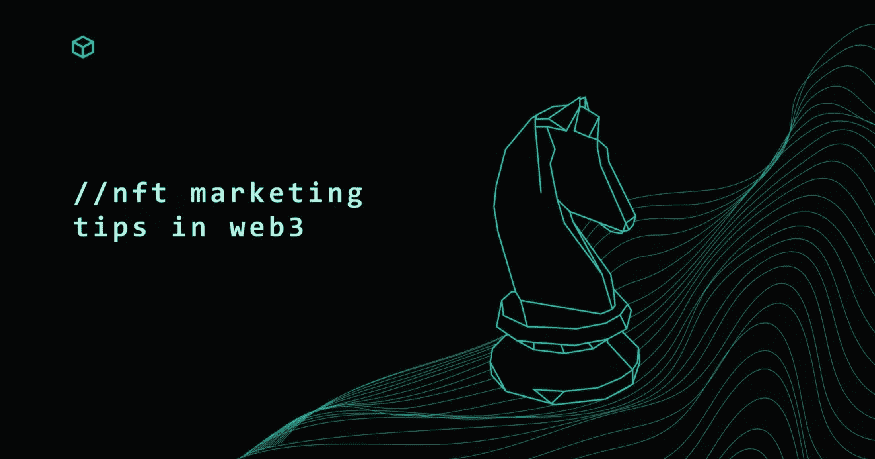
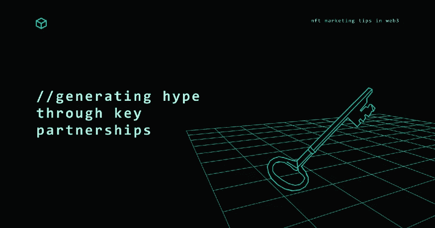

# Web3 中的 NFT 营销技巧

> 原文：<https://medium.com/coinmonks/nft-marketing-tips-in-web3-37025cd3ba57?source=collection_archive---------28----------------------->

NFT marketing tips in Web3

## 了解推广 NFT 项目的关键营销策略。用实际可行的方法来计划、执行和建立你的 NFT 社区。

NFT 现在正在成为趋势，这是有充分理由的。它们是独一无二的，稀缺的，并且容易交易；最好的也有长期效用。

话虽如此，尽管有成千上万的 NFT 项目，但只有少数达到了传奇的地位。拜克，密码朋克，涂鸦，月亮鸟，还有…..没什么别的，至少对普通的 Web3 用户来说是这样。

有趣的是，虽然许多最成功的 NFT 项目采取了不同的途径来取得成功，但如果分析每个成功的发射，我们可以看到一组清晰的变量和最佳实践，可以帮助建立任何 NFT 项目的最佳成功机会。

换句话说，我们分享了一些重要的 NFT 营销技巧，以帮助您将您的 NFT 项目营销给正确的受众。

Plan before you take action

# 1.路线图和规划

这是任何 NFT 发射的重要组成部分。你需要清楚地了解你想要达到的目标，你的目标受众是谁，你的 NFTs 将提供什么价值。

对于你将如何营销和分发你的 NFT，有一个可靠的计划也是至关重要的。如果你有一个计划，你的发射可能会成功。

*   明确你在 NFT 发布会上的目标以及你希望实现的目标。
*   研究你的目标受众，找出他们在网上“出没”的地方。了解其他成功的 NFT 产品发布以及成功的原因。
*   创建一个时间表，计划实现目标所需的步骤。

# 案例研究:BAYC

虽然这不是官方信息，但很明显， [BAYC 项目](https://bettermarketing.pub/how-the-bored-ape-yacht-club-became-the-most-successful-nft-brand-5158a80f1bd9)的创造者遵循了马尔科姆·格拉德威尔的书《引爆点:小事情如何能产生大影响》。他们精心策划并实施了:

*   **少数法则:**只允许来自各大行业的特定人群拥有猿 NFT。
*   粘性:在他们的项目背后创造一个有趣而独特的想法。BAYC 有独特的标志和梦幻般的品牌个性，它坚持其酷的品牌声音，这吸引了更多的人到它的 10，000 NFT 集合。
*   **背景原则:** BAYC 是 2021 年 4 月在 Twitter 上开始营销的第一批项目之一，当时 ETH 的价格在 3000 美元左右。他们在早期的加密社区中引入了他们的 ape，现在他们是世界上最顶尖的 NFT 项目之一。

The key to success is community

# 2.社区建设

一个强大的社区是任何 NFT 发布成功的关键。营销工作应该专注于创建一个对项目充满热情的用户社区，并帮助向更广泛的受众推广项目。

围绕 NFT 项目建立社区有几种方式:

*   社交媒体:像 Twitter、Telegram 和 Discord 这样的平台对于建立一个参与用户社区来说是非常好的。创建吸引人的内容和定期举行 AMAs(问我任何问题)会议是增加社交媒体追随者的两种有效方式。
*   NFT 论坛和社区:有几个致力于 NFT 的在线论坛和社区，如/r/cryptocurrency subreddit 和 Telegram 上的 NFT 启动板组。参与这些社区可以帮助你的项目传播出去，引起潜在投资者的兴趣。
*   博客和媒体推广:撰写关于你的 NFT 项目的信息丰富的博客文章，接触加密货币和主流媒体是为你的发布增加曝光率的好方法。

# 案例研究:密码朋克

据 TechCrunch 报道,“CryptoPunks Cult”是市场上第一批销售范围与 BAYC 相同的 NFT 项目之一。这是以太坊区块链上最早的 NFT 的例子之一。

CryptoPunks 是少数几个理解社区建设重要性的项目之一，尤其是在不和谐的情况下。在 Discord 上创建不同的频道，每个频道服务于一个独特的目的，这是我们现在在市场上看到的每一个 NFT 项目都在遵循的东西。加密朋克在这个行业真正开创了一个 NFT 崇拜。

Partner up with similar projects

# 3.通过重要的合作伙伴关系制造宣传

创建一个符合你的 NFT 发布目标的营销策略。这可能包括线上和线下推广、付费广告、影响者推广、内容营销等等。此外，考虑在发布前通过向你的观众提供内容和笑话来进行宣传。

当 NFT 项目与其他 NFT 项目和社区合作时，它们往往更成功。这让你可以进入一个更大的潜在用户生态系统，创造更多的协同效应。在寻找合作伙伴时，考虑具有互补技术或用户基础的项目。例如，专注于数字艺术的项目可以与专注于游戏的项目合作。然而，你应该小心合作项目和做你自己的研究(DYOR)，正如 NFT 营销[指南](https://www.bueno.art/blog/nft-marketing-guide)中提到的。

# 总之…

NFT 是创造和交易数字资产的一种令人兴奋的新方式。要启动一个成功的 NFT 项目，你需要有一个清晰的愿景，参与你的社区，并使用正确的营销工具。遵循这些建议可以增加你成功启动 NFT 项目的机会。

> 交易新手？在[最佳密码交易所](/coinmonks/crypto-exchange-dd2f9d6f3769)上尝试[密码交易机器人](/coinmonks/crypto-trading-bot-c2ffce8acb2a)或[复制交易](/coinmonks/top-10-crypto-copy-trading-platforms-for-beginners-d0c37c7d698c)