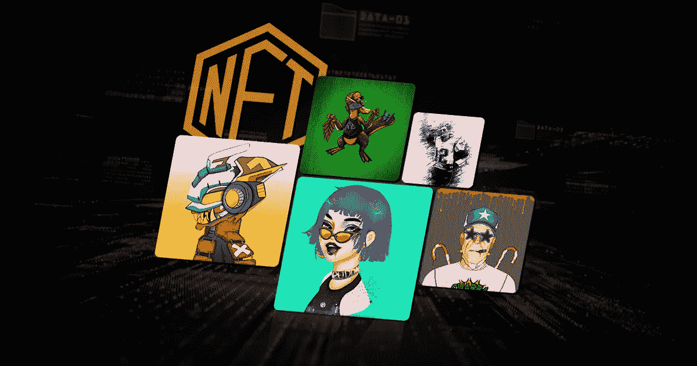

# NFT 市场发展服务——一个安全商业机会的综合方案

> 原文：<https://medium.com/coinmonks/nft-marketplace-development-services-an-integrated-formula-for-a-secured-business-opportunity-65f5442bad8a?source=collection_archive---------25----------------------->

非功能性交易是一种趋势，可能会在各行各业营造一种巨大的氛围。因为数字业务是未来，你可以成为其中的一部分。基于 web3 的未来对试图进入数字领域的人们有一些严肃的商业想法。NFT 市场就是这样一个让你成为成功企业家的地方。他们帮助你安全地交易最稀有的收藏品。根据你的定位，有很多市场。然而，他们每个人都在统治商业世界的方式上表现出了多样性。所以，现在正是你从合适的公司获得 [***NFT 市场开发服务***](https://bit.ly/3SZojN2) 的时候了。

## 对 NFT 市场的需求

NFTs 和传统货币的主要区别在于，每种代币的价值是基于其独特的属性，而不是固定的汇率。这意味着他们不能互相交易，以牙还牙。

 [## NFT 市场开发公司服务| NFT 市场开发| NFT 市场…

### NFT 市场的发展正在塑造即将到来的创业公司的未来，以在竞争中胜出。构建您自己的…

bit.ly](https://bit.ly/3SZojN2) 

交易 NFT 的唯一方式是通过在线 NFT 市场，因为这些不可替代的令牌不能通过集中式或分散式加密交换来购买或出售。因此，对于 NFT 市场开发企业来说，NFT 市场开发将变得越来越有利可图。

## **NFT 市场的好处**

*NFT 市场具有以下优势:*

透明度——由于区块链的实时性和不可改变性，在 NFT 市场上的所有交易都是完全透明的，不可更改。

分散化——NFT 的市场完全分散化。没有必要让中介破坏平台的功能。这都是在智能合约的帮助下处理的。

安全——NFT 市场有内置的安全工具、加密技术和共识算法，可以防范在线欺诈、违规或其他网络威胁。

## **描述了 NFT 市场发展的过程**

首先，重要的是要明白，专业的 NFT 市场比那些更普通的市场更受欢迎，比如专注于数字艺术的 NFT 平台。

 [## NFT 市场开发公司服务| NFT 市场开发| NFT 市场…

### NFT 市场的发展正在塑造即将到来的创业公司的未来，以在竞争中胜出。构建您自己的…

bit.ly](https://bit.ly/3SZojN2) 

NFT 市场开发供应商可以帮助企业开发市场应用程序，使 NFT 用户能够使用简单的界面有效地完成他们需要的任务。但是，在考虑 NFT 平台的特性时，在您的需求列表中包括以下特性非常重要:

*   店面
*   仪表盘
*   NFT 铸币厂
*   列表和收藏创建
*   列出状态和令牌详细信息
*   过滤
*   高级搜索功能
*   竞价购买功能
*   钱包整合
*   评级和评论

一旦你的目标市场被确定，你可以利用你选择的 NFT 市场发展公司的经验来帮助你实现你的项目。该合作伙伴将能够在整个 NFT 平台开发过程中为您提供帮助，该过程通常包括以下活动:

选择您的区块链(——您需要为您要构建的平台选择想要的区块链。一定要选性价比高的。

定义项目 UX 设计——建立一个成功的 NFT 市场平台需要优化和简化你的用户体验(UX)。此外，你需要借助 NFT 市场开发服务，设计一个直观、简单、愉快的用户界面。

:**前端开发** —您可以在久经考验的 NFT 市场开发公司的帮助下，为您的 NFT 平台设计框架，确保卓越的功能和简单的用户采用。

实施智能合约——智能合约执行 NFT 市场上的每一项运营任务。有了它们，市场安全运行，自动化每一个动作。

:**设置存储** —由于在区块链存储数据非常昂贵，所有与特定令牌相关的 NFTs 元数据通常都保存在区块链之外。一个解决方案是 IPFS 存储。它是一个对等网络，用于在分布式文件系统中收集和共享数据。

集成——智能合同业务逻辑通过构建在区块链之上的前端和后端接口来访问。

测试——在创建 NFT 市场的过程中，测试是一个至关重要的阶段，因为它可以帮助你在部署之前找到并修复错误。

部署——经过几轮全面的测试后，你的 NFT 市场平台已经准备好投入使用。

在区块链软件开发人员的熟练团队的帮助下，从零开始创建 NFT 市场的基本步骤如上所述。但是，您也可以使用白标 NFT 解决方案，这是一个现成的平台，可以根据您的需求进行定制。

## **结论**

[**NFT 市场开发**](https://bit.ly/3SZojN2) 服务帮助您开发此类平台，构建基于 web3 的未来。在与开发团队合作之前，确定你的目标。

> 交易新手？试试[密码交易机器人](/coinmonks/crypto-trading-bot-c2ffce8acb2a)或[复制交易](/coinmonks/top-10-crypto-copy-trading-platforms-for-beginners-d0c37c7d698c)