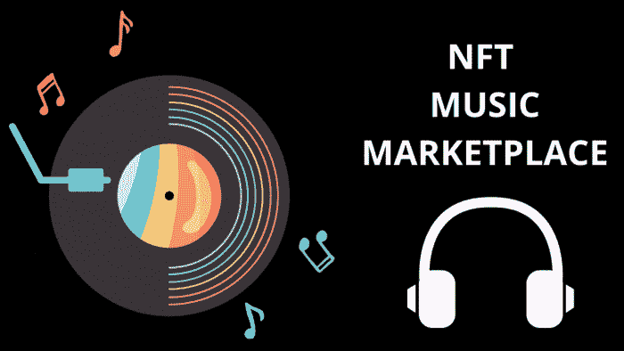

# NFT 音乐市场-简单的方法来筹集资金，使歌曲 NFT，赚取版税

> 原文：<https://medium.com/coinmonks/nft-music-marketplace-simple-way-to-raise-funds-make-song-nfts-earn-royalties-fe98dc9152f0?source=collection_archive---------17----------------------->

NFT 的市场让它如此响亮，以至于它增强了音乐在这个现代化世界中改变人们生活的方式。以前，人们从录音室带来歌曲，下载歌曲，然后用它们来换钱。最近，音乐产业已经发生了很大的变化，他们已经进入了蓬勃发展的 NFT 空间。现在，NFT 音乐有了一个专门的 [**市场**](https://bit.ly/3AK0lQb) ，艺术家们可以直接与粉丝分享他们的作品，给他们一个归属的地方。

## **NFT 音乐——紧跟潮流**

一家名为“粉丝老虎”的著名 NFT 音乐市场已经引入了令人兴奋的 NFT 音乐交易方式。

在由 Multicoin Capital 牵头的种子轮投资中，ArtistFirst Technology 在周三筹集了 550 万美元。在这里，平台有能力吸引更多的粉丝，让他们推出自己的歌曲，并从他们那里获得等量的激励。平台也给了粉丝机会，给了粉丝赚取的途径。

## **音乐 NFT 平台是做什么的？**

FanTiger 为独立艺术家提供了在平台上创建粉丝社区的工具，并向粉丝提供音乐 NFT，以便他们可以影响自己的职业生涯。粉丝可以购买音乐 NFT 来访问私人艺术家社区，获得奖励，并享受特权，如独家后台访问和幕后内容。

> **艺术家可以将音乐 NFT 的销售收入用于歌曲创作、工作室制作、音乐视频等。**

他们也可以承诺给歌迷一定比例的版税。

## 粉丝可以营销并从中赚取任何东西吗？

有了这样一个平台，粉丝们将能够通过传播关于他们的新闻来获得收入的转变。

是的，在这里，即使是歌迷也会宣传歌曲，因为他们在歌曲中拥有很小的股份。粉丝只是听歌，可能和一两个朋友讨论的旧观念和这个完全不一样。然而，NFT 给了歌迷一个提升和传播歌曲知名度的理由。因此，在这种情况下，NFT 正在建立一个公平的竞争环境，在如何筹集资金和分配给粉丝方面，没有障碍，透明。在区块链上，这一切都被记录了下来。“这些 NFT 可以从一个人卖给另一个人，一旦它们在接下来的两到三个月内打开市场，就会产生更多的收入，”FanTiger 的首席执行官和联合创始人、Gaana.com 的前首席执行官 Prashan Agarwal 说。

## **总结！**

因为 NFT 给了人们在这个创新时代生存的机会，音乐市场可以让他们赚得越来越多。音乐产业已经成为一个有利可图的机会，因为他们已经进入了 NFT 领域，因此， [**创造了一个音乐 NFT 平台**](https://bit.ly/3AK0lQb) 就像粉丝老虎一样，在他们的工作方式中赚取更多的利润。现在，音乐已经成为一种工具，甚至对于最小的艺术家来说也是如此，因为他们在吸引观众的同时也从制作中获得了金钱。从一家顶级公司建立一个 NFT 音乐市场可能会让你在未来几年成为一名企业家。

> 交易新手？尝试[加密交易机器人](/coinmonks/crypto-trading-bot-c2ffce8acb2a)或[复制交易](/coinmonks/top-10-crypto-copy-trading-platforms-for-beginners-d0c37c7d698c)