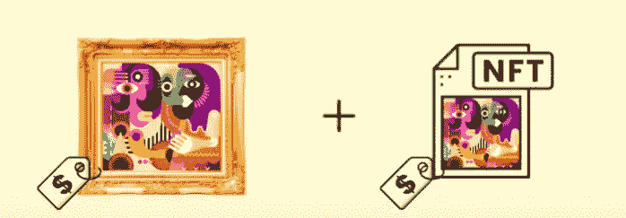

# NFT 实物资产平台|引领未来生活体验！

> 原文：<https://medium.com/coinmonks/nft-platform-for-physical-assets-lead-the-way-to-the-future-life-experiences-2112c7a71ac?source=collection_archive---------17----------------------->

**NFT Platform For Physical Assets**

继新冠肺炎全球疫情之后，世界正处于重建阶段，改变着全球的日常生活。就新一代 Web3 而言，可以肯定地说，它在这一阶段的作用至关重要，因为它开启了 2022 年 5 月题为“灵魂绑定令牌”的论文作者提出的**“去中心化社会”的概念。如果您熟悉 Web3 空间，您可能会知道什么是不可替换的令牌以及它们是如何工作的。这些项目的一个重要应用是用于实物资产** 的 [**NFT 平台，随着我们的进一步发展，我们将详细了解该平台。**](https://bit.ly/3QKonje)

## 这些平台的介绍

在进一步讨论之前，我们应该知道不可替代令牌(NFT)是数字令牌，可以证明它们所支持的资产的所有权和真实性。同样值得注意的是，2021 年 NFT 的繁荣集中于出售数字资产，如艺术品、个人资料图片、游戏内物品和体育收藏品。实物资产的 NFT 平台是出售支持实物的虚拟代币的地方。在 NFT 繁荣之后，这些企业变得越来越突出，因为有抱负的企业家正在挖掘非技术企业的无穷潜力。如今，品牌服装、稀有酒精饮料、实物绘画和房地产资产等项目都被令牌化，并通过这些平台作为 NFT 出售。

## 非功能性测试如何帮助物理项目？

以下几点说明了 NFTs 的优势如何帮助他们支持实体项目:

☀since NFT 基于区块链分类账，所有与交易和所有权历史相关的信息在网络上都是透明可见和可验证的。

☀With NFTs，资产持有人不需要耐心等待出售他们的资产，因为有大量的流动性条款可用于这些资产。如果需要，人们可以在创建或获得 NFT 后立即出售它们。

☀The 分布式区块链分类帐还为 NFTs 提供了无与伦比的安全性，因为所有数据都在网络上传播，使得黑客在不被抓住的情况下检索和修改信息变得不切实际。

☀NFTs 一直是风险企业的品牌武器，这也可以补充基于实物资产的业务，以在竞争激烈的网络空间中提升自己。

投资回报和版税等☀Monetizing 机遇也增加了收益。

**Physical Painting Art to NFT**

## 实物资产 NFT 平台中的工作流

✔用户(卖家/买家)注册并链接他们的加密钱包。

✔卖家可以通过提供必要的信息为他们的实物资产创造非金融资产。

✔:然后，他们可以在市场门户网站上 [**列出物理 NFT 资产**](https://bit.ly/3K9UeYs) 进行销售。

✔买家可以通过拍卖或固定价格出售购买 NFT 资产。

✔如果拍卖发生，买家出价，最高出价者最终可以拥有 NFT 资产。

✔:如果新东家想二次交易 NFT，他们可以在同一个平台内进行。如果启用，将向原创者提供版税。

✔如果所有者想用 NFT 来赎回它所支持的实物资产，他们可以通过提供的方法轻松完成。

## 基于实物资产的 NFT 平台的商业途径

✅ **美术馆**可以从这样的平台中受益，因为这些平台可以用来为原创者的真实艺术品创建 NFT，以达到狂热的艺术收藏家。

✅ **房地产公司**可以使用实物资产的 NFT 平台来标记土地并出售给人们。该流程还可以扩展到部分令牌化，通过安全令牌提供(STO)或令牌化资产提供(TAO)为加密项目筹集资金。

✅ **服装品牌**可以打造支持其产品的 NFT，为忠诚的顾客提供真实的体验。这种非功能性交易对于轻松管理供应链问题也很有用。

✅ **美术创作者**可以将与他们的音乐专辑、电影、书籍和纪录片相关的商品和物品进行令牌化，通过支持实物礼物的基于利益的 NFT 来吸引更多的观众。

✅ **厨师和家庭烹饪企业**可以在区块链上注册他们的特殊食谱作为 NFTs，并添加一个特殊的项目(食谱)作为实物资产，以激励他们的固定客户社区。

## 结束笔记

因此，实物资产的 NFT 平台在 Web3 领域获得了发展势头，因为许多企业已经开始基于该模型建立平台。在这种情况下，随着需要的增加，这些 NFT 给出的真实世界的相关性被证明是一个主线。如果你正在寻找一个基于实物资产的 [**NFT 平台**，](https://bit.ly/3QKonje)的业务，这是开始的正确时机。对于任何技术援助，考虑与在实物资产 NFT 平台开发方面有丰富经验的公司合作。这样的公司可以很容易地建立平台，以可承受的价格快速满足你的风险需求。

> 交易新手？试试[加密交易机器人](/coinmonks/crypto-trading-bot-c2ffce8acb2a)或者[复制交易](/coinmonks/top-10-crypto-copy-trading-platforms-for-beginners-d0c37c7d698c)