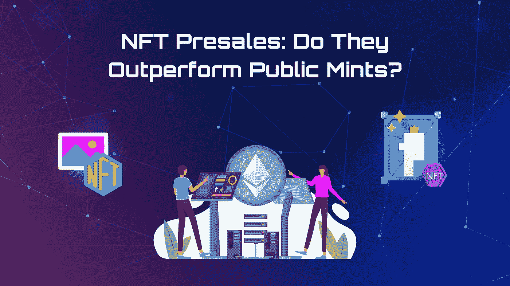
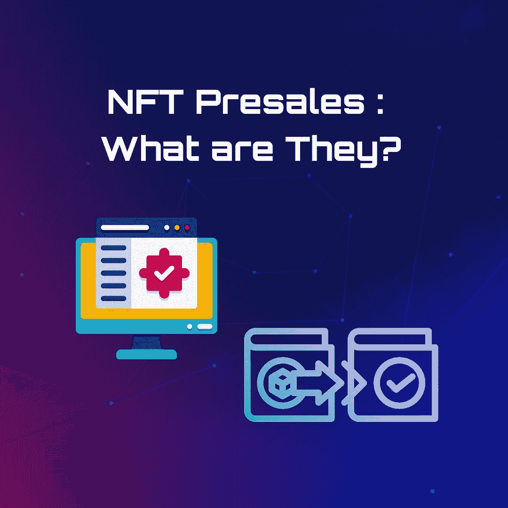
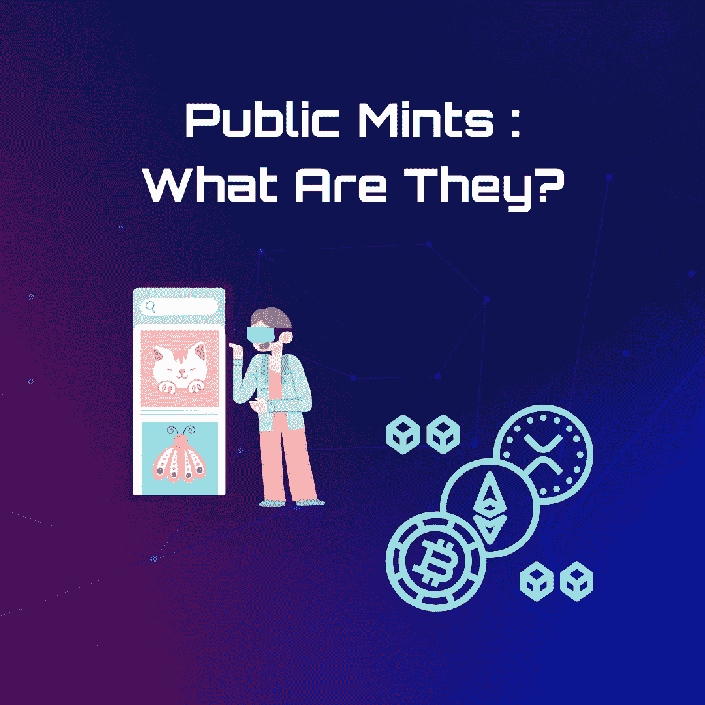
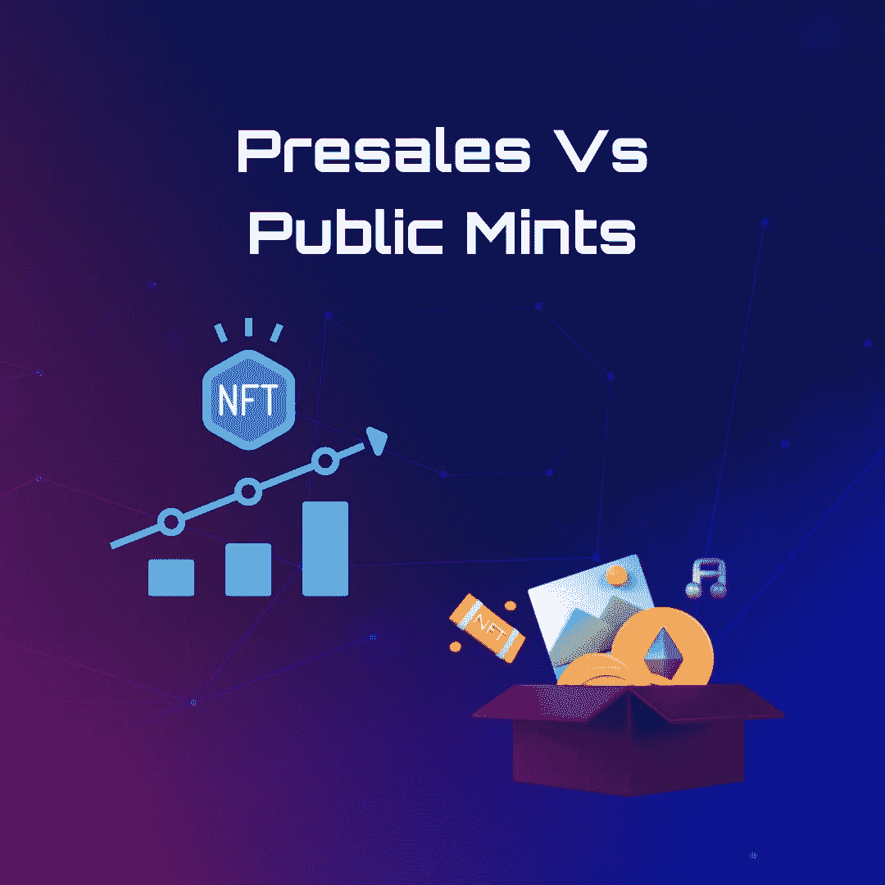

# NFT 预售:他们胜过公共铸币厂吗？

> 原文：<https://medium.com/coinmonks/nft-presales-do-they-outperform-public-mints-6189df2f6406?source=collection_archive---------14----------------------->

“随着社会的发展，商业模式也在发展。”大多数投资者都会引用这句话。在 NFT 市场上也是如此。

谈到 NFTs 时，最常被问及的问题是如何通过加密货币挖掘产生货币。许多人很难同意那些声称加密货币开采已经停止的人，特别是随着[比特币](https://www.investopedia.com/terms/b/bitcoin.asp)的首次亮相和合并价格的下降。

得知新的 NFT 上市令人兴奋，但你可能会担心其危险性。无论你是通过预售还是公开发行购买 NFT，每种方法都有其优缺点。

许多 NFT 倡议现在通过两级方法进入市场。公司可能会首先进行预售，而不仅仅是向公众销售。好消息是，你需要了解的只是预售或公开造币厂的[基本购买策略](/coinmonks/9-must-have-nft-tools-to-help-you-track-and-discover-the-best-nfts-to-invest-in-e49c8b2d6f69)。

# **NFT 预售:**有哪些？

NFT 预售是一种营销技巧，开发者利用这种技巧让投资者在产品上市前购买他们收藏的产品。如果这很有趣，这里有一个你可能会喜欢的事实；最贵的 NFT 价值超过 9180 万美元。没错。

回到售前 NFT，有趣的是它们经常用于分配代币预订。这些是为加密影响者、名人和其他个人准备的。想知道它们是如何分布的？一份白名单打破了这一切。

简而言之，它就像是一种开发者预先批准的钱包早期访问列表。这种方法背后的原因是通过将其添加到列表中来纪念 NFT 项目的早期和真诚的支持者。

## **预售的优点**

你知道那种涅槃的感觉。这正是预售的感觉。从这个意义上说，用户可以访问一些最稀有的非功能性语言。还有呢？它们具有特殊的属性，并且可能以比平常更便宜的价格购买。

如果有谁在等这些的问题？答案是男人。他们等待并急切收集最稀有的非功能性食物的可能性是其他人的三倍。

当项目开始或以后，那些被列入白名单的人经常以更高的价格出售他们的 NFT。事实上，光是 NFT 迷因《道奇》就带来了 400 万美元的收入。

## **为什么预售可能不适合你？**

因此，加入白名单可能比参与 NFT 风险投资更便宜。然而，不利的一面是，因为它是一种加密货币，所以不能保证这项倡议会成功。

此外，没有意识到危险的用户会成为钱包被盗的目标。也有网络钓鱼诈骗和地毯抓取，因为他们急于成为白名单。

## **预售示例**

新 NFT 风险投资公司，无论是 ETH NFTs，ADA NFTs，SOL NFTs，还是其他公司，都可以做预售。这甚至可以在没有白名单的情况下完成。

然而，白名单可能只是一个好的做法。这避免了天然气战争，并在像 Opensea 这样的竞争激烈的市场推出之前，给了 NFT 一个公平的机会。

# **公共造币厂:**它们是什么？

不，不是你期待的味道。为了制造 NFT，数字信息必须被转换成加密货币集合或存储在网络上的其他数字资产。

预售薄荷糖和公开薄荷糖的功能类似，只是薄荷糖的购买是在产品发布时开始的。预售结束后，创作者将提供硬币公开销售的日期和时间。

铸造具有不同寻常品质的 NFT 仍然是可行的，但这种可能性主要取决于你在毒气战中的表现以及剩余的供应量。

## **公共造币厂的优点**

如果您向公众购买了 NFT，您将有机会查看该计划的请求和分析数据。还可以享受完整的银行账户。在这种情况下，用银行账户、信用卡或稳定的货币给你的钱包存钱效果最好。

## **为什么公共薄荷糖可能不适合你？**

虽然创建一个 NFT 可能会令人难以置信地兴奋，但这并不保证你会赚钱。事实上，如果你不小心，你甚至可能会亏损。白名单的标准最近变得越来越严格；交易员现在称之为“打磨”。

## **公共造币厂的例子**

如果你想更好地了解大众薄荷糖，你必须了解有史以来最顶级的薄荷糖。Silks 是第一个基于元宇宙的赛马适应性游戏平台。

他们的生态系统使用真实世界的分散数据集和 NFT 来关联和跟踪血统。为玩游戏而购买的代币都是围绕着公共铸币局的。

你甚至可能听说过越来越受欢迎的虚拟游戏。

# **预售与公开造币**

实话实说吧；这两个 NFT 购买类型不能比较你选择最好的。

最终，你的决定应该完全基于你的研究。购买你的 NFT 最好的方法是少关注“炒作”，避开“FOMO”相反，集中精力更好地理解 [NFTs](https://www.investopedia.com/non-fungible-tokens-nft-5115211) 。

# **底线**

如果你真的看到，公共造币厂和预售之间唯一的主要区别是他们的可用性。最后，请记住，当试图在转售市场上出售 NFT 时，不能保证它的价值会高于公开或预售价格。

令人欣慰的是，我们已经使获得预售和公共造币厂的 NFT 变得简单。在一个市场中，你拥有信任、质量和数量。

因此，通过被告知，保持冷静，收集你的 NFT。

> 交易新手？试试[密码交易机器人](/coinmonks/crypto-trading-bot-c2ffce8acb2a)或[复制交易](/coinmonks/top-10-crypto-copy-trading-platforms-for-beginners-d0c37c7d698c)