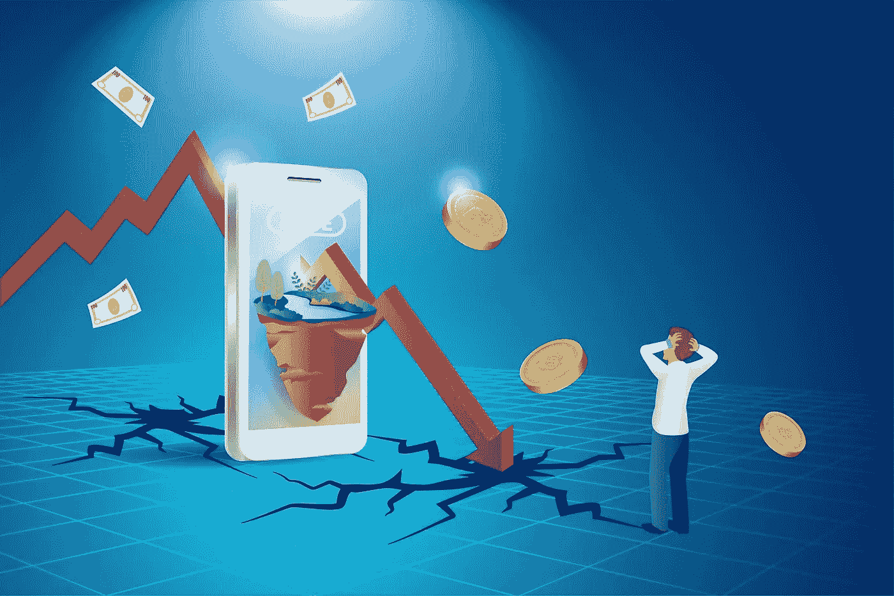
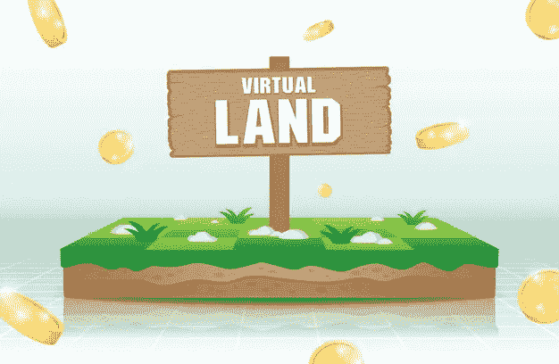

# NFT 房地产市场发展——发展十亿美元虚拟市场指南！

> 原文：<https://medium.com/coinmonks/nft-real-estate-marketplace-development-guide-to-develop-billion-dollar-worth-virtual-market-69068ea7f417?source=collection_archive---------5----------------------->

这个世界注定会随着季节而改变！这个季节是为了虚拟房地产的繁荣。两个世界的融合，物理房地产和数字加密资产。NFT 市场与日俱增的势头；他们带着他们革命性的概念——去中心化——往上爬。为用户开发的交易论坛在他们最喜欢的 NFTs 上有了新的化身，NFT 房地产市场开发。

**NFT 房地产市场是一个平台，它将在线论坛中的交易者连接起来，在一个屋檐下铸造、购买、出售和拍卖虚拟资产。这种发展的首要任务是从物理和虚拟土地提供更容易的交易和服务交换。这篇博客将带你进入决定性的旅程，开发你的个性化项目。**

# ****房地产和虚拟资产****

**我们都知道，现实世界中最昂贵的投资之一就是投资房地产。另一方面，不可替代代币是一次性投资，将随着时间的推移而增加。当这两个世界的两项高利润投资走到一起时，它们就成了传奇。在博客的这一部分，我阐述了 NFT 房地产市场的可靠性。**

*   **仅仅是利息，房地产市场在过去的一年里就增长了 433%。**
*   **据估计，到 2025 年，NFT 市场规模将达到 220 亿美元**的天文数字，到 2031 年将增长两倍。****
*   ****据 NFT 房地产市场预测，到 2022 年，他们预计将达到 10 亿美元的大关。****
*   ****普莱因集团最近在元宇宙购买的虚拟房地产价值约 140 万美元。****
*   ****同样的交易是根据本地加密货币 MANA 进行估价的，这是一个高达 51 万英镑的数字。****
*   ****还有一个例子，一个用户支付高达 450，000 美元购买沙盒中 Snoop Dogg 旁边的虚拟土地。****
*   ****republic realm 在 24 个元宇宙平台上拥有超过 3000 个虚拟土地 NFT，这使得平台的平均价格从 1265 美元增加到 12684 美元。****
*   ****第一个出现的房地产是“火星”,这是一个总部位于 NFT 的数字房子，用 3D 剪辑开发，售价高达 512，712 美元。****

## ******可交易的 NFT 房地产代币******

********

****NFT 房地产是一种投资，通过平台中存储的所有信息，使用户的生活更加舒适、安全和稳健。虽然如前所述，这些只是最近的例子，但我们可以说，这只是冰山一角。许多商业大亨和娱乐业的高层正在投资这些身临其境的房地产 NFTs 其他数字世界的原创性都是独一无二的。NFT 房地产是一种投资，通过平台中存储的所有信息，使用户的生活更加舒适、安全和稳健。****

****此外，希望 [**启动 NFT 房地产市场**](https://www.appdupe.com/nft-marketplace-development) 的密码爱好者可以铸造以下财产作为 NFT 并进行交易。许多可铸造的资产中，从用户那里交易最多的是，****

*   ****虚拟土地****
*   ****虚拟房屋****
*   ****虚拟财产****
*   ****虚拟国家****
*   ****虚拟城市****
*   ****虚拟国家****

## ******两个世界的融合如何改变行业？******

*   ****由于 NFTS 拥有部分财产所有权，所有者可以将他们的部分虚拟财产交易给许多投资者。****
*   ****由于所有权的转移，这两个有利可图的领域的融合有助于在没有中介服务的情况下访问平台。****
*   ****由于 NFTs 是在区块链上开发的，因此用户在将所有权转让给另一个用户时风险要小得多。****
*   ****NFT 房地产市场发展完全分散，可以作为一个虚拟的游戏平台。这鼓励用户互动、举办活动、购物、赚取和交易他们的财产。****
*   ****它们也可以像抵押贷款一样运作，用户将他们的资产证券化并借出。****

## ******NFT 房地产市场发展特点******

*   ****他们有一些最吸引人的虚拟资产展示。****
*   ****为了用户容易访问，列出了多个虚拟区域的 NFT。****
*   ****NFT 房地产市场也有能力拍卖 NFT。****
*   ****用于 NFTs 的加密钱包被集成到平台中。****
*   ****多个用户可以共享资产的所有权。****
*   ****吸引人和心照不宣的 3D 显示。****
*   ****该平台受到多层安全协议的保护。****
*   ****由于能够让用户传送到感兴趣的虚拟土地，该平台集成了多个支付网关。****
*   ****由于平台的 [**星际文件系统(IPFS)存储系统**](https://en.wikipedia.org/wiki/InterPlanetary_File_System) ，可以无延迟地存储大量的 NFT。****
*   ****所有用户的信息都受到他们的数据加密机制的保护。****
*   ****该平台支持用户/玩家的 P2P 交互。****
*   ****NFT 房地产市场在其生态系统中是 100%去中心化的。****
*   ****双因素身份认证是该平台的主要增值功能。****
*   ****虚拟土地拥有业界最先进的造地 SDK。****

## ******打造 NFT 房地产市场必不可少的技术平台******

*   ******云托管平台******

****这个托管平台帮助 NFT 房地产市场在云服务器上运行应用程序，为他们提供了一个灵活、可扩展的环境。此外，它们为用户提供了更合适的 API 集成、门户网站和移动应用。云托管基础设施需要平台的自动化，而不是单一的网络托管所有资产。****

*   ******数据库管理系统******

****在虚拟土地的基础设施中添加合适的数据库管理系统，使用户能够自动、安全、可靠地管理多种数据。这种面向市场的安装开发旨在提高用户的可靠性和可持续性。****

*   ******前端和后端开发******

****前端和后端开发是行业中任何 NFT 市场的两只眼睛。其中包括 React.js、Express.js、Node.js 等 [**打造 NFT 房地产市场**](https://www.appdupe.com/nft-marketplace-development) 的主要技术。在区块链中，交互式市场的一些前端开发需要各种工作框架、编程语言和复杂代码。同时后端开发纯属用户偏见。****

## ******NFT 房地产市场发展的 9 个解决步骤******

*   ****希望发展自己的 NFT 房地产市场的加密所有者必须了解市场的基本面。了解并全面分析投资者、商业伙伴、NFT 专家等。，是必须的。****
*   ****适当的市场研究将有助于你开发一个更有成效的市场，促进高流量。****
*   ****满足于一个最适合市场的区块链网络，为你的利基指定的资产集合。一些区块链，你可以去以太坊，币安智能链，卡尔达诺等。，具有丰富的功能和超前的目标。****
*   ****选择市场上最好的白牌解决方案开发商，为平台定制获得直观的用户界面和用户体验开发。****
*   ****该平台的交互式前端和后端开发对于用户拥有一个可持续的交易论坛至关重要。****
*   ****将加密钱包整合到生态系统中。这是一个基本要素，因为他们是管理和维护登山资产的人。此外，它们向加密令牌提供交易费用的安全传输。****
*   ****检查开发平台的每一个其他功能、特性和程序将极大地提升市场的成功。测试使得 NFT 市场对用户来说更加合作和全面。****
*   ****一旦整个市场被测试出生态系统中的缺陷和错误，它就能使 NFT 房地产市场运行得更加平稳和安全。完美开发的下一个阶段是在服务器上部署论坛。****
*   ****用户启动 NFT 房地产市场的最后阶段是通过各种渠道访问他们，这将吸引大量观众。****

******关闭思想！******

****房地产是 NFT 准备最充分的市场之一，将张开双臂拥抱房地产。我指的是 NFT 房地产市场的发展，white-label 的老牌开发商通过一个屏幕探索他们希望在元宇宙的任何地方。与元宇宙合并的 NFTs 有助于该行业利用区块链技术实现令人难以置信的增长。****

****元宇宙作为一个快速发展的行业，它的未来将会品尝到拥有这个数字世界的大部分的甜蜜胜利。该平台中的 DeFi 应用程序帮助用户获得贷款，并以 NFTs 作为抵押借入加密货币。在加密领域有如此复杂的市场，两个世界的顶点似乎对实体和数字资产都有利可图。单笔投资双倍收益？进入 [**白标 NFT 房地产市场开发**](https://www.appdupe.com/nft-marketplace-development) ！****

> ****交易新手？尝试[加密交易机器人](/coinmonks/crypto-trading-bot-c2ffce8acb2a)或[复制交易](/coinmonks/top-10-crypto-copy-trading-platforms-for-beginners-d0c37c7d698c)****