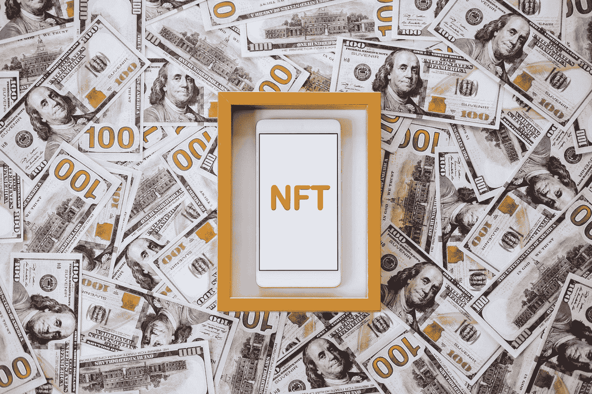

# NFT 租赁及其运作方式

> 原文：<https://medium.com/coinmonks/nft-rental-and-how-it-works-46aa253230e0?source=collection_archive---------2----------------------->

当您深入探索 NFT 空间时，会发现许多独特的令牌产品。尽管这些代币产品可能是独特和多样的，但大多数这些独特产品的共同点是它们的高昂价格。

购买和收集 NFT 无疑是不便宜的。即使是来自知名项目(如 Bored Apes 和 Cryptopunks)的最便宜的 NFT 也不会以普通人可以承受的价格出售。NFT 出租在这种情况下进入现场。它确切地意味着你可能会想到的——代币被出租给客户，让他们短暂体验一下拥有一台 NFT 并使用其公用设施的感觉。

# **什么是 NFT 出租？**

拥有某辆 NFT 的人可以将它短期出租给其他需要它的人。NFT 租赁市场使用类似 Defi 的区块链技术来促进安全交易，并保证在租赁时间结束时将 NFT 归还给所有者。

我们大多数人现在已经明白了非功能性思维是如何工作的，我们都同意它们可以实现一些奇妙的商业想法。但是这一领域的创新发展速度令人震惊，要跟上它变得越来越困难。

# 怎么租 NFTs？

有两种方式可以出租非金融资产——无抵押租赁和抵押租赁。

**抵押租赁**

在一个内置借贷功能的市场上，所有者可以列出他们的非金融资产。对 NFT 感兴趣的租户将开始借款程序，包括将 NFT 放入智能合同中。接下来，贷款人和租赁人将就智能合同的条件达成一致。租赁程序在条款确定并达成一致后开始。

租房者必须存放价值超过 NFT 的抵押品，以保护贷款者的利益。此外，租赁者必须支付租赁费。合同到期后，NFT 将归还原主，借款人将收回其抵押品。

**无抵押租赁**

无抵押租赁遵循与有抵押租赁相似的程序。唯一的区别是，与抵押租赁不同，租赁者永远不会收到原始的 NFT。相反，为租赁者创建一个包装的 NFT，它具有与原始资产相同的特征，并由真实资产备份。一旦合同结束，包装好的 NFT 就会被烧掉。在这种情况下，承租人和业主都不需要提供任何抵押品。结果，双方的财务风险都降低了。

# 为什么有人会去租一辆 NFT？

大多数 NFT 都包含某种实用程序。几乎总是，这个公用事业有一个市场价格。因此，NFT 的所有者可能并不总是想要或者能够使用这个工具。相反，他们可以通过出租 NFT 从他们的资产中获得被动收入。

NFT 租赁是一种廉价的方式，可以利用 NFT 提供的一些实用工具，而无需花费数百或数千美元来购买它们，例如访问独特的会员专用内容。例如，看一看吸毒的猫。这个由美国女演员米拉·库妮丝创作的 NFT 项目的持有者可以获得相应的动画电视节目。租赁者可能已经看过所有发布的内容，可以通过出租吸毒猫 NFT 来从他们的持有物中获利。这类似于为借阅者从在线图书馆租借 DVD 或电影，你观看内容，然后归还。

# 哪里可以租到 NFT？

NFT 的租赁市场仍然相对较小。因此，NFT 的租房市场还不多。最受欢迎的三位是伦夫特、维拉和特拉瓦 reNFT。其中，reNFT 和 Vera 最近势头强劲，风险投资公司 Animoca Brands 分别为这两个平台筹集了 150 万美元和 300 万美元的种子资金。随着 NFT 越来越受欢迎，对其租赁的需求将会上升，更多租赁非功能性租赁场地将开始出现。

> 交易新手？试试[密码交易机器人](/coinmonks/crypto-trading-bot-c2ffce8acb2a)或者[复制交易](/coinmonks/top-10-crypto-copy-trading-platforms-for-beginners-d0c37c7d698c)