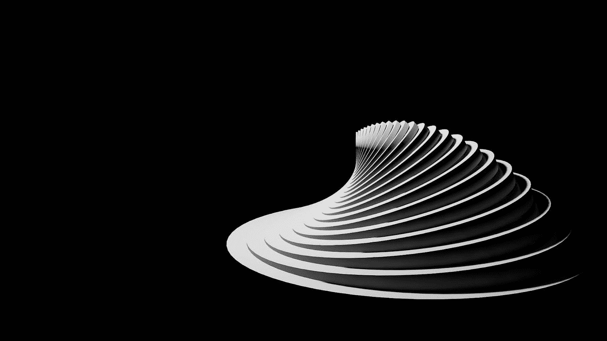

# NFT 版税:他们是什么，他们如何工作？

> 原文：<https://medium.com/coinmonks/nft-royalties-what-are-they-and-how-do-they-work-73722467c58d?source=collection_archive---------3----------------------->

With royalties, creators can still earn from their creations after the first sale.

随着 NFTs 成为关注的焦点，艺术家和创作者发现了新的功能。

例如，由于[智能合同](/zero-code-nft/omnichain-nfts-what-they-are-and-how-to-easily-deploy-them-a8f9481c3f88)，创作者可以通过 NFT 版税从他们的 NFT 二次销售中获利。然而，如果你是 NFT 的新手，你可能想知道它们是什么。这篇文章解释了 NFT 版税，它们是如何工作的，以及作为一个 NFT 创作者你如何利用它们。

# 什么是 NFT 皇室？

NFT 版税是从转售中自动支付给作者的。每个 NFT 的版税都被编码到 NFT 的智能合同中。每当二次销售发生时，智能合同向市场提供创作者期望的%版税。处理销售的市场然后强制执行支付给创作者的版税。

Beeple 的 NFT“十字路口”就是一个很好的例子，它在 2021 年 2 月以 660 万美元的价格在二级市场上转售。Beeple 本人获得了交易的 10%版税。这个特殊的例子展示了 NFT 版税的力量。

NFT 和传统的版税支付有许多不同之处。传统上，创作者和艺术家无法追踪他们作品的后续交易。他们的艺术品的第一次销售是他们从那件作品中所能获得的全部收入。无论这些年来他们变得多么受欢迎和优秀，他们都不会从之前卖出的作品中获得任何收益。

他们作品的买家可以高价转售同样的艺术品。因此，艺术家没有从二次销售中受益。NFT 正在改变这种说法。有了 NFT 版税，艺术家们可以从他们的创作中受益，不管需要多长时间。

> 交易新手？试试[密码交易机器人](/coinmonks/crypto-trading-bot-c2ffce8acb2a)或者[复制交易](/coinmonks/top-10-crypto-copy-trading-platforms-for-beginners-d0c37c7d698c)

# NFT 版税如何运作？

不同于传统的版税支付，NFT 版税不需要任何中介。然而，同样重要的是要注意到，并不是所有的非专利技术都会产生专利使用费。在付款之前，创建者必须将版税百分比添加到智能合同中。然后，他们在市场、区块链平台或铸造过程中选择版税设置。

版税是在链上跟踪的，一旦交易发生，它们就会自动支付。NFT 特许权使用费来自二次销售，二次销售发生在原始销售之后的市场上。作为背景，让我们用一个股票市场的比较——二级 NFT 销售类似于二级市场的股票交易，即首次公开募股的首次销售。

# 什么是典型的或标准的 NFT 版税？

版税系统因市场而异。在大多数市场，你可以选择你喜欢的版税比例。然而，5-10%被认为是标准的版税百分比。

了解你应该要求多少 NFT 版税依赖于了解与你的 NFT 项目相关的总成本。此外，了解你的受众以及他们是否愿意承担成本也会有所帮助。

购买 NFT 时，特许权使用费被添加到总成本中，不包括汽油费。例如，如果一部 NFT 价值 20，000 美元，那么 2.5%的版税就是 500 美元。如果另一个 NFT 值 3200 美元，2.5%就是 80 美元。与 6.5%的版税相比，第一部价值 2 万美元的 NFT 现在要 1300 美元，3200 美元的 NFT 要 208 美元。

换句话说，NFT 成本越高，版税百分比就越低。出于这个原因，你会看到很多价格较高的 NFT 项目使用较低的特许权使用费百分比，而成本较低的项目则使用 5%至 10%来赚取更多。

# 谁使用 NFT 版税？

NFT 版税是艺术家和创作者增加收入潜力的前所未有的机会。现在，艺术家可以从他们的工作中获得越来越多的回报，特别是随着他们的受欢迎程度增加——这是以前无法实现的功能。

关于 NFT 版税的另一件很酷的事情是，NFT 可以出售，但版权仍然属于原创者。如果他们决定，创作者可以将他们的 NFT 版权出售给他人。新的所有者可以赚取版税，由于他们的权利。一个很好的例子是，今年早些时候，BAYC 的创始人宇迦实验室收购了 crypto 朋克 NFT 知识产权(知识产权)的商业权利。由于知识产权所有权的变化，CryptoPunks 和 Meebits 持有者现在拥有与 BAYC 所有者相同的商业权利。然而，并非所有的市场都允许这一功能。

也就是说，一般来说，只要他们的 NFT 作品被售出，NFT 版税就能让艺术家维持并继续创作高质量的作品。艺术家不是唯一受益于版税的人。各类音乐人和内容创作者都可以利用 NFT 版税。例如，2021 年，电子音乐人杰克斯·格林(Jaques Green)2011 年的歌曲《另一个女孩》(Another Girl)获得了约 2.7 万美元的版税。像史蒂夫·青木和奥祖纳这样的其他艺术家也在积极利用 NFT 的技术来创造销售和随后的版税。

# 你如何从 NFT 版税中获益？

NFT 是支付民主化的一种方式。现在，任何创作者都可以从作品的二次销售中获益。如上所述，ZeroCodeNFT 为我们平台上的所有创作者提供版税和佣金设置。你想从你的 NFT 收藏中赚取版税吗？然后，跳上我们的[网站](https://www.zerocodenft.com/)。

ZeroCodeNFT 是一个先进的无代码 NFT 创建工具。在我们的平台上，设置您的 NFT 版税很容易。简单来说；你不需要聪明的合同开发技巧来推出你的 NFT 作品集并获得版税。你所要做的就是按照我们的向导中的步骤，在开始你的收藏之前，输入版税百分比和一个地址来发送版税支出。

每次二次销售后你都会得到报酬！整洁！

想了解更多关于我们工作的信息吗？

然后，[预约](https://hello.zerocodenft.com/book-deployment-call?utm_ads_source=blog_post)您与零代码 NFT 公司创始人&首席执行官 Ihor Bodnarchuk 的通话。

> 加入 Coinmonks [电报频道](https://t.me/coincodecap)和 [Youtube 频道](https://www.youtube.com/c/coinmonks/videos)了解加密交易和投资

# 另外，阅读

*   [印度最佳 P2P 加密交易所](https://coincodecap.com/p2p-crypto-exchanges-in-india) | [柴犬钱包](https://coincodecap.com/baby-shiba-inu-wallets)
*   [八大加密附属计划](https://coincodecap.com/crypto-affiliate-programs) | [eToro vs 比特币基地](https://coincodecap.com/etoro-vs-coinbase)
*   [最佳以太坊钱包](https://coincodecap.com/best-ethereum-wallets) | [电报上的加密货币机器人](https://coincodecap.com/telegram-crypto-bots)
*   [交易杠杆代币的最佳交易所](https://coincodecap.com/leveraged-token-exchanges) | [购买弗洛基](https://coincodecap.com/buy-floki-inu-token)
*   [3Commas 对 Pionex 对 Cryptohopper](https://coincodecap.com/3commas-vs-pionex-vs-cryptohopper) | [Bingbon 评论](https://coincodecap.com/bingbon-review)