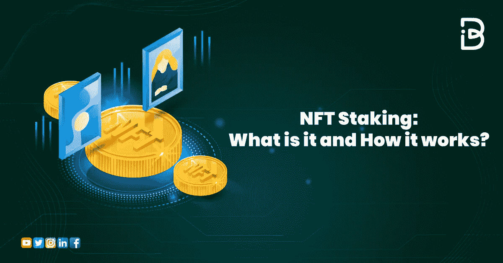

# NFT 打桩:它是什么，它是如何工作的？

> 原文：<https://medium.com/coinmonks/nft-staking-what-is-it-and-how-it-works-4a1f7b3da07c?source=collection_archive---------12----------------------->

寻找更新的方法来在睡觉的时候为你的口袋赚点外快，那么你来对地方了。

NFT 赌注为 NFT 用户提供了一个这样的机会，让他们在不失去 NFT 收藏品所有权的情况下获得额外的被动收入。

NFTs 的讨论已经持续了一段时间，特别是在杰克·多西(Twitter 的创始人)以 290 万美元的价格出售了一个 NFT 之后。另外，你还记得 youtube 上有 8 亿浏览量的查理咬我视频吗？它的 NFT 卖了 50 万英镑。

随着时间的推移，随着 NFT 市场的增长，开发商、投资者和艺术家为他们的不可伪造的代币收藏寻找新的用例。其中一个吸引了 NFT 爱好者注意力的实用工具是 NFT 打桩。

但是…..

## 1.NFT 在赌什么？

## 2.它是如何工作的？

## 3.我如何能从 NFT 博彩赚取被动收入？

## 4.NFT 跑马圈地的各种平台有哪些？

在这篇博客中，我们将回答你关于 NFT 赌注的大部分问题，以及你可以选择的数字资产的赌注方式和平台。

所以，让我们开始吧！

> *交易新手？试试* [*密码交易机器人*](/coinmonks/crypto-trading-bot-c2ffce8acb2a) *或* [*复制交易*](/coinmonks/top-10-crypto-copy-trading-platforms-for-beginners-d0c37c7d698c)

# NFT 在赌什么？

它指的是将你的数字资产锁定在一个分散的金融平台上。实际上，它根据三个主要标准向 NFT 持有者收取报酬，包括**年百分比收益率**、**赌注期**和**持有股份的非流通股数量**。这就是所谓的赌注奖励，你仍然是你的数字资产的所有者。通过下注你手头的 NFT 赚取密码。

这可能对投资者有利，因为它可以占用现有 NFT 资产的价格。因为，它减少了用于贸易的非农产品的供给，造成了通货紧缩的供给压力。

要下注一个 NFT，所需要的只是一个与正在使用的 NFTs 兼容的加密货币钱包。虽然不是所有的 NFT 都可以被标桩，但这取决于项目类型。我们将在本文后面讨论各种不同的赌注平台。

赌注 NFT 类似于**迪菲产量农业**，它允许你用你的密码制造更多的密码。它允许农民在市场上轮换种植南瓜，以获得最大回报。

# NFT 赌注是如何运作的？

在某种程度上，押注 NFT 的工作方式类似于押注加密货币。所有不可兑现的代币都不能下注。由于是令牌化资产，它们可以通过适当区块链平台上的智能合约部署在适当的赌注平台上。

如前所述，为了标记 NFTs，您需要一个与所讨论的令牌兼容的加密钱包。之后，您需要将您的钱包连接到所选的 NFT 赌注平台，将所需的资产添加到您的赌注池中。

现在，剩下的就是等待你的赌注回报，这取决于赌注平台的类型、赌注的周期和年收益率。此外，赌注依赖于利益证明**共识机制**来奖励参与者。

大多数平台都提供定期奖励，通常以平台效用令牌的形式出现。此外，一些平台有 DAO，NFT 持有者可以将他们的资产存储在 DAO 池或 NFT 赌注池中。有时，它允许用户参与 DAO 的治理任务。

# 如何赚取被动收入从 NFT 赌注？

您可以通过在兼容的下注平台上下注不可兑现的代币来获得被动收入。这可能是有价值的，尤其是对长期持有 NFT 或霍德勒的人来说，这是 NFT 收藏家的常见情况。他们可以锁定他们的 NFT 收藏来赚取被动收入，而不是把它们放在一个加密钱包里。

NFTs 的很大一部分属于 Web 3.0 世界的游戏元宇宙。在“玩到赚”游戏中有几个下注机会，人们可以在各种区块链游戏中锁定他们的 NFT，包括 Axie Infinity、Sandbox、MOBOX 和 Zookeeper 等。

早些时候，在元宇宙的游戏平台上，你可以使用你的 NFTs 来购买游戏中不可或缺的资产。这导致数字资产对于加密游戏元宇宙的有限效用。

现在，通过立桩，这个问题可以通过以下方式解决。

# 什么是各种 NFT 赌注平台？

在这些地方，NFT 持有者可以用他们的数字资产来赚取被动收入。通常，玩赚游戏平台在用户中很受欢迎，因为他们有大量的 NFT。

参考:[https://www . mobox . io/community/article/614 c 37918 b 39389 a 57 ef 5c 79](https://www.mobox.io/community/article/614c37918b39389a57ef5c79)

**以下是一些顶级的 NFT 赌马平台:**

1.  **onesus**

一个游戏赚取赌注系统，奖励用户代币$VOID。Onessus 的打桩系统称为“打桩时”。在这里，NFT 必须用$VOID token 下注，否则将没有奖励。

优势

*   它有一个内置的学习机制，允许游戏玩家租借 NFTs。
*   激励赌注持续时间更长的赌注者

**2。移动盒子**

一个玩到赚的游戏元宇宙，允许集成 Defi 产量农业和 NFTs。

它建立在币安智能链上，允许用户以其本地加密货币 MBOX 赚取奖励。

优势

*   它允许涉众通过治理令牌 MBOX 参与治理机制。
*   收集的 NFT 越多，获得的奖励就越多。

**3。仅 1 个**

这是一个独一无二的社交媒体平台，由 NFTs 提供支持，建立在索拉纳·区块链网络之上。这是特别有利于 NFT 的创作者，他们可以通过创作者赌注池产生收入。

优势

*   一种激励用户付出时间和精力的结构，不要求他们为其内容推广向任何第三方付费。
*   内容生成者以他们的本地令牌$LIKE 获得奖励

**4。KIRA**

首先，用户必须将他们的数字资产从他们的 Defi 钱包转移到 KIRA 网络。之后，发送接受请求，该请求在被批准后分配相应的权益。

这里的赌注回报取决于 KIRA 网络的治理规则，这些规则随着流动性的供给而变化。

优势

*   允许资产互换，可用于交易、投资等目的。
*   多层次的安全性，没有赌注限制
*   兼容以太坊、币安智能链、波尔卡多和宇宙区块链协议。

# 结束语

NFT 赌注是一个理想的途径，NFT 霍德勒利用他们的数字资产赚取额外收入，而不会失去他们的所有权。

在下注 NFT 之前，最好先了解一下你能从中获得什么。因此，良好的市场调查以及 testnet 的使用对于清楚地了解赌注是必不可少的。

*请继续关注 ImmuneBytes，了解更多关于 NFT、元宇宙和 Web3 宇宙的信息。*

# 关于免疫字节

**ImmuneBytes** ，一家区块链安全公司，为企业和创业公司提供全面的 [**智能合同审计**](https://www.immunebytes.com/) 解决方案，让他们的应用安全起步。我们的旅程始于促进即将到来的区块链世界的安全，提高大规模系统的性能。

然而，区块链培育了一个安全的交易环境，基于这种技术构建的应用程序也有自己的漏洞。由于在区块链交易中没有修改的余地，智能合同需要彻底评估，以防止任何进一步的漏洞将您的项目变成一个奢侈的利用。

ImmuneBytes 管理 stern smart 合同审计，采用静态和动态分析，同时检查合同的代码和 gas 优化，不为错误留下任何逃脱途径。