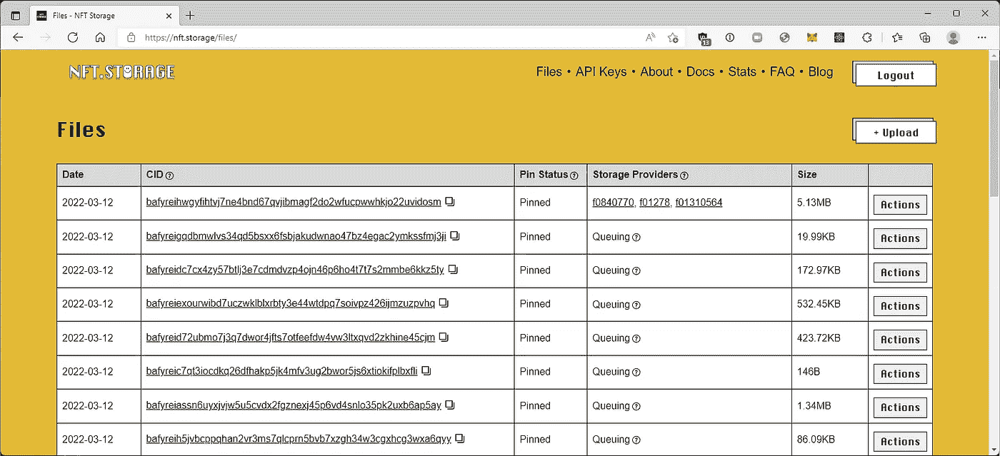

# NFT 储物件(你需要知道的一切)

> 原文：<https://medium.com/coinmonks/nft-storage-everything-you-need-to-know-d4556ce376a9?source=collection_archive---------7----------------------->

## 介绍您唯一需要的 NFT 储物解决方案

**#康普西#区块链#IPFS #NFT**


Photo by [MagicPattern](https://unsplash.com/@magicpattern?utm_source=medium&utm_medium=referral) on [Unsplash](https://unsplash.com?utm_source=medium&utm_medium=referral)

# 介绍

**NFT。存储**是 **IPFS** 解决方案，用于**将** **图像**和**元数据**存储到**持久**、**分散** **存储**；换句话说，它是满足您所有 NFT 储物需求的一站式商店。

> 📍注意:NFT。Storage 确实为上传 NFT 提供了一个图形界面，但是本文将重点介绍脚本方法。

# 装置

NFT。存储通过项目中的**本地安装**使用。

```
npm install nft.storage
```

此外，安装`mime`包，它有助于识别文件类型。

```
npm instal mime
```

接下来，参观 NFT。存储帐户页面来创建 API 令牌。此令牌将在与服务交互的所有脚本中使用；始终保持您的令牌的秘密，并注意不要透露给任何人。

# 文件上传

NFT。存储支持单个文件上传，使用`store()`功能。

要存储 NFT，请编写一个与服务交互的脚本。完成后，在命令行中用所有必要的参数执行它。

*下面是一个单独的文件上传脚本:*

*这是上一个脚本的执行:*

```
node fileUploadScript.js `Image Path` `Token Name` `Description`
```

# 商店目录

NFT。存储支持**文件目录**上传，使用`files-from-path`包。

```
npm install nft.storage files-from-path
```

接下来创建一个与上一个类似的脚本，但是使用 `filesFromPath()`函数来处理目标目录中的每个文件。完成后，用`storeDirectory()`功能保存目录。

*下面是一个目录上传脚本:*

`pathPrefix`选项告诉`filesFromPath`从它通过调用`path.resolve`创建的`File`对象的文件名中删除输入`path`。

*下面是上一个脚本的执行:*

```
node directoryUploadScript.js
```

# [计]元数据

NFT。存储支持**定制元数据，**使用传统的 **JSON 数据**方案。

标准元数据字段值为`image`、`name`、&、`description`。可以添加一个附加字段`properties`，以提供特定于上传的附加自定义字段。

在这样的方案中，图像被存储为`File`或`Blob`对象，它们应该包含 PNG 或 JPEG 格式的图像数据。

*以下是自定义元数据上传:*

> **✏️注:**根据您的需求，获取照片的方法可能会有所不同。

# 查看上传状态

NFT。存储服务提供了几种检查上传状态的方法。

在 NFT 的文件列表页面上。存储站点，您可以看到您使用唯一的服务令牌上传的所有内容。



文件列表页面上的表格有两列与数据存储过程的当前状态相关:**固定状态**和**存储提供者**。

*   **固定状态**表示您的数据是否被“固定”到 IPFS 集群。这个状态有三个可能的值:`Queuing`、`Pinned`和`Failed`。
*   **存储提供商**表示承诺长期存储您的数据的 *Filecoin* 存储提供商。该状态有两个可能的值:`Queuing`和`Active`。

# 就是这样！

正如我在我的页面上所说的，这些是我个人笔记本上的笔记。如果有任何明显的错误，请随时留下评论，以便我可以修复它们。还有，如果有你想从我这里看到的内容，请告诉我！

## 来源:

NFT。存储文档:(【https://nft.storage/docs/】T21)

> 交易新手？尝试[加密交易机器人](/coinmonks/crypto-trading-bot-c2ffce8acb2a)或[复制交易](/coinmonks/top-10-crypto-copy-trading-platforms-for-beginners-d0c37c7d698c)