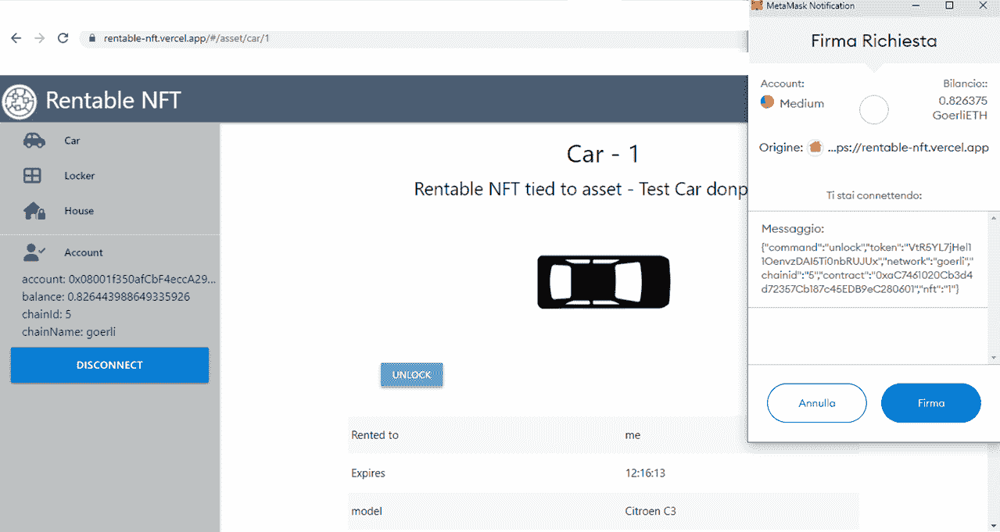

# NFT 与物联网设备紧密相连

> 原文：<https://medium.com/coinmonks/nft-tied-to-iot-device-a-demo-application-73fa760196a9?source=collection_archive---------10----------------------->

## [NFT 系列](/@donpablooooo/list/nft-series-34dea60327e7)

## 演示应用程序

当前的 NFT 通常与虚拟或物理的被动资产相关联，但在以下场景中，没有什么可以阻止它们与智能物联网设备相关联:

*   NFT 的所有者向设备发送命令，
*   该设备可以检查命令是否来自 NFT 的所有者并服从。

这种情况与我在[之前的一篇文章](/coinmonks/nfts-how-should-be-used-7909d34748e4)中描述的情况非常相似，其中描述了证明 NFT 所有权的过程。

乍一看，这似乎很简单，因为 NFT 持有者的地址在区块链上是公开的，但实际问题是:“所有者如何向智能设备证明他控制着该地址的私钥？”。

在一个简化的场景中，需要什么？

用户，其:

*   拥有设备绑定到的 NFT，
*   有一个能够签署信息的数字钱包。

一种物联网设备，其:

*   知道它所联系的 NFT 是什么，
*   具有可用于通信的可访问 web 端点。

然后，需要一个移动应用程序或 Web 应用程序来实现用户和设备之间的通信。

下面是所有权验证过程的一个示例。物联网设备变成了车锁，用户变成了汽车的主人，当然还有相关的 NFT(id 为 42)。

在这里，车主希望通过应用解锁他的汽车，因此通过应用向物联网设备发送解锁请求。

设备用包含命令和其它相关信息的消息来响应。当收到消息时，应用程序会要求用户的钱包签名。签名将保证用户就是他所声称的那个人。

然后，应用程序将签名的消息发送回设备。该设备验证签名并解析用户的地址。

现在，设备已经具备了验证命令是否来自其实际所有者的所有要素。因此，它查询区块链并检查其关联 NFT 的所有者是否与消息发送者的地址匹配。如果是，解锁命令被触发，汽车打开。

如果您对技术细节更感兴趣，我建议您阅读我以前的文章:“[实用程序 NFT:如何证明所有权](/coinmonks/nfts-how-should-be-used-7909d34748e4)”，在这里您可以找到部件之间交换消息的示例和一些代码片段，以了解验证应该如何实现。

# 演示应用程序

在[https://rentable-NFT . vercel . app](https://rentable-nft.vercel.app)你可以找到整个过程的演示应用。

当然，物联网设备是假的，你只会看到设备的图像，向它发送命令就意味着用另一个图像来改变那个图像。但我希望这足以理解事情是如何运作的。

在演示中，我将假设备与可租赁的 NFT 相关联，因此您不需要成为 NFT 的所有者，而是它的“用户”。

如果你不知道什么是可出租的 NFT，基本上它介绍了 NFT 的“用户”的数字，以便 NFT 的所有者可以在一定时间内将其出租给用户。在此期间，用户暂时获得 NFT 赋予的特权，但不能转让其所有权。

如果你对可出租的 NFTs 更好奇，我推荐你这篇文章“[可出租的 NFT (ERC-4907):如何才能改进](/coinmonks/rentable-nft-eip-4907-how-can-be-improved-b20a1b5a27bf)”，里面有更多的细节。

该网站位于格利测试网络上，你所需要的只是一个装有格利的数字钱包，它将被用来租一辆 NFT。你可以通过歌尔丽水龙头(【https://goerlifaucet.com】)将歌尔丽发送到你的钱包里。

第一步是将你的钱包连接到该网站，然后去汽车区(或另一个)寻找“可租赁的汽车”。

点击可供租赁的汽车，然后点击“租赁”按钮。

用钱包确认房租交易；耐心等待交易完成，只需 0.0012 格里斯(加上一些油费)，绑在那辆车上的 NFT 一小时就是你的了。

页面自动重新加载(如果没有，自己重新加载)，并显示汽车接受的两个可能的命令:“锁定”和“解锁”。点击“解锁”按钮。

现在，你的钱包上会出现来自“设备”的签名请求。签了它，等待奇迹发生。

在引擎盖下，解锁按钮向一个假的物联网终端发送“解锁请求”，由 Web 应用程序控制。端点用要签名的消息进行响应。然后，Web 应用程序向钱包请求签名。在您确认后，钱包会对消息进行签名，并将签名返回给应用程序，应用程序会将消息和签名发送回“设备”端点。进入端点，有之前解释过的验证逻辑。如果一切正常，你会看到车门开着的车。

反正没有什么比给 https://github.com/donpabblo/rentable-nft 看一下代码更好的了:[。](https://github.com/donpabblo/rentable-nft)

随时给我反馈(也是负面的，不用担心:-))，关于这个话题的评论和建议。

更多阅读来自 [**NFT 系列**](/@donpablooooo/list/nft-series-34dea60327e7) 。

> 交易新手？试试[加密交易机器人](/coinmonks/crypto-trading-bot-c2ffce8acb2a)或者[复制交易](/coinmonks/top-10-crypto-copy-trading-platforms-for-beginners-d0c37c7d698c)