# NFTNerds 详细指南| NFT 交易系列|发现新项目和即时购买

> 原文：<https://medium.com/coinmonks/nftnerds-detailed-guide-nft-trading-collections-discover-new-project-and-instant-buying-330bfa9aaab5?source=collection_archive---------21----------------------->

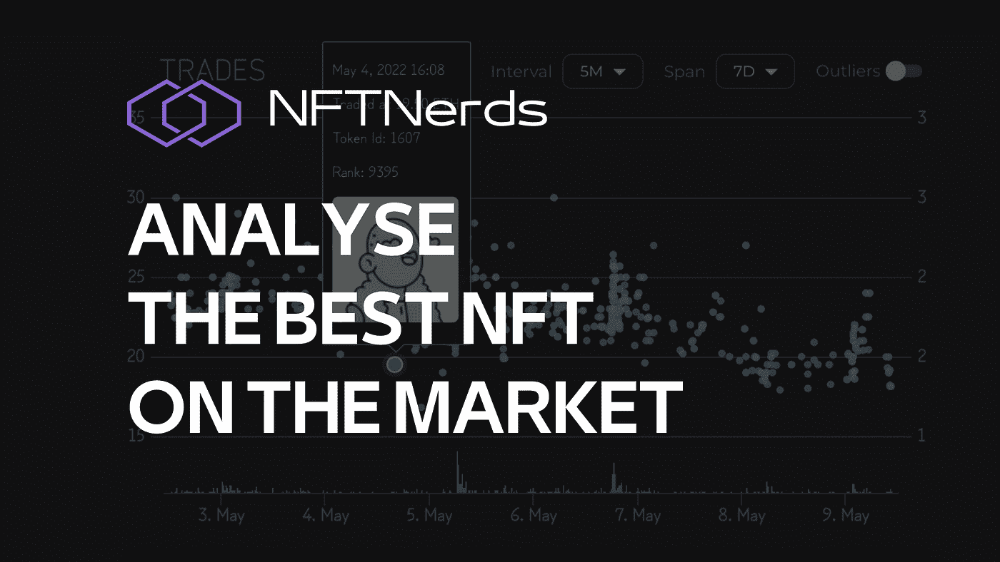

> 4 秒内买一个 NFT？使用 NFTNerds 就可以做到！如果你是一个专注的 NFT 交易者，这个工具当然值得一试。

**👉跟我上** [***推特***](https://twitter.com/TheCryptoKK)***|***[***中***](/@TheCryptoKK) **让自己升职！**

**聚焦#NFT 研究员&#网路搜寻家**

**每日分享# web 3 # Crypto # NFT #比特币的真实素材**

对于那些将非功能性金融交易视为严肃生意的人来说，NFTNerds 是一个必不可少的工具。它让认真的 NFT 交易者可以实时了解特定 NFT 项目和整个市场的情况。

该仪表板提供了一个项目当前性能的一站式概览，一些价格变化甚至比 OpenSea 等主要交易所更快地得到反映。NFTNerds 还显示了稀有度排名，这对于让潜在买家抢购便宜货至关重要，他们无需翻遍菜单就能找到。

NFTNerds 还突出了趋势系列和新系列，并让您了解汽油价格，并允许您定制它们。该网站还有一个购买门户，确保你不会在导航到第三方交易所去抢你的 NFT 时浪费重要的时间。

# I .跟踪最新项目

***展示日历*** 高亮显示收藏的新项目。

提醒将根据您的时区进行修改。

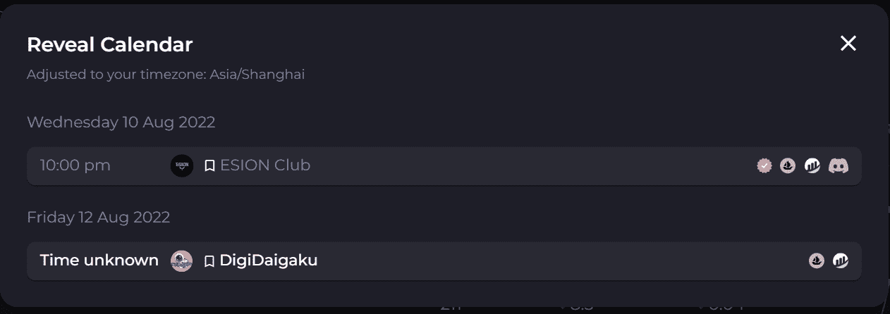

***铸币*** 站点提供铸币通票实时记录，有气费范围，最高优先级费，平均交易价格。

它还更新了右侧最活跃的铸币厂，反映了总共铸造了多少个 NFT，以及鲸鱼的数量。实时更新的交易信息对于在一级市场寻找蓝筹股的买家来说是一个很好的参考。

# 二。购买想要的 NFT

*   **如何解读数据？**

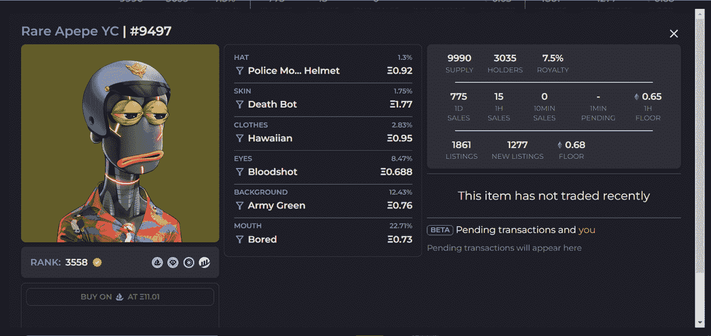

对于每个单个项目，在右上方显示一些基本信息，如供应量、持有人、近期销售情况、楼面价等，而我们最需要关注的是新的待批数量，这有助于你了解项目持有人销售趋势。

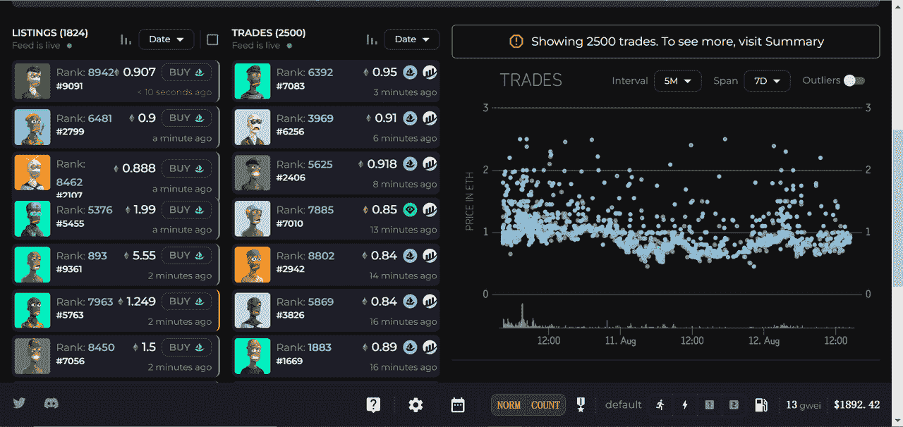

要做到数据可视化，左栏的挂单会每秒更新一次，直接显示稀有度排名、挂单价格和购买平台，也可以直接点击购买按钮进行购买。请注意，绿色横幅代表第一个列表，红色代表低价，黄色代表提价。

交易列表和交易图表显示特定时间内的销售，上限为 2500 倍。检查 ***总结*** 如果你想寻找更完整的数据。

交易图直观地显示了不同稀有程度的价格和数量趋势。每个点的颜色代表它的稀有程度，从最稀有的粉红色到最常见的蓝绿色。有时会出现一个金点，这意味着令牌当前不可用。

默认情况下，极端价格的销售是隐藏的，可以通过切换右上角的“异常值”开关来查看。

*   **什么时候出售？**

卖家通常会选择在 NFT 价值下跌之前卖出，但出售的时机很难预测。历史图表让卖家知道何时卖出。

与折线图一起解释，其中紫色条表示销售量，绿色和红色条分别表示绿色和红色横幅的数量。下图显示 2.5 ETH 以下的交易全部成交。越来越多的红色条意味着 NFT 进入买方市场，而许多卖方开始妥协，地板价格在未来也可能会下降。

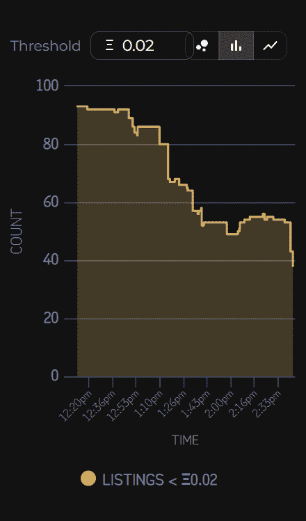

项目集中度也是一个重要的参考维度。根据所示的持有人总数、平均持有人数和独立持有人数，项目越分散，覆盖面就越广。

当这些独立持有人对 NFT 项目的趋势保持信心时，没有人愿意出售他们最后的 NFT。例如，Moonbirds 拥有 66%的独立股东份额，平均拥有 1.5 个单位。

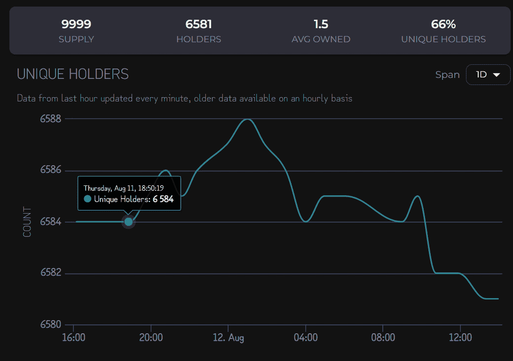

*   **立即购买！**

设定价格、等级或填写您想要的代币 ID 进行购买。

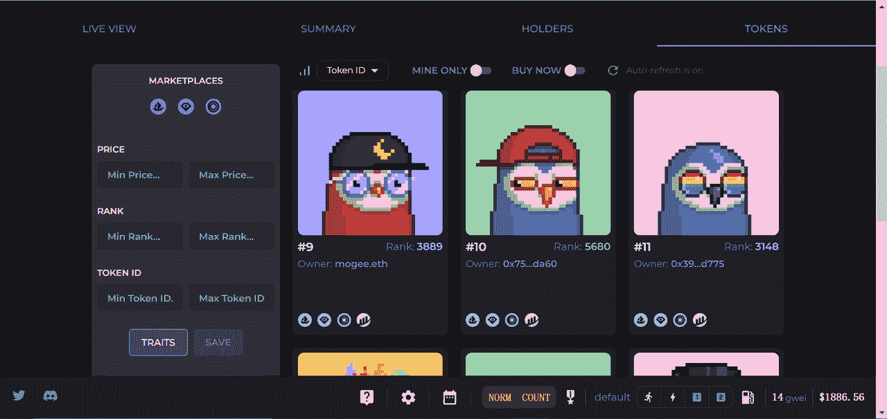

如果现有的挂单系列不符合您设置的条件，请返回到消防站委员会。输入你想追踪的收藏，你会得到你喜欢的物品。

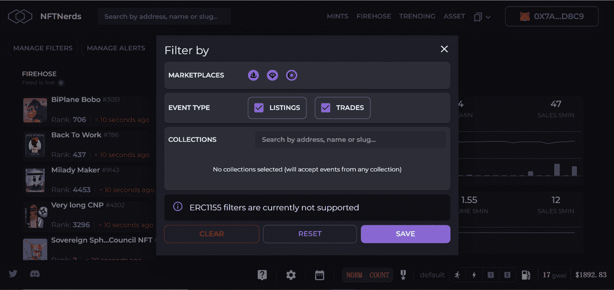

要让购买更快捷，先设置优先气费。点击一个特定的 NFT，未决交易将显示你的竞争对手给的气费。如果你想和他/她竞争，就提高你的油费。设置两套你能接受的最高优先费和最高气费。

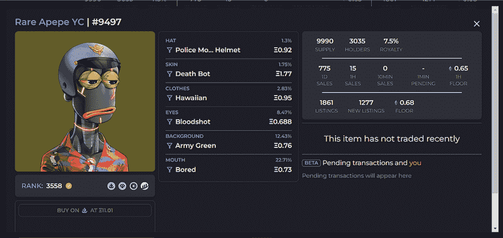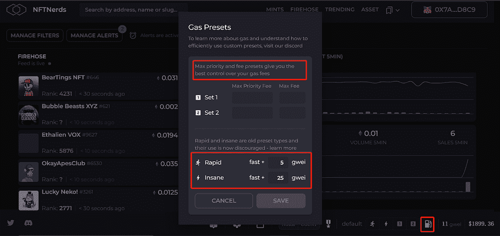

*   **可以更快！**

管理警报以设置您可以接受的最高价格和最高稀缺性等级，也可以通过预期特征进行过滤。记得把这一页放在最上面。当匹配的 NFT 被列出时，NFTNerds 将自动弹出。而且，你甚至可以设置自动购买，让钱包自动弹出，加上你设置的油费，达到工具声称的“4 秒购买”的效果。

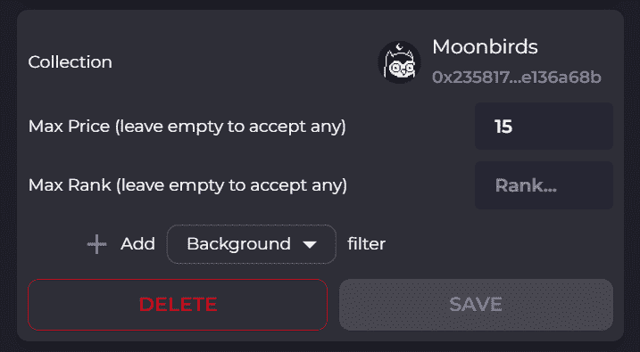

***关注我让自己升职！***

***聚焦#NFT 研究员&#蛛网***

***每日分享关于# web 3 # Crypto # NFT #比特币的真实素材***

[***碎碎念***](https://twitter.com/TheCryptoKK)***|***[***中等***](/@TheCryptoKK)

*欢迎关注我，并随时询问任何事情*

> 交易新手？尝试[加密交易机器人](/coinmonks/crypto-trading-bot-c2ffce8acb2a)或[复制交易](/coinmonks/top-10-crypto-copy-trading-platforms-for-beginners-d0c37c7d698c)