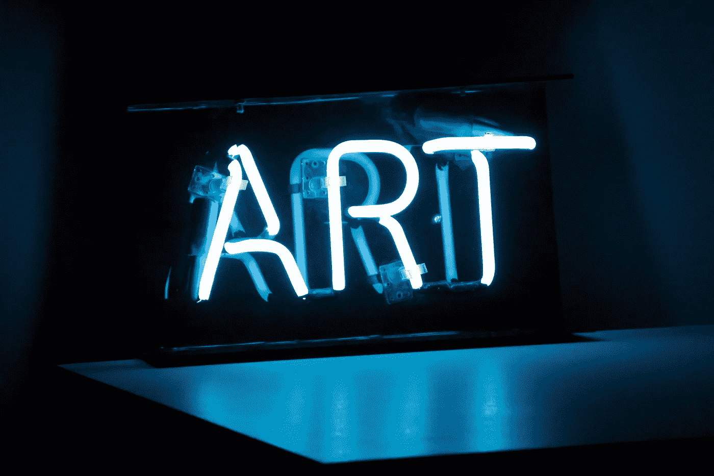

# NFTs 和 AR 对你的企业来说将是一个有利可图的组合

> 原文：<https://medium.com/coinmonks/nfts-and-ar-will-be-a-lucrative-combo-for-your-business-75165a3c3caa?source=collection_archive---------18----------------------->

Photo by [Zach Key](https://unsplash.com/@ian_w?utm_source=unsplash&utm_medium=referral&utm_content=creditCopyText) on [Unsplash](https://unsplash.com/photos/rKE6rXOl14U?utm_source=unsplash&utm_medium=referral&utm_content=creditCopyText)

我谈了很多关于如何利用 XR 科技和元宇宙机会赚钱的问题。今天，我想走出杂草，走进云端。

让我们一起想象。

> 交易新手？在[最佳密码交易所](/coinmonks/crypto-exchange-dd2f9d6f3769)上尝试[密码交易机器人](/coinmonks/crypto-trading-bot-c2ffce8acb2a)或[复制交易](/coinmonks/top-10-crypto-copy-trading-platforms-for-beginners-d0c37c7d698c)

向前看大约 18 个月——3 年后(2022 年底),那时 [AR/MR 头戴设备](/@stephenmciverxr/defining-xr-terms-for-ceos-and-business-leaders-6ad0eeed0551)将成为主流并最终流行起来(仅供参考:在大约 3 年或更短的时间内，我们将看到广泛采用的增强现实头戴设备，它们足够便宜、足够轻便、足够吸引人)。

然后想象一下你会在自己的 NFT 数字艺术收藏中保存什么。

你觉得你不会有吗？再想想。

早在 2019 年，家居装饰估计是一个 6000 多亿美元的行业。这个数字在 2020 年只会增长，因为在疫情期间我们被迫呆在家里！我们家的外观和感觉比以往任何时候都重要！

装饰不仅仅是实用或实用主义；这是关于自我表达，精神健康，以及使我们成为人类的主观美的需要！

我是说，拜托…你会选哪栋房子？

*来源(左):* [*牧野义弘和建筑文摘*](https://www.architecturaldigest.com/story/wall-decor-ideas) *来源(右):* [*水星出版社&媒体有限公司和每日邮报*](http://www.dailymail.co.uk/news/article-2947277/Terrible-estate-agent-pictures-homes-dodgy-decor-random-animals-bizarre-furnishings.html)

如果你可以根据一天中的时间来改变你的房子、办公室或房间的部分外观，会怎么样？

如果你能根据谁要来重新排列墙上的图片，会怎么样？

如果你可以用独一无二的生产力大师迈克尔·斯科特的激励海报来激励自己一天的深度工作，会怎么样？

*来源(及购买链接):*[*red bubble*](https://www.redbubble.com/i/poster/Michael-Scott-by-ItsDarkInThere/54707165.LVTDI?country_code=US&gclid=Cj0KCQiA99ybBhD9ARIsALvZavWDitwzAm8S0BNG-2m9z0IK96DC7sJZQngSGNhB3nzWTuRmUZfQBlgaAnDcEALw_wcB&gclsrc=aw.ds)

## 让我们更进一步。

你去你朋友家，你把你的 AR 耳机开着。当你走上他们的楼梯时，你会注意到你周围奇妙的数字艺术。有些是静态的，看起来很真实，你会仔细看看它是否真的存在。

当你到达主生活区时，你会受到意想不到的烟火热烈欢迎，宣告你的到来！红地毯在你面前铺开，你鞠躬，然后和你的朋友一起大笑。

> 所有这些都将通过 AR 成为可能。(事实上，这在今天已经是可能的了…但是还没有为大众创造出来…)

## 那么 NFT 在哪里发挥作用呢？让我们继续想象。

你参加公司一年一度的圣诞晚会，所有同样不可思议的 AR 效果都在你身边。物理装饰是正确的，但有各种各样的精彩，互动的额外通过你的耳机的观点。

当你离开的时候，你得到了一个普通的圣诞礼物包，但是却带了一些不太合适的东西。每个人都带着一件独一无二的艺术品离开，而这件艺术品现在是你的专属。他们只有一个，你拥有它。你的公司在 OpenSea 上购买了一幅 NFT，并在你离开时转让给了你，所以现在你可以在任何你喜欢的地方展示这幅新的艺术作品。

*我得花点时间琢磨一下这个……我很高兴有一天我的一个朋友真的喜欢我的 3D 作品，我可以把它作为礼物送给他们，在他们的房子里展示！然后其他人会看到它，听到我如何购买或创造它并把它给他们的历史…我们的东西背后的故事总是让它更令人兴奋！*

## 这就是为什么 NFTs 和 AR 之间的关系会如此重要。

目前，人们已经拥有 NFT 数字艺术收藏。这种情况在相当极端的水平上发生，销售价格往往高达数百万*(阅读我的整篇文章，了解为什么非功能性测试像听起来那样愚蠢，但也是一座金矿* *)。*

但是，如果不能在“真实世界”中看到数字艺术，它就没有那么有用了，这就是增强现实的用武之地。

NFTs 使用区块链技术使独家数字所有权成为现实，而 AR 使独家数字所有权变得实际有用，所以你可以在真实世界中以全 3D 显示它，每个人都可以通过 AR 耳机观看它。

当你开始看到这段关系将开启的所有可能性时，你就能看到人们将走向多少新的方向！

想想旅游业:艺术家们将开始画壁画，并把它们作为 NFT 送给城市。不是被锁在一个地方…一个单独的壁画可能能够在世界各地“旅行”,而没有实际移动一个大型艺术装置的物流成本。

> 通过 NFTs 的独家所有权与增强现实的实用性相结合，我们可以回收使艺术更有价值的稀缺资源。

游客在扫描 Instagram 后将不能只是“在他们的客厅里检查它”……他们将不得不去有壁画实际存在的虚拟体验！他们将扫描一个二维码或打开该城市的 AR 过滤器，并看到遍布整个城市的所有令人难以置信的艺术品。

> 也许你公司的店面可以挂一幅这样的壁画。
> 
> 也许你可以委托一位当地的艺术家来制作，制造出一大堆令人兴奋的声音。
> 
> 也许你可以开始把 NFT 作为礼物送给高级客户。
> 
> 也许你可以在客户走进你的室内设计公司时向他们分发高级 AR 耳机，这样他们就可以看到你可以在你的空间中实际创建的 5 倍设计。

NFTs 和 AR 是一对完美的组合，将会创造出大量的新的可能性:确保你的公司准备好投资。

您是否需要进一步的指导，以了解如何针对您的业务进行导航？在 LinkedIn 上给我发消息，我们可以聊天！