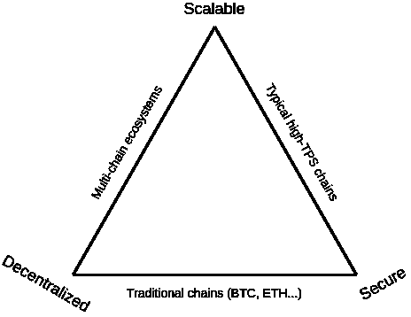
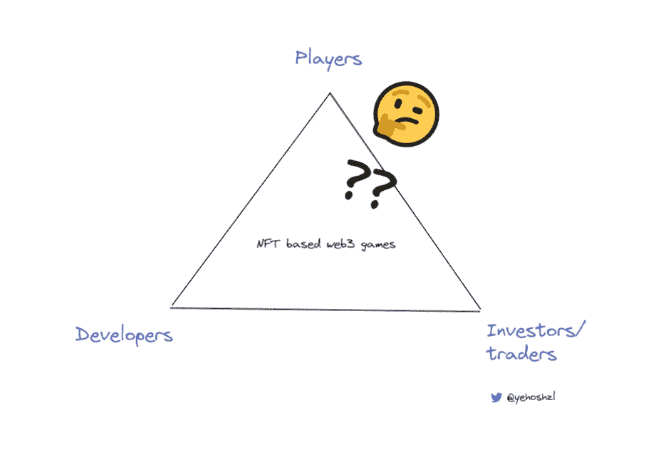
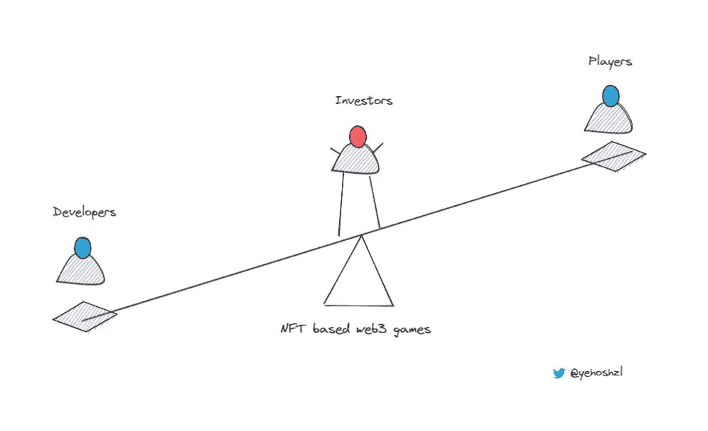

# NFTs 和 web3 游戏三难困境

> 原文：<https://medium.com/coinmonks/nfts-and-the-web3-gaming-trilemma-44d7fe73b9fd?source=collection_archive---------6----------------------->

“区块链三难困境”是指人们认为区块链只能提供健康网络所必需的三个要素中的两个:安全性、分权和规模。区块链不得不在其中一个问题上妥协。通过向三角形中两个方面都很强的部分移动，你就和第三个方面拉开了距离。

Source: [https://vitalik.ca/general/2021/04/07/sharding.html](https://vitalik.ca/general/2021/04/07/sharding.html)

类似的三难困境也存在于 web3 游戏中，它的存在是因为一个新用户进入了游戏领域:投资者。

游戏传统上有两个利益相关者:游戏开发者和游戏玩家。偶尔会有法官介入争论，但开发者和玩家之间的关系一直是游戏的支点。直到 web3，一个新的“玩家”进入了游戏世界，并戏剧性地改变了局面。这并不是说“投资者/交易者”玩家类型在传统游戏中不存在。交易员和投资者参与了一些大型游戏特许经营，如万智牌(一种交易卡牌游戏)，或者最近参与了一些在线游戏，如 Runescape 和 Eve Online。

虽然交易和游戏内经济是这些游戏的核心，但这仍然是一个边缘游戏运动。大多数游戏玩家从未遇到过作为游戏核心部分的拥有和交易机制，或者更重要的是，所有权经济，这使得与金融世界的其余部分的互操作性成为 web3 中的核心原语。

## 投资游戏玩家

投资者和交易者游戏玩家是一种新的游戏玩家。一个对所有权经济、投资回报率和投机感兴趣的人。他们也可能是游戏玩家，热爱游戏，但他们的核心是从交易和获胜中获得乐趣。对他们来说，金融方面就是游戏。太酷了！你可能会说。理财难道不是过山车大亨的核心部分吗？是的…但是。最大的“但是”是，web3 投资者游戏玩家原型有能力破坏普通游戏玩家的游戏，使三元悖论看起来不像三角形，而更像一个坏掉的跷跷板。

The web3 game seesaw

在传统上玩家和开发者有直接关系的地方，在 web3 中，投资者已经成为中间的主导用户类型。只要两边有一点点重量，他们就能让整个跷跷板失去平衡。

这种情况一再发生。投资者抬高了不同 web3 游戏资产的价格，使得这款游戏玩起来很贵，很无聊，有时当区块链变得拥挤时，甚至无法玩下去。在一个“免费游戏”的世界里，所有这些都是游戏玩家所厌恶的。

在游戏角色中，土地和物品被早期的投机者买走，而真正的游戏玩家从不参与。这是一个我已经在这里深入讨论过的话题。那么，为什么开发人员不断陷入同一个陷阱，我们如何才能解决这个三难问题并修复这个跷跷板呢？

我为加密协议设计了令牌组学(所有这些都还在启动阶段),并且正在将我所学的一切投入到一个超级深入的令牌组学课程中。如果你对我的免费电子邮件令牌学课程感兴趣， [*在这里报名*](https://designingtokenomics.com/) *！*

# web3 游戏三难解决方案！

问题在于，web3 的游戏开发商将投资者和玩家捆绑在一起，为他们的游戏筹集资金。需要停下来。他们需要以传统的方式筹集资金，或者当他们的游戏能够证明这一点时，从这些投资者那里筹集资金。但是他们需要停止依赖投资者。

相反，他们需要将游戏开发的资金筹集与游戏本身分开。解决方案是将两个活动和玩家分开。让玩家**玩。**让投资者和交易者进行投资和交易。你不可能让一个成功的早期游戏开发出一个对投资者和玩家都有用的产品。一方总是以另一方为代价。如果你想开发一个游戏，开发一个游戏，然后当你想赚钱的时候，加入财务层。

这并不是说将所有权经济从游戏中移除。一点也不。这是 web3 游戏必须提供的[核心差异化点](https://designingtokenomics.com/the-complete-tokenomics-primer/articles/the-core-differentiation-between-web3-and-web2-games)。把财务方面去掉就行了。让它在早期可以自由拥有，自由玩耍。将资金筹集活动限制在为游戏开发筹集资金。让他们远离游戏动态。然后，以后，当它变得相关时，加入货币化。

积极的一面是，web3 鲸鱼的 LTV 可能比 web3 鲸鱼高得多(简单的例子:iOS 应用程序购买限制为 100 美元。BAYC 的最后一个价位是多少？高得多)，所以从一个成功的游戏中赚钱有很多好处。

如果你想鱼和熊掌兼得，解决办法是建立一个围绕交易和投资的游戏。把它变成游戏。

这只是另一种游戏:完全围绕真实金融打造的过山车大亨。这可能是一个很酷的游戏——但这是一个不同类型的游戏，有着不同于魔兽世界的玩家档案。

*我为加密协议设计了令牌组学(所有这些都还在启动阶段),并且正在将我所学的一切投入到一个关于令牌组学的超级深入的课程中。如果你对我的关于记号学的免费电子邮件课程感兴趣，请在这里* [*注册！*](https://designingtokenomics.com/)

> 交易新手？试试[加密交易机器人](/coinmonks/crypto-trading-bot-c2ffce8acb2a)或者[复制交易](/coinmonks/top-10-crypto-copy-trading-platforms-for-beginners-d0c37c7d698c)