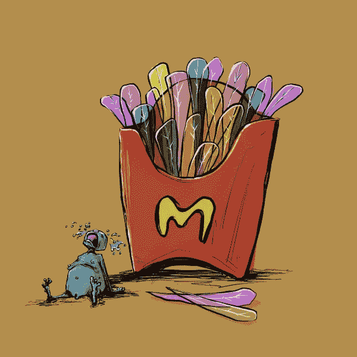

# NFT 是我们不能再忽视的大企业

> 原文：<https://medium.com/coinmonks/nfts-are-big-businesses-we-cant-ignore-anymore-327454175b15?source=collection_archive---------44----------------------->

Minting began for the [goblintown.wtf](https://goblintown.wtf/) collection [on May 19th, 2022](https://etherscan.io/tx/0x08d5f6ef87c3d50872cc6102b5bb003e48aedc5df307f89e937deea43b9cc069). The project was launched without any prior marketing and with little available information

过去的一个月里，尽管秘密交易市场陷入困境，但 NFT 的收藏家们还是抓住了他们的想象力。

现在这个项目背后的团队已经揭露了他们自己是真理实验室，他们以前的 NFT 收藏包括[光明会集体](https://illuminatinft.com/)和[187](https://the187.xyz/)。

观察市场和 NFT 如何随时间演变，我的一个问题是:

这是一种合法的商业模式吗？

它确实证明了 NFT 项目可以切实支持生态系统。

你可以把 NFT 项目做成一笔正当的生意。

戈布林敦背后的数字确实令人震惊。

到目前为止，在戈布林顿国家粮食信托基金上总共花费了 24，521 Eth。

按照目前的 Eth 价格，这相当于近 4000 万美元。

经过大起大落，跟随熊市，它的地板价格仍然是一个健康的 2 Eth。

它设法在这样一个竞争激烈的环境中生存下来，NFT 的项目就像太平洋的潮汐一样来来去去。

按 24 小时交易量计算，它仍然是 NFT 交易最活跃的十大项目之一。

我说的是击败重量级人物，比如 Doodles，VeeFriends，Cool Cats 和 World of Women。

他们在推特上有 12 万粉丝。

The artwork is a cross between wtf and grotesque.

请记住，这是一个看似凭空出现的项目。

他们在发布时没有真正的团队支持。

他们主持了一个 3 小时的推特空间会议，除了地精的咕噜声和奇怪的噪音什么都没有。

他们让人们对他们不可思议的成功感到困惑和不解。

他们领导了另一个寒武纪大爆发的珠蛋白衍生项目，该项目继续延续这种崇拜，并进一步滋养了社区。

似乎幕后团队真的知道他们到底在做什么。

似乎建立一个由工程师、设计师、社区建设者和营销人员组成的团队来建设 NFT 项目在现代是一个可行的商业模式。

震惊吧。

不完全是。

做些笔记。

宇迦实验室和 BAYC，现在是另一边的元宇宙。

真理实验室和格林顿。

幼虫实验室和密码朋克。

加里·维纳查克和维费罗斯。

扎加邦德和志那都红豆。

凯文·罗斯和月鸟。

*“***AAAAAAAUUUUUGGGHHHHH gobblins goblinns GOBLINNNNNNNNns wekm ta goblintown yoo sniksnakr DEJEN RATS oooooh rats are yummmz dis a NEFTEEE O GOBBLINGS on da BLOKCHIN wat? oh. crustybutt da goblinking say GEE EMMM DEDJEN RUTS an queenie saay HLLO SWEATIES ok dats all byeby***” —* [*goblintown.wtf’s collection description*](https://opensea.io/collection/goblintownwtf)

5 年前，如果我告诉你，你可以在网上设计、制作和营销图片，赚取数百万美元的收入，你可能会笑着让我去看医生。

记住我的话，哈佛商学院和老师们将把这些成功作为基准和案例研究。

忘记 NFT 作为爱好或副业。

NFTs 可以是合法的创收业务。

经营一家成功的 NFT 公司不仅仅是用算法来设计 1 万张数字图像。

有典型的构思和讲故事，招聘人才，公司内部流程，建立和设计正确的智能合同，还有社区建设的复杂性，营销和品牌的密集努力。

也许我应该开办一所学校，教授如何把 NFTs 作为一门正当的生意来经营。

或者干脆买辆 BAYC，看它的月亮。

-

你会投资经营 NFT 业务的公司吗？

-

# startups # business # startupx # growth # success # social media # culture # entrepreneurs # strategy # eth #比特币#加密货币# bayc # nft #品牌化# goblintown # web3 #商业模式

> 交易新手？试试[加密交易机器人](/coinmonks/crypto-trading-bot-c2ffce8acb2a)或者[复制交易](/coinmonks/top-10-crypto-copy-trading-platforms-for-beginners-d0c37c7d698c)