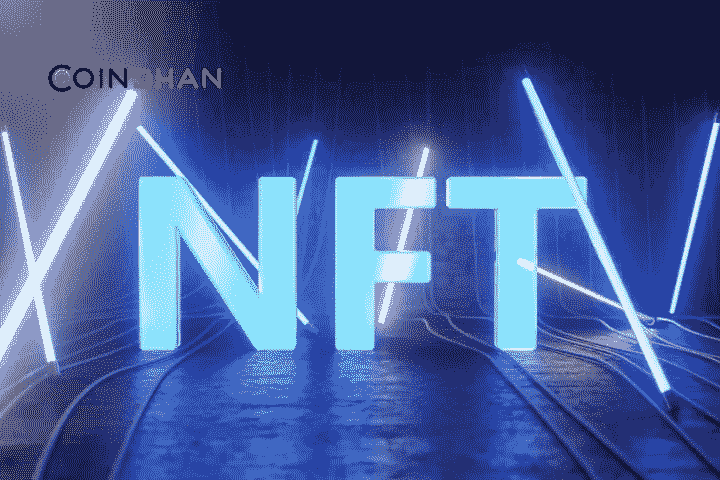

# 在元宇宙，非物质文化遗产不仅仅是艺术和绘画

> 原文：<https://medium.com/coinmonks/nfts-are-much-more-than-art-and-painting-in-the-metaverse-2ef9f354444b?source=collection_archive---------49----------------------->

当 crypto kitty 在 2017 年开始时，NFTs 开始时很不起眼，然而，随着时间的推移，NFTs 对 art 的贡献越来越大。在撰写本文时，这个市场的市值已经从百万美元变成了惊人的 1470 亿美元。NFT 的大部分贡献在于艺术和音乐领域，但并不仅限于此。NFTs 是如何超越为艺术和音乐提供动力的形象的，我们将在本文中看到。

# 什么是 NFT？

NFT 是唯一的加密资产，由单独的元数据来区分，使它们与其他资产不同。因此，NFT 是不可替代的，这意味着如果你有两个 BAYC NFTs，你想和你的一个朋友交换其中一个以产生相同的价值，就像交换一张 5 美元的钞票一样，这是不可能的。因此，NFT 享有独立的独特地位，由于这个原因，他们在元宇宙建立了新的用例，证明所有权。

# 什么是元宇宙？

元宇宙是一个独特的数字空间，它通过使用 AR 和 VR 创建了一个 3D 环境，并建立了一种新的互联网形式。在这个互联网世界，任何人都可以通过他们的数字化身在现实世界中做任何他们想做的事情。比如去办公室、购物、聚会、玩游戏等等。当你想探索元宇宙时，天空是无限的。

# 在元宇宙，NFTs 如何不仅仅是推动艺术和音乐的媒介？

品牌和各种行业已经在元宇宙开放。从三星、阿迪达斯到脸书，所有知名企业都想从元宇宙分一杯羹。也就是说，在这个领域建立真正的所有权至关重要。例如，假设你在[分散土地](https://decentraland.org/)上拥有一块土地，你想进行创新并出售。首要的事情是建立所有权。下一步将是给其他人提供机会，让他们帮助你建设自己的土地。所有这些都可以通过 NFTs 供电。

如果你在元宇宙拥有一座体育场，并主持过比赛模型，即使是这样的赛事，你也一定会需要 NFTs 来售票。耐克、蒂芙尼和《时代》杂志已经将 NFTs 作为举办锦标赛的可行选择，并在元宇宙获得急需的曝光率。谈到非功能性测试，用例是无限的。甚至可以通过 NFTs 在元宇宙内为用户提供单独的身份，以维护法律和秩序。因为任何在元宇宙犯罪的人都会受到当局的谴责。人们可以成立一个 NFT 道警察来处理这类事件。这些概念仍处于萌芽阶段，它们最终会随着时间的推移而成熟。当这种情况发生时，NFT 无疑将为元宇宙提供动力，它们将超越艺术和绘画。

> 交易新手？试试[加密交易机器人](/coinmonks/crypto-trading-bot-c2ffce8acb2a)或者[复制交易](/coinmonks/top-10-crypto-copy-trading-platforms-for-beginners-d0c37c7d698c)