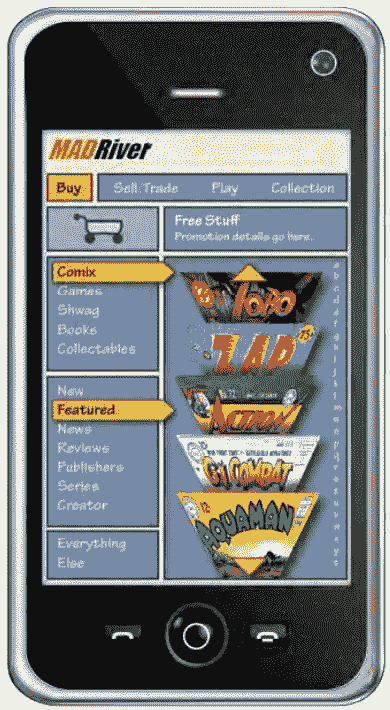
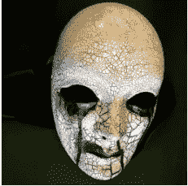

# NFT 很漂亮，但比特币 NFT 是游戏规则的改变者

> 原文：<https://medium.com/coinmonks/nfts-are-nifty-but-a-bitcoin-nft-is-a-game-changer-8dd62eb1b4d?source=collection_archive---------22----------------------->

当我听说 NFTs 的时候，我既兴奋又怀疑。早在 2012 年，我推出了 Mad River Entertainment，这是一个虚拟商品交易平台(现在被认为是 NFT 平台)，用户可以购买、出售和交易漫画和人物。我们有自己的货币“蛤蜊”(不与区块链挂钩)，用于易货和贸易。我们平台上的出版商可以设定虚拟商品的稀缺程度(NFT)。例如，“吉姆·福克斯超级英雄 1999”的第一期只能有 50 本。这个想法是，由于物品的稀缺性，二级市场会更有价值，就像早期的漫画书一样。出版商或版权所有者不仅在第一次销售中赚钱，而且在现有拷贝的每一次二次销售或交易中赚钱。我们的使命是让创意者有机会在他们的原创作品被买卖时受益。你不仅可以买到漫画书，还可以买到用于信息、游戏和市场的角色。与一件艺术品相关的使用权是由出版商/版权所有者定义的。

从目前的角度来看，我早了 10 年，因为我试图建立一个数字市场，让创意人员(艺术家、作家、内容创作者、设计师、作词人、音乐制作人、出版商等)出售他们的数字作品，为其创造内在价值，这正是今天的 NFT。我不太确定原创作品多久——或者是否——从二次销售中获得报酬。我相信他们的价值可能会因平台而异，但我仍然相信创意人员的基本权利是根据市场需求获得相应的报酬。

如今，以太坊是用于 NFTs 的头号加密货币。众所周知，以太坊的 NTFs 交易费非常高。我甚至听到一些人辩称，高收费实际上吸引了真正的收藏家/投资者。他们说，愿意支付高额运费是因为他们相信这凸显了 NFT 的更高价值。我可以从我自己在艺术界的经历告诉你(快塞给我老婆[金心艺术家)](https://kimhartartist.com/)，这根本不是真的。有眼光的国际艺术品收藏家和你在当地艺术博览会上的普通买家一样关心交易成本和运输。没有人愿意为任何东西支付比他们必须支付的更多的钱，即使是有价值的艺术品。

更重要的是，高昂的交易成本阻碍了 NFTs 在一个可行的、强大的二级市场中站稳脚跟所必需的交易速度，这使得整个努力是值得的。当你想到交易漫画、书籍、游戏商品(虚拟商品)、音乐、门票等。在我看来，这些类别都有着悠久的传统、繁荣的二级市场历史，NFT 的二级市场是理想的选择。

大多数人一想到 NFTs 就会想到图像和数字艺术。但是 NFT 通常不在区块链上存储创意内容的数据。对于大多数图像(艺术、插图、照片等)的非功能性翻译来说，这太昂贵了。NFT 不是将数据存储在链上，而是包含一个指向数据的 URL。这些数据存储在类似于 Mad River 的平台上，因为它使用由平台或云管理的老式 Web2.0 服务器来托管图像内容。

因此，本质上，如果你投资于 ETH 的 NFT，你实际上是投资于托管 NFT 的平台，而不是区块链上的东西。这个托管平台很容易受到黑客攻击，甚至可以被 NFT 的创意者(如果他们有邪恶的意图)利用，根据登录的来源提供不同的图像。问题是，不管是被故意误导还是很可能被误解，NFT 的投资者/买家没有区块链的安全性来保护他们投资的完整性。ETH 仅仅是 NFTs 的首选加密货币，因为它在智能合约方面享有盛誉。

然而，NFTs 有望与比特币区块链以及在现实世界和数字世界都具有真正价值的相关艺术品挂钩。实现智能合约的两个协议以及可能与比特币相关的 NFT 让我乐观地认为，这可能会在未来几年内发生。

[Taro by Lighting Labs](https://lightning.engineering/posts/2022-9-28-taro-launch/) 使智能合约和开发者能够在比特币区块链上创造、发送和接收资产。我可能更感兴趣的是 Casey Rodarmors [Ordinals](https://docs.ordinals.com/theory.html) 项目，这是一个 satoshis 的编号方案，允许跟踪和传输单个 sat。在 10，000 英尺的高度，一个比特币有 100，000，000 个 satoshis 或 100，000，000 个潜在的 NFT。—哇！

让我无耻地再次以我妻子的作品为例:[这次是她独一无二的威尼斯面具](https://kimhartartist.com/masks-by-the-artist)。来自世界各地的收藏者购买她的面具，除了收藏之外，还在各种媒体项目和实时活动中使用。

Kim Hart Artist Collector’s Piece

最近，华纳兄弟公司为一部即将上映的电影购买了五个她的面具，这部电影由一位非常著名的篮球运动员主演。现在，假设有人利用上述比特币协议创建了一个 NFT 市场，她的面具不仅可以被购买和用于电影和电视项目，还可以用于游戏和其他虚拟身份。

我们知道她的面具的历史，包括华纳兄弟电影中使用的面具，这些面具有望成为票房大片。现在她的艺术和艺术的历史，包括转手和使用，被永久记录在比特币区块链上。这使得她的面具和许多其他 NFT 艺术项目有一个真正的二级市场和实际价格发现。不仅仅是基于以太坊的 NFT 所提供的泵和转储。对于艺术家和版权所有者来说，这给了我希望，他们作品的真正价值可以实现，他们不仅可以在第一次销售中受益，还可以在第二次销售中受益。

祝一切顺利，

吉姆(人名)

> 交易新手？试试[加密交易机器人](/coinmonks/crypto-trading-bot-c2ffce8acb2a)或者[复制交易](/coinmonks/top-10-crypto-copy-trading-platforms-for-beginners-d0c37c7d698c)