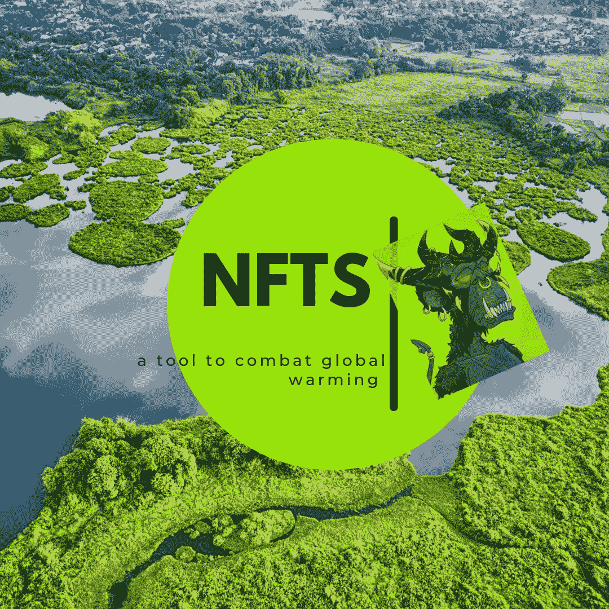

# NFTs 作为对抗全球变暖的工具

> 原文：<https://medium.com/coinmonks/nfts-as-a-tool-to-combat-global-warming-cb8dbf8f180c?source=collection_archive---------21----------------------->

Image by [Dammykhudz](https://mdium.com/@dammykhudz061)

“我们的生态系统正在恶化，但是 NFT 有潜力拯救我们……”

NFT 已经获得了如此多的关注，从以惊人的价格出售普通的 JPEGs 图片到以超过 200 万美元的价格出售[杰克·多西的第一条推文](https://www.google.com/amp/s/www.cnbc.com/amp/2021/03/22/jack-dorsey-sells-his-first-tweet-ever-as-an-nft-for-over-2point9-million.html)，炒作似乎不会很快消失。

除了倒卖艺术品和赚取资本收益，NFT 现在还为现实世界的问题提供解决方案。非功能性金融服务不仅仅是一种投机性资产类别的观点，促使人们认为非功能性金融服务终究可能是一种颠覆性技术。

## **什么是 NFT？**

NFT 是不可替换令牌的缩写。它可以表现为建立在区块链上的数字艺术、[音乐](/coinmonks/music-nft-8bce74f17b52)、绘画和文本。由于 NFT 是不可替代的，没有两个 NFT 可以在区块链上拥有相同的数据，这使得任何人都很难模仿被铸造为 NFT 的原始数字资产。

[作为一项能够在不久的将来被大众接受的创新](/coinmonks/nfts-beyond-right-click-and-save-19787eb2ce7a)，像耐克和三星这样的大公司已经投资将 NFTs 整合到他们的运营中。

## **NFTs 与全球变暖**

大多数人类活动向大气中排放碳，如果温室气体排放继续保持目前的水平，我们可能会面临严峻的气候变化。

*——但自 19 世纪以来，人类活动一直是气候变化的主要驱动力，主要是由于燃烧化石燃料(如煤、石油和天然气)，产生吸热气体。”* —联合国

Image by [Scied.ucar.edu](https://scied.ucar.edu/learning-zone/climate-change-impacts/predictions-future-global-climate#:~:text=Even%20one%20degree%20can%20impact,to%20rise%20at%20present%20levels)

在最近的一些应用中，非功能性食物与对抗全球变暖的能力联系在一起；这是通过一个概念[令牌化碳信用](https://coinmarketcap.com/alexandria/glossary/tokenized-carbon-credits)。

碳信用资助减少二氧化碳和促进环境友好型生态系统的活动。这可能包括植树和饲养动物。

事实上，NFT 的销售收入被投资到抵消我们生态系统中碳的项目中。

Likvidi 是将碳引入 NFT 的项目之一。NFT 的持有者有资格向大气中排放一定量的二氧化碳。未被充分利用的碳信用额可以进行货币交易，为那些排放较少二氧化碳的人提供激励。持有者不仅拯救了我们的星球，他们还能获得额外收入。

在这方面，NFT 与[再生金融(ReFi)](https://coinmarketcap.com/alexandria/glossary/regenerative-finance-refi) 相关联，这是一个旨在改善世界的金融包容性概念。

NFTs、加密货币和其他区块链发展被批评为对环境不友好；幸运的是，这项曾经不友好的技术这次可能会拯救世界。

## **这对 NFTs 意味着什么**

虽然以太坊，NFT 的动力，已经从 [PoW](https://coinmarketcap.com/alexandria/glossary/proof-of-work-pow) 转移到 [PoS](https://coinmarketcap.com/alexandria/glossary/proof-of-stake-pos) 共识机制，并且可以说比过去消耗更少的能源，使用 NFT 抵消碳可以确保政府灵活的监管合规性，而不是高能耗时代可能吸引的。

碳信用 NFT 提高了碳信用行业的透明度，因为与碳抵消相关的重要细节都存储在区块链上。这将鼓励更多的人参与这个不断增长的市场。

最后，这种类型的创新拓宽了创造性思维，可以识别金融包容性以外的非功能性金融工具的潜在应用，从而增加它们的总体效用。

***注意:*** *通过国家森林交易抵消碳，确保项目得到适当机构的批准，并确保碳抵消活动真正得到执行。*

> 交易新手？尝试[加密交易机器人](/coinmonks/crypto-trading-bot-c2ffce8acb2a)或[复制交易](/coinmonks/top-10-crypto-copy-trading-platforms-for-beginners-d0c37c7d698c)