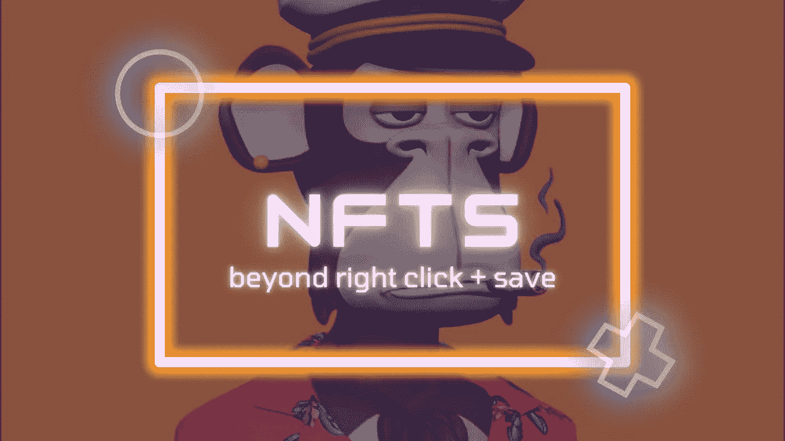

# NFTs —超越“右键单击并保存”

> 原文：<https://medium.com/coinmonks/nfts-beyond-right-click-and-save-19787eb2ce7a?source=collection_archive---------20----------------------->

Image by [Dammykhudz](/@dammykhudz061)

让我们不要假装你没有遇到过*无意义的 NFTs* 你似乎不能将该集合的任何真正应用于创作者的金钱攫取，事实上，这让你质疑 NFTs 的真正本质——是谁首先想到在 Opensea 上创造数字艺术的？该死的。

或者也许你是俱乐部的一员，似乎认为 NFTs 是一个[邪教](/@bardofboston/is-the-nft-community-a-crowdsourced-cult-92c2d4b48027?source=post_internal_links---------0----------------------------)，只对其社区有益，对普通非霍德勒人半敌视，并且“超级定价”足以限制拥有一个。说到超高价，[我写了一篇文章，可以帮助你以可承受的入门价格拥有任何昂贵的 NFT](https://vertical.im/dammykhudz/the-easiest-way-to-own-justin-bieber-s-b-GNVwiw9G)。

无论你属于哪个群体，至少知道你并不孤单会令人高兴吗？NFT 的任何人说他们对这些情况视而不见都是胡扯。

也许在潮流开始时，人们并不介意购买常规艺术作为 NFTs 有些人只是想翻翻它们获利，而其他人只是数字艺术的收藏家，就像传统的艺术收藏过程一样——欣赏艺术总是好的——总是！

创意产品的一个特点是，你永远无法真正给它们定价。总是有一个竞赛是否是一个创造性的作品；音乐、艺术、写作或表演，定价过高或过低。尽管如此，它不会削减开始资助开发者，或在这种情况下，创作者，有足够的钱放弃项目，去一个孤岛上实现他们的梦想；这可能是他们一直以来的计划，让你在 NFT 推特上做一些非常尴尬的收集——你遇到过多少这样的情况？是时候开始戴上你的“研究帽”了！

在 NFT 社区经历了一段时间的上升趋势后，铸造常规艺术并赋予它们价值的做法停止了。他们(社区)想要的不仅仅是支付数字绘图的费用。某种意识正在发生，就像人们问，“我买的是什么？、“我为什么要买这个？”。如果人们开始问这些问题，那么创造者最好开始给出答案，如果他们想继续做生意的话(市场现在竞争激烈，足以把任何人踢出去)。

虽然我自己没有做太多的铸造工作——我的 Metamask 钱包中的大部分 NFT 来自 [freedrops](https://www.investopedia.com/terms/a/airdrop-cryptocurrency.asp) ，但我开始看到一种新的 NFT，它们实际上可以做一些事情——至少，它们声称正在做一些事情。创作者们也希望他们的造币厂有一个背景故事，任何能让收藏者花钱的东西，即使是在昂贵的 ETH 气体中。

NFT 开始有路线图和白皮书。与其让一个创作者试图出售一些基于[大傻瓜理论](https://www.investopedia.com/terms/g/greaterfooltheory.asp)的随机画作，创作者们开始组建一个团队来表达和维持他们 NFT 项目的长久性。

我最喜欢的一个 NFT 项目(在我写这篇文章的时候，我还没有拥有它——这是一个悖论——它同时针对 NFT 社区和游戏赚钱社区，因为 P2Es 现在真的很重要。这个想法是，NFT 将作为一个登录要求，以访问团队开发的游戏，甚至他们合作的其他 P2E 游戏。这个项目也将继续有它的发射台，在那里其他的 NFT 可以发射——谈论全面的效用。

项目一个接一个，效用一个接一个，现在是辩论的时候了，参与者(开发者/创造者)开始争论他们的观点，并试图说服法官(NFT 社区)为什么他们认为他们有最合理的论点(NFT 项目)。

可以肯定地说，我们现在正处于非功能性阅读的阶段，人们开始看到非功能性阅读超越了翻转艺术，并开始看到它的用途。这并不是说没有地毯拉项目存在；但是，如今要完善地毯拉手需要更多的东西——这个曾经毫无戒心的社区现在已经找到了第四种感觉。

在现实中，NFT 可以完全是你想要的样子；你只需要给它附加一些潜在的价值。我最近参加了一个 web3 项目，演讲者说 NFT 现在被用作碳排放——这是一个非常有趣的话题，我打算很快发表。NFT 能做的就这么多；只是我们必须关注的远不止资本收益。

## **结论**

虽然非功能性测试现在是一种趋势，如果你没有参与最受欢迎的 NFT 讨论，你几乎会感到被排除在外。事实是，你根本不必有这种感觉。相反，注意在 NFTs 上学习更多，决定你是否想成为它的一部分，并找到一个与你的需求产生共鸣的项目。

> 交易新手？尝试[加密交易机器人](/coinmonks/crypto-trading-bot-c2ffce8acb2a)或[复制交易](/coinmonks/top-10-crypto-copy-trading-platforms-for-beginners-d0c37c7d698c)