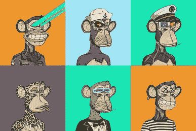
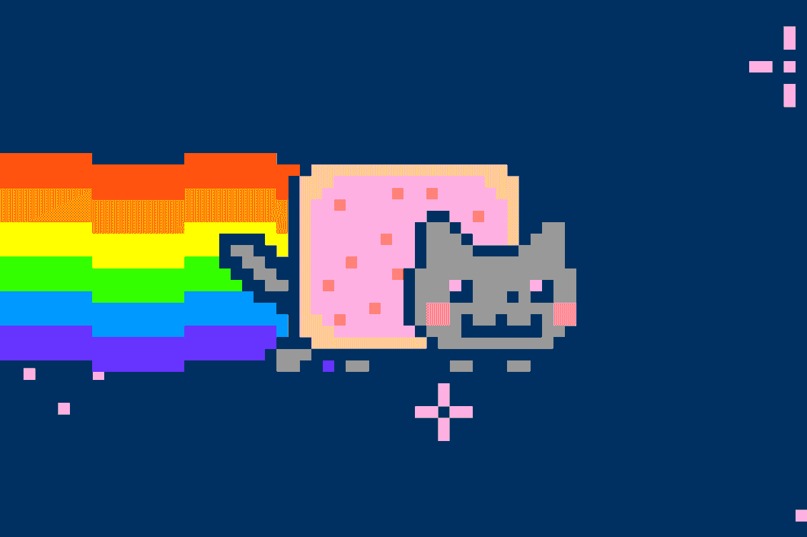
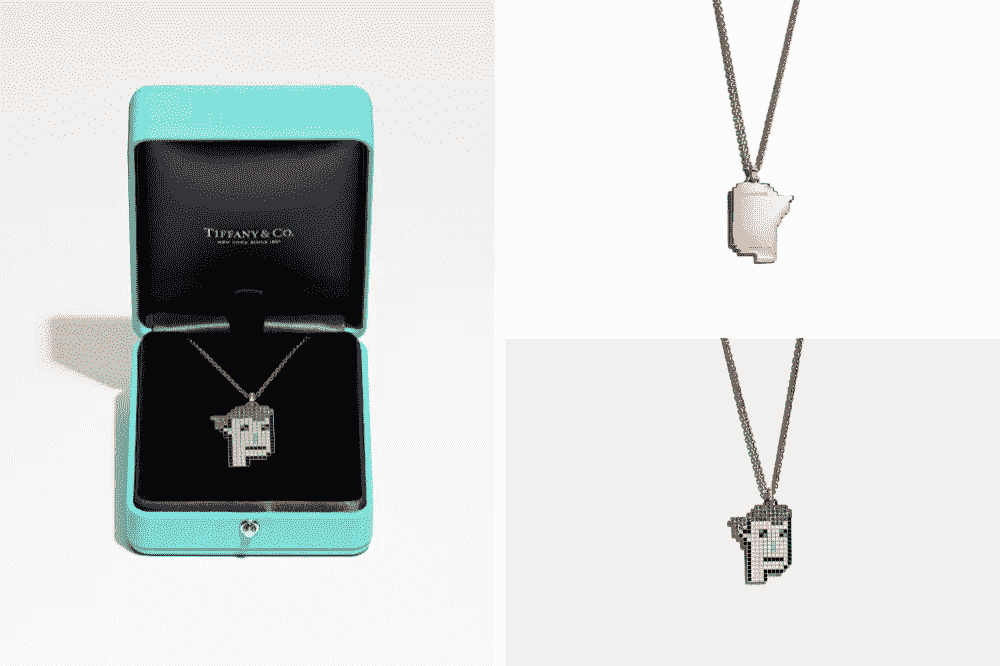

# NFTs 解释道

> 原文：<https://medium.com/coinmonks/nfts-explained-70fc7eb25ae6?source=collection_archive---------14----------------------->

Photo by [Yuga Labs](https://www.newyorker.com/culture/infinite-scroll/why-bored-ape-avatars-are-taking-over-twitter/amp)

嘿，宝贝，你生日时我送你一个 NFT 怎么样？昨晚晚饭后，我女朋友问我。或者我可以把你变成 NFT。'

什么？你知道 NFT 是什么吗？

“我当然知道，”

我以为我是这里唯一的网虫。

“不，你是这里唯一的网虫，”她翻着白眼说，“但在看到新闻说 [Meta 在 Instagram 上对 NFT 的支持扩大到 100 个国家](https://forkast.news/headlines/instagram-expands-nft-platform-to-100-countries/)，以及 [TiffanyAndCo 在 NFT 的门票售罄中赚了 1250 万美元](https://news.bitcoin.com/tiffany-co-nft-sale-sells-out-luxury-jewelry-retailer-rakes-in-12-5m-in-ethereum/)后，我决定查一下 NFTs。经过几个小时的研究，我觉得我不错。'

好吧，就当我 10 岁的时候解释给我听。

酷，让我们从最基本的开始。

# 什么是 NFT

NFT 是您可以拥有的数字(或物理)对象。他们的所有权可追溯到区块链。

> NFT 是一种让数字资产变得可拥有的方式。

NFT 代表不可替代的令牌。

不可替代意味着它是独一无二的，不可替代的。例如，你可以用一张 10 美元的钞票换一张类似的 10 美元钞票。它们是可替换的。但你不能用 NFT 做到这一点。如果你把它换成另一个，你会得到不同的东西。

# 为什么 NFT 很重要？

> NFT 允许任何人未经许可就拥有、发行、储存或交易它们。

非功能性交易使得拥有资产而不需要第三方中介成为可能。

在传统的世界里，你会依靠银行或财产登记处来维护财产的分类账。但是 NFT 使得中介变得无关紧要。

在 NFTs 之前，我们通常在脸书、Spotify 等大平台上赚钱。通过广告、出版等服务。这些公司控制着局面。他们拿走大部分收入，并可以决定禁止任何人进入他们的平台。创意人员接触粉丝的唯一途径就是通过这些公司。但是 NFT 帮助创作者与他们的粉丝联系。

此外，你并不拥有像超级马里奥这样的传统电子游戏中的角色。你只能在游戏中使用它们。你不能卖掉它们，或者把它们放进你的钱包。但是有了 NFTs，你可以做所有这些事情。你可以购买一个物体，在游戏中使用，存储在钱包中，插入去中心化的平台，与世界上的任何人进行交易，甚至可以作为抵押品。而你可以做到这一切，不需要任何人的许可。

让我们进一步看看 NFT 对创作者、爱好者和收藏者的重要性。

## 创造者

对创作者来说，NFTs 的意义在于允许他们与粉丝建立联系。NFTs 还允许他们出售可能没有市场的作品。比如在 NFTs 之前，如果你设计了很酷的贴纸或者 memes，是没有办法卖的。但是 NFTs 帮助 Chis Torres 卖出了他的 Nyan Cat meme。

GIF: Chris Torres

Chris Torres 在 2011 年创造了 Nyan Cat ( [一只躯干上有馅饼的卡通猫，它在太空中飞行，并在后面留下彩虹轨迹](https://en.wikipedia.org/wiki/Nyan_Cat))，并在 2021 年以 NFT 的形式出售，售价近 60 万美元！

疯狂吧。

根据 Torres 的说法，加密艺术和 NFTs 为迷因创造者提供了一个从他们的作品中获利的机会，这些作品本可以在网上自由传播。

> “它给了造物主力量。创作者最初拥有它，然后他们可以出售它，并直接货币化，对他们的工作有所认可。”

此外，一些 NFT 市场允许艺术家在每次 NFT 交易时获得佣金。作为一名艺术家，你可以对你的 NFT 进行编程，这样每当有新买家购买 NFT 时，你就可以获得佣金。

您可以通过自动化和透明的方式做到这一点。

## 粉丝

NFTs 让你欣赏和支持你喜欢的艺术家。此外，当你买了 NFT，区块链上有证据表明它属于你。你可以转售它，持有它，上传到网上作为你的个人资料图片，或在游戏中使用它。你有做任何你喜欢的事情的自由和选择。

## 收集者

非金融资产可以作为其他投机资产。你可以购买它们，持有它们，希望它们增值，这样你就可以卖掉它们获利。

# NFTs 是如何工作的？

NFT 是区块链技术的伟大应用。

区块链是一个具有计算能力的数字账本。它是分散的、分布式的、安全的和公共的。

NFT 是不同区块链的一部分，如[以太坊](https://ethereum.org/en/)、[多边形](https://polygon.technology/)、[币安智能链](https://binance.com/)和[索拉纳](https://solana.com/)。

区块链确保了 NFTs 的持久性。这意味着，当你买了一个 NFT，NFT 是你的，直到你放弃它。

当你决定把你的作品放在区块链作为 NFT 奖时，你首先要做的是“造币”。

铸币厂正在与区块链的智能合约进行互动。有不同的市场，你可以很容易地铸造你的 NFT。他们让你选择你的 NFT 的其他属性。如名称、价格、二次销售时涉及的版税类型等。

要铸造一个 NFT，你必须设置一个类似 [Metamask](https://metamask.io/) 的加密钱包。然后你会在钱包里放入价值 50-100 美元的 [ETH](https://coinmarketcap.com/currencies/ethereum/) 或任何其他代币(取决于你使用的区块链),以支付交易费用。完成这些步骤后，你可以去 NFT 市场铸造你的 NFT。

# NFT 市场

[NFT 市场](https://www.coindesk.com/tech/2021/07/12/nft-marketplaces-a-beginners-guide/)允许艺术家和收藏家购买、创作和出售他们自己的艺术品。
一些受欢迎的包括:

1.  [OpenSea](https://opensea.io/)
2.  [基础](https://foundation.app/)
3.  [稀有](https://rarible.com/)
4.  [Mintable.app](https://mintable.app/)
5.  [俏皮网关](https://www.niftygateway.com/)
6.  [KnownOrigin](https://knownorigin.io/)
7.  [分数艺术](https://fractional.art/)
8.  [索拉雷](https://sorare.com/)
9.  [分权](https://decentraland.org/)
10.  [异步](https://async.art/)
11.  [制造商地点](https://makersplace.com/)
12.  [贵重物品](https://v.cent.co/)
13.  [NFTX](https://nftx.io/)
14.  [超级罕见](https://superrare.com/)
15.  [ZORA](https://zora.co/)
16.  [NIFTEX](https://twitter.com/niftex?lang=en)
17.  [硝化甘油](https://niftys.com/)
18.  [unily](https://twitter.com/uniclyNFT)
19.  [NFTfi](https://www.nftfi.com/)
20.  [NBA 顶级投篮](https://nbatopshot.com/)
21.  [轴无限远](https://axieinfinity.com/)

# 什么可以成为 NFT

Image: [Tiffany & Co](https://www.tiffany.com/)

世界上任何东西都可以成为 NFT。任何人都可以创造一些独特的东西，有人可以拥有。
一些例子包括:

1.  [艺术](https://www.larvalabs.com/cryptopunks)
2.  [游戏人物](https://axieinfinity.com/)
3.  [音乐 NFTs](https://www.coinspeaker.com/muse-nft-album/)
4.  [书籍](https://www.theguardian.com/books/2022/aug/02/pearson-plans-to-sell-its-textbooks-as-nfts#:~:text=Textbook%20publisher%20Pearson%20plans%20to,resources%20they%20no%20longer%20require.)
5.  [珠宝](https://news.bitcoin.com/tiffany-co-nft-sale-sells-out-luxury-jewelry-retailer-rakes-in-12-5m-in-ethereum/)
6.  [博文](https://twitter.com/Iiterature)
7.  [推文](https://www.cnbc.com/2021/03/22/jack-dorsey-sells-his-first-tweet-ever-as-an-nft-for-over-2point9-million.html)
8.  [游戏中的时刻](https://nbatopshot.com/)
9.  [令牌门控健身社区](https://t.co/SzZdYvPqrQ)
10.  [令牌门控简讯](https://jammsession.mirror.xyz/-xYcfFRlhDdLDSUgRMTYJAaRJBs2VG4LP34DnOV84mI)

加密的奇妙之处在于它让人们变得有创造力。我们可以拥有所有这些我们从未想过可能的概念。

# NFTs 的使用案例

一些显而易见的事情是拿着它，卖它，或者向其他人展示它。但是你可以用你的 NFT 做更多创新的事情，比如:

1.  把它们借出去，
2.  用它们作为抵押，
3.  向他们借款，
4.  将他们作为游戏中的角色。

有 NFT 指数基金、NFT 衍生品，甚至还有非金融交易的部分所有权。

NFT 的可能性是无限的。