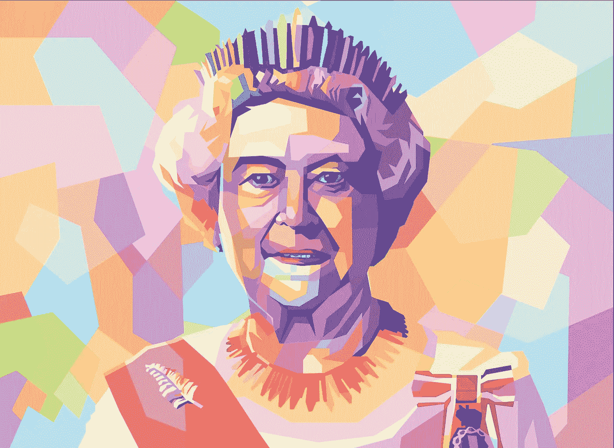
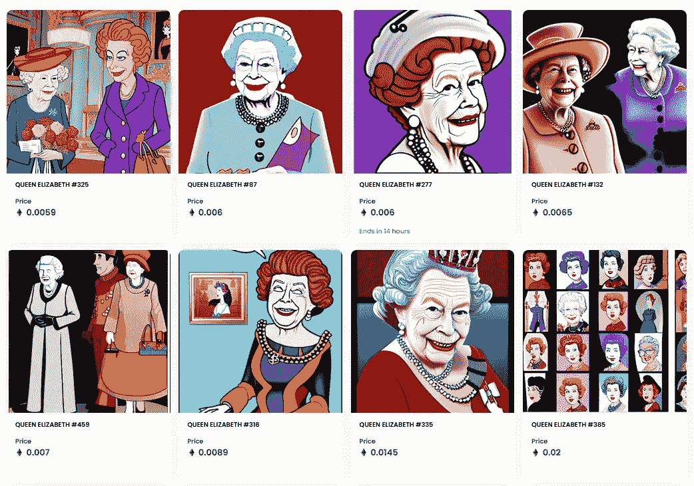
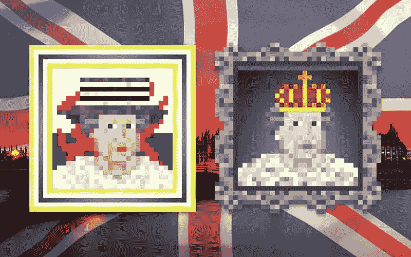

# NFT 向我们展示了互相利用是我们最擅长的。

> 原文：<https://medium.com/coinmonks/nfts-have-shown-us-that-exploiting-each-other-is-what-we-do-best-8768e1629f1d?source=collection_archive---------37----------------------->

**Queen Elizabeth has been our queen for the past 70 years.**

英国女王伊丽莎白二世以 96 岁高龄平静地离开了我们。

她在位超过 70 年，是历史上在位时间最长的君主之一。

她受到各国和几代人的崇敬和尊敬，目睹了一切。

从世界大战到和平时期，从马车到汽车，从电报到网络。

我的意思是，她几十年来积累的丰富经验和智慧是无法估量的。

自从世界失去了他们沉默的保护者，涉及女王的 NFT 几乎立刻就出现了。

低劣的项目，如伊丽莎白女王伊努，RIP 伊丽莎白女王和精神女王伊丽莎白二世。

这看起来很廉价，甚至不尊重人。

一个名为“撕裂女王官方”的 NFT 收藏有超过 8000 张女王的像素化照片，这表明发布会的准备工作已经进行了一段时间

一些硬币在 24 小时的交易量中产生了数百万的收入，但基本上没有任何流动性。

这是一个典型的灾难迹象，显然每个人都是为了快速获利，希望把它放大，然后扔给下一个更大的傻瓜。

这是剥削和巨大的金钱掠夺。

So much meme, so much grifts.

对于 crypto 来说，这是一个糟糕的外观，还是仅仅暴露了我们已经知道的东西？

有一个名为“伊丽莎白二世女王以太坊 NFT 致敬项目”于 7 月启动，迄今已发布了 73 件作品。

“在最近几个月发布了已故君主的几十张像素肖像后，名词 NFT·福克将关闭其最初的收藏。”

看起来像是更合法的收藏，他们通过结束收藏来尊重女王。

看起来二次销售大幅上升。

但是外面有那么多骗子。

这是我们都知道并喜爱的 web3 吗？

当埃隆上 SNL 或在推特上发布关于 Dogecoin 的消息时，NFT 的一系列项目突然出现了。

当威尔·史密斯在奥斯卡上扇了克里斯·洛克一巴掌时，欢声笑语接踵而至，更多的 NFT 涌入市场。

当《乌贼游戏》是网飞最受关注的游戏系列时，大量新的加密硬币和 NFT 模仿它。

是的，大多数都是无情的骗局，让天真的用户比以前更穷。

Queen Elizabeth II Ethereum NFT Tribute Project.

那么 web3 是好是坏呢？

权力属于人民，不受信任，不受约束，有时甚至毫无品味。

虽然我们热爱 web3 带给我们的好东西，但我们也应该接受随之而来的坏东西。

没有技术是完美的。

Web3 为我们提供了匿名的力量，而骗子们滥用了这种力量。

它给了我们权力下放，但有些人滥用了它。

它给了我们自己的钱/密码的监护权，黑客利用了它。

它给了我们一种拥有所有权、参与并从创造者经济中获利的方式，我们变得贪婪了。

没有技术是完美的。

我们只需要学会如何善用它，警惕地阻止坏人滥用它。

安息吧 E 女王，你一直都是最棒的。

-

你对女王的去世感到悲伤吗？

-

# startups # business # startupx # growth # success # social media # culture # entrepreneur # strategy # eth # BTC # crypto # opensea # markets # bear market # NFT #利润# nftmarket # queenelizabeth #伊丽莎白#女王#君主#英国#诈骗

> 交易新手？试试[加密交易机器人](/coinmonks/crypto-trading-bot-c2ffce8acb2a)或者[复制交易](/coinmonks/top-10-crypto-copy-trading-platforms-for-beginners-d0c37c7d698c)