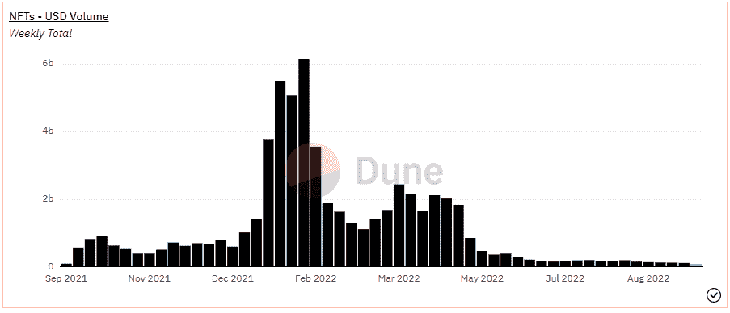
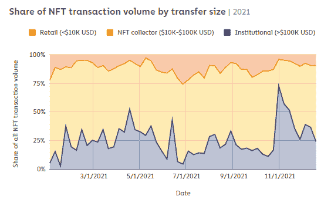
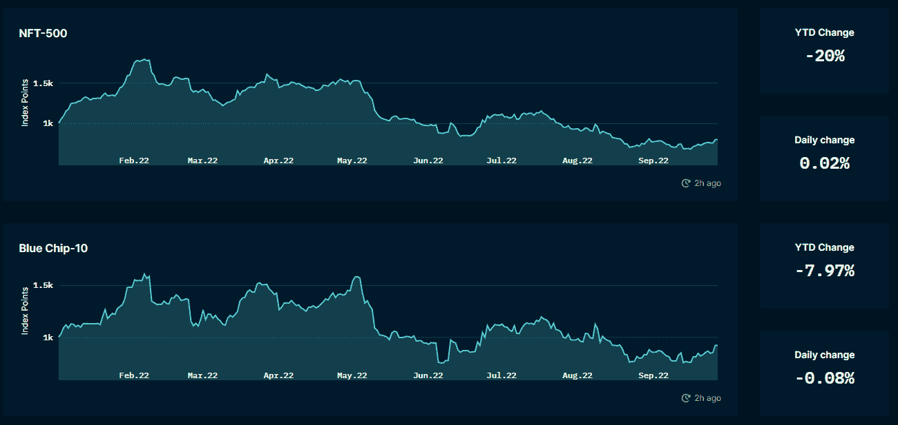
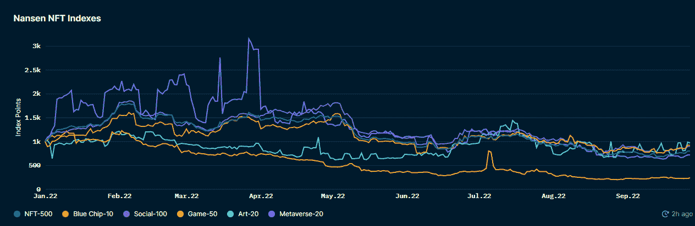
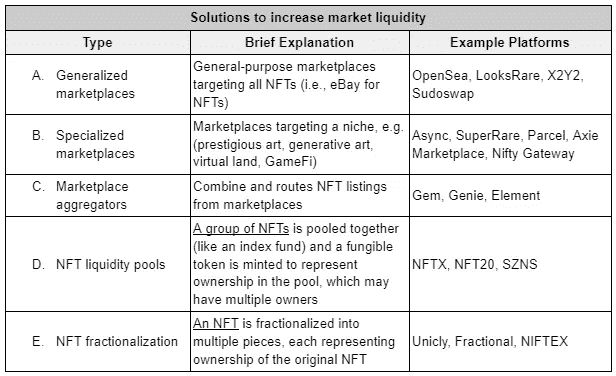
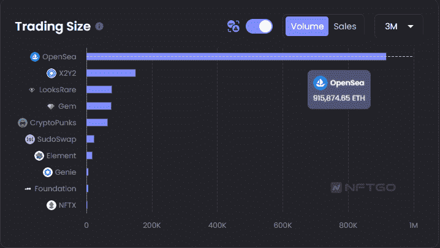
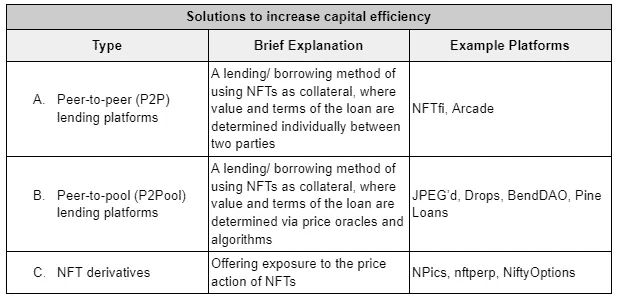
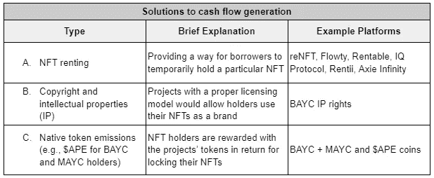
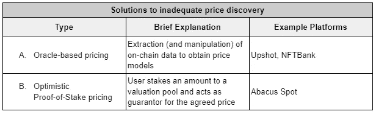

# NFT 隐藏的潜力——NFT 金融

> 原文：<https://medium.com/coinmonks/nfts-hidden-potential-nft-finance-5a424b631149?source=collection_archive---------6----------------------->

> 这绝不是对 NFT 金融业的深度报道，只是我个人的看法。虽然我努力提供准确的数据，但这篇文章中呈现的所有数据都是 2022 年 9 月 21 日的快照。

# 介绍

## NFT 市场概述

NFT 被描绘为艺术市场的下一代，也是加密采用的最强催化剂之一，该行业从 2021 年 9 月到 2022 年 1 月实现了巨大的增长。然而，在全球资本市场低迷的背景下，该行业的周成交量迅速调整，此后其增长逐渐减弱。

Figure 1: Weekly USD NFT volume [1]

> NFT 市场目前由不太频繁但价值更高的交易驱动。

就交易量而言，较大的交易(> 10000 美元转账)仍在市场中占主导地位(约占市场交易量的 90%)，但就交易数量而言，零售交易更为突出(占总交易数量的 85%)。

Figure 2: Shares of NFT transactions by transfer size[2]

Figure 3: Shares of NFT transactions by transaction volume by transfer size [2]

这种差异也反映在较高层次(即蓝筹股，如 BAYC，CryptoPunks)的 NFT 收藏的价格优于大盘。年初至今，蓝筹股集合的表现比 NFT 大盘高出 12%(截至 2022 年 9 月 28 日)。

随着这些更为成熟的蓝筹股 NFT 集合的价值不断增加，并主导市场交易规模，NFT 金融，一个围绕非金融交易的金融化/证券化的子行业，也一直在增长，以促进非金融交易的流动性，并确保其价格稳定。不足为奇的是，这些 NFT 金融协议中有很大一部分倾向于关注蓝筹股集合。

Figure 4: Top 500 NFTs index vs established ‘Blue-chip’ collections (as of September 28, 2022) [3]

Figure 5: Wider NFT market vs established ‘Blue-chip’ collections (as of September 28, 2022) [3]

# NFT 金融前景

目前，NFT 金融分部门的协议主要旨在解决 NFT 持有者/投资者面临的四个核心挑战— **1)缺乏市场流动性，** **2)资本效率低下，** **3)完全依赖资产价格升值，以及 4)价格发现不充分**

## 1)市场流动性不足

非正规金融机构普遍缺乏市场流动性有三个主要原因(除了它们的市场规模小之外):

1.  **不可替代性:**购买者需要花费更多的时间来区分和购买来自同一系列的潜在非功能性纺织品，这归因于它们的独特特性和整个系列的分散流动性
2.  **可负担性:**购买领先非功能性桌面平台的价格壁垒较高，降低了领先非功能性桌面平台的用户基础(购买者较少意味着流动性较低)
3.  **缺乏实用性:**当前的 NFT 系列尚未开发出有意义的实用性，我们认为这是 NFT 缺乏采用率的一个重要原因(潜在用户基数较低)

以下是旨在增加 NFTs 市场流动性的主要协议:

Figure 6: Types of NFT protocols increasing the liquidity of NFTs

***A .广义市场***

它们相对成熟，适用于一系列所有类型的非功能性测试，即促进非功能性测试销售的通用解决方案。

尽管不同的市场采用不同的机制(代币排放、专有定价模式、较低的费率)慢慢蚕食了 OpenSea 的主导地位，但按交易量计算，OpenSea 目前在该领域占据了大约 75%的主导地位[4]。

***B .专业市场***

它们仍处于萌芽状态，但随着整个空间的进一步发展，很可能会需要它们。

目前，这些专业市场的用例仍然局限于促进利基部门(例如，虚拟土地)中的收藏、收藏中的稀有作品以及特定 dApps 的专用市场的交易。

***C .市场聚合器***

最适合捕捉不同市场的增长以及它们各自为政的事实。

通过管理多个市场的列表，聚合器提供了优秀的 UX，甚至为更新的(和更创新的)市场提供了更好的价格。

Figure 7: Generalized, specialized, and aggregated marketplaces 3 months trading volume (without wash trading) [5]

***D & E. NFT 流动性池和 NFT 细分化***

细分协议更侧重于细分单个 NFT，而 NFT 流动性池通常细分一个价格相似的 NFT 池，并可以进一步扩展以形成集体投资网络(社区风险集团)。鉴于重叠，NFT 流动性池和 NFT 细分通常被归为一类。

这些协议的主要问题是它们(还)不适合与公用设施一起收集，而公用设施正是 NFT 市场理想的发展方向。这是因为大多数细分的非功能性资产很难重新形成原始资产。

它剥夺了 NFT 的基本社会福利和效用，尽管投资者仍可从价格变动中获利。这类似于投资于追踪基础资产价格变动的衍生品，但放弃了直接持有基础资产所带来的其它非金融收益。

如果 NFT 的市场流动性能够得到改善，投资者将更有可能把它们视为一种资产类别。在上述四项挑战中，这也是我们迄今为止看到最多创新和发展的领域。

## 2)资本效率低下

人们可能还记得，DeFi 最初的发展是围绕着掉期和贷款协议。由于这一点，不同的 DeFi 协议现在可以为投资者提供各种途径来建立杠杆头寸，因此他们可以比以前更容易地最大限度地提高资本效率。

NFT 部门在这方面仍然落后，因为非金融交易作为抵押品尚未被普遍接受。也就是说，我们也开始看到更多的协议旨在通过支持使用 NFTs 作为抵押品来改善这一点。

以下是旨在提高 NFTs 资本效率的协议:

Figure 8: Types of NFT protocols unlocking locked capital when holding NFTs

***A. P2P 借贷平台***

这些平台为评估非金融资产作为抵押品打开了一个可流通的市场。

一方面，由于价格和条款是由每个贷款人和借款人商定的，这些 P2P 贷款平台的核心优势是在没有甲骨文的情况下运营。另一方面，由于这种半手工性质，P2P NFT 贷款不能立即执行，只会对长尾资产最有效。

***B. P2Pool 借贷平台***

这些平台利用定价方法(oracles 参见挑战 4)中的更多解决方案，为发放的贷款设置不同的参数(抵押品价值、最小抵押品价值、最大贷款期限和利率)。这一过程是自动化的，因此为借款人提供了即时的流动性。

P2Pool 贷款平台最适合流动性集合中的“底层”产品，因为 oracles 严重依赖非流动性资产缺乏的历史数据。

然而，依赖 oracle 会使协议面临 Oracle 失败的风险，并限制可接受的担保品的类型。最近的 BendDAO BAYC 清算事件就是一个突出的例子，说明需要重新评估这些 P2Pool 贷款平台的机制和参数。

Figure 9: NFT lending platforms (P2P and P2Pool) aggregated borrow volume [6]

***C. NFT 衍生品***

由于 NFT 的交易量较低(与可替代代币或传统市场相比),并且其独特的特征对无缝实施这些衍生品构成了巨大的障碍，因此这一部分仍未得到充分开发。

该部门的进一步发展将允许更全面的交易策略。衍生产品将使(杠杆和)更少的资本要求暴露于价格行为。就像在加密和遗留市场，衍生品以交易量压制现货市场一样，一个强大的 NFT 衍生品市场并非不可能。

然而，鉴于衍生品市场的巨大基础要求(高流动性和准确的价格)，我们认为 NFT 衍生品不会在不久的将来蓬勃发展。为了折衷当前的基础设施，大多数平台专门列出了高流动性的非功能性交易，而忽略了详细的特征组(将它们分为底层、中层、顶层等。)或整体追踪某个系列的底价。

我们认为，这种提高非上市公司资本效率的发展不仅有利于看涨者，也有利于寻求避免应税事件的投资者。

# 3)单纯依赖资产价格升值

最近 NFT 市场的增长是许多人的福音。这是一个转折点，人们认为 NFTs 不仅仅是 JPEGs，而是一种可能的投资工具。然而，市场经历类似增长率的可能性微乎其微，至少短期内不会。这意味着人们应该减少对资产价格升值的依赖，寻求更可持续的回报生成策略。

这是允许持有者产生现金流的协议的主题。

与传统的 A&C 市场类似，NFT 租赁市场也有所发展。由于缺乏公用设施，NFT 目前被出租用于陈列柜(例如，博物馆出租它们用于展览)或其(有限的)基础公用设施(例如，后台访问、DeFi 协议中的特殊收益等)。).

NFT 投资者产生现金流的另一种方式是将其知识产权商业化。一个例子是开发/授权一个以 NFT 海湾为中心的餐馆品牌。一些 NFT 收藏也采用了一种模式，用可替换的代币奖励他们的 NFT 持有者。

以下是为 NFT 持有者提供现金流的协议/机制:

Figure 10: Types of NFT protocols and mechanisms generating cash flow when holding NFTs

***NFT 租房***

NFT 租房高度依赖于他们的基础设施。由于市场目前由私营部门筹资和伙伴关系基金主导(缺乏明确的公用事业)，NFT 的租赁空间尚未获得动力。然而，如果 NFT 市场走向现实世界的资产令牌化(例如，用 NFTs 表示物业)，那么租赁空间可能会有一个更明确的使用案例。

***B .版权和知识产权***

NFT 通常被宣传为拥有一件艺术品，但由于有关数字资产的法规仍然不明确，收藏在授予所有者全部版权和知识产权时面临巨大障碍。

***C .原生令牌排放***

几个 NFT 集合还集成了本地令牌发射，NFT 持有者将获得锁定和不出售其 NFT 的令牌奖励。

但是，如果没有一个完整的用例生态系统，持有者出售令牌是不可避免的。抛售压力可能会引发负飞轮效应，进一步压低票面价格，使收益率变得更加不可持续。

随着 NFT 市场的成熟，预计资产价格增速将会下降。我们认为，为持有 NFT 提供现金流的协议/机制可能允许投资者通过资产价格升值和收益率溢价的组合来实现回报最大化。

# 4)价格发现不充分

NFT 应该如何定价？

这是真正解决上述三个问题之前需要解决的首要问题。然而，我们把它放在了最后，因为它是迄今为止我们看到的创新最慢/最少的领域之一。

目前，定价机制可以大致分为两类:

Figure 11: Types of NFT protocols solving price discovery

***A .基于 Oracle 的定价***

现状是依赖基于 oracle 的定价方法来评估其他 NFT 财务协议中使用的 NFT。

这些先知通常提取关键参数(例如，底价、TWAP、VWAP、历史价格等。)来确定 NFTs 的公允价值。市场上更全面的解决方案可能会实现机器学习算法，以推断价格趋势并对相似的特质排名进行分组。

基于 Oracle 的定价最适用于高流动性集合或特征方差分布紧密的集合。但考虑到 NFTs 的波动性，预计会有很大的误差。

具有各种风险容限和机制的协议必须定制它们的参数以适应这些错误。此外，依赖历史价格数据也意味着不在新闻/路线图中定价。

***B .乐观股权证明定价***

为了进一步提高 NFT 定价，最受公众期待的方法之一是 Abacus Spot 的乐观股权证明定价机制。

受乐观汇总和利益一致机制证明的启发，这种定价模型依赖于用户的集体估价来为 NFT 定价，而不是使用历史数据。因此，它最适合长尾产品(即缺乏历史数据的产品)和那些预期未来销售营业额较低的产品。

用户将通过集体存入$ETH(在规定的时间内；至少 1 周)进入 NFT 估价池。NFT 所有者可以使用相应的估价池作为(贷款)协议的“抵押品”或估价证明。

在违约的情况下，基础 NFT 被拍卖，如果销售价格超过估价池大小(锁定的总金额)，销售收入按比例分配给估价人。如果拍卖价值低于评估池，销售收入以先进先出的方式分配给评估者(最新的评估者承担错误评估的风险)。

该模型是乐观的，因为它假设估价者同意的价格是正确的。它来源于利益一致机制的证明，因为评估者用他们的资金支持他们的评估(他们的利益可能会在错误评估中损失)。

这种定价模式的缺点是资本效率低下，因为它需要一种资产来保证 NFT 的声称价值。

由于解决其他三个挑战的大多数协议依赖于定价机制，这部分的开发将是突破性的。它释放了协议对价格更加敏感的能力，并可能有助于解决其他三个挑战。

# 前方的路

NFT 金融公司的目标是为非功能性金融服务增加(金融)设施。如果没有适当的财务方面，NFT 很难被视为拥有不变所有权记录的收藏品。NFT 金融扩大了非金融交易的范围(和市场规模)。我们相信，该领域的发展可能有助于 NFTs 被认可为一个可与传统 A&C 市场相媲美的适当投资类别。

NFTs(尤其是私营部门筹资和伙伴关系司的 NFTs)的现状与项目的品牌和营销能力密切相关。随着 NFT 金融业变得越来越重要，项目创建者将别无选择，只能适应。他们可以利用这一点，将金融化作为他们收藏的另一个特征。这种采用的一个例子是，项目创建者将一定数量的销售收入或资金分配给非市场流动性协议(例如，借贷平台和流动性池)。

藏品金融化的容易程度可以充当护城河。当现有的既定项目纳入金融化，创造一个成功的集合的进入壁垒将增加。这可能会间接迫使更新的项目进行创新来竞争，推动 NFT 空间走上积极的轨道。

NFT 金融释放的潜力让未来看起来一片光明。然而，在 NFT 空间向外扩张之前，内部问题需要得到解决。目前，这些问题围绕着如何对非功能性森林交易进行估价达成共识。此外，还需要更多的开发和创新(探索用例)来推断 NFT 可以有多大。

希望你喜欢这篇文章，我对 DMs 持开放态度！

https://www.linkedin.com/in/domica/

【https://twitter.com/mimiLFG 

# 参考

# 直接来源

[1][https://dune.com/hildobby/NFTs](https://dune.com/hildobby/NFTs)

[https://go.chainalysis.com/nft-market-report.html](https://go.chainalysis.com/nft-market-report.html)

[https://pro.nansen.ai/nft-indexes?platform=All](https://pro.nansen.ai/nft-indexes?platform=All)

[https://dune.com/rchen8/opensea](https://dune.com/rchen8/opensea)

[https://nftgo.io/analytics/marketplace](https://nftgo.io/analytics/marketplace)

[6][https://dune . com/impossible finance/NFT-lending-aggregated-dash](https://dune.com/impossiblefinance/nft-lending-aggregated-dash)

[7][https://hypebast . com/2022/3/bored-ape-yacht-club-owner-IP-ownership-rights-open-restaurant-bored-hungry-info](https://hypebeast.com/2022/3/bored-ape-yacht-club-owner-ip-ownership-rights-open-restaurant-bored-hungry-info)

# 相关消息来源

[https://medium . com/1kx network/show-me-the-liquidity-evaluation-NFT-financial ization-methods-f 3c 30 BF 8 f 08 c](/1kxnetwork/show-me-the-liquidity-evaluating-nft-financialization-methods-f3c30bf8f08c)

[https://www . theartnewspaper . com/2022/05/19/advisory-group-gurr-Johns-launchs-art-lending-arm](https://www.theartnewspaper.com/2022/05/19/advisory-group-gurr-johns-launches-art-lending-arm)

[https://www . nomuraconnects . com/focused-thinking-posts/investing-in-the-art-and-collectables-market-a-1-7 万亿资产类别/](https://www.nomuraconnects.com/focused-thinking-posts/investing-in-the-art-and-collectables-market-a-1-7-trillion-asset-class/)

[https://go.chainalysis.com/nft-market-report.html](https://go.chainalysis.com/nft-market-report.html)

[https://non fungible . com/reports/2022/en/Q2-quarterly-NFT-market-report](https://nonfungible.com/reports/2022/en/q2-quarterly-nft-market-report)

[https://docs . Google . com/document/d/1 r9 iuruprxg 1 _ af 1 uth 8 koncckac 1 MD-L-ggaqjid 3 EO/edit](https://docs.google.com/document/d/1r9iUrupRXg1_af1uth8kOnccKAC1md-L-ggAQjid3Eo/edit)

 [## 版税-揭秘💰

### NFTs 最重要的一个方面是版税，即原创艺术家无论何时都能获得收入的能力

manifoldxyz.substack.com](https://manifoldxyz.substack.com/p/royalties-demystified-) 

> 交易新手？尝试[加密交易机器人](/coinmonks/crypto-trading-bot-c2ffce8acb2a)或[复制交易](/coinmonks/top-10-crypto-copy-trading-platforms-for-beginners-d0c37c7d698c)