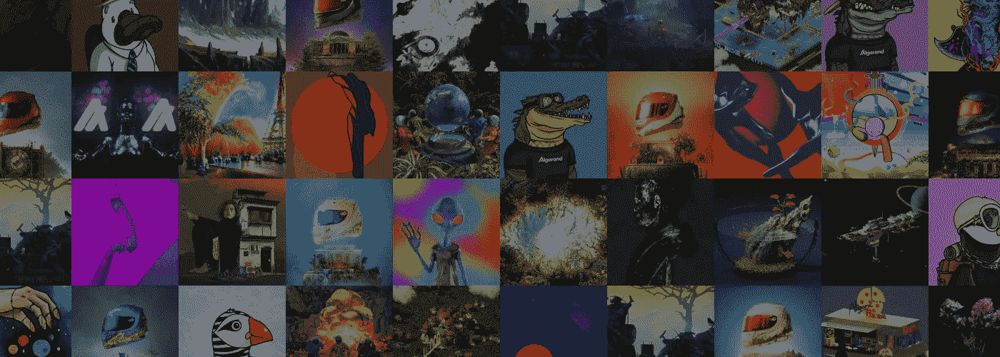
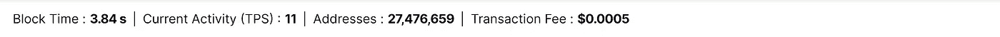
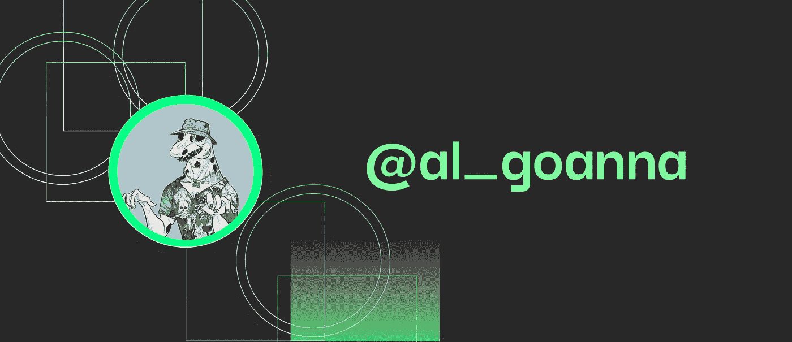
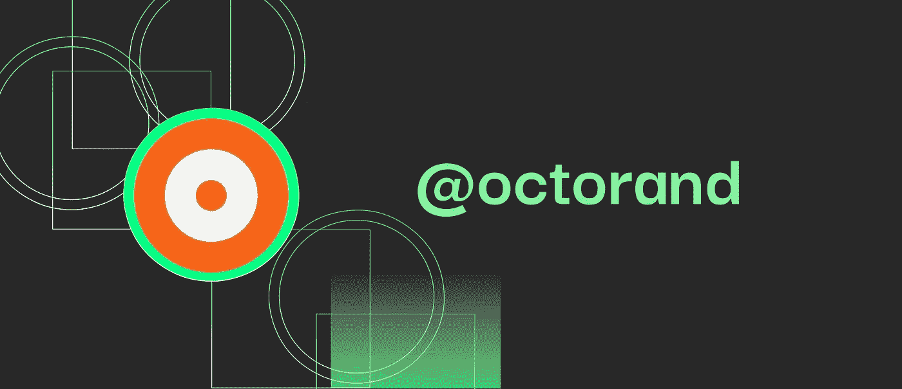
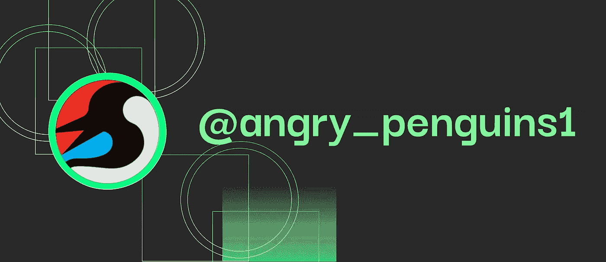
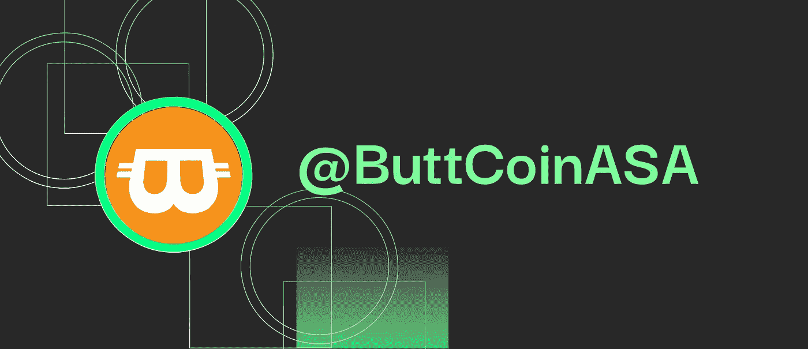

# NFTs？迷因币？探索阿尔格兰德创造者经济。

> 原文：<https://medium.com/coinmonks/nfts-meme-coins-exploring-the-algorand-creator-economy-61222d4a69f0?source=collection_archive---------24----------------------->

在过去的几个月里，我们经历了 NFT 创作者和社区的活动以及带有[**# AlgorandNFTs**](https://twitter.com/search?q=%23AlgorandNFTs&src=typed_query)**标签的模因创造者的活动大幅增加。**

**阿尔格兰德[NFT 酒店无疑是目前所有连锁酒店中最热门的，与此同时，令人惊叹的建筑商们夜以继日地为生态系统开发有趣的解决方案。如果你不是 algofam，你很可能会错过。](https://algorand.com)**

****

**Image credits: [https://algorand.foundation](https://algorand.foundation)**

**阿尔格兰德社区最吸引人的是对新来者的合作和支持，以及生态系统投资者和创造者(包括基金会)之间的团结。除此之外，鉴于约 6，000 TPS、3.2-3.9 秒块终结性、纯利益证明(PPoS)共识机制和最近推出的[状态证明](https://www.prnewswire.com/news-releases/algorand-protocol-upgrade-introduces-state-proofs-for-trustless-cross-chain-communication-and-5x-faster-performance-301619219.html)概念，该链被证明是“天才”。**

****

**Image credits: https://algorand.com**

**这篇文章的核心目的是指出 Algorand 生态系统上几个令人惊叹的(或值得一看的)NFT(和 meme coin)项目。(如果你喜欢他们，一定要关注他们的 Twitter 账号)。请注意，该目录会随后更新(增加、减少、修改)。**

# **NFT 项目**

**在阿尔格兰德，有相当多的 NFT 项目有很好的使用案例和迷人的美学价值。由于基金会和其他几个项目(如 [AlgoScout](https://twitter.com/AlgoScout) )的审查，区块链是加密生态系统中最少的混乱之一。**

**Algorand 上有很多 PFP NFTs 和常规的公用事业 NFT。这个列表几乎是无穷无尽的，但我会试着写一些我随手可得的:)**

## **阿尔冈纳**

****

**PFP from https://twitter.com/al_goanna**

**如果你期待一个热情迷人的社区，那么你最好的选择是阿尔冈那。Al Goanna 是阿尔格兰德区块链上最大的 NFT 项目之一。在第一个系列销售一空后，该项目正在改变 NFT 的叙事，并证明它们可以成为一种良好的力量，并推动重大的现实世界影响。发现社区迄今为止取得的成就和里程碑。**

**万众期待的第二系列，[僵尸 V 的变种人](https://algoanna.com/v2-roadmap/)，在我写这篇文章的时候正在制作中，预计很快就会发布。**

**阿尔格兰德的第一个专门的环境影响基金，吉尔伯特·戈安娜树木基金，已经种植了超过 100，000 棵树，并且还在增加。看看他们的[推特账号](https://twitter.com/al_goanna)。**

## **奥克特兰特**

****

**Logo credits: [https://twitter.com/octorand](https://twitter.com/octorand)**

**另一个具有顶级实用性的有影响力和令人印象深刻的 NFT 是 Octorand。Octorand 是一个建立在阿尔格兰德区块链之上的充满机会的虚拟世界。八开素数是八开世界中唯一存在的生命形式。该项目的特点是在阿尔格兰德区块链之上构建了一个分散式应用程序(dApp ),并利用了其基础设施的许多方面，如阿尔格兰德标准资产(ASA)、有状态智能合同、原子转移等。你可以收集八分素数，转换它们以增加它们的价值，并通过内置的市场进行交易。点击[这里](https://twitter.com/octorand)访问他们的官方推特账号。**

## **愤怒的企鹅**

****

**Logo credits: [https://angrypenguins.xyz](https://angrypenguins.xyz)**

**《愤怒的企鹅》是一部叙述 NFT 的作品。每个企鹅持有者都被期望在推特上发出他们的议程。然后，社区的每个其他成员都能够仔细阅读这些问题，并提出他们自己的故事。该项目为其社区提供了一个表达创造力和成为故事讲述者的机会。这使得美联社 NFT 收集格外独特。他们的官方推特账号可以通过[这个链接](https://twitter.com/angry_penguins1)进入。**

# **迷因硬币**

****

**Logo credits: [https://twitter.com/ButtCoinASA](https://twitter.com/ButtCoinASA)**

## **纽扣硬币**

**Buttcoin 是作为一个笑话而创建的，是在 Reddit 上以 r/CryptoCurrency 发布的关于如何在 algrand 区块链上创建硬币的教程的一部分，是目前 algrand 上最好的 Meme coin(如果我没有弄错的话)。**

**在社区开始参与并接管这个项目之前，它收集了数千张赞成票。该项目现在由所有想进一步推进该项目的志愿者组成。**

**它的流动性在几个月内从大约 20 ALGO 美元上升到超过 4 万 ALGO 美元。**

**访问 [https://buttcoin.cc](https://buttcoin.cc/) 进入他们的官网。**

# **摘要**

**上面列出了项目，并且你已经阅读了本文的这一部分，我强烈建议你通过笔记或其他任何可能的方式留下你的反馈。如果你想联系我，以便在这篇文章中得到特写，请通过[elzucky@gmail.com](mailto:elzucky@gmail.com)给我发邮件，或者在[推特](https://twitter.com/EOttoho)上直接给我发消息。**

**抓紧了法语:)**

> **交易新手？试试[加密交易机器人](/coinmonks/crypto-trading-bot-c2ffce8acb2a)或者[复制交易](/coinmonks/top-10-crypto-copy-trading-platforms-for-beginners-d0c37c7d698c)**