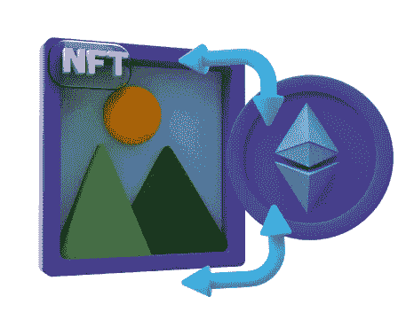

# 2023 年，NFT 为艺术家提供了创新的方式来营销他们的作品

> 原文：<https://medium.com/coinmonks/nfts-offer-artists-innovative-ways-to-market-their-works-in-2023-d700f08087b7?source=collection_archive---------14----------------------->

艺术收藏家长期以来一直被艺术的审美吸引力以及拥有特殊和例外的东西所带来的地位所吸引。制作容易复制的数字作品的艺术家现在可以使用 NFTs，它使用[区块链技术](https://cyberhubintelligence.com/blockchain-the-technology-of-the-future/)来保护版权，并给买家一个确认原创作品所有权的机制。

[NFT 敏婷网站开发](https://www.suffescom.com/product/how-to-create-an-nft-minting-website/)对于一些作者来说从零开始还是很难完全理解的。让我们看一个例子来更好地理解如何铸造 NFT。

# (NFT)是如何发布的？

尽管 NFTs 似乎有望使[数字艺术](https://cyberhubintelligence.com/web-3-0-and-blockchain-technology-the-future-of-art/)变得可行，但许多艺术家仍然不清楚铸造 NFT 到底需要什么。

制作 NFT 指的是在一个或多个区块链网络上制作与数字艺术品相关的独特标记的过程。NFT 的每一笔买卖，以及任何相关的创作，都会在区块链账本上产生一个永久的、不可撤销的所有权变更记录。NFT 就像一个"[智能合约](https://cyberhubintelligence.com/smart-contract-business-use-cases/)，将可编程逻辑在区块链上付诸实施。如果他们选择以这种方式构建，这份合同可能会在每次买卖他们的 NFT 时向作者支付佣金。

通常情况下， [NFT 和它所代表的数字作品](https://cyberhubintelligence.com/how-can-art-be-converted-to-nft/)可能是分开的。你也可以附加一个链接到实际的人工制品，可以是照片，视频或音频文件，或任何其他类型的数字制品。源文件可以独立于区块链而存在，并且可以在没有 NFT 的帮助下被复制、使用和传播。

应该强调的是，NFT 是唯一的，拥有一个就构成了相关作品的原始版本的所有权。

*   考虑

在铸造 NFT 之前，创造者有许多选择。

*   你喜欢的区块链和市场

例如，虫洞 NFT 桥促进了跨越以太坊和索拉纳网络的 NFT 交易。然而，在区块链上，NFT 一旦建立，通常会永久地留在那里。

这一点很重要，因为某些交易所只允许在 NFT 的一小部分区块链上进行交易。尽管还有其他考虑因素，但较大的区块链通常具有最大的销售潜力。

与 Tron 相反，Tron 是公认的玩赚和基于游戏的 NFTs，NBA Top Shot NFT 项目利用区块链流。格莱美奖和红牛是两个在 Tezos 上举办自己的音乐 NFT 的知名组织。但到目前为止，以太坊一直是 NFT 的主要交换和创建平台。

*   网络费用

每当制造 NFT 时，就要评估网络费用。这些费用用于支付处理交易所需的计算机资源的成本。

在以太坊上，网络费用，通常被称为“煤气费”，经常高达数百美元，尤其是在美国的营业时间。

正在开发的帮助降低高油价的第三方替代品之一是 Immutable X，一些交易所，如 FTX，将支付其用户的汽油费用。流量上的网费，特佐斯和索拉纳·区块链可能只有几美元。

了解费用是很重要的，因为作为一个没有作品集或收藏者的新开发者，你的 NFTs 可能卖不了高价。如果你继续保持最低的铸造和销售费用，你盈利的机会会增加。在你选择的区块链，你应该平衡费用和 NFT 市场的规模。

费用总是以你正在开采的区块链的当地货币支付，例如以太坊的 ETH，Tezos 的 XTZ，SOL 的 SOL。在你拥有足够数量的代币之前，你不能铸造你的 NFT。

# 利用以太坊上的 OpenSea 创建一个 NFT

由于 OpenSea 将自己描述为“第一个也是最大的 NFT 市场”，所以在本文中，我将把它作为打造 NFT 的一个例子(这是我拍摄的一张冬日日出的照片)。在所有市场和区块链，生产 NFT 的过程都是一样的。

步骤 1:启动一个加密货币钱包并链接它

将您的 OpenSea 帐户连接到可靠的加密货币钱包，如 MetaMask 或比特币基地钱包应用程序，即可开始使用。在选择和安装比特币钱包之前，请确保该平台与比特币钱包兼容。

然后你必须购买适当的代币来支付你的铸造费用。这些可以通过比特币基地这样的加密货币交易所购买。你最初的 NFT 的铸造费应该在以太坊达到 250 美元。

通过将你的钱包连接到 OpenSea，你就被确认为一个新用户，然后很多账户创建和验证过程都是自动的。

注册后，您的加密货币钱包将作为您与 OpenSea 的接口，允许您在铸造过程中安全地验证交易。

*   步骤 2:将源文件拖到编辑器中

你现在可以在链接你的钱包后上传你的 NFT 源文件，在我的例子中是一个高分辨率的 JPEG 图像文件。

尽可能多地给出描述性信息，以说服潜在买家相信你的想法的价值，就像你在易贝上列出商品一样。你的 NFT 的发行年份与此有关。

如果照片有叙述，或者如果你在提交照片时有任何其他信息，一定要包括任何证书或资格，这可能会使 NFT 对购买者更有兴趣。任何让你的作品独一无二或非常罕见的信息都应该包含在描述中。

为了验证重要的操作，在铸造过程的不同阶段，您将被要求提供数字签名。通过向你的比特币钱包发送确认请求，OpenSea 在开始开采比特币之前会征求你的同意。

第三步:参加 NFT 并支付必要的费用

OpenSea 要求在最后一轮硬币生成过程中确认以太币气费(以美元报价，但以以太币支付)。

你可以在美国最繁忙的营业时间之外铸造，把它们减少一半。当我在我的第一个 NFT 上盖章时，我在半夜向 OpenSea 发送了一个请求，要求将汽油费从 140 美元降至 94.33 美元。

在你的比特币钱包里，OpenSea 会在分散造币费之前征求你的同意。

硬币生产速度很快。程序完成后，汽油费用将从您加密货币钱包中的可用 ETH 余额中扣除。你的钱包会把 NFT 和你的其他宝贝放在一起，直到它被卖掉。

# 作为回应，需要采取什么行动？

一旦你的 NFT 被创造出来，你也许可以卖掉它。但是请记住，销售需要集中的营销努力(或者一群积极的购买者)。然而，如果你的 NFT 对潜在客户来说具有真正的艺术价值、美学吸引力或实用性，你就拥有了和其他发明家一样的机会。

为了测试这个过程，你现在能做的最好的事情就是做一个 NFT！白牌 NFT 市场仍处于早期发展阶段，这是投资的最佳时机。

***阅读本文上我们的*** [***博客***](https://cyberhubintelligence.com/nfts-offer-artists-innovative-ways-to-market-their-works-in-2023/)

> 交易新手？尝试[加密交易机器人](/coinmonks/crypto-trading-bot-c2ffce8acb2a)或[复制交易](/coinmonks/top-10-crypto-copy-trading-platforms-for-beginners-d0c37c7d698c)