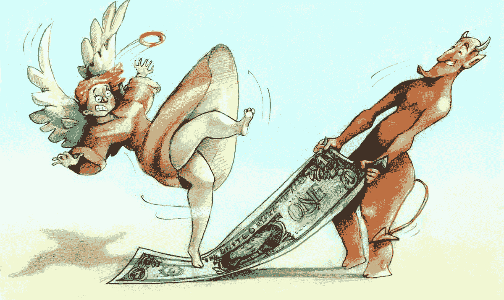

# NFTs:发现危险信号以避免拉地毯

> 原文：<https://medium.com/coinmonks/nfts-spot-red-flags-to-avoid-a-rug-pull-3a7945180806?source=collection_archive---------50----------------------->

如果你正在读这篇文章，你对 Web3 感兴趣……如果你是的话，这最终意味着你在某个时候听说或成为了一场骗局的受害者。如何发现它们并避免它们？

**这里有几个小贴士可以帮助你，尤其是在 NFT 项目上。**

**#1 NFT 数量对比价格对比效用**

一些项目将铸造数量低于 1k 的 NFT，其他的大约 5k 甚至 20k。没有规定什么是正确的数字，你应该做的是看价格和背后的效用。

*   **数量少+价格高:**项目要提供高的、真实的效用，并且非常排外。
*   **高量+低价:**项目看的是大众。他们的提议有意义吗？是游戏吗？一个特定的市场？这个不会改编成《独家网络》吧！
*   **高数量+高价格:**团队是否已经交付并被广为人知，拥有大量追随者？效用高，符合价格吗？如果不是，你面对的是一个没有经验的团队，他们可能会试图拖后腿。
*   **低量+低价:**不是来抢钱的，独家项目。它有增长潜力还是只是一次情感购买？

**#2 假跟随者 vs 真跟随者及其交战**

人们总是很容易认为，因为一个 Twitter 账户显示了 2 万/7 万/15 万+的粉丝，这个项目就火了。你应该总是深入一步，看看每个帖子上的约定。

相对于他们的追随者基数，他们有很多评论、喜欢和转发吗？

像 followeraudit.com 这样的工具将帮助你进一步分析这一点。

**#3 他们是想让出通道还是抬高楼层？为什么创始人以这个价格和数量铸造？**

数量必须与项目的类型相适应。游戏应该努力吸引大众，除非他们发布第一个具有高效用的集合来帮助初始资金。

拥有大量追随者并试图提供效用的团队不应该拥有太少的数量。这应该和他们的受众成正比。这是他们试图提高地板价，攫取更多金钱的迹象。

没有明显效用的项目，与他们的追随者基础相比发布的数量很少，让人们凭自己的情感而不是逻辑原因投资。如果他们没有办法计算一个项目的价值，他们会根据自己的情绪做出判断。情感价值和数学价值可以大相径庭。这将抬高内在价值，让投资者面临风险，因为时间会显示项目的实际效用(或不效用)。

**#4 白名单必须有意义**

白名单应该是高需求或独占访问的结果，而不应该是自动的。早期项目经常使用白名单作为激励合作伙伴和合作者的方式，这很好，但他们应该将他们的部分创作向公众开放，不要使用白名单。WL 制造了炒作的假象，如果项目实际上需求不高，可能会让观众望而却步。这将导致销售不足，自动降低底价。

**#5 Grindy 白名单流程**

那些需要人们努力争取 WL 位置的项目会导致自动转储，因为它们的目标是那些时间比金钱多的人。当谈到市场波动时，没有优质投资者会带来更多风险。

投入的小钱对投资者来说代表着更大的价值，更容易出现恐慌性抛售。高质量的鲸鱼没有时间磨磨蹭蹭、坐几个星期喋喋不休，但他们会投资好项目，并在市场波动时保持稳定，给团队时间去执行。

**#5 你能铸造多少个 NFT？**

**没有限制？**鲸鱼操纵市场的风险使小投资者面临风险。

**每个钱包 1？**团队瞄准优质投资者，降低炒股风险。
不止一个？必须与效用和价格相比较。

每个钱包 2–5 英镑？使用该列表的其余部分逐一检查。与价值产品相比，它是否有意义。

**#6 采用 FOMO 机制的荷兰拍卖**

荷兰式拍卖一直备受争议。他们仍然是一个很好的方法来找到一个集合的公平价格，让社区决定什么时候是正确的时间和价格购买。现在，荷兰拍卖增加了一层紧迫性(第一个购买的 X 将获得此奖励)正在扭曲结果，应该是团队不良意图的即时红旗！

**#7 融资金额必须符合路线图**

老实说，NFT 是“众筹”项目的一个很好的方式，这是一个令人惊讶的现代方式，让初创企业不用走上风险投资的道路就可以启动……像任何融资一样，你应该有一个清晰的路线图，知道团队要用这笔钱做什么，以及它将如何服务于项目的交付。它必须与项目成比例。一个独家的 NFT 漫画书不需要 500 万美元来制作，这只是一个例子。

**#8 承诺太多太快**

过度承诺可能是一个危险信号。项目需要时间来开发，并且在开发过程中会在几个层面上面临许多挑战。按照路线图通过里程碑筹集资金，并定期向他们的社区提供部分产品或定期更新他们的资金使用情况，这比从零开始筹集大量资金，然后消失一年来提供完美的产品要好。就算团队是正版，观众到时候也早就走了。

**#9 未解组**

我仍然无法理解那些不想 dox 的团队所编造的所有借口。是的，Web3 容易受到更多的黑客和攻击，但对于成功的科技公司、银行和世界上任何成功的公司来说，情况依然如此。然而，网络 2 企业主很少用假名字和个人资料照片。

Doxxing 向社区表明，创始人正在为他/她的行为负责。它还提供了关于团队真正拥有的经验以及他们是否有能力交付的信息。Doxxing 本身提供了许多关于风险和意图的信息。

这些只是你在做 DYOR 时可以寻找的几个危险信号。注意安全！

感谢您的阅读！

*我写一些关于 Web3 和交易的短文。我是一名企业家，喜欢教育人们关于交易的知识，并分享我在金融行业 13 年的经验。我和我的团队正在进行一个令人兴奋的 Web3 生态系统项目。我会在媒体上发布更多有教育意义的内容。你可以在这里关注我或者直接在我的推特上关注我 https://twitter.com/MarkFobo 的***。**

> *交易新手？尝试[加密交易机器人](/coinmonks/crypto-trading-bot-c2ffce8acb2a)或[复制交易](/coinmonks/top-10-crypto-copy-trading-platforms-for-beginners-d0c37c7d698c)*