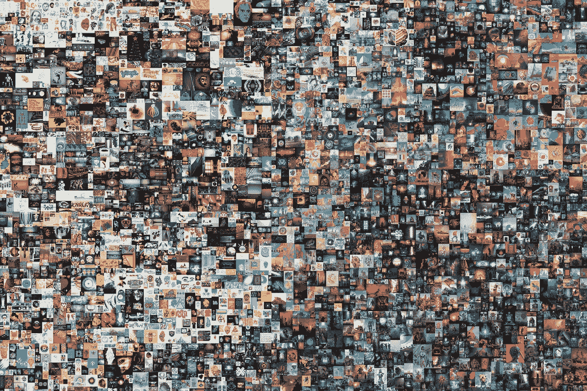

# NFTs:数字资产所有权的未来！

> 原文：<https://medium.com/coinmonks/nfts-the-future-of-digital-asset-ownership-dcdcb4180f66?source=collection_archive---------20----------------------->

近年来，随着不可替代代币(NFT)的出现，数字艺术和收藏品的世界越来越受欢迎。这些建立在区块链技术基础上的独特数字资产提供了前所未有的所有权和真实性。

但是 NFT 到底是什么，它们是如何工作的？简而言之，NFT 是一种数字资产，代表一个独特项目或内容的所有权。与易于复制和共享的传统数字资产不同，NFT 是独一无二的，不能与同等价值的其他资产交换。这使得它们非常受收藏家和投资者的追捧，他们正在寻找一种拥有和交易独特数码物品的方法。

> 交易新手？在[最佳密码交易所](/coinmonks/crypto-exchange-dd2f9d6f3769)上尝试[密码交易机器人](/coinmonks/crypto-trading-bot-c2ffce8acb2a)或[复制交易](/coinmonks/top-10-crypto-copy-trading-platforms-for-beginners-d0c37c7d698c)

非功能性交易的一个主要优势是它们建立在区块链技术的基础上，可以安全透明地记录所有权。这意味着 NFT 的所有权可以很容易地验证和跟踪，为资产提供附加值和可信度。

NFT 的用途广泛多样，从数字艺术和收藏品到虚拟房地产，甚至音乐和电影。在艺术界，NFT 允许艺术家直接向收藏家出售他们的作品，绕过传统的看门人，让他们对自己作品的发行和定价有更多的控制权。

Everydays: The First 5000 Days NFT

2021 年 3 月，在佳士得的一场拍卖会上，艺术家 Beeple 以创纪录的 6930 万美元售出了一件数字艺术品，这是 NFTs 力量最引人注目的例子之一。这幅名为《每一天:前 5000 天》(Everydays: The First 5000 Days)的作品被作为一幅独特的 NFT 画作出售，巩固了这些数字资产在艺术界的潜在价值和可信度。

但是，不仅仅是艺术界受到了非传统艺术的影响。音乐家和乐队也在使用 NFTs 向粉丝出售独家、独一无二的体验和商品，如虚拟见面和问候或签名商品。在游戏世界中，NFT 正被用来表示游戏中的物品和虚拟不动产，为玩家提供了一种在他们喜爱的游戏中拥有和交易独特物品的方式。

虽然 NFTs 的采用仍处于早期阶段，但很明显，它们有可能彻底改变我们对数字世界所有权和真实性的看法。随着技术的不断成熟，越来越多的人开始熟悉 NFTs，我们可以期待看到这些独特的数字资产有更多创新和令人兴奋的用途。

在 Twitter 上关注我们！

 [## JavaScript 不可用。

### 编辑描述

twitter.com](https://twitter.com/The_Swop) 

> 加入 Coinmonks [电报频道](https://t.me/coincodecap)和 [Youtube 频道](https://www.youtube.com/c/coinmonks/videos)了解加密交易和投资

# 另外，阅读

*   [面向开发者的 8 个最佳加密货币 APIs】](https://coincodecap.com/best-cryptocurrency-apis)
*   [加密交易机器人](/coinmonks/crypto-trading-bot-c2ffce8acb2a) | [维护审查](https://coincodecap.com/uphold-review)
*   [十大最佳加密货币博客](https://coincodecap.com/best-cryptocurrency-blogs) | [YouHodler 评论](https://coincodecap.com/youhodler-review)
*   [my constant Review](https://coincodecap.com/myconstant-review)|[8 款最佳摇摆交易机器人](https://coincodecap.com/best-swing-trading-bots)
*   [MXC 交易所评论](/coinmonks/mxc-exchange-review-3af0ec1cba8c) | [Pionex vs 币安](https://coincodecap.com/pionex-vs-binance) | [Pionex 套利机器人](https://coincodecap.com/pionex-arbitrage-bot)