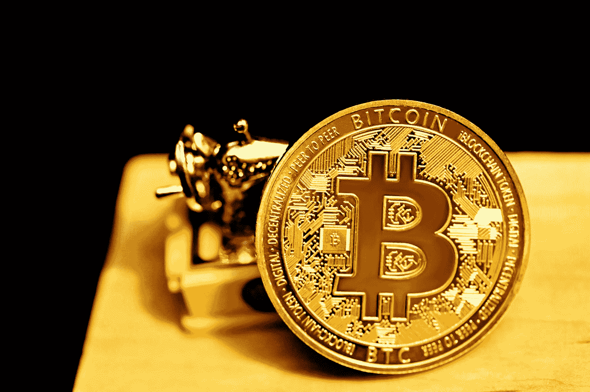

# 尼克·萨伯作为比特币的创造者，中本聪

> 原文：<https://medium.com/coinmonks/nick-szabo-as-a-creator-of-bitcoin-satoshi-nakamoto-fe426994a471?source=collection_archive---------43----------------------->

## 埃隆·马斯克认为比特币的潜在创始人中本聪

Photo by [Kanchanara](https://unsplash.com/@kanchanara?utm_source=medium&utm_medium=referral) on [Unsplash](https://unsplash.com?utm_source=medium&utm_medium=referral)

***比特币是货币的未来。为什么呢？***

这是多年来一直萦绕在投资者和企业家心头的问题。比特币是金融领域的下一个大事件吗？