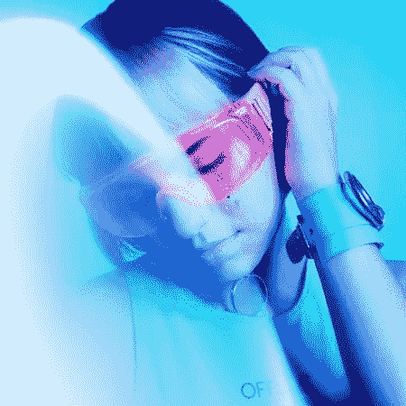
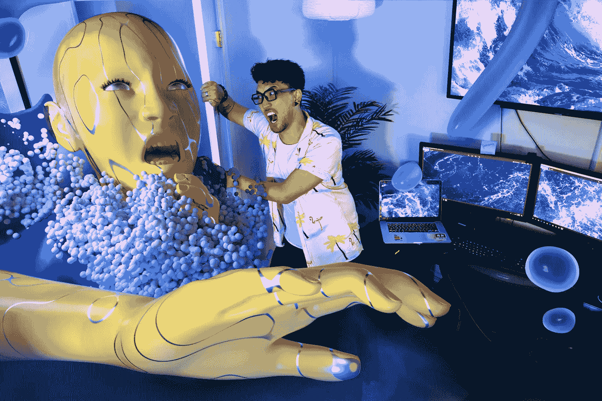
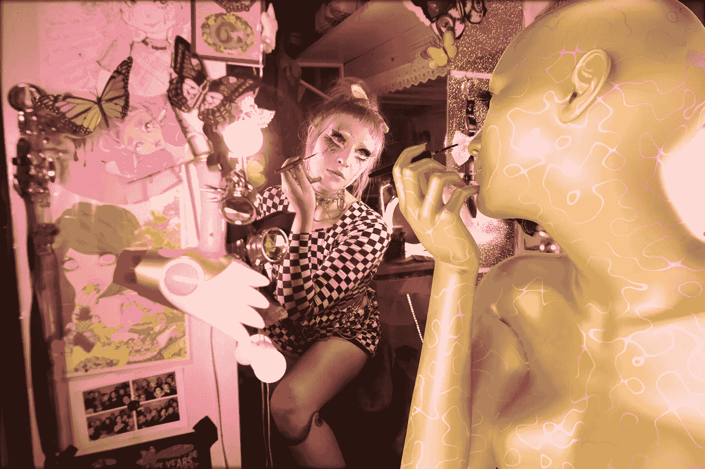
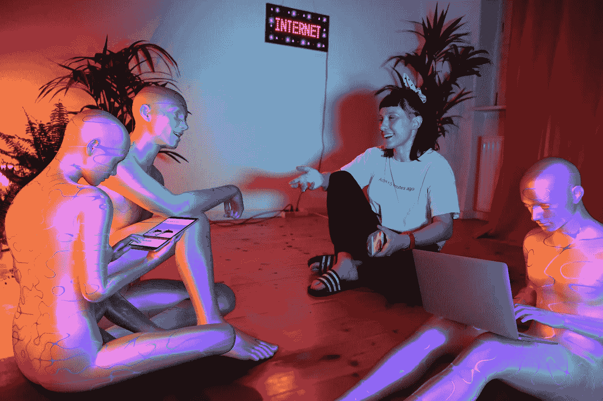
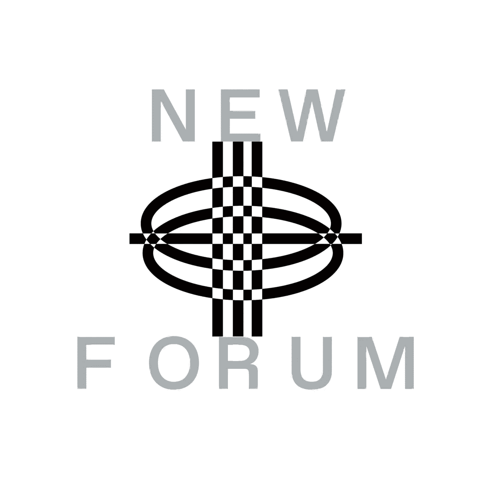

# 妮可·鲁杰罗分享了她作为一名受科技和文化启发的 3D 视觉艺术家的经历

> 原文：<https://medium.com/coinmonks/nicole-ruggiero-shares-her-experience-as-a-3d-visual-artist-inspired-by-technology-and-culture-33f960007e47?source=collection_archive---------24----------------------->

Nicole Ruggiero | Freelance Cinema 4D Artist

我们与妮可·鲁杰罗进行了一次愉快的对话，讨论了未来的艺术，她的精彩作品采用了什么流程，以及为什么技术和区块链世界是艺术和创意的新时代。

妮可·鲁杰罗是一位 3D 视觉艺术家，她的作品专注于技术和文化。

她是 2020 年末该基金会的首批成员之一，并于 2021 年在纽约 NFT 发表演讲。

她最近的展览包括:1/1 与 SuperRare 和 Vellum 一起参加洛杉矶艺术展(2021 年)，与 nig Galerie 和保时捷一起参加国际公告牌展览(2021 年)，另一次与 Rarible 一起参加洛杉矶 Frieze 艺术周(2022 年)，与 OpenSea 一起参加 SXSW (2022 年)。妮可在迪拜艺术博览会(2022)期间也与克里斯蒂在中东举办了一场展览。

# 是什么让妮可迷上了数字艺术？

How The Internet Changed My Life, Mika Diva by Nicole Ruggiero

妮可 2015 年考上了 3D。她决定以互联网和网络文化为主题；这在她的作品中司空见惯。

How The Internet Changed My Life, Toshi Salvino by Nicole Ruggiero

> “我对技术如何影响文化很感兴趣，所以你会在我的作品中一次又一次地看到这一点……”——妮可

How The Internet Changed My Life, Franziska Von by Nicole Ruggiero

# **妮可制作如此复杂的艺术品需要什么过程，需要多长时间？**

据妮可说，这完全取决于这个想法和它的成本。她解释说，一些艺术品可能需要一天或几年才能完成，但钱在这个过程中起着重要作用，但她不允许金钱因素限制创作过程。

> “我在非专利技术出现之前就开始了，那时候很难，但现在有了非专利技术，就能够通过我的工作更多地赚钱而言，事情变得简单了一些。我的意思是，这只是取决于想法，多少时间和多少成本……”——妮可

妮可也分享了为什么她觉得开始做 3D 工作很幸运，这带来了画廊的邀请和她钦佩的人的合作。

她解释了 Web3 空间如何帮助她对未来艺术发展的看法。

# **社交媒体是如何影响妮可的创作过程的？**

> “我认为对许多艺术家来说，肯定是对我来说，我从来没有真正参与算法，因为我喜欢做更大的项目。我不仅只做一天的项目，也不做只花几天时间的东西……”——妮可

妮可进一步解释了社交媒体对她工作过程的影响，这在过去更为普遍。她还谈到了她如何处理作为艺术家不断交付工作的压力以及与艺术家 block 的斗争。

> “对于艺术家区块，你总是必须推动和解决它，并超越它。期望喜欢你所有的草图或者你做的所有东西并不是什么好事。我认为这是阻止许多新艺术家的原因，他们会说，哦，我讨厌这样，或者我很沮丧，但作为一名艺术家，很大一部分是要学会超越这些，继续创作，因为最终，你会喜欢自己创作的东西……”——妮可

# 妮可迷上了游戏。她是否打算未来进行游戏合作？

妮可分享说，她已经制作了一些游戏或互动体验，并认为这些是她更大的展览。她补充说，她通常与令人难以置信的合作者一起工作。

她建议我们的社区去她的[网站](https://nicoleruggiero.com/)获取更多关于此类展览的信息——这些项目和她在这些项目中合作过的人。

# **在 Web3 技术领域，你希望改变什么？还是在创意经济中？**

> “我担心人工智能艺术。我不知道我是否会改变它，但我很好奇它将如何影响我们的文化和作为艺术家的艺术创作。我认为，这种平衡正在向拥有量身定制体验的消费者倾斜，这对艺术家本身来说是相当危险的。我很好奇会有什么结果……”——妮可

她补充说，我们还没有看到如此多的事情发生，但她认为当人们知道机器在制造东西而不是人类时，会有如此多的偏见；我们倾向于对此有一点反感，所以这是对艺术家有利的因素。

她这么说是什么意思？

> “谈谈图灵测试；如果有人不能辨别一件作品是由算法还是人工智能创作的，我认为这就是它开始对艺术构成威胁的时候，就像现在这样。我确信在艺术界会有一些反对这项技术的人，尽管我不知道在这一点上它会是什么样子，也不知道它是否会成功；如果人工智能要永久地融入到艺术创作的体系中……”——妮可

最后，妮可分享了她作为艺术家对未来 Web3 的期望，以及她对这一领域身份建设的看法。她还分享了自己喜欢的展览，回答了一些有趣的这样或那样的问卷。

对妮可的选择感到好奇:

*   Web2 还是 Web3？
*   VR 还是 AR
*   动漫或动画电影
*   Youtube 或 Twitch
*   大展还是小展？

在这一集的 NEWFORUM 上观看她的完整采访🔥

[加入社区](https://twitter.com/newforum_nco)了解[@ _ NicoleRuggiero](https://twitter.com/_NicoleRuggiero)并发现 web3 社区中的其他创作者！

✨follow·妮可·鲁杰罗！Twitter:[@ _ NicoleRuggiero](https://twitter.com/_NicoleRuggiero)insta gram:[@ NicoleRuggiero](https://www.instagram.com/stories/nicoleruggiero/2937462901128387483/)Linktree:[NicoleRuggiero](https://linktr.ee/nicoleruggiero)LinkedIn:[NicoleRuggiero](https://www.linkedin.com/in/nicole-ruggiero-52202168/)

# new forum # web 3 # web 3 gaming #元宇宙#创造经济#数字艺术#nfts #aiart

爱 x 新论坛

# Twitter @newforum_nco

不和谐[@加入](https://discord.gg/2K8tvVh8tM)

# 新论坛

[NEWFORUM](https://newforum.notion.site/newforum/Welcome-to-NEWFORUM-48f9661398ec4ec6a1af37fcc96dc926) 由 [Newcoin Foundation](https://newcoin.org/) 提供支持，专注于促进去中心化社交应用的扩展，也被称为 Social 3.0，形成一个生态系统和一个由远见者、创造者和投资者组成的社区。它为思想者提供了一个安全的交流、传播和分享思想的空间，以确保一个新网络的自觉和道德发展，嵌入关怀、自由和创造力的价值观。✨每周新集！在 [Twitter](https://twitter.com/newforum_nco) 、 [Newlife](https://newlife.io/) 、 [Youtube](https://www.youtube.com/channel/UCWvHyau1nIJBffmaaj6FmbQ) 和 [LinkedIn](https://www.linkedin.com/showcase/newforum/) 上关注我们，了解 web3 的更多信息，认识生态系统！加入生态系统[不和](https://discord.gg/DHepA4WTkN)！

> 交易新手？尝试[加密交易机器人](/coinmonks/crypto-trading-bot-c2ffce8acb2a)或[复制交易](/coinmonks/top-10-crypto-copy-trading-platforms-for-beginners-d0c37c7d698c)