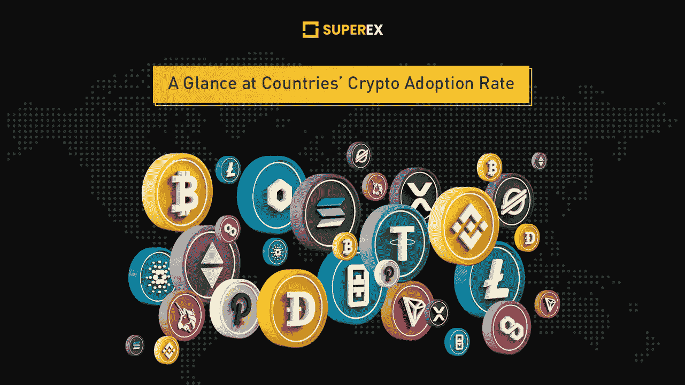

# 尼日利亚是秘密收养舞会上的大人物

> 原文：<https://medium.com/coinmonks/nigeria-is-the-big-guy-in-the-crypto-adoption-prom-43cbcafefdc0?source=collection_archive---------9----------------------->

www.superex.com

对于大多数人来说，加密不再是一个陌生的话题。然而，我们并没有意识到在不同的意识形态和社会经济的国家中，加密的普及和接受程度。在本文中，让我们深入一些数据，看看它是如何在其他国家传播的。

**正如我们假设的那样，美国可能是拥有广泛加密采用人口的第一大国家。然而，数据表明了一个不同的事实。**我们参考了一个名为 Statista 的网站的数据，该网站结合了 55 份研究报告和全球调查，以确定比特币和其他加密资产最受欢迎的国家。

**非洲、亚洲和南美洲脱颖而出。尼日利亚位于排行榜首位，32%的受访者声称他们在 2020 年使用加密。相比之下，只有 6%的美国人有同样的报告。尼日利亚独特的文化和社会经济结构刺激了这一趋势。一个最大的原因是贫穷；该国 2 亿人口中有 8700 万人生活贫困。便宜的加密交易也减少了转账费用。另一个因素是手机现金转账被广泛采用。尼日利亚人喜欢用手机支付和汇款。两位数的通货膨胀也持续多年打击着这个国家的经济。无限量的比特币是尼日利亚人的“缓冲区”。

虽然尼日利亚名列前茅，但该国并不是唯一一个采用加密技术的国家，直到最近，这还是一个陌生的新事物。在前十名的名单中，南亚国家相当强势，一个拉丁美洲国家打破了前五名。具有讽刺意味的是，经济实力最强的国家却落在了前十名的末尾。**十大采用数字列表如下。尼日利亚 32%，越南 21%，菲律宾 20%，土耳其与秘鲁 16%，瑞士 11%，印度 9%，中国 7%，美国 6%，德国 5%，日本 4%。**

美国是采用比特币最多的国家。**比特币在 2021 年第一季度增长了 113%，但与 Dash 的 198%增长、以太坊的 324%增长、Maker 的 760%增长和 Dogecoin 的 7555%增长相比，这只是小巫见大巫。**

虽然最近几天最热门的趋势 altcoins 正在统治加密话题，但比特币仍然是加密巨头。根据 Statista 的数据，2020 年，美国加密交易所交易的比特币价值超过 15.2 亿美元。**俄罗斯第二交易量为 421.38 美元，比美国少三倍。尼日利亚也不缺乏支持，其投资额略高于 4 亿美元。**毕竟，它在欧洲的票房下降了一点，超过了 2 亿美元。**

加密货币和区块链公司 TripleA 估计，全球超过 18，000 家企业接受加密支付。现在全球有超过 3 亿的加密货币用户。平均加密拥有率为 3.9%。五分之三的秘密收养者是男性，秘密收养者主要是受过高等教育的年轻一代。

www.superex.com

**SuperEx 是第一个去中心化的加密交易所，拥有完整的 DAO 社区治理。** SuperEX crypto exchange 的交易区有数千个代币，使用户能够进行从现货到杠杆和衍生品的不同交易。没有 KYC 条款是超级交易所的焦点，该交易所为用户资产提供终极保护和严密防御。该交易所在建立其高清钱包的发展过程中取得了指数级的突破，这保证了加密服务的轻松访问和分散安全性。超级链预计将于 2022 年第三季度推出，将 ET 令牌迁移到其链中。

为了与项目方和应用服务有更密切的联系，我们推荐用户访问 SuperEx [的官方页面](http://superex.com/) 。新的空投活动，项目跟进，相关的加密新闻，以及伙伴间的讨论欢迎在官方 [**电报群**](https://t.me/SuperExOfficial) 中。在 [**官方邮箱**](http://business@superex.com/) 接收业务邮件、合作建议、问题报告。用户可以进入[官方 Twitter 页面**查看最近上市的代币和不同的空投活动或后续营销。**](https://twitter.com/SuperExet)

> 交易新手？试试[加密交易机器人](/coinmonks/crypto-trading-bot-c2ffce8acb2a)或者[复制交易](/coinmonks/top-10-crypto-copy-trading-platforms-for-beginners-d0c37c7d698c)