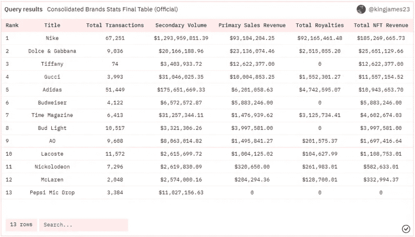
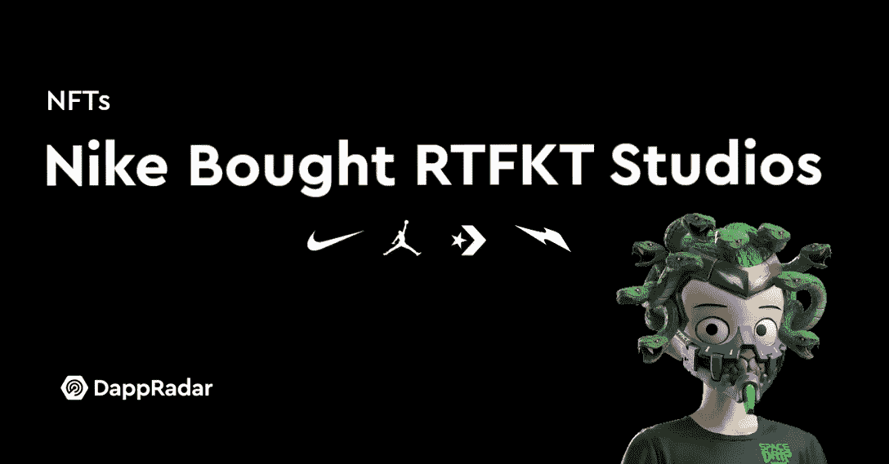

# 耐克刚刚在元宇宙大获全胜

> 原文：<https://medium.com/coinmonks/nike-just-did-a-slam-dunk-in-the-metaverse-a62b67494244?source=collection_archive---------31----------------------->

Nike is crushing it in the Metaverse.

仅仅几个月前，大品牌还在拥抱 NFTs，现在已经开始赚钱了。

还记得不久前，似乎每个主要的奢侈品牌和大玩家都一头扎进了 NFT 世界吗？

你猜怎么着？

他们打这个赌是对的，不管听起来有多古怪。

耐克、杜嘉班纳、蒂芙尼、古驰、阿迪达斯、百威啤酒、时代杂志、鳄鱼、迈凯轮和百事可乐都跃入创造自己的 NFT 系列。

现在，他们都沉浸在用户交易他们的 NFT 时产生的版税中。

Big brands are making big money in the web3 space.

除了用户第一次铸造 NFT 时实际赚到的钱之外，他们还可以从随后的每笔交易中提成。

目前，耐克位于排行榜的首位。

“截至 8 月，耐克仍然是发行 NFT 最成功的时尚品牌。该公司在所有 NFT 收藏中积累了 12.5 亿美元的累计交易量和 8700 万美元的累计版税。”

好吧，这跟乔丹品牌在 2021 年为耐克赚的 50 亿美元比起来算不了什么。

但这是进入 NFT 世界的良好开端。

“耐克最成功的 NFT 系列是克隆 X，由 RTFKT(发音为‘artifact’)于 2021 年 11 月推出，二次销售收取 5%的版税。两周后，RTFKT 被耐克收购。”

In December 2021, NIKE, Inc. acquired RTFKT for a sum thought to be **in excess of $1 billion.**

“从那以后，RTFKT 不断推出多种 NFT 系列。目前，耐克获得的 86%的累计版税仅来自 3 个系列——Clone X、Clone X Mintvial 和 MNLTH。在耐克 12.5 亿美元的累计交易量中，这 3 个系列占了 11.7 亿美元。”

谁会想到从现实生活中卖运动鞋转型到在元宇宙卖电子鞋会如此有利可图？

秘制酱？

遗产。

这不是来自布朗克斯区的某个不知名的小品牌。

这就是耐克，众所周知，久负盛名，拥有强大的品牌资产和全球粉丝群。

当他们推出他们的 NFT 时，他们乘上了牛市，并在整个加密市场的宣传列车上获得了一张票。

他们知道他们可以把大部分的艺术品和运动鞋设计转移到网上，因为现在它们都是数字化设计的。

Fancy a pair of digital Nikes?

事实上，这让他们可以在实物产品上尝试他们在现实生活中无法尝试的新事物。

从乔丹鞋到 Air Max，耐克几十年来一直主导着运动鞋文化。

将所有的善意和品牌带入元宇宙将为未来提供巨大的机会。

耐克当然知道如何利用他们的品牌资产，并在新的网络 3 革命中占据领先地位。

当然，legacy 不是我们任何人都可以放在背包里的东西，耐克花了几十年时间来打造它。

但同样值得注意的是，像耐克这样的大公司和像古驰这样的老品牌是如何敢于尝试新事物的。

对于这样一个大组织来说，行动如此迅速，驾驭潮流如此有效，这是值得称赞的。

想象一下通过管理所需的繁文缛节和文书工作。

打造一个 NFT 部门所需的资源、新员工和惊喜。

他们需要一大批精通 web3 和 NFT 理工的程序员和骗子。

更不用说社区建设方面的不和谐和社交媒体。

他们打了个赌，信心大增，现在他们笑了。

就像马特·达蒙说的“财富奖励勇敢的人！”

-

你会在元宇宙买一双耐克鞋吗？

-

# startups # business # startupx # growth # success # social media # culture # entrepreneur # strategy # eth # BTC # crypto # NFT # Nike # branding # marketing # niken ft # rfkt # cloneX # jordans # Nike shoes #元宇宙

> 交易新手？试试[加密交易机器人](/coinmonks/crypto-trading-bot-c2ffce8acb2a)或者[复制交易](/coinmonks/top-10-crypto-copy-trading-platforms-for-beginners-d0c37c7d698c)