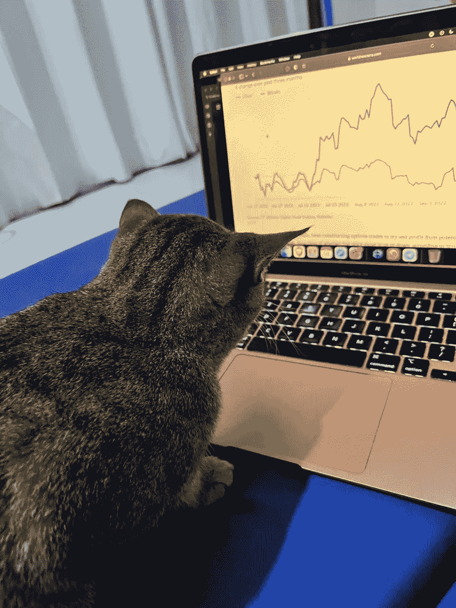
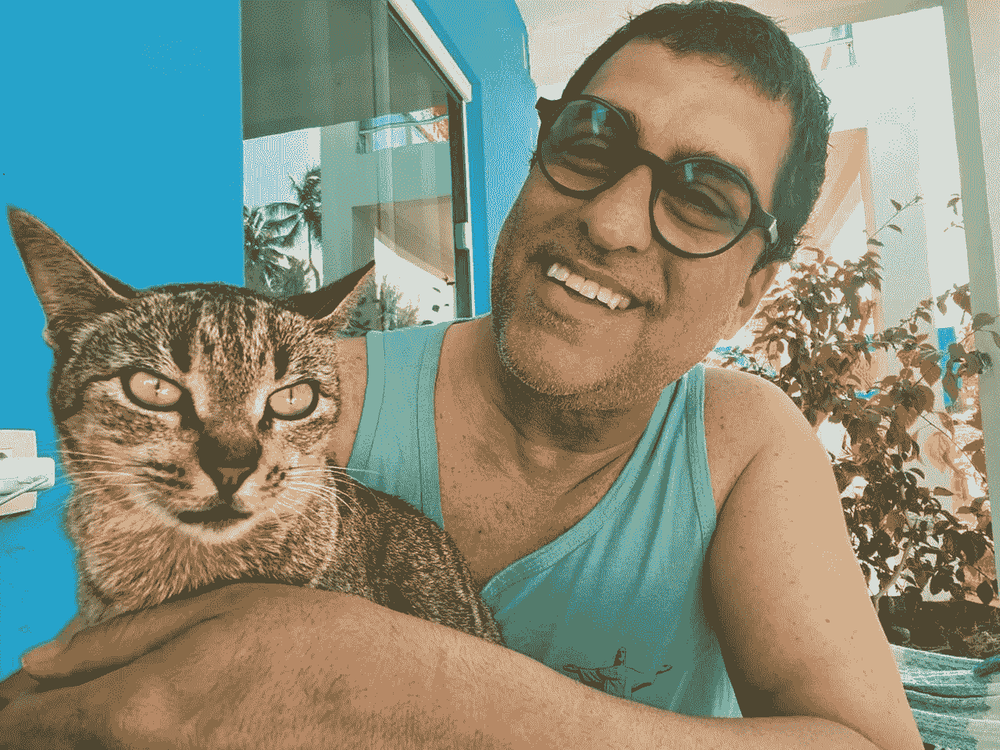
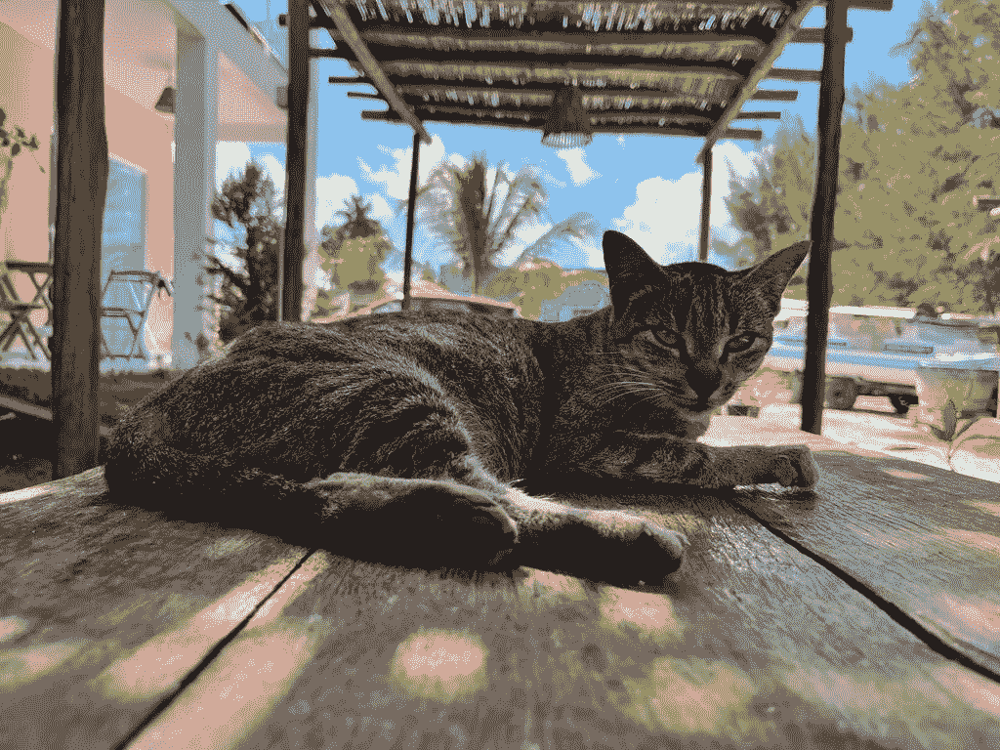
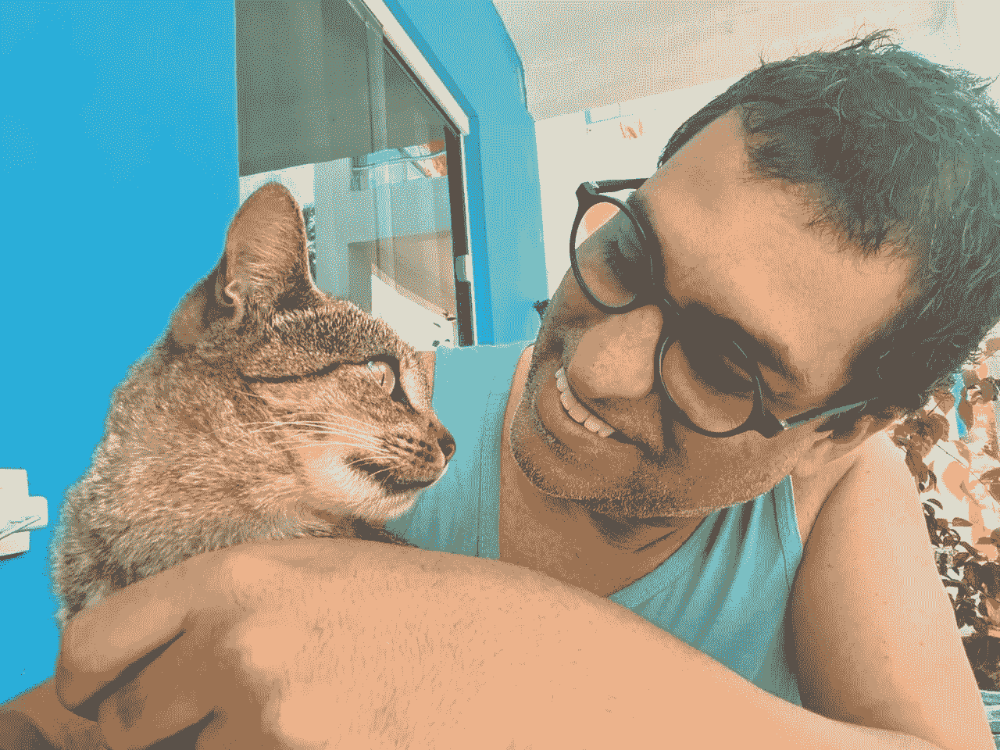

# 猫尼娜和密码世界

> 原文：<https://medium.com/coinmonks/nina-the-cat-and-the-crypto-world-ea56104a2378?source=collection_archive---------25----------------------->

我们需要一位老师、一位导师、一位古鲁，只要你说得出名字的，但我们必须继续前进，否则我们将向外面的许多骗子祈祷，甚至更糟:我们将成为我们自己的聪明才智和错误的受害者。所以，是的，我读过书，我在 telegram 和 Tweeter 上关注精明的人(我不是任何其他社交媒体)，我参加了一些课程，你能说出来的。然而，我最好的教授不是这些。

我最好的教授是…猫尼娜。

Nina studying the market

> 尼娜确切地知道去哪里找食物，什么时候需要什么就打电话给我，最重要的是:她信任我。然而，她不会盲目地相信任何人的任何东西，包括我。如果有人想给她什么，她会先给他们她的“现在你想从我这里得到什么？”*看。只有当——如果——她确信靠近是安全的，她才会靠近。*

这对初学走路的宝宝来说是一堂很棒的猫课。我学会了不盲目相信任何人，但同时我也相信一些项目。然而，如果我信任一个项目，我总是会给他们尼娜的'*'你现在想从我这里得到什么？'*看。在仔细阅读他们的白皮书后，我*可能*会更接近。从来没有问过自己，这个项目中有什么反映了我的原则、价值观和目标。一旦我购买了这个想法，我就可以持有这个代币/硬币，直到我觉得它对我的 wallett 有益为止。在那之后，我离开了，没有任何内疚和依恋。

Safeness and trust is a must. For both cats and crypto.

就像尼娜一样。

尼娜教给我的另一个教训是独立。尼娜根本不需要我。我们的关系必须是双向的。人类给了她食物和住所，她还给我们她的超级可爱。有限制的。如果我们过度挤压和抱着她，她会立刻从我们的臂弯中滑走。有时她甚至会喵喵地抱怨:“*够了*！”

在 crypto，我学着像 Nina 一样。我不需要任何项目。在我错过那颗隐藏的宝石之前，我不需要尽快购买任何私人的或预售的。不要！我们是*隐藏的宝石*。如果他们想卖，让我们看看 NFT、代币之类的东西对我们来说是一笔好资产。如果我们错过了隐藏的宝石，那又怎么样？许多其他人会来。

错过一个好项目比开发 FOMO 好得多。对吧尼娜。

妮娜没有 FOMO。我们为什么要拥有它？

妮娜也教会了我什么时候该停下来。我们许多初学加密的孩子可能会遇到的一个问题是，我们太兴奋了，以至于我们可能会在室内在线电脑前研究、阅读和学习白皮书、基本面等几个小时。问题是，我们的大脑有效吸收信息的时间是有限的。

Nina and her’ *what-do-you want -from-me-now?’ look.*

是猫决定了我们可以抚摸它们多久，而不是相反。加密也是如此。我们必须划清界限。否则，我们可能会研究和学习，直到我们感到筋疲力尽。知道停止的时间是明智的。没有其他东西可以决定*我们的*极限。每次我穿过那块石灰，我都会看着妮娜，她用她的眼神说:“*够了*”。我立刻停下来，去海滩散步。

最后，我还从 Nina 那里了解到，著名的建议“*永远不要在加密上投资超过你能失去的*”不仅仅意味着金钱。这也意味着我们的时间和生活质量。

谢谢你，尼娜！

> 交易新手？尝试[加密交易机器人](/coinmonks/crypto-trading-bot-c2ffce8acb2a)或[复制交易](/coinmonks/top-10-crypto-copy-trading-platforms-for-beginners-d0c37c7d698c)