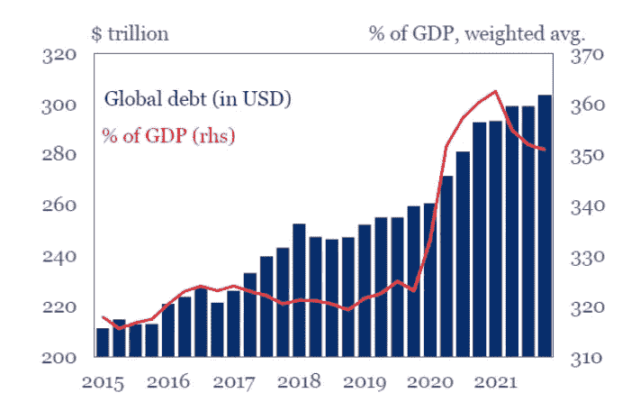
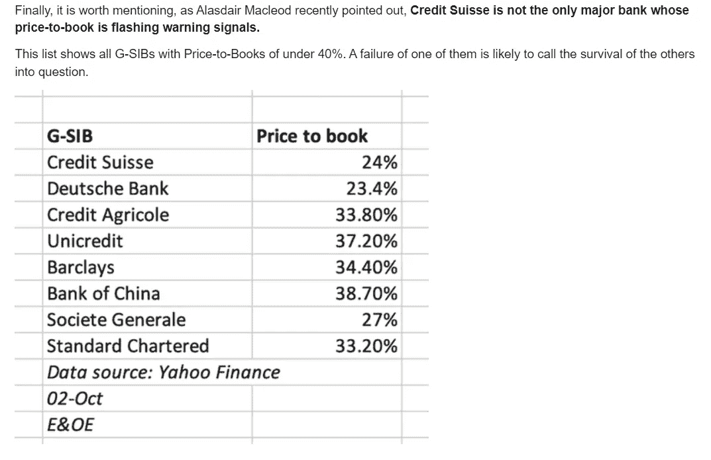
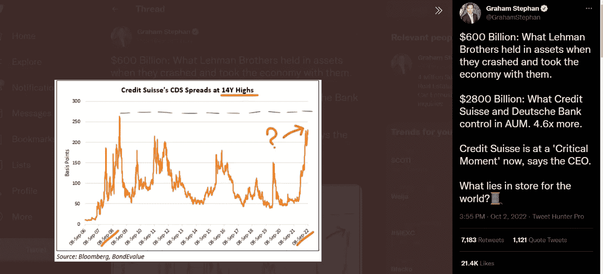

# 不，利率没有导致这次衰退

> 原文：<https://medium.com/coinmonks/no-interest-rate-didnt-cause-this-recession-35e3e3200f14?source=collection_archive---------16----------------------->

Photo by [Andrea Piacquadio](https://www.pexels.com/photo/sad-isolated-young-woman-looking-away-through-fence-with-hope-3808803/) via [Pexels](https://www.pexels.com/)

我们看到了叙述方式的变化。在 2022 年初，人们正在告诉政府加息以对抗通胀。现在，我们都担心激进的加息，因为它可能导致经济衰退。我有朋友一直指责美联储或其他独立的政府机构造成了这次衰退。我们都被利率这个词包围着。没错，加息会引发衰退，但加息本身并没有搞垮经济。我们必须关注这次衰退的主要原因。

**那么问题是什么呢？**

一个字，债！今天，我们的债务比以往任何时候都多。据[路透社](https://www.reuters.com/markets/europe/emerging-markets-drive-global-debt-record-303-trillion-iif-2022-02-23/)报道，全球债务已达 300 万亿美元。在过去的一个世纪里，我们在全球范围内有一个有吸引力的接近 0%的利率。个人、公司、甚至国家都完全依赖于“免费”资金。央行不断向经济“注入”资金。

Chart by [Reuter](https://www.reuters.com/markets/europe/emerging-markets-drive-global-debt-record-303-trillion-iif-2022-02-23/)

其结果是货币供应量的增加导致通货膨胀率的上升。各国正面临创纪录的通胀率上升。这很糟糕。东西越来越贵了。我们现在正面临着拥有‘闲钱’的后果，我们需要通过加息来对抗日益加剧的通货膨胀。

然而，这对经济不利。大多数债务是按可变利率计算的。加息意味着偿还债务将更加昂贵。 [Walter Frick](https://hbr.org/2022/09/can-zombie-firms-survive-rising-interest-rates) 在[哈佛商业评论](https://hbr.org/)中提到，最近“僵尸”公司大量增加，这些公司可能无法偿还贷款。

## 全球债务危机来了

多家银行接近变成‘僵尸’。据瑞士银行[彭博](https://www.bloomberg.com/news/articles/2022-09-30/credit-suisse-ceo-says-firm-at-critical-moment-sees-strength?leadSource=uverify%20wall)报道，瑞士瑞信银行集团正处于关键时刻。根据[泰勒·德登](https://www.zerohedge.com/markets/credit-suisse-ceo-touts-strong-liquidity-positionagain-market-says-nein)的说法，8g-sib 的市净率正在发出警告信号。根据[维基百科](https://en.wikipedia.org/wiki/List_of_systemically_important_banks)的说法，G-SIB 指的是可以被称为“大到不能倒”的系统性重要金融机构的银行。'

Source by [Tyler Durden](https://www.zerohedge.com/markets/credit-suisse-ceo-touts-strong-liquidity-positionagain-market-says-nein) via [ZeroHedge](https://www.zerohedge.com/)

Graham Stephan 在推特上写道，在 2008 年金融危机期间，雷曼兄弟控制了 6000 亿美元。雷曼兄弟的倒闭拖垮了整个世界。目前，瑞士瑞信银行集团和德意志银行控制着价值超过 28000 亿美元的资产。我想不出比这更糟糕的情况了。

Tweeted by [Graham Stephan](https://twitter.com/GrahamStephan/status/1576601663477059585) via [Twitter](https://twitter.com/home)

## 结束语

“最昂贵的钱是免费的”是我们经常听到的一句话。在享受了一个多世纪的 0%利率后，我们已经到了必须与多年积累的廉价债务作斗争的地步。中央银行不得不使用利率作为工具来对抗飞涨的通货膨胀。过程中可能会造成很多痛苦，但这是必须的。

然而，世界经济正在迅速崩溃。政府似乎只专注于对抗通货膨胀。我不得不问自己，通货膨胀问题会首先得到解决吗？还是世界经济会先崩溃？这还有待观察。

[您想知道可能脱颖而出的一项资产吗？阅读我的文章，了解更多信息！](/coinmonks/3-reasons-why-bitcoin-is-extremely-bullish-right-now-e270846de6d6)

> 欢迎关注我，听听我对经济的看法！

 [## 埃隆·马斯克刚刚警告了美联储！即将到来的通缩可能比通胀更糟糕

### 我相信每个人都熟悉疫情之后发生的事情。美联储印刷了数量惊人的…

medium.com](/@smartmoneysalem/elon-musk-just-warned-the-fed-incoming-deflation-may-be-worst-than-inflation-b0152e0948b8) 

> 交易新手？尝试[加密交易机器人](/coinmonks/crypto-trading-bot-c2ffce8acb2a)或[复制交易](/coinmonks/top-10-crypto-copy-trading-platforms-for-beginners-d0c37c7d698c)