# 6 最佳无 KYC 密码交易所——购买无 KYC 密码(2023)

> 原文：<https://medium.com/coinmonks/no-kyc-crypto-exchanges-buy-crypto-without-kyc-3b2eda2b5397?source=collection_archive---------0----------------------->

保持匿名，特别是作为一个密码交易和购买的初学者，可能具有挑战性。但是不要担心。你可以保持你的匿名和购买/交易密码没有 KYC。

然而，在购买/交易没有 KYC 的加密货币时，您将不得不面对一些提款或其他交易功能方面的限制。大多数标准加密交换来自 KYC 或部分 KYC。以下是你可以尝试的七种不用 KYC 验证的加密交换。

> [**Pionex**](https://coincodecap.com/go/pionex) 也是一个允许现货、期货交易、无 KYC 存取款的交易所。

# 没有 KYC 验证的顶级加密交换

## 1.[比特码](https://coincodecap.com/go/bityard)密码交易所

Bityard 是一个全球加密交易所，提供差价合约(CFD)、现货和复制交易。此外，对于加密合约交易，它们的独特性在于它们的简单性和易用性。

该平台还允许你购买加密而不用担心 KYC 验证。你所要做的就是在交易所注册并遵循以下步骤。

## 如何在 Bityard Crypto Exchange 上购买 Crypto？

*   去 Bityard 的官网点击“入门”
*   通过在注册页面上提供所有必要的详细信息来创建一个帐户。然后，您可以使用您的电子邮件 ID 或电话号码创建一个帐户。

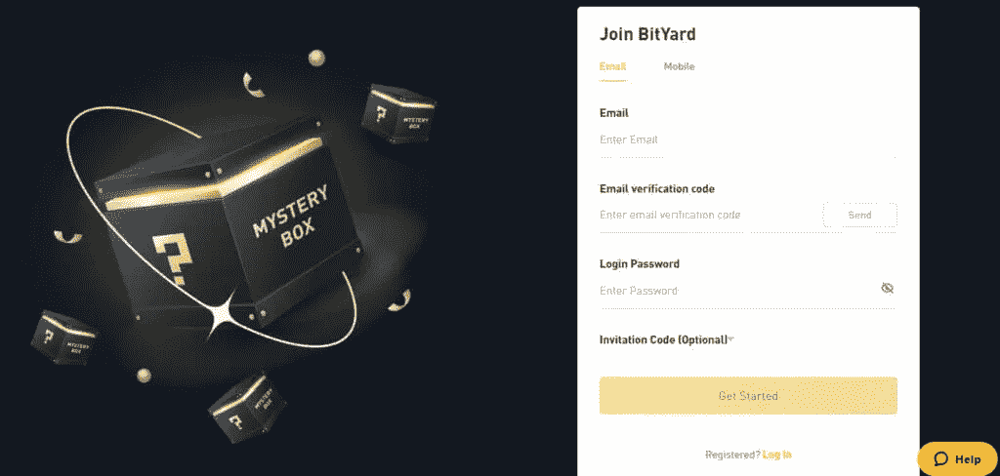

*   创建完成后，点击“购买加密”，会弹出如下屏幕。

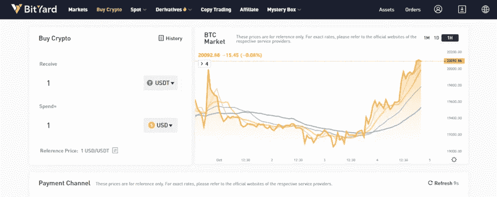

*   输入您的购买详细信息，选择支付渠道，然后使用信用卡、银行转账、Google Pay 和 Apple pay 等支付服务提供商进行支付。
*   假设我想购买价值 100 美元的 BTC，最终的购买过程如下所示:

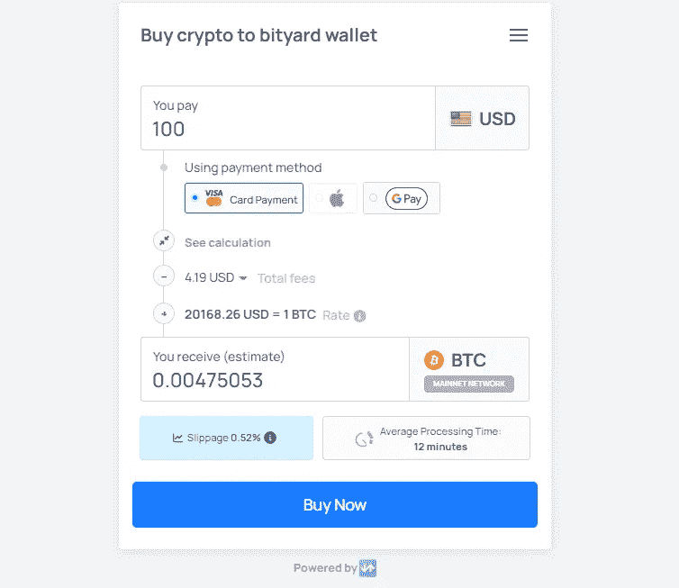

> 交易新手？尝试[加密交易机器人](/coinmonks/crypto-trading-bot-c2ffce8acb2a)或[复制交易](/coinmonks/top-10-crypto-copy-trading-platforms-for-beginners-d0c37c7d698c)

## 2.库币密码交易所

[KuCoin](https://coincodecap.com/kucoin-review) 是最受欢迎的加密交易所之一，提供部分 KYC，这意味着没有 KYC，你可以享受 KuCoin 的所有功能。

该平台的界面对初学者友好，有多种交易选项。他们提供衍生品。KuCoin 有自己的 KuCard，可以让你购买/出售和启动 NFTs。

## 如何在 [KuCoin](https://coincodecap.com/kucoin-review) 上购买 Crypto？

*   前往 [KuCoin](https://coincodecap.com/kucoin-review) 官网，使用您的邮箱 id 或手机号码注册。KYC 是可选的，有提款限额。
*   点击“购买加密”您可以通过 Visa/Mastercard、P2P、银行转账或使用 Banxa 和 Simplex 等第三方金融机构购买 crypto。
*   点击“购买 BTC”，以下确认细节。
*   将您的联系信息提供给第三方提供商，然后按照屏幕指示进行操作。

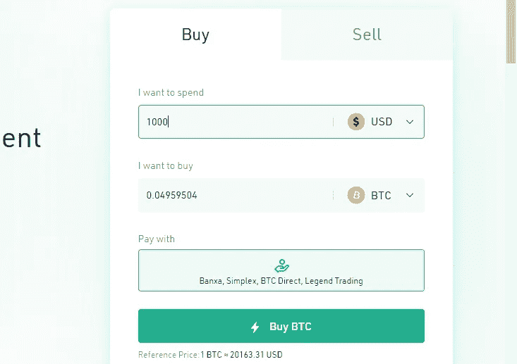

## 3. [BingX](https://coincodecap.com/go/bingx) 密码交易所

[BingX](https://coincodecap.com/bingx-review) 是一个密码交易所，让你安全有效地购买密码。该平台提供复制、衍生和现货交易。

该界面是初学者友好的，是为第一次购买密码的人设计的。最后，您可以期待全天候的客户支持。

## 如何在 BingX 上购买 Crypto？

在 BingX 上购买 crypto 是最简单的。按照下面给出的步骤购买您的第一个加密:

*   去 Bingx 官网自己注册。你一注册，就会弹出一个屏幕，询问你是否已经拥有加密货币。
*   点击“我没有加密货币。”如果您已经有了，请单击“否则”。
*   您将被重定向到支付网关页面。

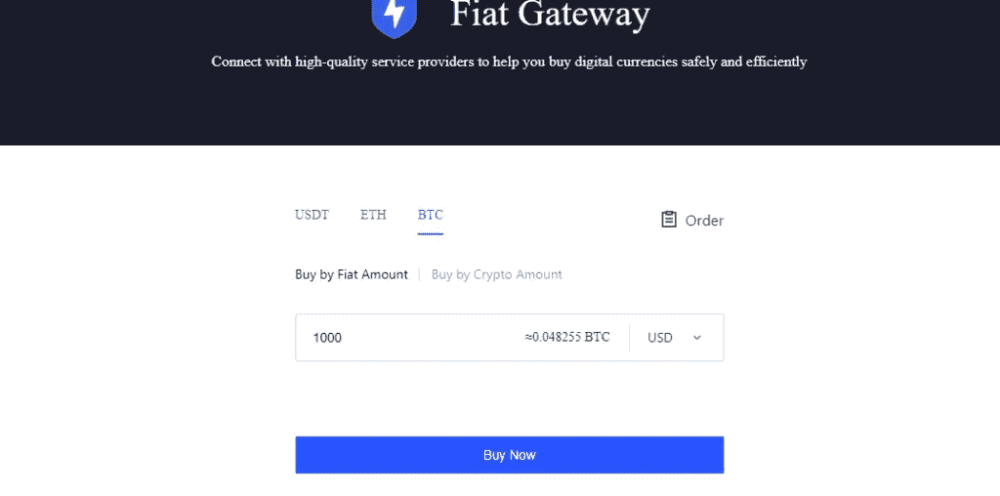

*   你可以通过法令或密码购买。我将通过菲亚特购买它。
*   最后，点击“立即购买”，然后确认您的交易。
*   然后，您将被引导至支付服务提供商。给他们提供你的基本资料，就搞定了。

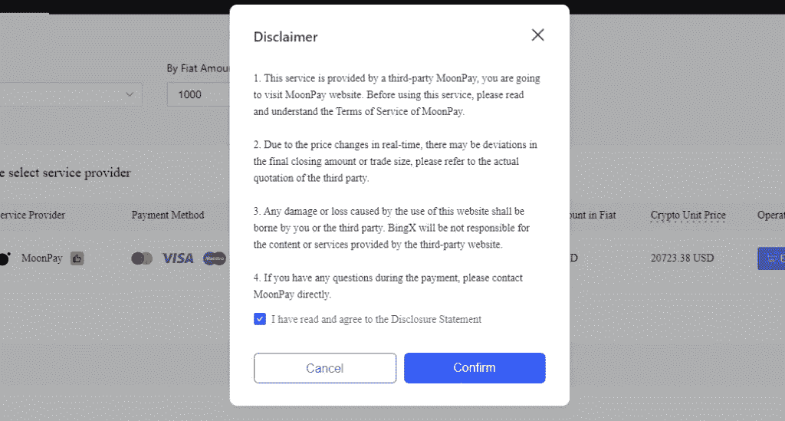

## 4. [ChangeNow](https://coincodecap.com/changenow-review-a-secure-crypto-exchange) 密码交换

ChangeNow 是一个无 KYC 的加密交易所。您必须拥有加密钱包或预加密 exchange 帐户。ChangeNow 是与您的加密交换合作的非托管交换。

你可以和他们买卖和交换密码。购买加密很容易，因为他们接受借记卡和信用卡。然而，为了利用最好的非 KYC 功能，使用交换功能，因为购买加密需要一个基本的 KYC。

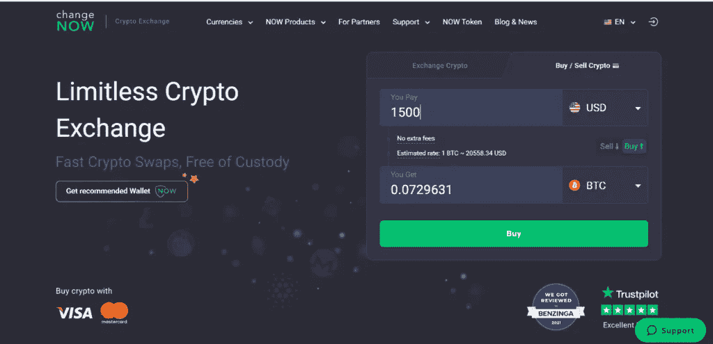

## 如何在 ChangeNow 上交换加密？

*   进入 [ChangeNow](https://coincodecap.com/changenow-review-a-secure-crypto-exchange) 官网，在网页上，你会发现左手边有一个长方形的方框，里面有两个选项:交换加密/购买/出售加密。

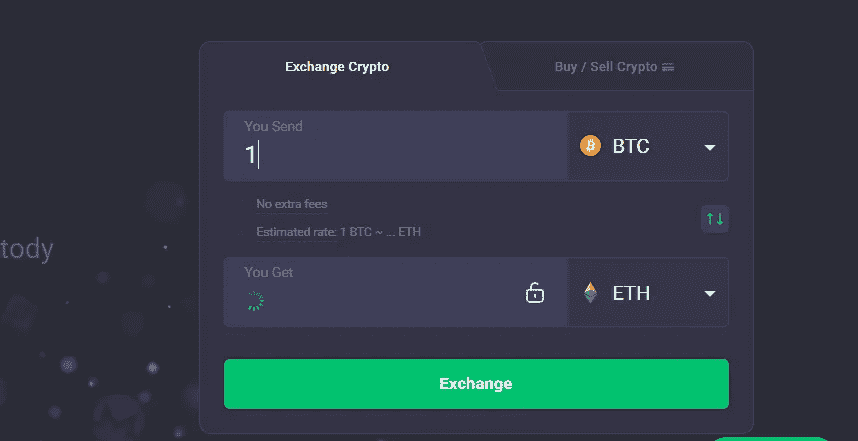

*   点击“交换”，您将被重定向到交换页面。

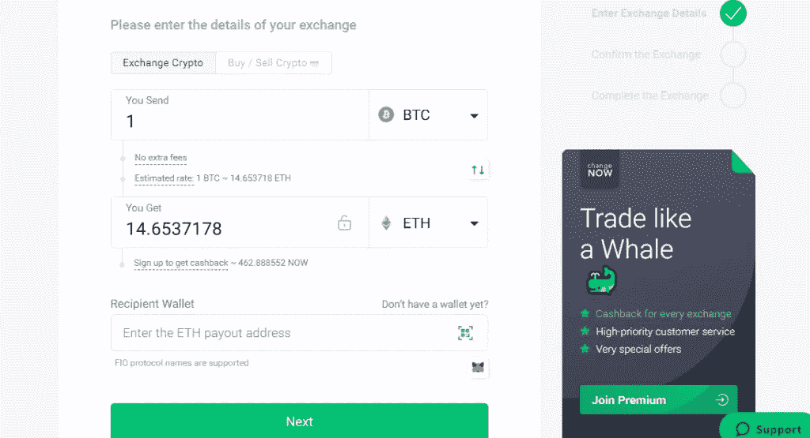

*   给出您的钱包地址，然后点击“下一步”
*   将出现一个确认页面，确认您的地址和汇率。
*   最后，当他们给你送硬币的时候，你可以期待一些奖励代币。

## 5.海浪。交换加密交换

说到保持匿名，Waves.exchange 似乎是最好的选择之一。该平台允许你在没有任何 KYC 的情况下向他们注册，并提供一些最低的费率和费用。

该交易所允许你交易(现货交易)，使用信用卡购买，互换，并投资于他们的赌注加密。最后，支持系统很有帮助。

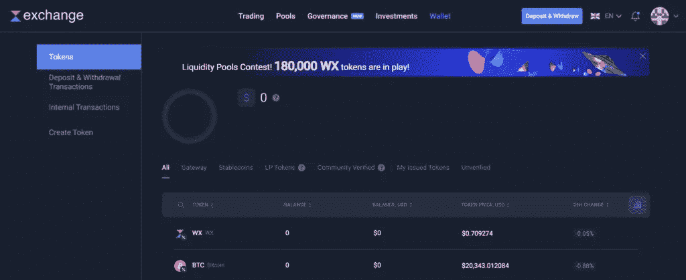

## 如何在 Waves 上购买 Crypto？交换？

*   去 Waves 官网看看。通过电子邮件注册或使用他们的软件通过密码注册来交换和创建您的帐户。
*   将光标放在“交易”上，就会出现用卡购买的选项。点击你想买的硬币。

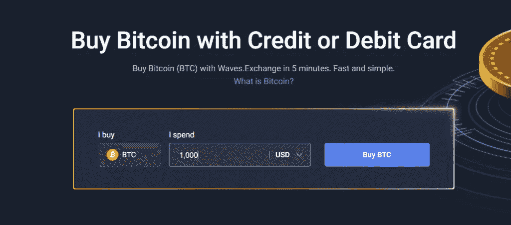

*   平台仅支持 AdvCash 支付系统。所以，要用卡支付，你必须有一张 AdvCash 的银行卡。
*   选择付款方式，然后点击购买 BTC。
*   该网站会将您重定向到支付网关。
*   给出你的卡的详细信息并支付确定的金额。

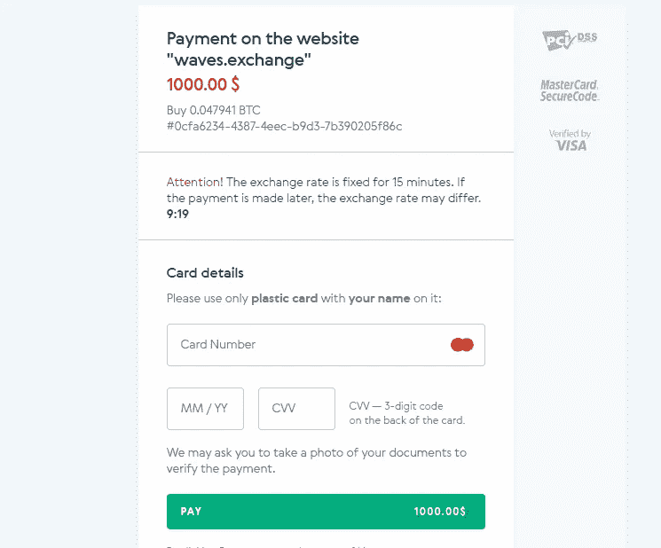

# 6.[多变](https://coincodecap.com/changelly-review)密码交换

[changely](https://coincodecap.com/changelly-review)是一个满足您所有要求的加密交换，并且是 KYC 免费的。该平台允许您在一个界面下购买/出售、交换、交易和互换加密货币。

他们不收集个人信息。你所要做的就是在平台上注册一个账号，使用他们的产品。

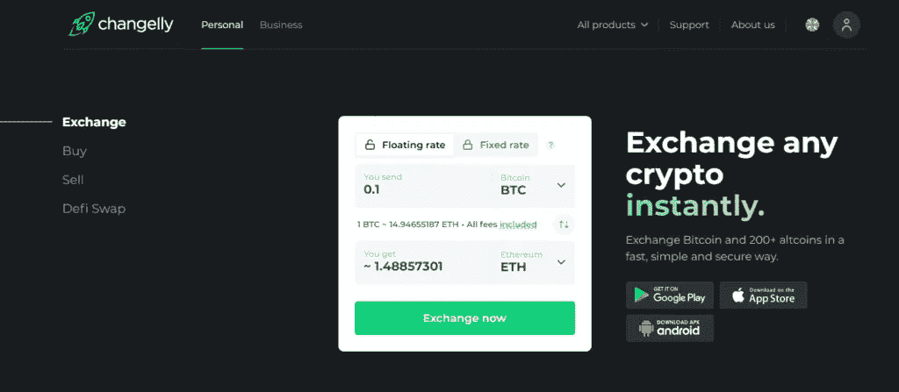

## 如何在 Changelly 上购买密码？

*   去[changely](https://coincodecap.com/changelly-review)官网报名吧。
*   点击“所有产品”，下拉选项中有“购买”作为列表。点击购买。
*   你将被重定向到购买页面。该平台提供三种支付方式:visa/Mastercard、apple pay 和 pix。除此之外，他们还提供 Moonpay、Banxa 和 Simplex。
*   给他们你的钱包地址，并购买你的密码。

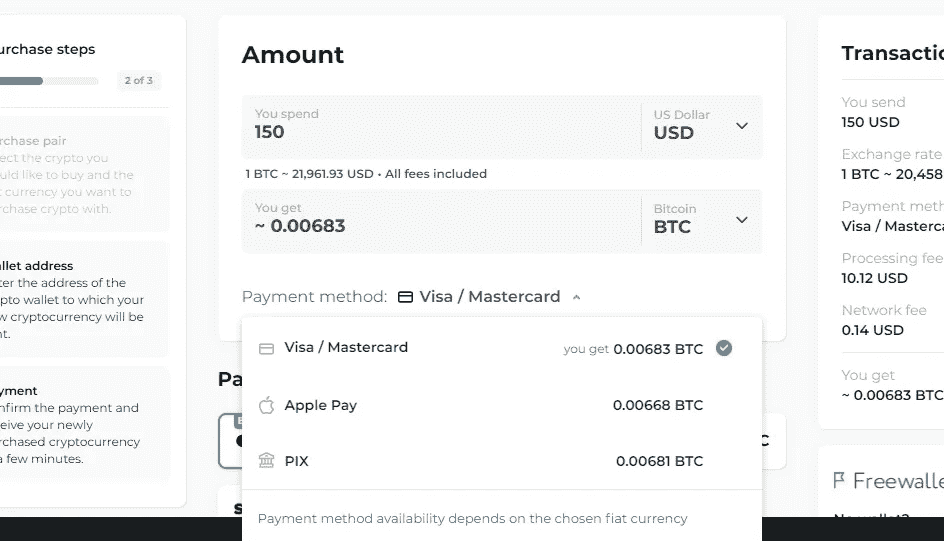

# 7.Bisq 加密交换

Bisq ，以前被称为 Bitsquare，是一个分散的加密交换，不需要任何中央机构的身份验证。

您可以在 Bisq 加密交换中保持自治。用户可以完全控制他们的数据，因此非常安全。

由于其开源的特性，该平台对初学者来说可能具有挑战性。因此，它最适合那些已经使用分散式交易所的人。

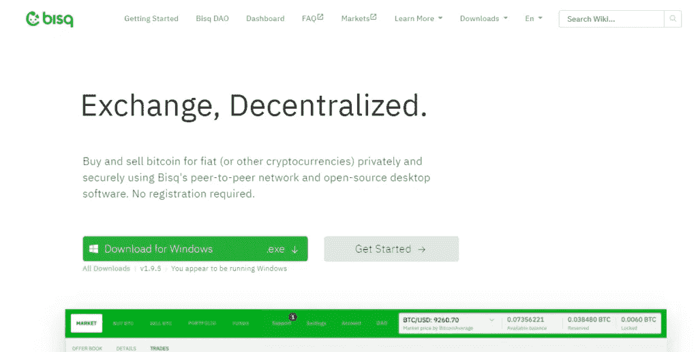

***免责声明:*** *确保您选择的是没有 KYC 法规的标准加密服务提供商，以保护您免受欺诈和金钱损失。*

## 如何在 Bisq 上购买 Crypto？

*   要使用 Bisq，您必须首先下载 Bisq 应用程序。
*   添加您的钱包帐户或加密帐户。
*   现在，您的帐户已在 Bisq 上更新，如果您想交易，请创建您的报价；如果您打算出售，请探索现有的报价。
*   要执行事务处理，请遵循界面说明。

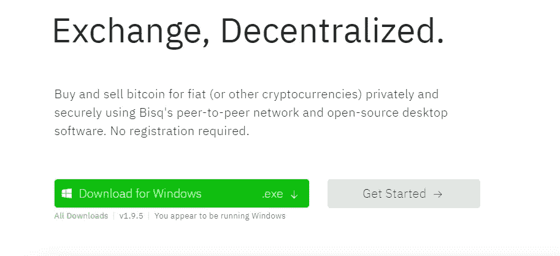

## 结论

如果你希望在保持匿名的同时安全地购买/交易/交换密码，最好的选择是选择分散交易。然而，如果这不是你想要的，你可以从七个没有 KYC 的加密交换(集中的和分散的)中选择，我们在本文中讨论过。

还在迷茫？尝试 [**Bityard**](https://www.bityard.com/?ru=zPe4QC) ，探索他们的平台。

> *加入 Coinmonks* [*电报频道*](https://t.me/coincodecap) *和* [*Youtube 频道*](https://www.youtube.com/c/coinmonks/videos) *获取每日* [*加密新闻*](http://coincodecap.com/)

## 另外，阅读

*   [复制交易](/coinmonks/top-10-crypto-copy-trading-platforms-for-beginners-d0c37c7d698c) | [加密税务软件](/coinmonks/crypto-tax-software-ed4b4810e338)
*   [网格交易](https://coincodecap.com/grid-trading) | [加密硬件钱包](/coinmonks/the-best-cryptocurrency-hardware-wallets-of-2020-e28b1c124069)
*   [密码电报信号](/coinmonks/top-3-telegram-channels-for-crypto-traders-in-2021-8385f4411ff4) | [密码交易机器人](/coinmonks/crypto-trading-bot-c2ffce8acb2a)
*   [最佳加密交易所](/coinmonks/crypto-exchange-dd2f9d6f3769) | [印度最佳加密交易所](/coinmonks/bitcoin-exchange-in-india-7f1fe79715c9)
*   [面向开发者的最佳加密 API](/coinmonks/best-crypto-apis-for-developers-5efe3a597a9f)
*   最佳[密码借贷平台](/coinmonks/top-5-crypto-lending-platforms-in-2020-that-you-need-to-know-a1b675cec3fa)
*   [免费加密信号](/coinmonks/free-crypto-signals-48b25e61a8da) | [加密交易机器人](/coinmonks/crypto-trading-bot-c2ffce8acb2a)
*   [杠杆代币的终极指南](/coinmonks/leveraged-token-3f5257808b22)

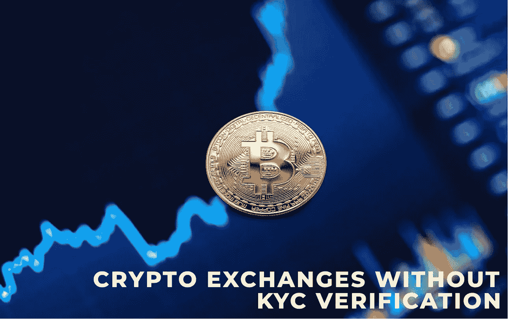