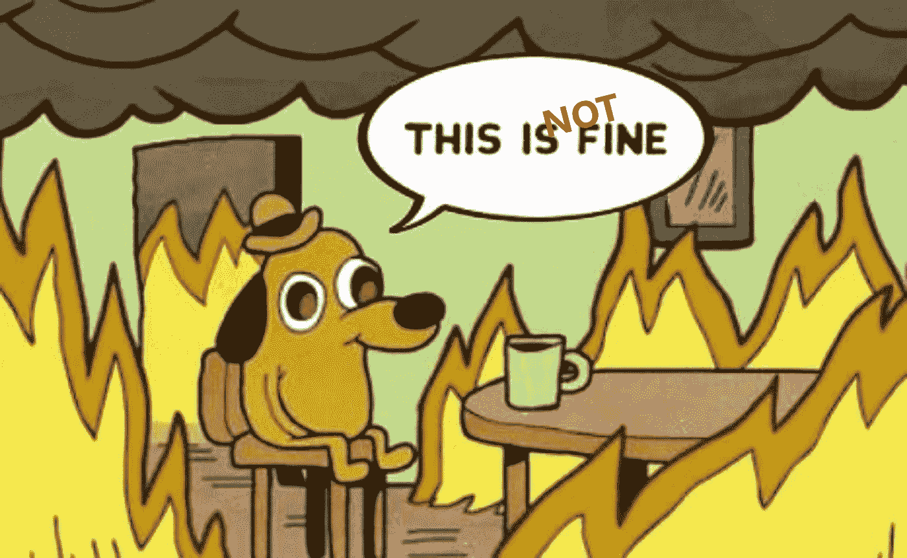
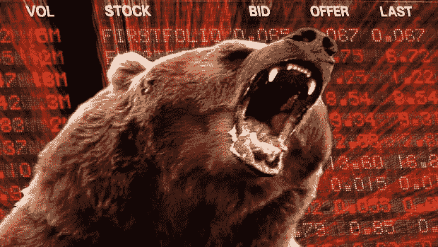
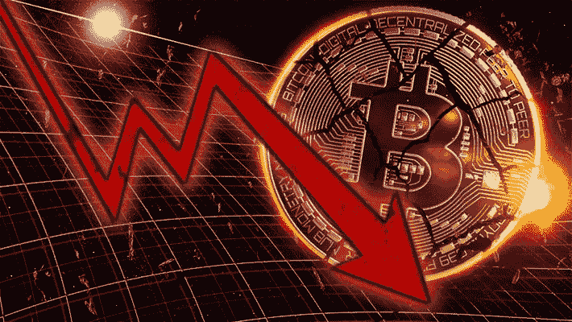
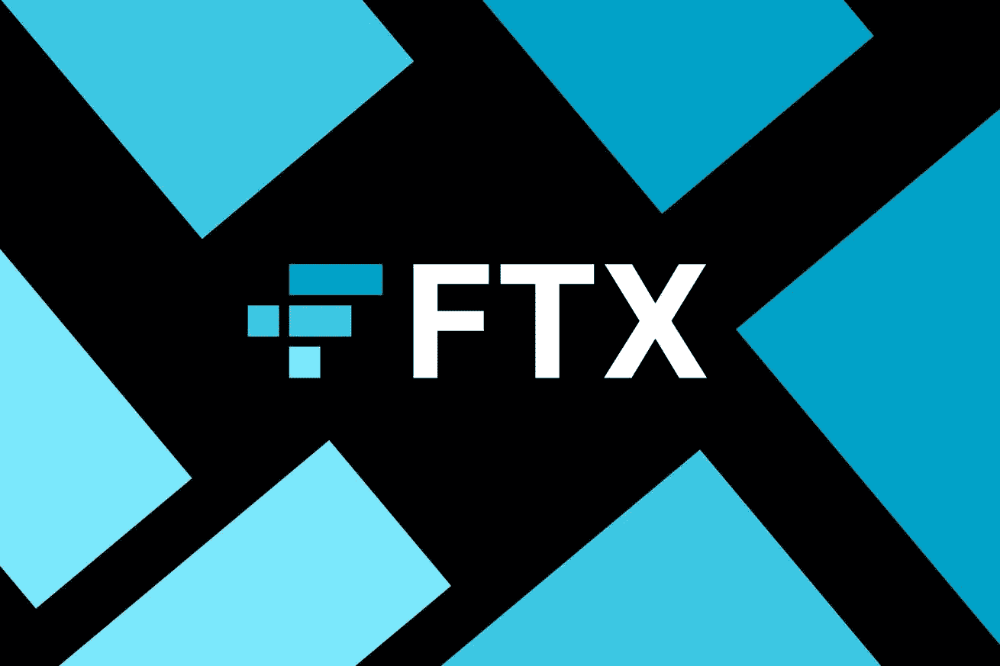
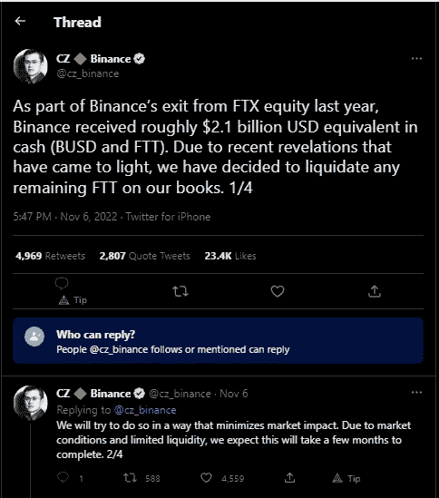

# 不，这不好——谁是山姆·班克曼-弗里德，一个人是如何引起另一次加密崩溃的？

> 原文：<https://medium.com/coinmonks/no-this-is-not-fine-who-is-sam-bankman-fried-and-how-did-one-guy-cause-another-crypto-crash-455dd79acf73?source=collection_archive---------3----------------------->

好日子什么时候会回来？？

我不知道你怎么想，但在过去的几周里，我真的开始觉得熊市终于开始放弃，慢慢消退了。

BTC 终于突破了 20000 点，这是第一次，感觉像是永远。然后奇迹般地成功交易了 21k。就在 7 天前。现在，街上的血又开始了，两个月来以 19k 的价格清仓的努力一夜之间化为乌有。谢谢山姆·班克曼·弗里德(SBF)和阿拉米达，当你再次单枪匹马消灭数十亿普通人的钱时，你向全世界展示的无限贪婪。

**什么时候结束？**

这个熊市已经如此漫长，如此难以忍受，我们真的需要另一个 Luna 时刻来让更多的人把 crypto 称为骗局，让监管机构比以往任何时候都更急于跳到这一切之上，剥夺我们更多的自由吗？

FFS:那几只贪婪的小猪舒舒服服地坐在那 1%的人当中，产出的能量超过了他们掌握的任何线索，他们的行为让我恶心到了骨子里。

我真的希望这是 SBF 的末日，他多年来为 crypto 所做的一切，到头来他只是一个有太多钱和太多权力和影响力的神童冒险家。

FTX 卷入了如此多有争议的加密事件，尤其是 Luna 的倒闭和讨好美国监管机构以打击加密并执行有利于他和他的加密帝国的法规。

请走吧，谢天谢地。

对于那些不知道 SBF 是谁，也从未听说过阿拉米达研究公司的人来说，这里有一个简短的介绍和解释，关于他们如何对目前密码市场的血战负责。

萨姆·班克曼-弗里德(Sam Bankman-Fried)在 2017 年创立了阿拉米达研究公司(Alameda Research)，当时他开始对日本比特币的较高价格和美国比特币的价格进行套利。他利用他在麻省理工学院的关系筹集了数千万美元，能够在美国购买比特币，在日本以更高的价格出售，带回利润，然后从头再来。它很快成长为一家专有的量化加密交易公司，这基本上意味着他们使用自己的技术和资金来利用交易和套利数字资产来获利。

他非常成功，但需要更好的平台和交易所产品来利用早期 crypto 的许多机会，所以 SBF 决定建立自己的交易所，与币安和比特币基地竞争。那是 2019 年年中。

FTX 大受欢迎，交易量增加到每天 100 亿美元。有了这些成功，没过多久，SBF 就利用 Alameda 进入了风险投资领域，并在 Solana 等一些大型协议的 ICO 售前中获得了大量职位。这一点和其他许多使他们成为亿万富翁。这一切都发生在他 30 岁生日之前。

**那么，到底发生了什么？**

11 月 2 日，一份[报告浮出水面](https://www.coindesk.com/business/2022/11/02/divisions-in-sam-bankman-frieds-crypto-empire-blur-on-his-trading-titan-alamedas-balance-sheet/)，报告显示阿拉米达研究公司资产负债表上的资产几乎全部由 FTX 代币$FTT 构成。总计 36.6 亿美元，另有 21.6 亿美元的 FTT 作为抵押。这笔钱以及另外数十亿非流动性替代硬币，抵消了该公司账面上数十亿来自杠杆交易、衍生品敞口以及天知道他们还炮制了其他什么高科技金融工具的债务。从本质上说，这意味着一家最大的加密交易公司和做市商在技术上已经破产，并直接与第三大中央加密交易所 FTX 相连。市场很快意识到，这可能会导致另一场大规模的传染效应，就像我们在 Terra 崩溃时看到的那样。Gd 知道还有多少其他的交易所，对冲基金，借贷平台等等。暴露于 FTX。

报告发布后不久，币安首席执行官 CZ 在推特上说，币安将出售其持有的全部$FTT 股份(5.8 亿美元)，这导致价格暴跌(FTT 损失了 95%的价值)，几乎是在 FTX 和阿拉米达的棺材上敲下了最后一颗钉子。

此后，市场陷入恐慌，客户纷纷将资金撤出 FTX。10 亿美元在 24 小时内被匆忙转移。这导致 FTX 停止提款，表明他们没有资金支付所有的客户。现在看来，可以肯定的是，FTX 将走上与露娜、Celsius 和三箭资本相同的道路。

我花了一些时间在 twitter 和 YouTube 上挖掘，越来越清楚的是，这个故事比任何人都知道的要深刻得多，比仅仅使用流动性差的狗屎硬币来支撑你的资产负债表或在你的交易台上使用过多的杠杆要险恶得多。SBF 显然涉嫌“滥用客户资金”、欺诈和敲诈。我不知道这些指控有多少是真的，但我们可以肯定的是，币安首席执行官 CZ 只需要几个小时的尽职调查，就可以匆忙退出以低价收购竞争对手 FTX 的交易。那么，他发现了什么，这么快就把他吓跑了。

我敢肯定，阿拉米达及其年轻创始人萨姆·班克曼-弗里德贪婪程度的全部细节将在未来几天和几周内揭晓。显然，在过去几天的这场风暴之前，SBF 已经申请破产，他在福布斯 400 世界最富有的人名单中估计拥有 220 亿美元的净资产。有些人甚至呼吁对这位在世界历史上最短时间内积累了数十亿美元财富的天才交易者进行监禁。我能说来得容易去得也快吗，还是说得太多了？

无论 SBF 和 FTX 的结果如何，对加密的损害都不会被夸大。尽管比特币现在的交易价格处于两年半以来的低点，数千亿美元已经化为乌有，但 Crypto 作为改变世界的技术的声誉正处于历史最低点。

请 2023 年能带来一些好消息和复苏的市场，我不知道我还能坚持多久。

感谢阅读。

克莱顿（m.）

PS 你知道吗，你可以点击并按住拍手按钮 50 次，而不是只有一次；-)

PSS 如果你喜欢这篇文章，请点击关注按钮，如果你想支持我，请给我买杯咖啡。-)