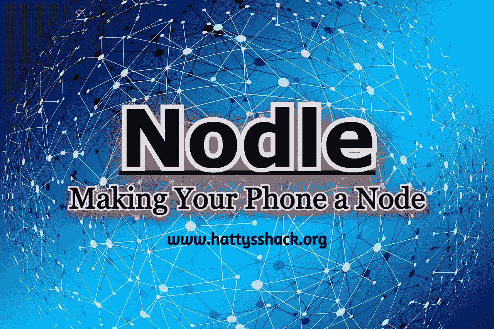
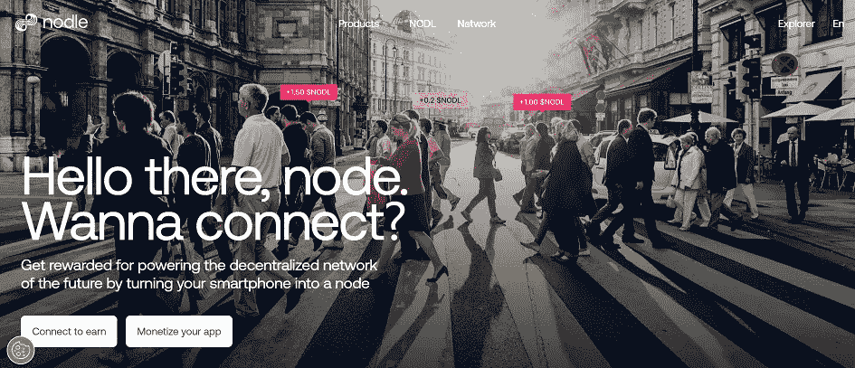
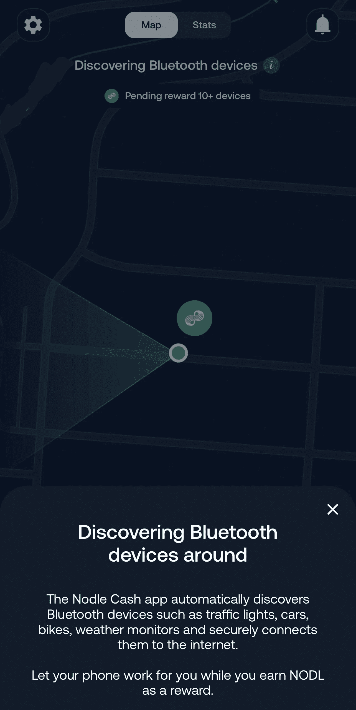

# 节点网络——让你的手机成为一个节点

> 原文：<https://medium.com/coinmonks/nodle-network-making-your-phone-a-node-90530cd65e4c?source=collection_archive---------8----------------------->

**什么是 Nodle 网络？**

[Nodle](https://www.nodle.com/products/cash_app#qrCodeSection) 网络是一个分散的节点网络，运行在区块链技术上。每个节点负责维护分类账的完整性并验证交易。节点通过 NODL 代币获得报酬。2017 年，Micha Benoliel 和 Garrett Kinsman 创立了 Nodle Network。Nodle 是一个无线网络，致力于连接和帮助创建物联网。

【Nodle 是如何工作的？

你所要做的就是在你的手机设置中打开蓝牙和定位，然后开始赢取[现金](https://www.nodle.com/products/cash_app#qrCodeSection)。就这么简单。

当你的手机使用蓝牙低能耗连接并收集物联网设备和传感器的数据时，你就赚不到钱了。这些信息随后被发送回物联网设备的所有者。您的个人数据不会与所有者共享。

为了更好地理解，我们周围有越来越多的带传感器的物联网设备，这些设备需要将数据传输回它们的所有者，但它们只有蓝牙无线电(例如，没有 WiFi 或 LTE)。 [Nodle Cash 应用](https://www.nodle.com/products/cash_app#qrCodeSection)在您走过时使用手机中的蓝牙无线电连接到这些物联网设备，并安全地将物联网数据从蓝牙传输到 LTE，传输到任何拥有物联网设备的公司(例如电动滑板车、带跟踪设备的宠物、带传感器的货物)。该应用程序会跟踪您的手机为物联网设备传输了多少数据，并相应地向您的帐户奖励 Nodle 现金。每项奖励的金额取决于许多变量，如连接质量、传输的数据量、相关物联网设备的“价值”等。

Nodle 将在未来增加更多的功能。激动人心的时刻就在前方！— [来源](https://www.nodle.com/faq)

**为什么要用 Nodle？**

如果你想获得奖励并成为独一无二的项目的一部分，你应该使用 [Nodle](https://www.nodle.com/products/cash_app#qrCodeSection) 。你可以通过在手机上运行一个节点并帮助收集信息来获得奖励。有一些项目，比如氦，可以让你通过采矿赚钱，但你需要购买一种特殊的设备，这种设备可能会花你一大笔钱。有了 Nodle，你的手机就是你的设备。最好使用你的额外手机，这样你就可以让应用程序一直运行，但你可以使用你的主手机，全天打开它来获得奖励。

很快你就可以选择用你的头做赌注了。我很期待这一点，因为我希望我的密码为我工作，并帮助我做更多。

**我可以从哪里开始？**

如果你想了解一下 [Nodle](https://www.nodle.com/products/cash_app#qrCodeSection) ，那就去他们的[网页](https://www.nodle.com/)，你可以找到更多关于这个区块链项目的信息。你也可以在 [iPhone](https://apps.apple.com/app/nodle-cash/id1480763553) 和 [Android](https://play.google.com/store/apps/details?id=io.nodle.cash&referrer=adjust_reftag%3Dc72ISAQw92exj%26utm_source%3Dnodle-website) 设备上下载该应用。

**Nodle 免费吗？**

是的， [Nodle](https://www.nodle.com/products/cash_app#qrCodeSection) 完全免费！运行一个节点不需要任何费用。你实际上是在手机上运行一个节点来赚钱，而不必购买任何额外的部件或订阅。你的信息是安全的，Nodle 几乎不用你的手机电池。Nodle 应用一整天只使用手机电池的 1%到 3%。

我可以提取和兑换我的现金吗？

可以，可以退，可以换。 [NODL](https://www.nodle.com/products/cash_app#qrCodeSection) 可以在北海巨妖、Huobi、Mercado 比特币和 Ripio 上兑换。希望随着时间的推移，你可以使用更多的交流。在写这篇文章的时候，NODL 值 0.003799 美元。

我想对这个应用程序说实话。如果你没有额外的电话可以使用，你可以离开，那么你不会赚那么多钱。有一段时间，我每天只需在一天结束时打开应用程序一次，就能赚到大约 0.5527447999 美元。一天一分钱也没有，这是不可接受的。我让这个应用在我的手机上运行了一整天，赚了不少钱。它不会让你变得富有，但它可以每月变成一笔可观的金额，然后你可以将你的收入兑换成你最喜欢的加密项目之一，或者你可以将它存起来，希望 NODL 变得更有价值。

我计划持有我的 NODL，因为我相信随着时间的推移，会有更多的方式来使用你的 NODL，我认为这个项目有一个惊人的想法，在未来可能会更有价值。就像我上面说的，在不久的将来，他们将允许赌博，我想这就是我将会做的。

查看我的网站，了解更多赚取、学习和投资密码的方法。

[哈蒂小屋](https://www.hattysshack.org/)

[上的原创文章 read.cash](https://read.cash/@HattyHats/nodle-network-making-your-phone-a-node-07ba577b)

> 交易新手？试试[密码交易机器人](/coinmonks/crypto-trading-bot-c2ffce8acb2a)或[复制交易](/coinmonks/top-10-crypto-copy-trading-platforms-for-beginners-d0c37c7d698c)