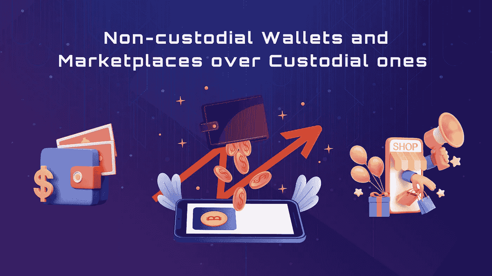
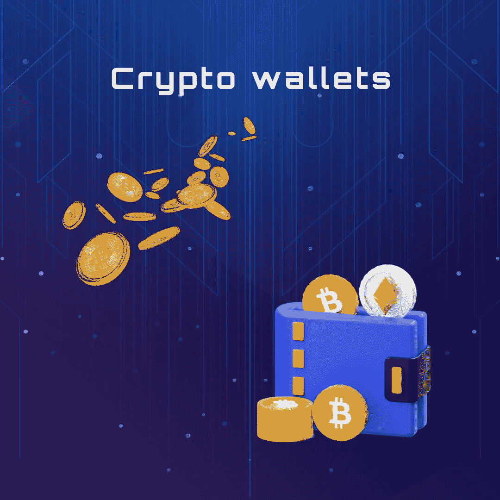
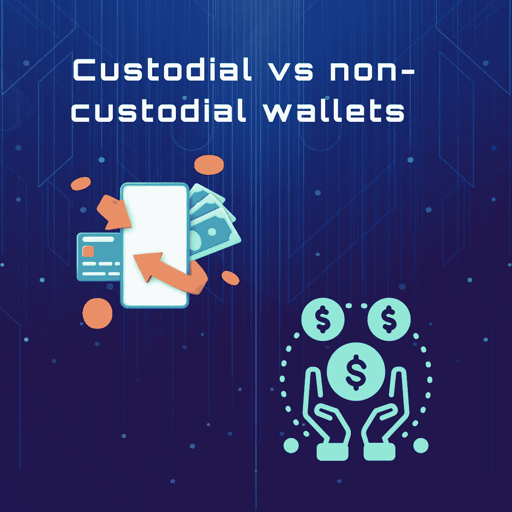
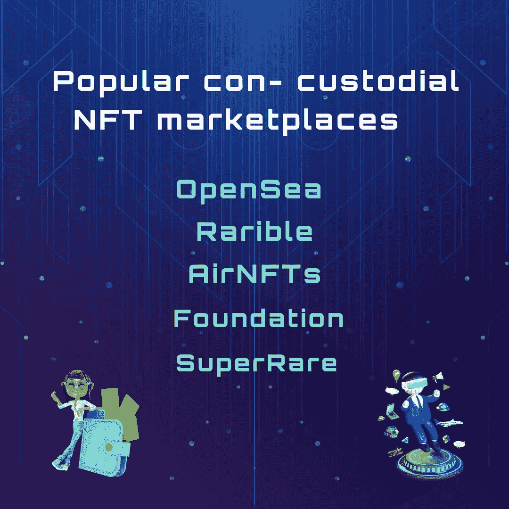

# 非保管钱包和市场超过保管钱包

> 原文：<https://medium.com/coinmonks/non-custodial-wallets-and-marketplaces-over-custodial-ones-29e783ff744?source=collection_archive---------32----------------------->

随着 [DeFi](/coinmonks/the-beginners-guide-to-decentralised-finance-or-defi-d7cb01935fa3?source=user_profile---------15----------------------------) 行业的扩张，FTs 正迅速获得牵引力。在交易或拥有 NFTs 或其他加密资产时，您可以选择使用保管服务或非保管服务。

你的钱包的私人钥匙和你的资产一起由保管服务机构保管和维护。因此，托管 NFT 市场完全控制着你的非功能性交易，有权访问你的账户，并且必须允许你转移你的非功能性交易。币安 NFT 市场是一个托管 NFT 平台，在那里你可以用注册账户登录。

另一方面，一个非托管的 NFT 市场为 NFT 开发商和收藏家提供了对他们钱包以及非托管资产的完全所有权和控制权。你可以直接从你的钱包里交易 NFT。一个非托管平台使用[智能合约](https://www.binance.com/en/blog/nft/all-you-need-to-know-about-nft-smart-contracts-568745413587703085#:~:text=NFTs%20are%20created%20via%20a,qualities%20of%20your%20crypto%20assets.)来促进任何 NFT 交易，这消除了对任何第三方的需要。目前，一些最著名的非托管 NFT 市场包括 OpenSea、AirNFTs 和 Rarible。

# **非托管市场的好处**

非托管 NFT 市场有两大优势:

*   **所有权分散的 NFT**—非托管的 NFT 市场的主要好处是 NFT 创建者对其 NFT 的完全控制，以及他选择 NFT 交易成本类型的权力。由于秘密信息存储在用户的加密钱包中，而不是 NFT 市场中，NFT 的创建者可以随时重新定位他的 NFTs，即使 NFT 市场不活跃。
*   **不需要表格或图片** —在非托管的 NFT 市场生成或销售非托管证券不需要任何文书工作。NFT 的创造者或所有者只需要有合法或独特的 NFT 资产进行交易，不需要身份证或护照。

# **加密钱包**

在选择钱包和交易平台时，您主要会遇到保管型和非保管型 NFT。加密钱包是存储加密货币和参与区块链的重要工具。如果你想进行交易和使用[分散应用](https://ethereum.org/en/dapps/) (DApps)，你需要一个钱包。钱包有两个基本组成部分:一个私钥和一个公钥。

用于传输加密货币的地址是使用您钱包的公钥创建的。您的私钥授权交易并允许访问您的资金，因此，应该像主密码一样对待。选择加密钱包时，有几个备选方案。密钥可以存储在[硬件钱包设备](/@orbis86/hardware-wallets-explained-why-they-are-the-safest-ways-to-store-crypto-643352e6ebc?source=user_profile---------14----------------------------)中，打印在纸上，或者使用桌面钱包软件访问。

但加密货币钱包可能不仅仅用于存储数字货币。根据您的钱包，您也可以存储 NFTs。您可能熟悉使用加密钱包发送或接收数字货币，如以太网(ETH)、比特币(BTC)或稳定币。然而，NFTs 在区块链上创建的令牌——也可以使用各种加密货币钱包进行存储和转移。

# **保管型与非保管型钱包**

很像保管 NFT 市场，保管加密钱包不提供对个人私钥的完全控制。您的资金将由第三方保管，如交易所或保管钱包服务提供商。虽然您不能直接访问您的私钥，但是如果您忘记了密码，有一个保管人可以让您轻松地恢复它。

在非保管加密钱包中，私钥仅由钱包的所有者持有和管理。非保管型钱包是那些希望对自己的钱有更多控制权的顾客的最佳选择。然而，保管钥匙的安全取决于钱包的主人。如果失主放错了钥匙或忘记了他们的备份种子短语，钱包及其内容将永久丢失。

# **受欢迎的 NFT 拘留所市场**

以下是一些最好的非托管 NFT 市场，以铸就非托管市场:

*   **OpenSea**—[OpenSea](https://opensea.io/)用户的 NFTs 不在其所有或控制之下。因为 Opensea 既不执行任何 NFT 的购买、销售或转让，也不管理您连接的区块链，所以您的 NFT 在被出售或交换之前一直安全地保存在您的钱包中。
*   **Rarible** —当 NFT 在 [Rarible](https://rarible.com/) 的 NFT 市场上出售时，你在 NFT 上市时同意的智能合约会自动激活，它会从你的钱包中取出 NFT，存入你应得的钱作为交换。
*   **AirNFTs**——币安智能链、Polygon、Fantom 等多链 NFTs 由 [AirNFTs](https://www.airnfts.com/) 支持。它不能改变或转移用户的 NFT，因为它需要他们的种子短语来这样做。相反，用户是他们的 NFT 的唯一管理者，这些 NFT 归他们的钱包所有。
*   **基金会**——你的非婚生子不会被[基金会](https://foundation.app/)托管。该平台的唯一目的是通过在线市场连接 NFT 买家和 NFT 卖家。你必须像 [MetaMask](/@orbis86/the-beginners-guide-to-metamask-and-how-to-use-it-d6a2ae09ae15?source=user_profile---------11----------------------------) 或 Trust Wallet 一样建立 3 个钱包来存储你的 NFT。
*   **super rare**—[super rare](https://superrare.com/)平台上的所有 NFT 交易都是点对点的。只有在市场上交易的个人才能获得资金或 NFT。

# **结论**

了解托管和非托管 NFT 市场之间的主要区别，旨在帮助 NFT 爱好者决定如何最好地保护和管理他们的非托管市场。取决于你在寻找什么，监管和非监管的选择都有其优势。一个非托管的 NFT 平台对于任何重视自主性和安全性并对这类平台相当熟悉的人来说都是一个很好的选择。对于经验不足的用户来说，使用托管的 NFT 市场和钱包可能更有意义。保管服务让你花更多的时间互动，花更少的时间学习如何浏览钱包。

> 交易新手？尝试[加密交易机器人](/coinmonks/crypto-trading-bot-c2ffce8acb2a)或[复制交易](/coinmonks/top-10-crypto-copy-trading-platforms-for-beginners-d0c37c7d698c)