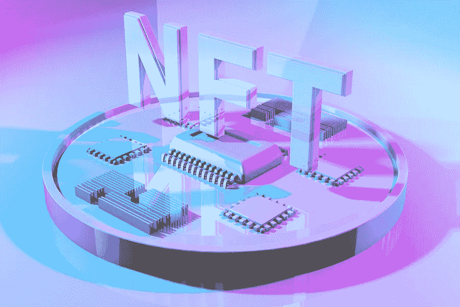

# 不可替代的代币:我们在周围看到的所有这些外星人、猿和化身是什么？

> 原文：<https://medium.com/coinmonks/non-fungible-tokens-what-are-all-these-aliens-apes-and-avatars-we-see-around-8deb971756e?source=collection_archive---------35----------------------->

不可替代的代币或简称 NFT 是特殊和独特的数字资产，不能被复制或模仿。此外，它们也不能与其他同类或不同类的资产互换。

像比特币、以太坊、Dogecoin 等加密货币。不是唯一的，因为它们可以复制和互换，因此，它们是可替换的。同样，传统或法定货币，如日元、美元等。也可以复制，使它们可以互换。

简而言之，NFT 是一组标记，是人类、外星人、猿、猫以及更多彼此完全不同的实体的数字表示。多达两个或两个以上的 NFT 可能来自同一来源，它们通过一些性状和独特的特征来区分。

在本文中，我们将了解不可替代的令牌，它们是什么，以及它们如何对 web 3/区块链生态系统做出贡献。

## **不可替换令牌:概述**

使用类似于加密货币的编程语言，不可替代令牌(NFT)是基于区块链技术的加密资产。加密货币与 NFT 的区别就在于它的唯一性和不可替代性。

NFT 不能像加密货币或法定货币一样等价交易或交换。每个 NFT 都有一个独特识别码，将它与另一个 NFT 区分开。因为它们不能被交换，所以它们不被用作商业交易的标准资产。

用一个随机元素来表现这些独特的金融工具，使其不那么敏感，这种行为被称为**记号化。**令牌只是使用您的后台机器将请求映射回原始资产。

虚拟化现实世界的有形资产，如动物、人类和其他物体的过程使得在指定的平台上购买、出售、持有/拥有和交易它们成为可能。NFTs 背后的技术是 ERC-721 标准，类似于 ERC-20 智能合同。

ERC-721 处理安全性、元数据、所有权细节和游戏代币的分发。为了扩展这一概念的灵活性，ERC-1155 标准开始发挥作用，以减少 NFT 和批处理多种类型的 NFT 所需的交易和存储成本。

目前，NFTs 被用于不同的情况，如建筑物或艺术品等物理结构的数字表示。

## **它们如何工作，有什么用途**

不可替换令牌(NFT)是在区块链上铸造和发布的。铸造是开发和部署新区块以及验证 NFT 信息的过程。智能合同在分配 NFT 所有权时发挥了作用。

一旦创建并验证了一个新块，它就会在区块链上启动，并带有一个唯一的标识符，该标识符与一个区块链地址相关联。尽管该地址对公众开放，但它只属于一个所有者。

换句话说，没有两个人可以拥有一个 NFT。如果一个资产有多个版本，那么它们之间没有相似之处。它们由唯一的标识组成，用于区分彼此。

## **NFT 的常见例子**

有无数的不可替代令牌(NFT)项目，但这里是目前可用的前 10 名 NFT 收藏。

1.无限轴

2.密码朋克

3.无聊猿游艇俱乐部

4.艺术街区

5.NBA 最佳投篮

6.变异猿游艇俱乐部

7.CloneX

8.米比特

9.志那都红豆

10.沙盒

## **可用的 NFTs 市场**

NFT 市场只是一个数字平台，你可以在这里购买、出售和交易非功能性金融产品。他们允许人们购买和存储这些代币在他们的钱包里，并在出售的时候展示出来。

Web3 的不可替代令牌(NFT)部分不久前开始流行，最常见的市场是 OpenSea 和 Rarible。但是，还有其他一些因素，包括:

1.OpenSea

2.稀有的

3.NBA 最佳投篮

4.币安

5.漂亮的网关

**6。**超级罕见

## **最终想法**

像加密货币一样，不可替代代币(NFT)也在区块链上制造和推出。但是，两者的区别在于后者的独特性。NFT 既不能复制，也不能等价交换。

NFTs 由 ERC-721 和 ERC-1155 标准提供支持，这两个标准负责安全、交易和持有。他们还负责将所有权分配给特定的人。

请分享你对不可替代代币未来的想法。你认为这些对他们来说是未来的希望吗？

点击[此处](/@abdulmuminsolihu/)关注我，了解更多关于加密货币、web3、金融科技、区块链和元宇宙的内容。也可以在 [LinkedIn](https://www.linkedin.com/in/abdulmuminsolihu) 上和我联系。

> *交易新手？试试* [*密码交易机器人*](/coinmonks/crypto-trading-bot-c2ffce8acb2a) *或* [*复制交易*](/coinmonks/top-10-crypto-copy-trading-platforms-for-beginners-d0c37c7d698c)
> 
> *分散加密持股，了解* [*币安替代品*](https://coincodecap.com/binance-alternatives)
> 
> *加入 Coinmonks* [*电报频道*](https://t.me/coincodecap) *和* [*Youtube 频道*](https://www.youtube.com/c/coinmonks/videos) *获取每日* [*加密新闻*](http://coincodecap.com/)

# 另外，阅读

*   [复制交易](/coinmonks/top-10-crypto-copy-trading-platforms-for-beginners-d0c37c7d698c) | [加密税务软件](/coinmonks/crypto-tax-software-ed4b4810e338)
*   [网格交易](https://coincodecap.com/grid-trading) | [加密硬件钱包](/coinmonks/the-best-cryptocurrency-hardware-wallets-of-2020-e28b1c124069)
*   [密码电报信号](/coinmonks/top-3-telegram-channels-for-crypto-traders-in-2021-8385f4411ff4) | [密码交易机器人](/coinmonks/crypto-trading-bot-c2ffce8acb2a)
*   [最佳加密交易所](/coinmonks/crypto-exchange-dd2f9d6f3769) | [印度最佳加密交易所](/coinmonks/bitcoin-exchange-in-india-7f1fe79715c9)
*   [面向开发人员的最佳加密 API](/coinmonks/best-crypto-apis-for-developers-5efe3a597a9f)
*   最佳[密码借贷平台](/coinmonks/top-5-crypto-lending-platforms-in-2020-that-you-need-to-know-a1b675cec3fa)
*   [免费加密信号](/coinmonks/free-crypto-signals-48b25e61a8da) | [加密交易机器人](/coinmonks/crypto-trading-bot-c2ffce8acb2a)
*   [杠杆代币终极指南](/coinmonks/leveraged-token-3f5257808b22)