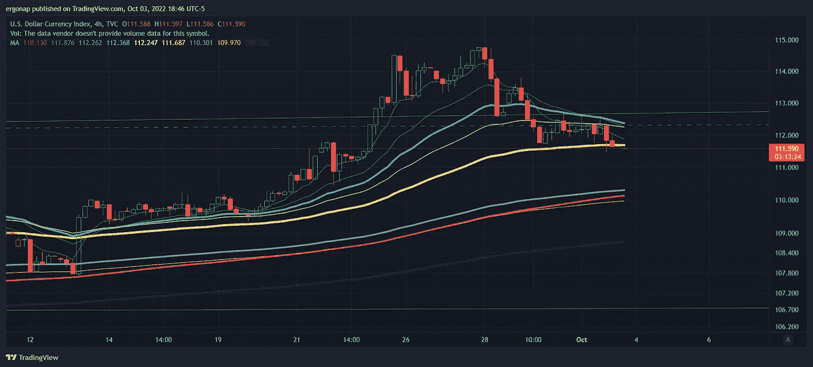
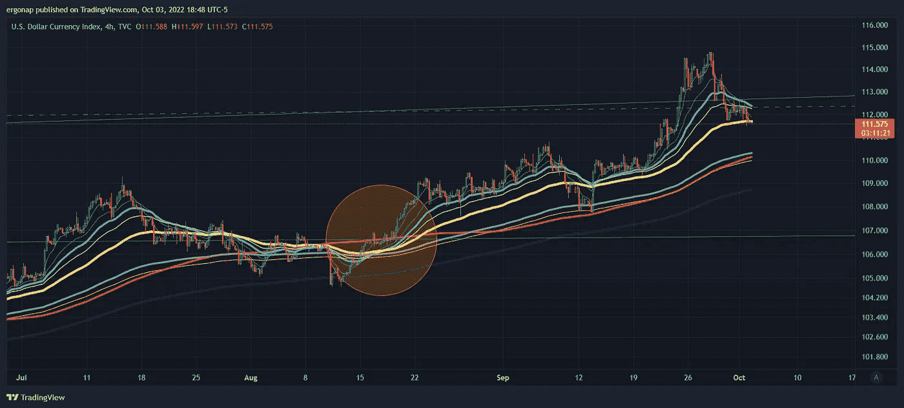

# 没什么变化

> 原文：<https://medium.com/coinmonks/not-much-has-changed-b7514ab65d78?source=collection_archive---------19----------------------->

## 全球市场分析 9/3

所以，由于假期和工作上的原因，我请了一段时间的假。这都是美好的时光，我希望在这些充满压力的时刻，你们都给自己一个喘息的机会。为庆祝的✡，祝你有一个美好的明天。

我的意思是，我们基本上如下，我可以稍后进入:俄罗斯在战争中被粉碎，很严重。他们输了，但战争还没有结束。不太可能有其他结果。

我们也有来自马斯克的原始无知的白痴，他谈论核战争，并对乌克兰提出无益的建议。马斯克，请永远离开 twitter 我们知道你只是想获得影响力。我没有把它联系起来，因为他对世界有害，我以前也提到过。我将写另一篇曝光，作为我在[https://medium.com/coinmonks/chucklemusk-e2427063b6bf](/coinmonks/chucklemusk-e2427063b6bf)的原著的后续。

与此同时，实际上聪明的人插话进来，提供了和平解决战争的现实方法:

连锁效应是巨大的:普京将会下台，俄罗斯将会在全球储备中永久瘫痪，还有……还记得俄罗斯关于美国炸毁北溪的宣传吗？关于这个:

whoops. Guess all that bs was going to come out quite quickly.

其他人会取代他们的位置(可能是中国，或者分裂 w/印度)。战争总结是:

大重述领土，包括俄罗斯试图吞并的地方。

接下来是…其他新闻。英镑在新闻中暴跌，然后在利兹·特拉斯眨眼时反弹。修卡。

 [## 利兹·特拉斯支持英国的减税计划，但希望她在上市后“奠定了更好的基础”

### 利兹·特拉斯说，取消英国最高所得税的有争议的决定是由英国财政大臣做出的。

fortune.com](https://fortune.com/2022/10/02/liz-truss-backs-uk-tax-cuts-plan-admits-mistakes-after-market-chaos/) 

这就是当你把特朗普式的政客(即:无视建议，也毫无头绪)放在政治位置上时会发生的事情:他们使用 Mierdas 的触摸，这次是英国版。

然而，事实证明，她的回溯是一个完美的催化剂，让市场在 10 月初的低迷中喘息一下。

[https://www.tradingview.com/x/0fZj8YlN/](https://www.tradingview.com/x/0fZj8YlN/)

显然是巧合。我的意思是没有人使用技术，更不用说趋势线了！？对！？因此，随着$DXY 向下移动一点，$SPY 和$BTC 向上移动。多少钱？哦，我想这也是我策划的。哎呦。将你的警报设置为 106-107，DXY 可能是底部，记住我们不会总是反转 DXY，这是一个循环。

[https://www.tradingview.com/x/69Sv3vCl/](https://www.tradingview.com/x/69Sv3vCl/)

我们接下来要看的是市场数据，因为上次申请失业救济人数显示就业状况有所改善，消费者信心下降(支出略有下降)。这意味着缓慢的经济衰退。周四将公布持续的失业救济申请。看下面，这个经济日历提供了很好的数据。

 [## 美国经济日历-市场观察

### 来自 MarketWatch 的美国经济日历共识预测。

www.marketwatch.com](https://www.marketwatch.com/economy-politics/calendar) 

当你看到死猫反弹时，不难理解它，但这也不意味着你知道它会反弹多远。所以我们可以花一两周的时间往上走，在此期间，我会为支点准备好我的推杆。

> 交易新手？试试[加密交易机器人](/coinmonks/crypto-trading-bot-c2ffce8acb2a)或者[复制交易](/coinmonks/top-10-crypto-copy-trading-platforms-for-beginners-d0c37c7d698c)