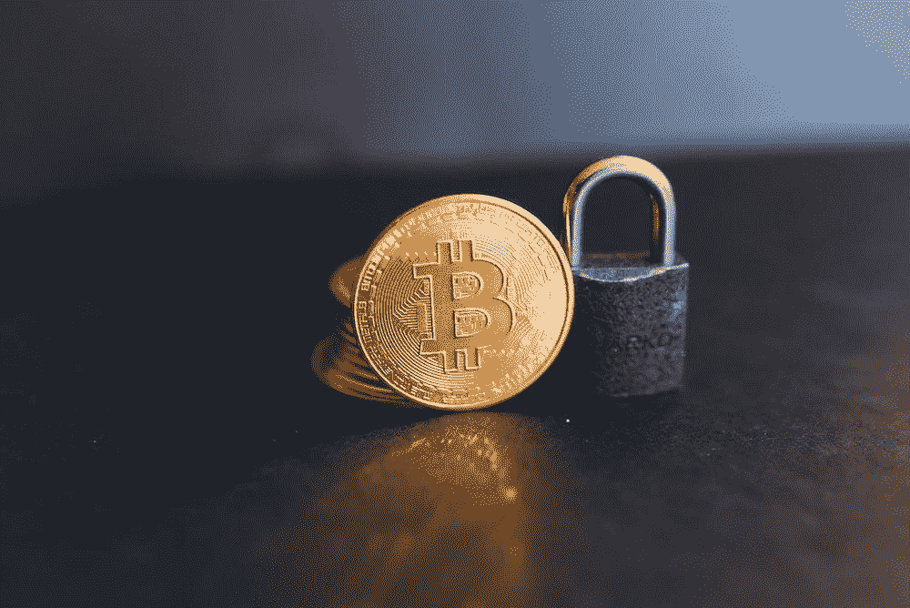

# 不是你的钥匙，不是你的硬币比以往任何时候都更重要

> 原文：<https://medium.com/coinmonks/not-your-keys-not-your-coins-is-more-relevant-than-ever-740bd387b5fe?source=collection_archive---------22----------------------->

加密货币通常因其安全性和匿名性而受到称赞。但是这到底是什么意思呢？它是如何工作的？在本文中，我们将探索加密货币的基础知识，并探索它如何帮助您保护您的资金安全。

近年来，比特币和以太坊等加密货币越来越受欢迎。虽然有许多潜在的好处…