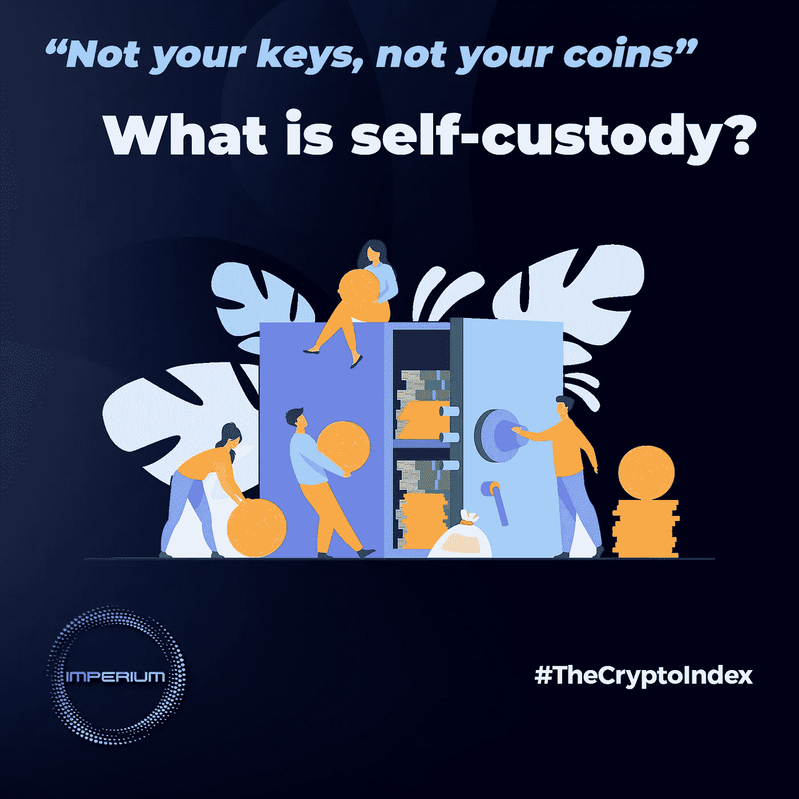

# “不是你的钥匙，不是你的硬币”——什么是自我保管？

> 原文：<https://medium.com/coinmonks/not-your-keys-not-your-coins-what-is-self-custody-e88811be148e?source=collection_archive---------24----------------------->

最近 FTX 集中交易所的崩溃使得“自我监管”成为加密 Twitter 上的热门词汇，再次引起人们对真正拥有自己的加密技术的重要性的关注。

要理解自保管，我们必须首先清楚地了解区块链技术的本质。

区块链一般都是 DLT，即分布式账本技术，这意味着它们不受第三方管理或控制，因为它依赖于“分布式”、分散的计算机网络来运行。

这给了区块链自治和主权，允许他们以未经许可/不信任的方式运作。因此，这种技术的受益者必须是自己的保管人，这意味着他必须独自管理和保护自己的账户，保护其私钥(访问加密钱包的字母和数字串)及其恢复短语。

这就是自我监管的基本含义:自由与责任交织在一起。你是你资金的实际所有者，因为你决定如何使用你的资金以及何时使用，但同时，你有责任保证资金的安全。

在区块链技术的基础上，开发了许多去中心化的应用程序(dApps)和产品，提供金融服务(和其他服务)，要求同等程度的自主性，因此对处理加密货币钱包的知识很少。

当然，这对于没有经验的用户来说可能具有挑战性，因为密码学、资产管理和网络安全不是你在学校里学到的科目。

自然地，为了满足这些用户的需求，出现了许多托管平台，如集中交易所，提供简化的服务，类似于 Web2 中的服务，不需要创建/导入加密钱包。这些被称为托管或保管钱包。

但是简单的方法并不总是最好的方法。至少目前还没有加密。

记住:“不是你的钥匙，不是你的硬币！”

只要你的密码不在你不拥有密钥的钱包里，这个密码就不是你的。

直到加密空间变得更加规范，对任何用户都更加安全，不管他们的级别如何，我们必须(重新)学习安全存储我们的密码的基本知识。

为了能够成为自己的托管人，你必须能够学习新的东西，以保持你的财务自主权，放弃集中式平台提供的舒适。

一个经验法则是不要在 CEX 上持有大量密码(如果你不经常用它来交易)。

你最好把你的硬币存放在你自己的、自我保管的钱包里。

这是为了减少别人管理你的资金带来的第三方风险，尤其是在一个不受监管的行业(盗窃、欺诈、黑客等)。).

但是要小心。自保管钱包也有风险。

桌面、移动和网络钱包总是连接到互联网，容易受到网络攻击，如网络钓鱼。正因为如此，他们被称为“热钱包”。使用这类钱包时，一定不要存放大量资金。

另一方面，冷钱包是那些私钥不存储在连接到互联网的设备上的钱包。这些是硬件钱包和纸质钱包，它们是长期储存你的加密货币的最佳选择。

当然，物理支撑上的任何东西都有丢失、被盗或由于自然灾害而被毁坏的风险。这就是为什么，如果你想 100%安全，你必须始终保持你的恢复短语的副本存储在多个安全的地方。

在托管方面，Imperium 正在建立合作伙伴关系，并认为其基础设施可以为用户提供两全其美的服务:一方面是 Imperium 平台带来的易用性、盈利性和额外的安全性，另一方面是自托管带来的自主性、自由和灵活性。

在推特上关注我们了解更多:[twitter.com/imperiumindex](https://twitter.com/imperiumindex)

> 交易新手？试试[密码交易机器人](/coinmonks/crypto-trading-bot-c2ffce8acb2a)或者[复制交易](/coinmonks/top-10-crypto-copy-trading-platforms-for-beginners-d0c37c7d698c)