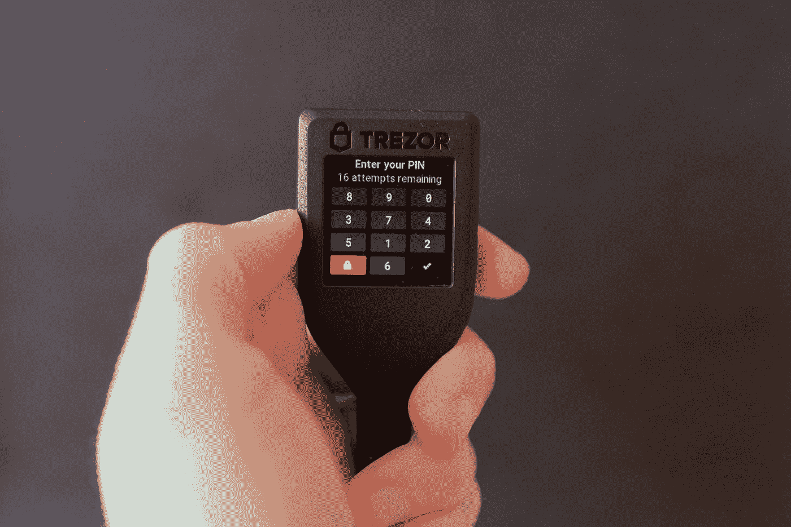

# 不是你的钥匙，不是你的密码

> 原文：<https://medium.com/coinmonks/not-your-keys-not-your-crypto-a2441893d6e?source=collection_archive---------43----------------------->

Photo by [Jason Dent](https://unsplash.com/@jdent?utm_source=medium&utm_medium=referral) on [Unsplash](https://unsplash.com?utm_source=medium&utm_medium=referral)

加密货币是一种数字货币，记住“不是你的钥匙，不是你的密码”这句话很重要这是一个提醒，如果你没有你的加密货币的钥匙，你不拥有它。

> 从顶级交易者那里复制交易机器人。免费试用。

# 什么是钥匙？

[密钥](https://www.coinbase.com/learn/crypto-basics/what-is-a-private-key)就像只有你知道的秘密密码，你需要它们来访问你的加密货币。

# 为什么重要？

因为没有它们你就无法访问你的加密货币。如果别人有你的钥匙，他们就控制了你的加密货币。如果您的密钥丢失、被盗或被黑客攻击，您可能会失去您的加密货币。

# 冷藏钱包的需求

[冷藏](https://www.fool.com/investing/stock-market/market-sectors/financials/cryptocurrency-stocks/cold-storage/)钱包用于离线安全存储加密货币，远离互联网。它有助于保护您的加密货币免受黑客的窃取。冷藏钱包还让你完全控制你的加密货币，所以你可以随时访问它。

# 不同类型的冷藏钱包

Photo by [regularguy.eth](https://unsplash.com/@moneyphotos?utm_source=medium&utm_medium=referral) on [Unsplash](https://unsplash.com?utm_source=medium&utm_medium=referral)

你可以使用几种类型的冷存储钱包，包括纸张，硬件钱包，甚至物理金库。

纸质钱包是一种冷藏钱包，你可以将加密货币储存在一张纸上。如果你想让加密货币离线，但不想购买硬件钱包，这是一个不错的选择。

[硬件钱包](https://crypto.com/university/what-is-a-hardware-wallet)是一种存储在物理设备上的冷存储钱包。这些设备通常很小，便于携带，所以无论你去哪里，你都可以带着你的加密货币。

# 莱杰和崔佐

Photo by [Max Saeling](https://unsplash.com/@maxsaeling?utm_source=medium&utm_medium=referral) on [Unsplash](https://unsplash.com?utm_source=medium&utm_medium=referral)

一个[账本](https://www.ledger.com/)和 [Trezor](https://trezor.io/) 钱包是流行的硬件钱包，允许你离线存储你的加密货币。Ledgers 和 trezors 有不同的型号，因此您可以选择最适合您需求的型号。

Ledger 和 Trezor 的每个型号都有不同的功能，可以让不同的用户受益。例如，有些型号对初学者来说更容易，而有些型号具有更适合有经验用户的高级安全功能。

Ledger 和 Trezor 钱包的设计也非常安全，具有双重身份验证等功能。如果有人要访问你的钱包，他们仍然需要第二个代码才能访问你的加密货币。

# 最后的想法

提醒“不是你的钥匙，不是你的密码”这句话很重要，因为你需要控制自己的钥匙来控制你的加密货币。

您可能想知道，“如果我需要在 Crypto.com 的比特币基地、北海巨妖等地的集中交易所购买 crypto 怎么办？?"

你可以在集中的交易所购买密码，但是不要把你的密码放在交易所。发到你的硬钱包里保管。我个人有一个 Trezor 钱包，那是我寄 BTC 和 ETH 的地方。

> 加入 Coinmonks [电报频道](https://t.me/coincodecap)和 [Youtube 频道](https://www.youtube.com/c/coinmonks/videos)了解加密交易和投资

# 另外，阅读

*   [Bookmap 点评](https://coincodecap.com/bookmap-review-2021-best-trading-software) | [美国 5 大最佳加密交易所](https://coincodecap.com/crypto-exchange-usa)
*   [加密交易机器人](/coinmonks/crypto-trading-bot-c2ffce8acb2a) | [硬币门评论](https://coincodecap.com/coingate-review)
*   最佳加密[硬件钱包](/coinmonks/hardware-wallets-dfa1211730c6) | [Bitbns 评论](/coinmonks/bitbns-review-38256a07e161)
*   [新加坡十大最佳加密交易所](https://coincodecap.com/crypto-exchange-in-singapore) | [购买 AXS](https://coincodecap.com/buy-axs-token)