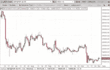
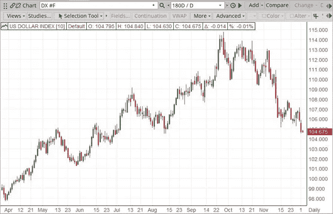
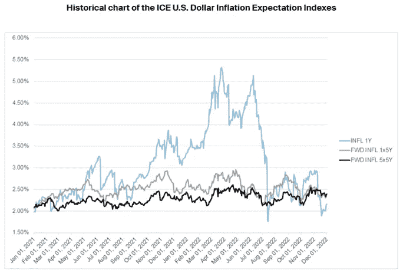
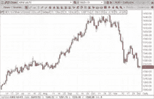
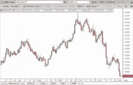
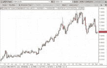
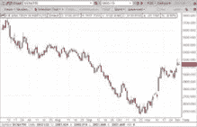
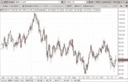
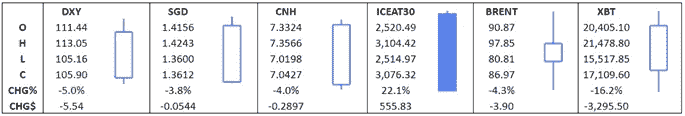

# 2022 年 11 月宏观市场评论

> 原文：<https://medium.com/coinmonks/november-2022-macro-market-commentary-57f0c11e9111?source=collection_archive---------37----------------------->

**比特币-**

比特币因交易量排名第四的加密货币交易所 FTX 的消息而走低。自 2022 年 6 月以来，价格一直保持在 17，500 美元至 26，000 美元之间，11 月 9 日达到 16，862 美元。在此之前，推动价格双向波动的催化剂很少，数字资产市场主要跟随股票的走势。

*   交易量排名第四的加密货币交易所 FTX 在美国申请第 11 章破产保护，在数字资产生态系统中产生了反响。加密货币借贷平台 BlockFi 试图在 FTX 的支持下，通过贷款从今年早些时候的问题中恢复业务，除了申请第 11 章破产保护外，别无选择。
*   富达推出了加密货币交易产品富达加密(Fidelity Crypto)，允许零售客户交易比特币(BTC)和以太坊(ETH)。该产品和服务，包括保管服务，教育和研究，是由该公司的数字资产部门，富达数字资产。过去，富达推出了交易所交易基金(ETF)，为希望通过其富达加密行业和数字支付 ETF (FDIG)投资数字资产行业的投资者提供投资机会。

**日线趋势:下跌**

比特币跌破了自 6 月份以来一直保持的 26，000 美元至 17，500 美元的区间。11 月初，围绕 FTX 中央交易所的担忧成为头条新闻，导致比特币价格大幅下跌。

价格走势在本月剩余时间里一直保持横向。XBT 原油本月收盘下跌至 17，109 美元，跌幅为 16.2%。

即将举行的高影响力活动

*   2024 年春季比特币减半事件

**美元-**

美元指数(USDX)11 月份下跌近 5.00%，收于 105.90，为 2010 年以来最大单月跌幅。

*   美联储在 11 月 2 日举行的会议上加息 75 个基点，使联邦基金利率达到 3.75%-4.00%的目标区间，这是自 2008 年 3 月以来的最高水平。USDX 当日收于 111.23 点，跌幅为 0.12%。
*   公布的非农就业数据显示，10 月份新增就业岗位 284，000 个(从 261，000 个修正)，超过预期的 200，000 个。虽然这是积极的，但与前一个月相比有所下降，因为 9 月份新增就业岗位 315，000 个(从 263，000 个向上修正)。USDX 当日收于 110.77 点，跌幅为 1.86%。
*   核心通货膨胀率(扣除食品和能源的所有项目)出人意料地下降，在过去 12 个月中上升了 6.3%，低于 9 月份的 6.6%。USDX 当日收于 108.09 点，跌幅为 1.92%。

**日线趋势:下跌**

*指数权重:
欧元 57.6% |日元 13.6% |英镑 11.9% |加元 9.1% | SEK 4.2% |瑞士法郎 3.6%*

在 10 月的牛市结束后，随着美元指数于 11 月 1 日在亚洲和欧洲市场开始交易，市场开始疲软。

尽管 11 月 1 日发布的 10 月 ISM 制造业 PMI 数据显示制造业产出继续放缓，但美国市场的看跌势头在早盘有所逆转。该数据为 50.2，略高于预期(50.0)，但低于 9 月份发布的 50.9。

对美元的需求继续(与 4 小时布林线中点的测试相吻合)收回了早些时候的大部分损失。美元指数当天收于 111.36，跌幅为 0.07%。

11 月 2 日，由于市场急切地等待着美联储的声明，早盘交易几乎没有什么动静。今天首先是 ADP 的就业变化。公布的数据显示，私营部门就业岗位增加了 23.9 万个，高于市场预期的 19.5 万个，也高于上个月向下修正的 19.2 万个，这是一个受欢迎的消息。

当天晚些时候，美联储宣布再次加息 75 个基点，这是连续第四次加息 75 个基点，将其基准利率上调至 3.75%至 4.00%，是自 2022 年 3 月以来的第六次加息。强硬的货币政策立场继续作为控制持续高通胀的手段，尽管人们对更广泛的经济以及这将对数百万家庭和企业造成的财务困难表示担忧。

经过一天的市场从 110.26 的低点拉锯以测试日线布林线的中点阻力并下跌后，美元指数最终收于 111.23，跌幅为 0.12%。

11 月 3 日，美元多头强势回归，美元指数跳空上涨。

10 月份 ISM 服务业 PMI 数据公布，录得 54.4，低于预期的 55.5，较上月的 56.7 有所放缓，尽管如此，多头仍获得了动力，因为它突破了日线布林线的中点。美元指数收盘上涨 0.69%，至 112.80。

11 月 4 日公布的非农就业数据显示，10 月份新增就业岗位 284，000 个(从 261，000 个向上修正)，超出市场预期的 200，000 个，尽管修正后的数字较前几个月有所下降，录得 315，000 个(从 263，00 个向上修正)。

公布的数据还显示，10 月份的失业率意外上升至 3.7%(上月为 3.5%)。工资继续上涨，平均每小时收入增长 0.5%，略高于 9 月份公布的增幅。在最初的反应温和积极后，美元指数逆转，空头获得了控制权。美元指数走低，收于 110.77 点，跌幅 1.86%，相对于该指数内交易的一篮子货币明显疲软。

截至 11 月 4 日的交易周，美元指数小幅上涨 0.09%，至 110.77。

周五交易中观察到的看跌势头持续到接下来的交易周，美元指数于 11 月 7 日收盘，下跌 0.91%，至 109.99。

在 11 月 8 日的交易中，看跌情绪持续，因为在对美元的需求下降后，资金流出了避险天堂。美元指数走低，直到市场达到日线布林线的下限，买家介入，美元指数上涨，收复部分早些时候的失地。美元指数当天收盘下跌 0.42%，至 109.54。

对美元的需求推动市场在 11 月 9 日的大部分交易中走高，美元指数收于 110.46，涨幅为 0.76%。

11 月 10 日发布的最新通胀数据显示，通胀速度连续第四个月放缓，截至 10 月底的 12 个月内，所有项目的消费者价格指数(CPI)数据显示，价格上涨 7.7%，低于上月的 8.2%。这是自 2022 年 1 月以来最低的 12 个月增幅。

截至 10 月份的 12 个月期间，核心通胀率(代表除食品和能源以外的所有项目)降至 6.3%，而 9 月份公布的数据为 6.6%，为 40 年来的最高水平。

美元指数在 110.89 创下一天的高点后，当它突破日线 20 均线时，在 110.79-111.17 的 4 小时阻力区内遇到了抛售压力，空头控制了市场的下跌。美元指数当天收于日线布林线下边界下方 108.09，跌幅 1.92%。

由于通货膨胀将在整个 2022 年的利率决策中发挥关键作用，ICE 美元信息预期指数系列是一个帮助规划未来的伟大工具。下图提供了过去一年的历史指数设置:

看跌势头持续到 11 月 11 日，密歇根消费者情绪指数低于预期，为 54.7，低于预期的 59.5 和 9 月份的 59.9。美元指数当天收于 106.16，跌幅为 1.75%

11 月 11 日当周，美元指数收于 106.16，跌幅为 4.36%。

11 月 14 日周一交易平淡，美元指数收盘于 106.53，小幅下跌 0.12%。在 11 月 15 日的交易中，市场难以获得任何明确的方向，在达到 105.16 的低点后，随着买家的回归，市场上涨。美元指数收盘下跌 0.57%，至 105.29，刚好位于日线布林带的下边界内。

11 月 16 日，零售额数据出乎市场意料，数据显示增长 1.3%，高于市场预期的 1.0%，高于前一个月的持平记录。即使有这个积极的消息，美元指数仍难以上涨，当天收于 106.15，跌幅为 0.30%。

在本周的最后两个交易日，美元指数开始缓慢上涨，收盘走高，同期总涨幅为 0.54%。11 月 18 日当周，美元指数小幅上涨 0.16%，收于 106.83。

对美元的需求持续到周一的交易中，多头在 11 月 21 日推动市场走高。市场达到 107.90 的高点，这与 4 小时时间框架内的阻力区 107.95-108.32 重合，然后略有回落。美元指数收盘上涨 107.73，涨幅为 0.77%。

在 11 月 22 日的交易中，阻力区得以保持，空头重新控制了局面，美元指数全天走低，收于 107.12，跌幅为 0.42%。

11 月 23 日，随着资金继续远离安全港，看跌的时刻加快了步伐。10 月份公布的耐用品订单数据显示，订单增加了 1.0%，此前 9 月份的修正数据公布了 0.3%的增幅(从 0.4%向下修正)，高于 0.4%的市场预期。这对于发行后的市场走向几乎没有影响。

非国防资本货物订单。11 月 23 日发布的数据显示，飞机也有显著改善，增长了 0.7%，高于市场预期的 0。%和 9 月份公布的向下修正的-0.8%数据(从-0.7%修正)，在公布时也几乎没有影响。

发布的 FOMC 会议纪要证实了本月早些时候宣布的加息，并显示美联储可能会进一步小幅加息。尽管通胀率在一段时间内不太可能降至接近目标区间的水平，但一些官员表达了对通胀上升将对金融稳定和经济产生影响的担忧。美元指数 11 月 23 日收于 105.97，跌幅为 1.01%。

在前一天的市场运动后，11 月 24 日和 25 日的交易是横向的，虽然每天的开盘价都有小幅上涨，分别上涨 0.08%和 0.07%，但在任何方向上都没有什么整体运动。11 月 25 日当周，美元指数收盘下跌 0.93%，至 105.92。

在 11 月交易的最后一周，美元多头在本周早些时候推动市场走高，11 月 28 日收于 106.63，涨幅为 0.48%，11 月 29 日收于 106.77，涨幅为 0.15%。

11 月 30 日，ADP 公布的就业变化数据显示，私营部门的就业岗位增加了 12.7 万个，大大低于市场预期的 20 万个和上月的 23.9 万个。

11 月 30 日公布的国内生产总值(初步)数据也带来了可喜的消息，美国经济第三季度年化增长率为 2.9%，超过了 2.6%的预期，比前一个月的初步数据 2.6%有所增长。即使在这一消息下，美元多头也未能保持控制，当市场在 4 小时内达到 106.71-107.14 的顶部阻力时，弱势出现，空头回归。美元指数下跌，收于 105.90，跌幅为 0.72%。

由于市场继续从 9 月份的高点下跌，美元指数本月收盘下跌 4.97%，至 105.90。在 11 月，上涨趋势在周时间框架内被打破，新的下跌趋势已经形成。在日线时间框架上，美元指数向下突破，进入确认的下跌趋势。

即将举行的高影响力活动

*   12 月 1 日 ISM 制造业采购经理人指数(11 月)
*   Fri 12 月 2 日非农就业报告(11 月)
*   12 月 5 日星期一 ISM 服务采购经理人指数(11 月)
*   Fri 12 月 9 日电 PREL 密西根消费者信心指数
*   12 月 13 日星期二消费者价格指数(11 月)
*   12 月 14 日星期三美联储利率决议
*   12 月 14 日星期三美联储货币政策声明
*   12 月 14 日星期三 FOMC 经济预测
*   12 月 14 日星期三 FOMC 记者招待会
*   12 月 15 日零售销售(11 月)
*   Thr 22 月 22 日国内生产总值年化(第三季度)
*   Fri 12 月 23 日耐用品订单(11 月)
*   Fri，12 月 23 日，非国防资本货物订单。飞机(11 月)

**韩元-**

11 月韩元兑美元汇率继续上涨，收于 1301.63 韩元，涨幅为 8.69%。

*   S&P 全球制造业 PMI 数据意外上升，10 月份升至 48.2，高于 46.1 的预期和 9 月份公布的 47.3 的数据。
*   11 月 1 日发布的截至 10 月的 12 个月所有项目的消费者价格指数(CPI)显示，通货膨胀率从上月的 5.6%上升到 5.7%，高于市场预期的 5.6%。
*   截至 10 月底的 12 个月工业生产数据收缩至-1.1%，比前几个月的修正数据 0.7 %(从 0.8%向下修正)有所下降，低于市场预期的持平。截至 10 月底的月度数据显示，与预期的下降 1.0%和前一个月的下降 1.9%(从-1.8%向下修正)相比，下降了 3.5%。

**日线趋势:下跌**

11 月交易的第一天，美元兑韩元在日线布林线结合日线 10 SMA 交叉的中点遇到阻力。空头取得了控制权，美元兑韩元下跌，11 月首日收盘下跌至 1416.00，跌幅为 0.67%。

看跌势头持续到接下来的交易日，美元兑韩元收盘走低。多头于 11 月 3 日回归，尽管日线布林线中点的阻力保持不变，但这对组合仍出现跳空，最终收盘小幅下跌至 1423.61 点，跌幅为 0.09%。在本周的最后一个交易日，巨大的下行压力继续存在，空头推动这对货币走低，收盘时下跌 1.43%，低于日线布林线的下限。

11 月交易的第一周，美元兑韩元收于 1403.27，下跌 1.29%。

在接下来的一周，看跌势头持续，美元兑韩元连续五天收盘走低，因为对美元的需求继续减少，有利于韩元多头。这也是自 2021 年 6 月以来，该货币对首次收于周线布林线中点下方。这对组合在 1315.30-1295.39 的日线支撑区域内收盘，该区域嵌套在周线支撑区域内。

交易的第二周，美元兑韩元收于 1313.67，下跌 6.39%。这是韩元的一次重大升值，因为它是该货币对中的报价。

在交易的第三周，当 1313.52-1308.38 的日支撑区域嵌套在更大的周支撑区域内时，多头回归。11 月 14 日周一，多头推动该货币对走高，收于 1323.83 点，涨幅为 0.77%。空头在第二天施加压力，在找到支撑之前，该货币对跌至 1308.45 的低点，对美元的需求增加，推动该货币对脱离低点。最终，该货币对收盘下跌 0.58%，至 1316.20 点。

11 月 16 日和 17 日，对美元的需求继续增长，美元兑人民币汇率连续两天收高，涨幅为 2.01%。本周最后一个交易日，该货币对小幅回调，收于 1339.69 点，跌幅 0.25%。

美元兑韩元本周上涨 1.98%。自 2022 年 10 月中旬以来的首次正收盘。

看涨情绪持续到周一的交易中，美元兑韩元通过日线 10 SMA 上涨，收于 1359.29，涨幅 1.46%。

第二天，空头卷土重来，美元兑韩元连续三个交易日走低，同期跌幅为 2.41%。多头在本周的最后一个交易日 11 月 25 日卷土重来，当天收盘上涨 0.59%。

美元兑韩元本周收于 1334.46，跌幅为 0.39%。

周五的牛市势头在周一继续，市场收盘上涨 0.40%。空头在 11 月 29 日重新控制了局面，全天下跌，收于 1325.33 点，跌幅为 1.07%。看跌情绪持续到 11 月的最后一个交易日。美元兑韩元下跌穿过日支撑区域，收盘时下跌 1.79%，至 1301.63，尽管仍处于周支撑区域 1315.30-1295.29。

美元兑韩元在日线图上处于下降趋势，而在周线上已经达到一个临界点。每周趋势保持上升。美元兑韩元本月收于 1301.63，跌幅为 8.69%，为韩元自 2022 年 5 月以来第二次月度上涨。也是 11 年来对美元的最大单月升幅。

即将举行的高影响力活动

*   没有列出重大事件

**新加坡元-**

新加坡元兑美元汇率本月收于 1.3612 美元，涨幅为 3.84%。新加坡元兑美元汇率自 2016 年 3 月以来的最强劲月度表现。

*   11 月 2 日发布的 PMI 制造业数据显示，10 月份制造业继续下滑，降至 49.7，略低于上月的 49.9。
*   公布的消费者价格指数(CPI)数据显示，通货膨胀率虽然仍然很高，但有所下降，因为截至 10 月份的 12 个月 CPI 所有项目的增长率为 6.7%，低于 7.6%的预期，而上月的增长率为 7.5%，为 14 年来的最高水平。与 9 月份相比，截至 10 月份的 12 个月核心通胀率降至 5.1%，9 月份录得 5.3%的最大涨幅，为 2008 年 11 月以来的最高水平。
*   11 月 25 日公布的工业生产数据显示，截至 10 月份的 12 个月期间，制造业产出下降，制造业下降至-0.8%，尽管略好于市场预期的-0.9%，但大大低于上月。10 月环比数据显示，制造业产出超出预期 0.9%，显著高于预期的-0.3%和上月数据的 0.2%(从 0%修正)。

**日线趋势:下跌**

11 月是一个具有挑战性的开始，多头和空头为获得整体控制权而战。在达到 1.4165 的高点后，美元兑新加坡元小幅回调，收盘小幅下跌 0.07%，至 1.4145。然而，多头获得了动力，并在接下来的两个交易日中推动这对货币走高，上涨了 0.47，尽管这对货币在空头回归的日线布林线中点遇到了阻力。

美元兑新加坡元在 11 月 4 日本周的最后一个交易日下跌，因为美元空头占据了控制权。该货币对收盘下跌 1.25%，至 1.4033 点。新加坡元(报价)大幅上涨。

美元兑新加坡元在 11 月交易的第一周收盘时下跌 0.52%。

看跌情绪持续到接下来的一周交易中，该货币对在头两天以 0.34%的小幅下跌收盘，直到美元兑新加坡元达到日线布林线的下限，在此找到支撑。

买家在 11 月 9 日介入，美元兑新加坡元反弹，当天收于 1.4025，涨幅为 0.28%。

看涨是暂时的，因为空头卷土重来，美元兑新加坡元在随后的两个交易日大幅下跌。该货币对收盘下跌至 1.3708，在 1.3727-1.3666 的日支撑位下跌了 2.26%。

美元兑新加坡元本周收盘下跌 2.31%。

美元对新加坡元的多头在这一支撑区域等待，在 11 月 14 日小幅走高，收盘时小幅上涨 0.03%，至 1.3719，之后再次测试支撑。

在买家介入之前，美元兑新加坡元在这一支撑区域内交易，并略微下跌至下方。这对组合在 11 月 17 日从该区域上涨 0.28%，然后回落并再次找到买家。周五收盘时，这两只股票小幅上涨 0.03%。

美元兑新加坡元本周收于 1.3747，涨幅为 0.24%。

11 月 21 日周一，美元兑新加坡元从支撑区域反弹，收盘上涨 0.44%，看涨势头加快。

然而，当空头在 11 月 22 日卷土重来，对美元的需求下降时，这一势头发生了逆转。美元兑新加坡元收盘下跌 1.3777，跌幅为 0.28%。在本周余下的时间里，该货币对继续走低，以再次回到支撑区域，在那里，买家再次坚守阵地。

美元兑新加坡元本周收盘下跌 0.05%，至 1.3748。

多头在 11 月 28 日的交易中回归，再次从支撑区域上涨，但势头减弱。美元兑新加坡元收盘上涨 0.32%，至 1.3791。

熊市在 11 月 29 日卷土重来，这对组合跌回支撑区域，收于 1.3732，跌幅为 0.40%。

在交易的最后一天，空头推动该货币对走低，美元兑新加坡元收于 1.3612，跌幅为 0.87%，并突破了日线支撑区域。

下跌趋势在日线时间框架内持续。周线上涨趋势被打破，新的下跌趋势形成。美元兑新加坡元本月收盘下跌 3.84%，至 1.3612，创下新加坡元兑美元自 2016 年以来的最大月度涨幅。

即将举行的高影响力活动

*   没有列出重大事件

**中国元-**

人民币收复了上个月的失地，兑美元汇率上涨 3.95%，收于 1 美元兑 7.0427 CNY。

*   11 月 9 日发布的消费者价格指数(CPI)数据显示，截至 10 月份的 12 个月内，通货膨胀率降至 2.1%。这一增幅低于 2.4%的预期，也低于截至 9 月份的 12 个月报告的 2.8%。
*   截至 10 月份的 12 个月零售销售数据显示，与预期的 1.0%相比，意外下降了 0.5%，远低于截至 9 月份的 12 个月报告的 2.5%。这一下降主要归因于 COVID 感染人数的上升以及几个大城市严格限制的影响。
*   国家统计局发布的制造业 PMI 数据显示，11 月份制造业产出下降，从 10 月份的 49.2 降至 48.0，低于 49.0 的预期。11 月份非制造业 PMI 数据显示大幅下滑，11 月份数据为 46.7，低于 48.7，低于 51.7 的预期。

**日趋势:横盘/下跌**

在 11 月交易的第一天，美元兑人民币达到 7.3566 的高点，在日线布林带上界附近遇到阻力后下跌。该货币对收盘下跌 0.42%，至 7.3016 点。

第二天，多头重新控制了市场，尽管当天收盘时，这两个货币对都没有突破前几天的高点。11 月 3 日，多头试图保持控制，但失败了，这对组合收盘时亏损 0.14%。11 月 4 日，随着美元空头压低美元对人民币汇率，人民币对美元的兴趣增加，人民币汇率进一步走低。美元兑人民币突破并收于日线布林线中点下方 7.1718，跌幅 2.15%。

美元兑人民币本周收盘下跌 1.33%。

11 月 7 日，美元多头卷土重来，美元兑人民币汇率上涨。尽管美元兑人民币在到达日线布林线中点时遇到阻力，但美元兑人民币收于 7.2245，涨幅为 0.74%。

在接下来的连续两个交易日，美元兑人民币汇率走高，但日线布林线的中点再次吸引了大量卖家涌入，美元兑人民币汇率难以获得上涨动力。

11 月 10 日，空头卷土重来，美元兑人民币汇率走低，收于日线布林带下边界附近的 7.1494，跌幅为 1.67%。

这种看跌势头持续到 11 月 11 日，因为这对货币在本周的最后一个交易日以 0.83%的跌幅收盘，低于日线布林线的下限。

美元兑人民币本周收盘下跌 1.13%，收于 7.0904。

看跌势头在接下来的一周继续，USDCNH 首日交易收于 7.0407，下跌 0.67%，以测试 7.0257-6.9907 的日支撑区域。该区域保持住了，这对货币在 11 月 15 日小幅反弹。看涨势头加快，在接下来的两个交易日中，该货币对收高，同期上涨 1.42%。

在最后一个交易日，随着空头的回归，该货币对略有回落，其价值下跌了 0.27%，收于 7.1274。

美元兑人民币本周收盘上涨 0.55%。

11 月 21 日，多头卷土重来，美元兑人民币汇率上涨。该货币对收盘上涨 0.79%，至 7.1760。第二天，空头又回来了，这对组合下跌 0.58%，收于 7.1345 点。在交易周的剩余时间里，该货币对小幅走高，最终收于日线布林线中点上方。

美元兑人民币本周收盘时总体上涨 0.97%，至 7.1890。

11 月 28 日星期一，对美元的需求持续，多头推动美元兑日元走高，收于 7.2462，涨幅为 0.55%。11 月 29 日，当空头在 4 小时时间框架内重新控制了 7.2409-7.2688 的阻力区时，牛市的上涨趋势发生了逆转。该货币对大幅回落至日线布林线中点下方，收于 7.1376，跌幅为 1.51%。看跌势头持续到本周的最后一个交易日，该货币对进一步下跌 1.40%，收于 7.0427。

USDCNH 在每日时间框架内处于下降趋势。从周线来看，尽管整个 11 月都在走弱，但普遍趋势是上涨。美元兑人民币本月收于 7.0427，下跌 3.85%，结束了 8 个月的上涨。这是人民币兑美元汇率创下的最强劲月度表现。

即将举行的高影响力活动

*   Fri 12 月 9 日消费物价指数(11 月)
*   12 月 15 日零售销售(11 月)
*   12 月 20 日星期二中国人民银行利率决议
*   12 月 31 日星期六国家统计局-制造业和非制造业采购经理人指数(12 月)

**亚洲科技-**

ICE 亚洲科技 30 指数(ATI)在经历了多个月的疲软后，本月首次收高。中国成份股大幅上涨，台湾许多成份股也是如此。

*   中国成份股全部上涨，哔哩哔哩股份有限公司上涨 67.5%，扭转了上月的跌势，快手科技上涨 52.2%。JD.com 股市当月上涨 39.1%。
*   台湾股票组件上涨，领涨台湾半导体制造公司(Taiwan Semiconductor Manufacturing)上涨 25.2%，联发科技(MediaTek Inc .)上涨 22.4%。联合微电子公司上涨了 17.3%，达美电子公司上涨了 15.7%。只有鸿海精密工业收盘下跌 1.0%。
*   日本指数成份股中，涨幅最大的是东京电子公司，上涨了 14.6%，索尼集团公司上涨了 12.7%。两家公司增长了 7%左右——富士胶片控股公司和富士通有限公司。
*   韩国零部件类股涨跌互现，三星 SDI 本月下跌 4.1%。Kakao 上涨 11.2%，Naver Corp 上涨 9.7%。

**日线趋势:下跌**

ATI 走高，因为这个月的进展大致跟随整体股市，并从连续几个月的收盘走低中喘息。

ATI 本月收于 3076 美元，涨幅为 22.1%。

*指数构成:中国 37%，日本 23%，台湾 23%，南韩 17%*

即将举行的高影响力活动

*   Fri 12 月 9 日电中国消费物价指数(11 月)
*   12 月 15 日零售销售(11 月)
*   12 月 31 日星期六中国非制造业采购经理人指数(12 月)

**油-**

ICE 布伦特原油在 11 月份交易走低，接近 9 月底的低点 79.68 美元，创下新高，并反弹至 90.00 美元，本月收于 86.97 美元。尽管俄罗斯前一个月宣布减产 200 万桶，但对中国石油需求的担忧影响了价格下跌。

*   欧佩克+将在 12 月 4 日星期日举行会议。人们期望维持目前的供应目标。然而，鉴于对需求方面的担忧，减产可能仍会被讨论。展望未来，观察人士将评估欧盟价格上限对俄罗斯海运石油的影响，以及鉴于新冠肺炎限制的放松，中国对石油的需求。
*   欧盟对俄罗斯海运原油的禁运将于 12 月 5 日星期一生效，价格上限设定为每桶 60 美元。允许有价格上限的俄罗斯石油销售，将降低石油通过黑市和非 G7 国家渠道流动的风险。它旨在对俄罗斯经济施加压力，以减少他们可用于战争的收入，并使他们更接近结束与乌克兰的敌对状态。

**日趋势:下跌**

ICE 布伦特原油从 10 月下旬创下的较高高点下跌，交易价格接近 98.00 美元。

较弱的预期需求推低了价格，特别是来自中国的需求，中国保持了严格的新冠肺炎限制，影响了他们的经济前景。布伦特原油本月收于 86.97 美元，跌幅为 4.3%。

即将举行的高影响力活动

*   12 月 4 日星期日欧佩克+政策会议，决定是否减少石油供应或保持稳定，因为价格继续下跌。

**关键人物-**

请随时加入我们的˲tradewithufos 社区，我们提供全面的交易课程和交易应用程序。

行情分析与交易应用:
[**【www.tradewithufos.com/apps】**](https://www.tradewithufos.com/apps/)

对所有人免费永久会员:
[**www.tradewithufos.com/membership**](https://www.tradewithufos.com/product/tradewithufos-membership/)

传统研究团队

> 交易新手？尝试[加密交易机器人](/coinmonks/crypto-trading-bot-c2ffce8acb2a)或[复制交易](/coinmonks/top-10-crypto-copy-trading-platforms-for-beginners-d0c37c7d698c)