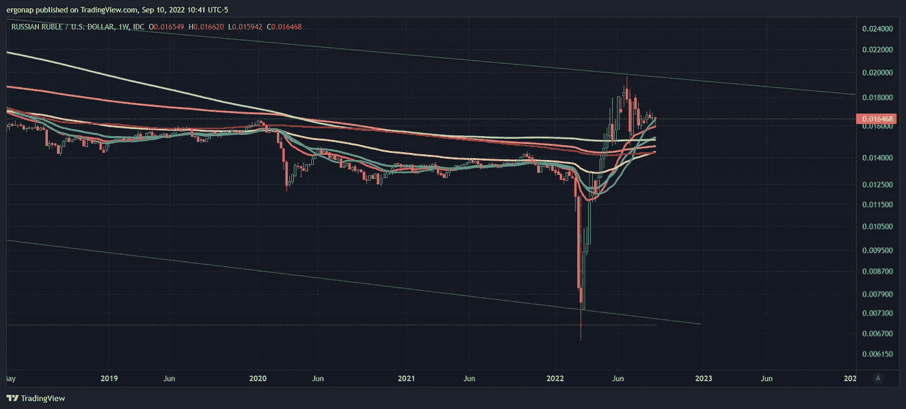

# 现在真正的市场走势来了，催化剂已经准备好了——如何安全地驾驭即将到来的事情！⚠

> 原文：<https://medium.com/coinmonks/now-comes-the-real-market-moves-catalysts-are-set-how-to-safely-navigate-whats-to-come-4c0821f8db1f?source=collection_archive---------23----------------------->

## 2010 年 9 月全球市场季度分析

这一次将是大规模的、宏观的、意义重大的。许多事情正在发生。

我们有很多东西在变化，这是人们害怕的时候。是时候专注了。没时间打开你的钱包，没有。而是要为我们面前所有可能的情况做好准备。重点:CL(石油)SPX(股票)BTC 和卢布(美元)。

首先，战争影响:俄罗斯完蛋了，乌克兰做出了极其重大和成功的军事行动。我一直从专业的角度写这有多么重要，但这不能低估这两个国家的影响。

好见解在下面的链接。请注意，这是俄罗斯的宣传，就像“制裁不起作用”。请记住，俄罗斯被认为是一个主要的石油生产国，而现在它的客户实际上仅限于中国。在这之后谈石油。

 [## 渐渐地，然后突然

### 乌克兰国旗在库皮扬斯克再次升起“你是怎么破产的？”两种方式。渐渐地，然后突然。”―欧内斯特……

samf.substack.com](https://samf.substack.com/p/gradually-then-suddenly) 

俄罗斯和哈萨克斯坦一直在争夺石油，哈萨克斯坦不与俄罗斯结盟。他们是俄罗斯和中国之间的邻国，因此意义重大。[https://eurasianet . org/Russia-blocks-kazakhstans-main-outlet-for-oil-exports](https://eurasianet.org/russia-blocks-kazakhstans-main-outlet-for-oil-exports)

接下来是第二个，如果你注意到，这表明俄罗斯确实试图用石油来积极制裁人民。从长远来看，这没有用。短期内，当然。

 [## 欧洲准备进一步削减俄罗斯石油和天然气出口

### 路透莫斯科 8 月 22 日电---欧洲面临新一轮能源供应中断，原因是一条管道系统受损，导致…

www.reuters.com](https://www.reuters.com/business/energy/kazakh-oil-exports-via-russia-hit-by-damaged-equipment-2022-08-22/) 

这在很大程度上是一个来回，但非金砖四国(即:资本主义)正专注于帮助哈萨克斯坦。简单的玩法；

 [## 雪佛龙首席执行官表示，考虑铁路运输哈萨克斯坦石油

### 雪佛龙公司正与哈萨克斯坦政府合作，以确保来自这个内陆国家油田的石油可以…

www.reuters.com](https://www.reuters.com/business/energy/chevron-considering-rail-transport-kazakhstan-oil-ceo-says-2022-09-07/) 

简言之，石油的情况是这样的:

> 俄罗斯->中国，哈萨克斯坦->欧盟。其他重头戏是 EU - >阿塞拜疆和美国->欧盟出口(都在增加出口)。

> 这对美国有利，对俄罗斯不利，对油价不利。

那么，如果石油将会崩溃，这是好是坏呢？没有明确的答案。对环境不利(廉价石油鼓励使用)，对市场不利(石油市场崩溃)，对欧洲有利，对美国喜忧参半。好吧，石油->下降。

[https://www.tradingview.com/x/IDaXY0Lz/](https://www.tradingview.com/x/IDaXY0Lz/)

不过这是每周一次，每月一次有很多时间去相反的方向——但是不太可能，我们有足够的时间去了解。如果它爆炸了，可能会拯救#俄国和#BTC。这就是全球金融战争。

[https://www.tradingview.com/x/zaAKhwEu/](https://www.tradingview.com/x/zaAKhwEu/)

石油危机将打击卢布，并根据定义弹射 DXY。记住，DXY 是看季度的！

[https://www.tradingview.com/x/ADjxJ7YO/](https://www.tradingview.com/x/ADjxJ7YO/)

除此之外，我们还有:卢布(卢布兑美元) :据说如此强劲，但在季度关键趋势上也表现不佳。

[https://www.tradingview.com/x/11qW5d9l/](https://www.tradingview.com/x/11qW5d9l/) . You know, pivot right when sanctions started. Obviously with 20 days to go, quarter’s not over but definitely at a pivot.

周线卢布表示通道修正时间，更多下跌。所以，油价下跌，俄罗斯下跌。至少目前是这样，这使许多期望落空了。

[https://www.tradingview.com/x/0WDGZWcH/](https://www.tradingview.com/x/0WDGZWcH/)

到$BTC。你能猜到我在这里看到了什么吗？看到左边 3 个月的重复了吗？

[https://www.tradingview.com/x/KTYUBIWA/](https://www.tradingview.com/x/KTYUBIWA/)

然而，股票市场(SPX)却截然不同。

[https://www.tradingview.com/x/I8ym7Z0K/](https://www.tradingview.com/x/I8ym7Z0K/)

即使股市出现 80%的回调，也仍然是牛市。就是这么牛气。如果 BTC 的移动速度是间谍的 1-4 倍，那么 80%会跌到$BTC？我喜欢用的短语是滚开。这将是$BTC 镜像月神下降。99%降-> 99%降等等。可以肯定的是，仅在过去 10 天里，就有 10 亿美元从 crypto 流出，而且之前还有大量资金流出。我可以把 8 月份加起来，但也不会好到哪里去——8 月份有 30 亿人退出。这是机构，它展示了一幅非常清晰的画面:

let’s just say they aren’t bullish

因此，对于 crypto 来说，我们似乎处于最大的看跌预期区域。我很好地驾驭了微观牛市，但宏观上我现在明白为什么美联储说“更多的加息是完全可以的”，他们是对的。

假设我们翻转？如果我错了，我们将定义一个快速的底部，并在市场上快速上涨——在 3 个月内。但在接下来的 6-9 个月里，我对此很有信心。

再次，**即使看淡也不会永远**。但这仍然是我们目前应该考虑的问题。我们应该安全地持有美元，因为 DXY 已经明确表示了这一点。投资吗？小。

观察 2 周和 3 个月(1 个季度)的移动平均线，这就是移动的位置。