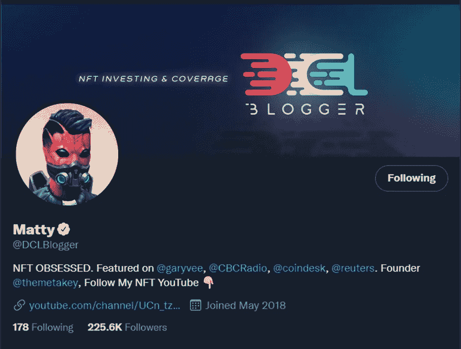
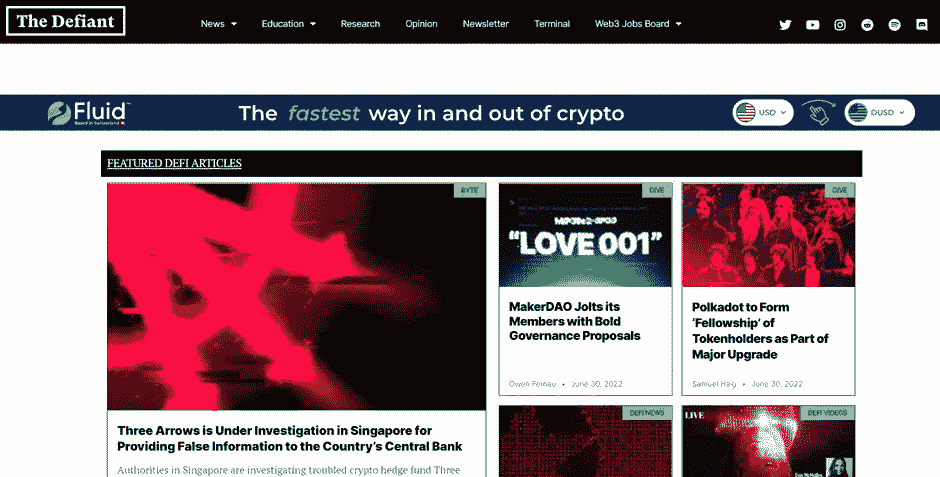

# 现在是学习加密的最佳时机

> 原文：<https://medium.com/coinmonks/now-is-the-best-time-to-learn-about-crypto-a0f2d7270405?source=collection_archive---------27----------------------->

## 2 推荐:叛逆和 DCL 博主

## 在熊中学习密码

在熊市期间发布一个关于开始进入加密之路的博客对于 SEO 来说可能不是最好的。对 crypto 的普遍看法已经变得非常负面。毫不奇怪，当 10 倍回报停止，人们开始经历严重亏损时，对市场的态度将不会像以前那样乐观。很容易将这个数字指向 Terra/Luna 协议的破坏和 3 Arrows Capital 的过度杠杆化混乱，这是螺旋式下降的原因。然而，尽管这两者是不可否认的催化剂，但这只是 crypto 急转直下的众多原因中的两个。自 2022 年 2 月俄罗斯入侵乌克兰以来，全球市场一直动荡不安。更糟糕的是，从本质上来说，加密是一种极其不稳定的资产类别，因此受到全球不确定性的严重影响。

尽管如此，尽管 Crypto 还在它的膝盖上，但正如我们目前所看到的那样，它已经准备好扰乱我们的日常生活。尽管批评家们经常只看到定价过高的 JPEGs 的表面价值，认为它是一种小众时尚，将成为技术历史上的一个亮点，但它背后的技术区块链仍将存在。

> 交易新手？试试[加密交易机器人](/coinmonks/crypto-trading-bot-c2ffce8acb2a)或者[复制交易](/coinmonks/top-10-crypto-copy-trading-platforms-for-beginners-d0c37c7d698c)

虽然加密进入了许多人眼中的冬天，但正是在这种情况下，开发人员在室内创造、试验和创新的想法将推动下一轮牛市。隐秘的冬天可能就在这里，如果是这样的话，这个空间似乎是荒凉的。然而，那些看过去流行的媒体报道的人会发现一些项目在建设和发展一个创新的空间。因此，对于那些足够好奇和愿意积累知识的人来说，加密冬天是一个合适的时机，并在不可避免的被称为“规范”的到来之前执行信息。

点击这篇文章，你是一个对加密感兴趣的人。在过去的两年里(2020-22)，你可能已经体验到了所有或部分隐藏的兴奋及其在流行文化中的普遍性。你可能积极参与了膨胀的炒作或看着别人要么收到 6 位数的回报或遭受可怕的损失。更有可能的是，你将是一个听说过密码的人，在互联网上或从你 13 岁的亲戚那里听说过。不管你是如何听说 crypto 的，你都希望向未来迈出一步，用前沿发展的优势来装备自己。

## 关于 DCLblogger(分散土地博客)

**YouTube:**[**https://www.youtube.com/c/DCLBlogger/featured**](https://www.youtube.com/c/DCLBlogger/featured)

**推特:**[**https://twitter.com/DCLBlogger**](https://twitter.com/DCLBlogger)

**主要特性:**

*   NFT 侧重于游戏和元宇宙
*   经验丰富的主持人，其内容可以追溯到 NFT 炒作之前
*   主持人不仅仅是一个 Youtube 频道，他还是一家名为 Metakey 的 Web3 游戏公司的首席执行官

**批判:**

*   过去一个月没有上传新内容，由于开发了元键，上传可能会非常不规则
*   大部分内容是 NFT 和游戏，不会经常扩展到比这更远的地方

**建议的行动:**那些希望主要了解非功能性测试的人应该首先探讨这个建议。大多数视频都与 NFT 有关，并倾向于游戏，打开了元宇宙的大门。查看标题为 [**【为什么 NFTs 失败】**](https://www.youtube.com/watch?v=g4ThutZaH0Q)**的视频，开始学习。**

## **关于反抗者**

****

****YouTube:**[**https://www.youtube.com/thedefiant**](https://www.youtube.com/thedefiant)**

****网址:**[**https://thedefiant.io/**](https://thedefiant.io/)**

****推特:**[**https://twitter.com/DefiantNews?s=20&t = ut 6 F3 wx 8 dbrpzwjz 3 ynxag**](https://twitter.com/DefiantNews?s=20&t=Ut6F3WX8DbrpZWjz3YnxAg)**

****主要功能:****

*   **关注 dapps，尤其是 Defi 协议**
*   **一致的高质量娱乐视频，提供与加密相关的一切最新新闻和教育内容**
*   **《批判》讲述了加密，强调了机遇和随之而来的困难。**

****批判:****

*   **在渠道上做广告的 Web 3 赞助可能会有风险**
*   **由于加密领域覆盖面如此之广，很难筛选并找到最有价值的信息**

****推荐行动:**观看视频 [**【如何在熊市中生存】**](https://www.youtube.com/watch?v=cTq1znovkWI) ，它将带你经历熊市期间的预期和心态，让你感到舒适，这只是另一个终将结束的周期。**

## **无知的推荐**

**这两个推荐帮助我开始了我的密码之旅。我在 2021 年 2 月的同一天发现了 DCLblogger 和 Defiant。我在浏览我的 YouTube 推荐时偶然发现了这两个。我记得我点击了 DCLBlogger 的一个视频，标题是“七位数数字艺术销售”。这样的标题立刻引起了我的兴趣，我发现自己震惊于它不是一个点击诱饵。我很快观看了 DCLblogger 的其他几个主要涉及 NFT 市场和加密游戏的视频。**

**值得注意的是，因为 DCLBlogger，我在 0.33 美元的时候买了这个加密多边形。Polygon 在 2021 年 12 月达到了 2.88 美元的历史高点，累计涨幅超过 750%。我卖掉了一些，仍然持有我最初投资的大部分，这使我净赚了 150 英镑。DCLBlogger 提供了不带偏见的内容，这是他自 2017 年以来在市场上的经验所强化的。在熊市期间的几次成功和经验，使得他的观点对个人度过秘密的冬天是非常宝贵的。**

**第二个建议是 Defiant，它将信息加密内容与高质量的视频制作相结合。视频的质量完全将该频道与其他任何频道区分开来。他们的许多视频呈现的信息就像来自电影一样，这要归功于主持人罗宾，他有视频制作的背景。高质量的视频让教育和新闻内容看起来很有趣，大多数观众不会觉得无聊。**

**Defiant 远不是一个旨在炒作最新硬币/令牌或 dapp(非集中式应用程序)的频道。该渠道的重点是 Defi(分散融资)，但也包括 NFT。它的执行提供了整个市场的关键内容，同时维护了两党的价值观。挑衅者告诉它是怎么回事，让观察者明白，尽管有很多获得巨大收益的机会，但也有同样多(如果不是更多)遭受重大损失的机会。挑衅者给个人带来意识，提供一致的新闻和知识更新，以自信地根据这些信息采取行动。**

## **发现我的推荐系列**

****关注我**[**Twitter**](https://twitter.com/IgnorantView)**对于无知的推文。****