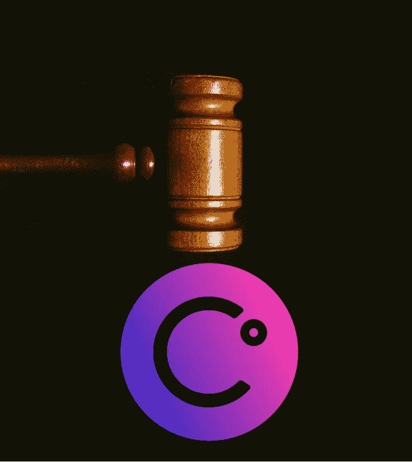
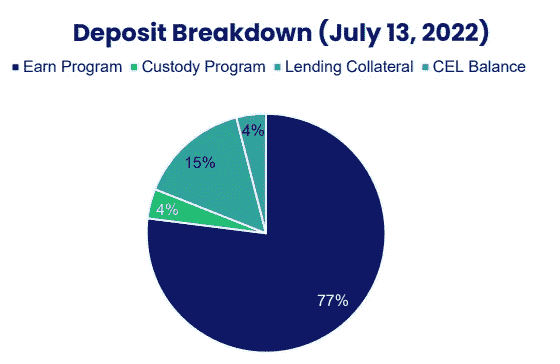
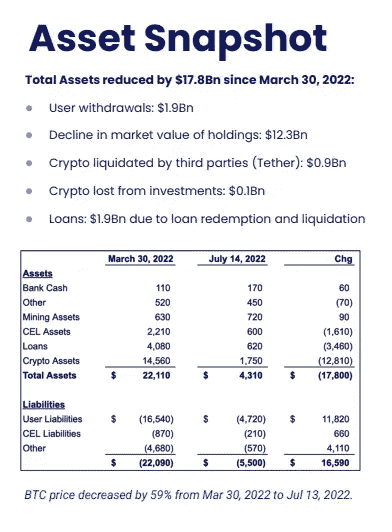
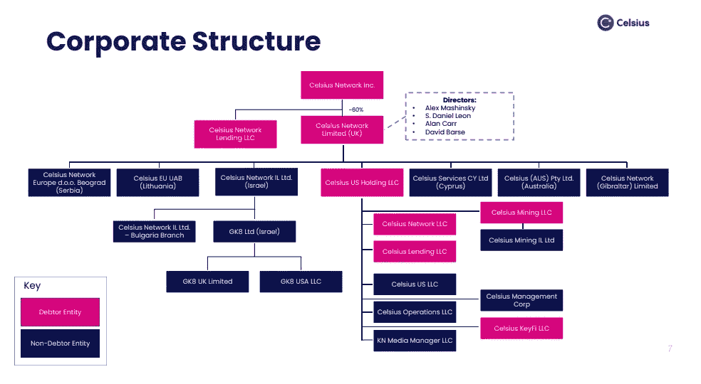

# 对 Celsius 法律计划的观察

> 原文：<https://medium.com/coinmonks/observations-from-celsius-legal-plan-6439620f264c?source=collection_archive---------8----------------------->

嗨，伙计们，如果你最近没有关注新闻， [Celsius 上周四](https://www.businesswire.com/news/home/20220713005911/en/Celsius-Network-Initiates-Financial-Restructuring-to-Stabilize-Business-and-Maximize-Value-for-All-Stakeholders)(2022 年 7 月 13 日)正式申请第 11 章破产，这是在他们[上个月完全停止所有提款](https://www.cnbc.com/2022/06/13/crypto-lender-celsius-pauses-withdrawals-bitcoin-slides.html)后写在墙上的。

如果你像我和其他数百万无法获得资金的用户一样，你可能会好奇(就像我一样)Celsius 的未来计划，因为他们正在考虑可能偿还他们的投资者/客户。昨天(7 月 19 日)，他们在推特上发布了一个链接，提供了如何向他们提出索赔的说明，以及他们提议的法律计划的 powerpoint。通过阅读一些法庭文件和其他新闻媒体的不同分析，我将涵盖的下几个项目是我发现的最重要的观察结果，以及为什么它们可能对你或你可能认识的希望摆脱 Celsius 倒塌的纸牌屋的人很重要。

# 为什么第 11 章(相对于第 7 章)很重要

第 11 章破产申请为公司提供了一个可能通过重组恢复的机会，与第 7 章大甩卖有很大不同，在第 7 章大甩卖中，一切都被清算，这是传统经纪公司必须经历的破产道路。换句话说，两者之间的关键区别在于，在第 11 章中，优先事项是重组公司以使其继续运营，而在第 7 章中，优先事项是出售东西以将钱返还给投资者。

在这种情况下，有趣的是，如果 Celsius 被视为一家正规的经纪公司，他们很可能不得不经历第 7 章，而不是第 11 章。Celsius 所走的道路强调了一个关键点——你手里的密码不是你的。例如，在富达这样的经纪公司，如果你在他们的经纪账户上持有股票，而他们破产了，这些股票仍被视为“[客户的财产。](https://www.willkie.com/~/media/Files/Publications/2008/03/What%20Happens%20When%20a%20Broker-Dealer%20Fails%20%20A%20Summa__/Files/SummaryofKeyBankruptcyCodeandSIPARelatedIssuespdf/FileAttachment/Summary_of_Key_Bankruptcy_Code_and_SIPA_Related___.pdf)“然而，对于摄氏温度，这显然仍有待讨论。缺乏明确的所有权让我想到了下一点:

# 它们是谁的钥匙？

在他们的[法律陈述](https://cases.stretto.com/public/x191/11749/PLEADINGS/1174907182280000000001.pdf)的第 3 张幻灯片上，被问到的第一个法律问题，我认为对散户投资者来说最重要的是:

> “Celsius 拥有的加密资产是遗产的财产吗？这个问题的答案对于托管和赚取计划下的加密资产是否有所不同？"

如果你在 cryptotwitter 上寻找这个问题的答案，你可能会看到很多人说“不是你的钥匙，不是你的密码”，但这里有很多矛盾之处会说不是这样。例如，像包括我自己在内的许多人一样，如果你对来自 Celsius 的收益缴税，我会认为这意味着这些是*你的*收益，而不是 Celsius 的收益，否则 Celsius 基本上可以鱼与熊掌兼得。

进一步剖析他们第一个法律问题的第二部分，让我意识到**虽然每个人都被耍了，但有些人更被耍了**。因为我只在 Earn 程序中持有我的密码，所以直到阅读 powerpoint 时，我才意识到 Celsius 的“托管服务”需要什么。如果你还记得 2022 年 4 月[日](https://blog.celsius.network/important-celsius-update-to-our-us-clients-6df471420cc7)，Celsius 试图先发制人地回避可能的监管，不允许美国投资者(除非你被认可赚取 6 位数的收入)从 rom Earn 获得收益，而是引入他们的托管服务。

从本质上来说，保管计划告诉用户“没有顾客的指示，Celsius 不能使用硬币”，这使得人们可以像使用第三方钱包一样使用硬币。我完全理解当人们试图利用他们的资产或赚取收益时所涉及的风险，但托管服务用户没有这样做——他们只是拿着他们的密码，没有赚取任何东西。

# 摄氏温度的损失比最初报道的要多，但也许这个洞没有那么大

自 2022 年 3 月 30 日以来，他们损失了价值 178 亿美元的资产。不要误解我的意思，这个数字很糟糕，但 123 亿美元是由于加密资产的固有损失(如 ETH/BTC 在一个月内下降了 80%)，以及近 20 亿美元的用户提款:

在这 178 亿美元中，大约有 29 亿美元可以归因于不良贷款、投资和清算。从这些数字中还可以看出，FTX 否认给予 Celsius 支持时报道的[“20 亿美元漏洞”](https://www.theblock.co/post/155069/ftx-walked-away-from-celsius-deal)和 Celsius 5 月份报道的[120 亿美元管理总资产](https://www.cnbc.com/2022/07/13/embattled-crypto-lender-celsius-informs-state-regulators-that-its-filing-for-bankruptcy-imminently-source-says-.html)显然已经缩减到 12 亿美元(总资产-总负债= Celsius 漏洞)。

# 这需要一段时间

我不是财务顾问，也不是破产律师，但我认为任何一个门外汉都可以说，在这种公司结构中，有很多东西需要分析:

通过多个不同的跨国实体，Celsius 与 100 多个不同国家的数百万用户进行了互动。考虑到有多少投资者受到影响的复杂性质，如果这比 Mt. Gox 需要的时间长得多，我一点也不会感到惊讶 Mt. Gox 是一个可以追溯到 2014 年的比特币抢劫事件，在大约 85 万 BTC 被盗后，用户[仍在试图变得有点完整](https://www.coindesk.com/markets/2022/07/14/no-mt-gox-payouts-arent-going-to-torpedo-bitcoins-price/)。

# $BTC 矿业能拯救我们吗？

在阅读文档之前，我不知道的另一个项目是关于 Celsius Mining，LLC——一家加密采矿公司，其资产价值约为 7.18 亿美元。根据法庭陈述，“Celsius 运营着超过 43，000 个钻井平台，并计划到 2023 年在 Q2 运营 112，000 个钻井平台。”如果我们假设$BTC 的价格继续上涨，那么采矿可能会非常有利可图，但在 Celsius 的情况下，有一个大问题——他们似乎还没有完全开店。根据 Coindesk 的消息，Celsius 的律师在两个月内要求批准 500 万美元，以完成他们的设置操作——这包括释放目前被海关扣留的采矿设备，并完成实际采矿中心的建设。

**这真的能让公司有偿付能力吗？让我们快速计算一下。“矿业子公司显然是[”预计在 2022 年开采 10，100 个比特币，现在每天开采 14.2 个比特币。"](https://www.cryptotimes.io/celsius-presents-a-reorganization-plan-focused-on-mining/)假设这是真的，这意味着他们有望每年开采(14.2 x 365)大约 5183 个比特币，这与“预期”的 10100 个相去甚远(实际上只有 51.3%)。)假设 BTC 的恒定价格约为 22，500 美元，这意味着为了填补 12 亿美元的漏洞，采矿设备将能够在 12 亿美元/ ($22，500 x 5，183 $BTC) = 10.29 年后使 Celsius 具有偿付能力。如果 500 万美元获得批准，那么他们可以操作 112，000 个钻机，而不是 43，000 个，假设所有其他变量相同，那么 Celsius Mining 应该能够以大约 2.6 倍的速度生产$BTC，这意味着**假设 Celsius 可以在大约 3.95 年**后变得有偿付能力。**

# 结论:

我不是会计师，我甚至不会假装在电视上扮演会计师，但我可以说的是，这将需要很长时间来理清，零售商需要发出声音并积极行动，以便对 Celsius 的未来有任何发言权。也就是说，我发现有几种方法可以提供一些意见，那就是直接向 [Stretto](https://cases.stretto.com/celsius/file-a-claim/) (Celsius 的破产管理人)提出索赔，或者通过 [Bnk 向未来资本](https://www.bnktothefuture.co/celsius)提供您的意见，未来资本试图在参加股东大会之前整合零售商的意见。

这能保证把钱还给我们吗？当然不是。但至少希望它能让我们的意见被听到。

感谢你花时间阅读这篇文章，如果你因为摄氏温度而瘦了很多，我会向你表达我的想法。如果你觉得我遗漏了什么，或者如果我的计算有任何错误，请在下面的评论中告诉我。

一如既往，再次感谢您的阅读，如果您还没有阅读，请务必在 twitter 上关注我，获取我所有的最新更新:[https://twitter.com/CryptosWith](https://twitter.com/CryptosWith)

免责声明:本文中的任何内容都不是财务建议。请自行研究和/或联系财务顾问，找出最适合你的投资。

> 交易新手？试试[加密交易机器人](/coinmonks/crypto-trading-bot-c2ffce8acb2a)或者[复制交易](/coinmonks/top-10-crypto-copy-trading-platforms-for-beginners-d0c37c7d698c)