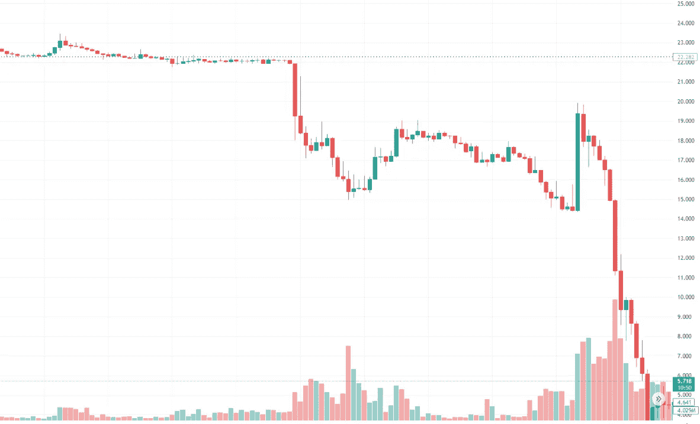
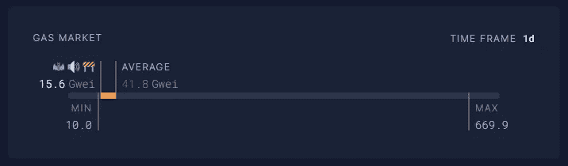
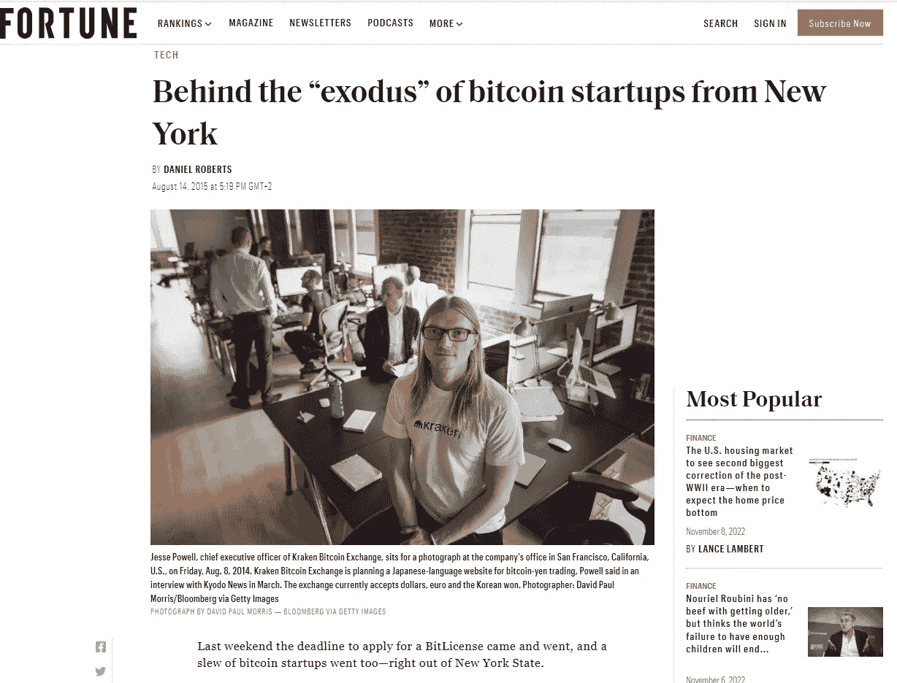

# 对 FTX 崩溃的观察

> 原文：<https://medium.com/coinmonks/observations-from-the-collapse-of-ftx-8d1d79d90e0?source=collection_archive---------7----------------------->

在过去的 24 小时里，关于 FTX(山姆·班克曼·弗里德饰)和币安(CZ)之间的战斗，已经有了大量的信息，尽可能保持客观，我已经从这一集的整个肥皂剧中做出了大量的观察。

# 高昂的天然气费用使得连锁清算变得更糟

我仍然有大约$ETH 作为抵押锁定，幸运的是我的贷款超额抵押超过 200%，但如果我有被清算的危险(谁知道呢，也许我会晚些时候，因为这次崩溃可能还没有结束)，我不能 100%确定我能够去杠杆化我的头寸。在平均油价约为 500 gwei 的情况下，我将花费大约 300 美元的汽油费来完全摆脱我的头寸——这是假设我的交易将成功完成，否则我可能会花费更多。如果你曾经尝试过经历一个受欢迎的 NFT 造币时期，你会知道如果有很多交易试图同时通过，这基本上会导致一场没有人能出去的车祸:

如果价格不波动，那么等待一段时间是好的，但随着价格持续下跌，更多被清算的资产基本上被抛售，导致价格进一步暴跌。

# CeFi 平台不能遵循同样的传统——即部分储备

如果你不熟悉部分准备金，这是 TradFi 银行的一项要求，要求他们以现金(流动性)形式持有一部分准备金，而其余部分可以借出。银行可以做到这一点，而不会吓到人们，因为人们知道他们的钱是有联邦存款保险公司保险的。不幸的是，加密 CeFi 平台不是。

当人们对一个加密平台感到恐慌时——无论理性与否——银行挤兑很容易发生。正如我们在过去几个月所看到的，CeFi 平台冻结提款的例子越来越多，我认为这将使人们越来越倾向于向前发展。换句话说，如果任何 CeFi 平台有很大一部分储备被借出，那么如果出现任何 whimisical 市场恐慌，Voyager、Celsius 或 FTX 发生的事情很可能会发生在该平台上。CeFi 平台不应该有部分准备金吗？CZ 当然这么认为:

如果币安真的坚持到底，创造 100%的外汇储备透明度，如果他们显示 100%的外汇储备是流动的，理论上就不可能吓唬人们进入币安的银行账户。这就引出了我的下一个观点…

# 千万不要穿越 CZ

我不是说他是个坏人，我也不是说他不适合 crypto，但我想说的是他让我害怕。对于他发布的所有不同的推文，我只能猜测他的最终目的是什么，但不管他的目的是什么，很明显他现在是加密国王的创造者:

就像我说的，我没有理由相信他是个坏人，但 FTT 和露娜的比较是我见过的最有力的讽刺:

假设这一收购获得通过，这意味着币安将不仅是 FTX 事实上的“统治者”，而且是 FTX 自己救助的所有公司的事实上的“统治者”，包括 BlockFi 和 Voyager。我个人担心的是，我们现在看到一个实体对 DeFi 获得了更多的控制和影响，这当然…违背了 DeFi 的精神。

# 警惕平台币，调查它们是如何被使用的

读了更多 CZ 的推文，他强调了一个非常重要的点，基本上 FTX 是如何被骗的——他们用自己的令牌作为抵押品:

如果你拉得足够远，无论是$BNB，$FTT 的投资者，我认为重要的是要提醒我们自己，无论我们有什么样的代币或货币，其价格可能只受到市场信心的支持。如果社会(或者就$FTT 而言，更像是加密 twitter)认为$FTT 没有价值，市场将不可避免地反映出来。同样，如果每个人都对它有信心，市场可能也会反映出来。

因此，这整个失败提醒我更加努力地考虑我正在投资的原生平台令牌。换句话说，请问问你自己，你的平台令牌的定价是基于实用性还是简单的市场信心。

# 这可能会延迟加密监管

导致 FTX 垮台的主要催化剂之一是许多人对山姆·班克曼-弗里德在政治中的作用以及他试图在国会推动的秘密立法的怀疑:

简而言之，据我所知，该草案正在推动一个加密许可系统，其中 DeFi 平台必须注册并获得批准，以获得美国政府的合规性。许多人对此持谨慎态度的原因是，从我们的一个测试案例来看，类似的事情发生在纽约，早在 2015 年 6 月，纽约就通过了“[虚拟货币监管”](https://www.dfs.ny.gov/virtual_currency_businesses)和 BitLicense 要求。结果如何？人们刚刚离开纽约:

同样，如果 DCCPA 在美国获得通过，许多人担心这将把美国从“加密竞赛”中彻底淘汰出去:

随着 SBF 和 FTX 的倒台，他在国会做的所有游说可能都将被置若罔闻，如果有人想在所有尘埃落定之前公开将自己与这场争议联系起来，我会感到震惊……我想这可能需要一段时间。根据 C [oindesk](https://www.coindesk.com/policy/2022/05/24/ftxs-bankman-fried-is-already-a-political-mega-donor-hes-doubling-down/) (顺便说一句，who 是由 FTX 赞助的)，SBF 捐赠了:

> FTX 交易所创始人萨姆·班克曼-弗里德周一在一个播客中表示，他可能会在 2024 年美国总统大选中捐赠多达 10 亿美元。
> 
> 根据播客采访，他的净资产为 2 亿美元。其中很大一部分用于政治努力:他今年向一个政治行动委员会(PAC)捐赠了 2300 万美元。
> 
> 他的政治捐款产生了喜忧参半的结果。班克曼-弗里德是支持美国总统乔·拜登(Joe Biden)赢得 2020 年大选的最大捐助者之一。但是，尽管受益于 1100 万美元的 Bankman-Fried PAC 资金，他最喜欢的候选人在俄勒冈州国会初选中被击败。

除非有人来填补这个资金真空，否则我认为加密货币监管不会在已经运转缓慢的美国政府中得到任何推动。

# 结论:

就像我之前说的，如此多的信息被公之于众，如果这个故事在未来几周内继续通过加密 Twitter 引起反响，我不会感到惊讶。

与此同时，请记住，这个领域的大部分内容都是不受监管的，如果您正在从事加密领域的工作，了解外面正在发生的事情非常重要，因为正如我们刚刚看到的那样，最大的交易所之一可能会在不到 24 小时的时间内崩溃。希望你们中没有人在 FTX 身上有钱，但如果你有，我希望你能在他们开始冻结提款之前把钱取出来。如果你是其中一个不幸的人，我强烈建议你开始关注秘密新闻渠道，当不祥之兆降临时，它们会提醒你。我可以推荐谁？DYOR 给你可以信任的人，但我得到了足够好的提醒[数字资产新闻](https://www.youtube.com/c/DigitalAssetNewsDAN)和[冉诺伊纳](https://twitter.com/cryptomanran)与[加密戏谑](https://www.youtube.com/c/CryptoBanterGroup)。

感谢你花时间阅读这篇文章，一定要在推特([https://twitter.com/CryptosWith](https://twitter.com/CryptosWith))上关注我，获取我所有的最新消息。

免责声明:最后提醒一下，这不是财务建议，仅用于教育和娱乐目的。请一如既往地做自己的研究，找到最适合你的投资。干杯大家！

> 交易新手？尝试[加密交易机器人](/coinmonks/crypto-trading-bot-c2ffce8acb2a)或[复制交易](/coinmonks/top-10-crypto-copy-trading-platforms-for-beginners-d0c37c7d698c)