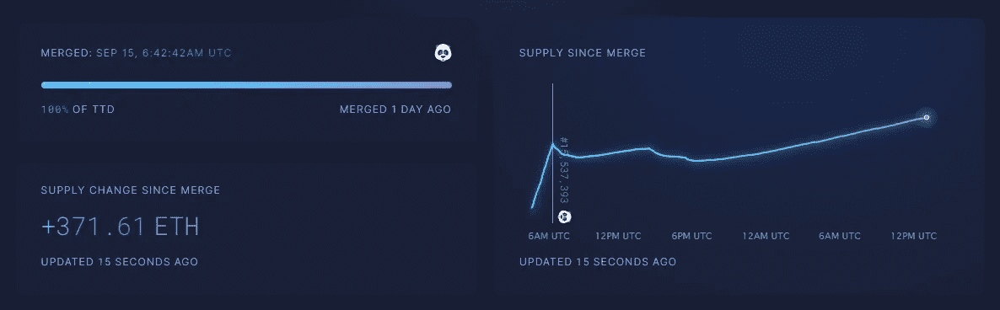
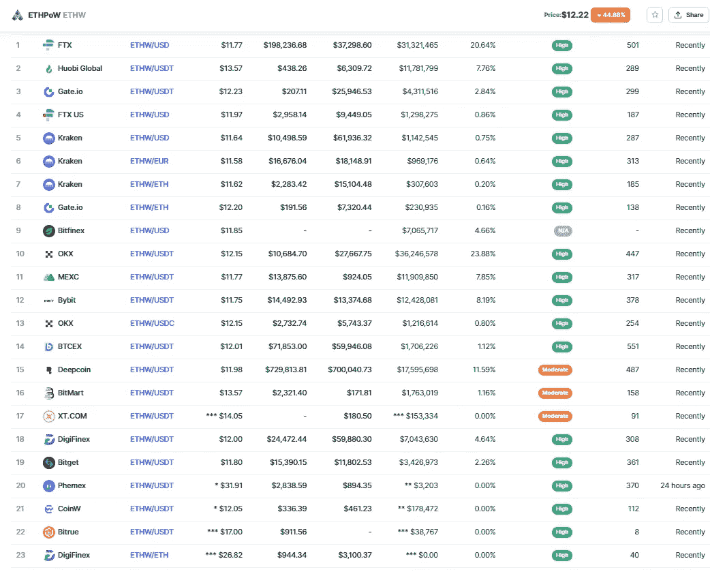
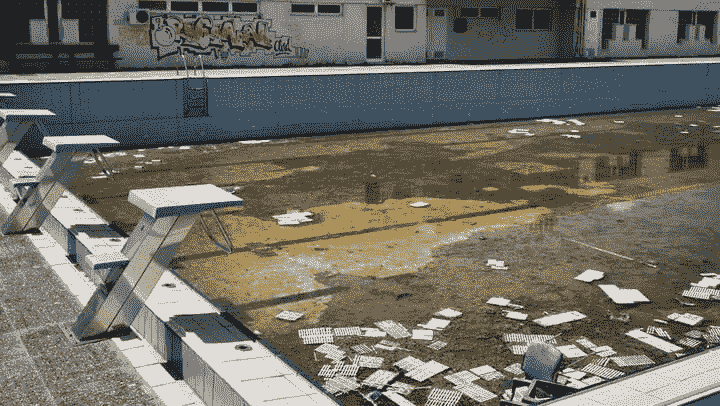
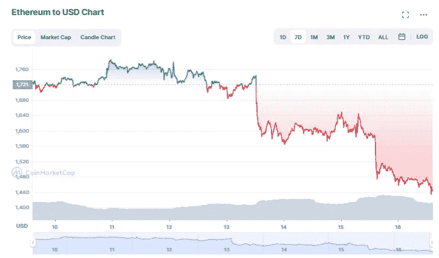
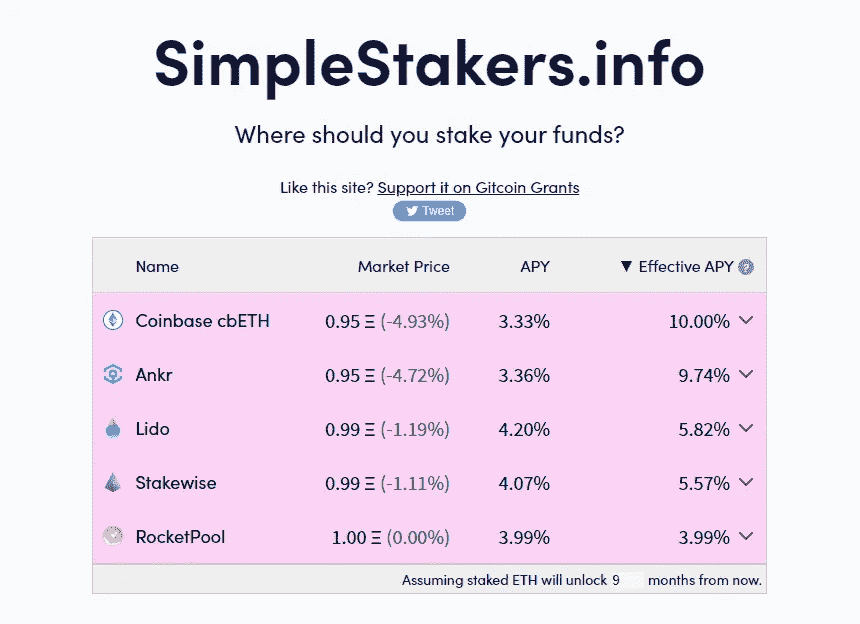

# 来自合并的观察

> 原文：<https://medium.com/coinmonks/observations-from-the-merge-baa798f331ac?source=collection_archive---------13----------------------->

Still might be a upward grind

就像我确信你们中的许多人正在阅读这篇文章一样，我在黎明时分醒来，加入了成千上万其他人的行列，观看以太坊的升级和从工作证明到利益证明的迁移。我为整个密码社区感到非常欣慰，合并进行得如此顺利，现在我们已经离开几天了，我想我应该分享一下我对合并的一些观察。

# $ETH 不是真正的超声钱…或者至少不会一直是

在合并后，美元 ETH 的供应变化立即下降到略高于-200 美元 ETH，向美元 ETH 持有者发出了一个有希望的信号，即与美元 ETH 的发行数量相比，将有更多的美元 ETH 被烧毁，或者换句话说，这意味着它将成为“超声波货币”。如果你对这个术语不熟悉，这是比特币创造者称比特币为“健全货币”的一种玩法，因为有 2100 万 BTC 的硬性上限供应。“超声波货币”一词意味着$ETH 将被超越一步，实际上成为通货紧缩，或者换句话说，使$ETH 比$BTC 更好的价值储存手段，这是硬封顶的。

然而，就在合并一天后，我们看到以太坊网络的使用率很低，ETH 的总供应量反而可能会增加:

纵观并购前宣传的所有乐观承诺，这都是在假设人们会使用它的情况下完成的。我的猜测是，使用率最终将再次回升，但至少可以说，供应量的增加仍然令人惊讶。

# 砍伤了

如果您不熟悉“删减”，这是对帮助维护网络完整性的$ETH 验证器的惩罚。如果一个验证器因为某种原因做错了什么或者基本上违反了规则，那么这个验证器就会被削减掉他们的$ETH。因此在合并过程中有一个验证器被削减了:

这个不幸的事件是由于一个简单的错误，在合并开始时，validator 有一个重复的备份节点在运行，导致他被削减，结果是启动时丢失了 1 $ETH。我真正认为不幸的是，这似乎是一个真正的错误，而不是一些威胁系统完整性的恶意企图；然而，利害关系证明算法似乎不能区分错误和威胁。

# 捡$ETHPoW(又名$ETH IOU，$ETHW)空投

如果您不熟悉$ETHPoW，它基本上是剩余的 pro-Ethereum 工作证明用户的创建，这些用户希望保留 PoW，而不是升级到合并时实现的利益证明。如果你在交易所持有你的$ETH，你应该看看你是否已经被空投了任何$ETHPoW，因为我的可以立即使用 [Midas](https://midas.investments?p=0191) ，但只能用于提款。FTX 等其他交易所允许用户交易/出售美元 ETHPoW，但他们限制人们存入任何资金进行出售。目前，Coinmarketcap.com[的](https://coinmarketcap.com/currencies/ethereum-pow/)拥有最全面的$ETHPoW 列表:

再说一次，我认为许多这样的交易所(如 FTX 和迈达斯)有不同的限制，所以一定要检查你想使用的平台，看看这些限制可能是什么。

**认领你的$ETH 如果它在你的钱包里:**如果你的$ ETH 包在你的钱包里，你可以在 [EthereumPOW 的官方 twitter 账户](https://twitter.com/EthereumPoW)上找到如何认领它们的说明:

因为有很多人仍然将他们的$ETH 锁定在 Celsius 和 Voyager 等平台上，所以有很多心怀不满的人现在加倍沮丧，因为他们也无法获得空投。

# 没有什么可以定价的了…除了可能的分割

虽然我总体上长期看好以太坊，但鉴于我们所看到的它的最新价格走势，它看起来像是被当作奥林匹克体育场一样对待——事先有很多宣传和炒作，然后被放弃，之后陷入混乱:

相反，随着最终合并日期的宣布，$ETH 的价格暴涨，但我们已经看到$ETH 的价格暴跌至自 7 月下旬以来的最低点:

实际上，在过去的几个月里，市场已经接受了合并的消息，然而现在新闻周期已经结束，狂热似乎已经结束了…至少现在是这样。分片可能是以太坊下一个最大的升级，但从项目路线图[来看](https://ethereum.org/en/upgrades/)这要到 2023-24 年才会发生。不考虑分片，鉴于许多人吹捧这是自比特币诞生以来最大的加密事件，我个人不认为分片的实现会有这么大的声势。

# $ETH 打桩

谈到$ETH 的价格行动，我之前读到过，在合并后， [Lido](https://lido.fi/) 等服务上的$ETH 赌注者将无法立即解锁他们所有的赌注令牌，但我没有意识到这可能需要 6-12 个月，而且锁定将会继续。也就是说，风险投资即服务的机会似乎正在增加，现在我们已经证明了风险，我只能想象这些机会将继续下去。

如果你现在有兴趣了解$ETH staking 的主要玩家，我建议你查看 [SimpleStakers.info](https://simplestakers.info/) :

在这里，您可以看到所有选项，包括它们的相对市场价格和解锁时可赚取的 APY 利率。

# 结论

合并成功让我大大松了一口气，对于它现在给新投资者、新开发人员和新用户带来的可能性，我也非常兴奋。然而，我也相信进步从来不是一帆风顺的，所以我想在以太坊经历成长的痛苦时，我们会看到它的未来会有很多坎坷和动荡。

一如既往，再次感谢您的阅读，如果您还没有，请务必在这里和 twitter 上关注我，获取我所有的最新更新:【https://twitter.com/CryptosWith

免责声明:本文中的任何内容都不是财务建议。请自行研究和/或联系财务顾问，找出最适合你的投资。

> 交易新手？尝试[加密交易机器人](/coinmonks/crypto-trading-bot-c2ffce8acb2a)或[复制交易](/coinmonks/top-10-crypto-copy-trading-platforms-for-beginners-d0c37c7d698c)