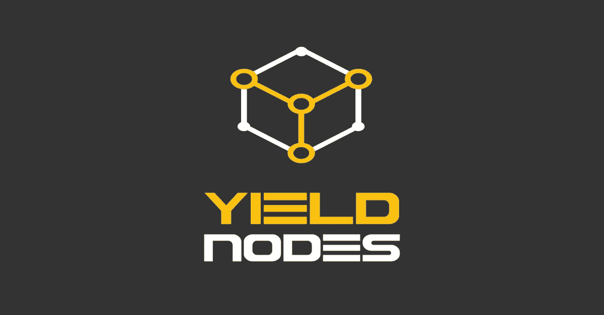
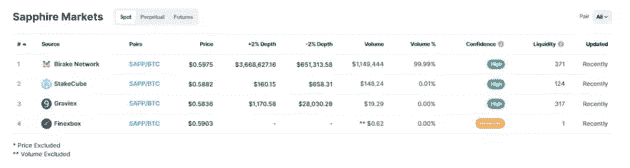

# 产出节点审计报告的观察结果

> 原文：<https://medium.com/coinmonks/observations-from-yield-nodes-audit-report-1399338f8d3c?source=collection_archive---------2----------------------->

完全免责声明:我是[收益率节点](https://yieldnodes.com/?a=OKe9wjw2dbXnLMr)的投资者，自去年 3 月以来一直如此。但就像我肯定你们中的许多人一样(或者至少应该如此)，我一直对收益率节点有点怀疑，因为它们是我的投资组合中少数几个能够在熊市深处持续产生净利润的协议之一。这就是为什么我怀着极大的兴趣阅读了 [YieldNodes 的最新审计报告](https://members.yieldnodes.com/en/auditjuly2022)，该报告由 10 位不同的与会者主持，其中 9 位来自全球各地，第 10 位是马耳他本地人，由于最后一位成员取消，他在最后一分钟填补了空缺。

在我开始深入探讨之前，我确实觉得我需要声明，我不适合或不适合做公司或财务审计员，所以如果我没有记下一些技术细节，请原谅我，但正如我稍后将进入的那样，这正是问题的关键——我只是互联网上一个随机给出自己观点的人。你必须自己做研究(或者最好寻求财务顾问甚至会计师的建议)，看看收益率节点是否是最适合你的投资。

在阅读了“审计”之后，也看到了一些 youtube 视频/一些“审计员”的评论，我收集了几个关键的要点，这些要点影响了我对收益率节点的看法，以及我认为这将如何影响我未来的投资。如果你不熟悉 Yield Nodes，请一定要看看[我之前的评论](/@CryptosWith/a-deep-dive-analysis-on-yield-nodes-my-only-green-in-a-red-market-df3e77afc92c)，我在那里做了一些更深入的探讨，但本质上 Yield Nodes 是一项出色的服务，一直以来平均每月投资回报率为 10% (120% APY)。

事不宜迟，我从“审计”中得到的主要收获是…

# **如果不是由真正的审计员完成，这就不是真正的审计:**

任何公司审计师都会告诉你，如果不是由实际的审计师做的，审计就不是真正的审计。我认为这可能是我对 Yield Nodes 所谓审计的最大批评。我不知道马耳他的法规是什么，但即使是美国最宽松的要求，最起码你需要某种金融学士学位，而*也许*只有一个“审计师”真正拥有——Irfan Mohammed，他在他非常短的简历“股票衍生品交易”中列出了:

Does this just mean that he’s a degen?

话虽如此，我还是很欣赏其他一些简历的透明度，而且我也认为很多简历是随机而不是有选择地挑选出来的，总比没有好，尽管看起来没有人有任何正式的金融或会计背景。然而，“审计员”是普通用户这一事实引出了我的下一个观点:

# **如果“审计师”也是投资者，那么这就不是真正的独立审计**

公司审计师在接受公司审计任务之前必须披露金融控股和投资的一个重要原因是——他们试图避免或消除利益冲突。在 TradFi 的世界里，如果我把毕生积蓄投资在 X 公司的股票上，然后让我负责审计 X 公司，我能有多客观？出于同样的原因，真正的审计师必须披露他们的金融持股，我预计这 10 位投资者也会这样做。更具讽刺意味的是，“参与者审计报告”称，“审计师**没有收到任何报酬，”**，但我认为这是绝对不真实的，因为所有的“审计师”都从收益率节点收到股息支付，无论这是否与他们的“审计”服务直接相关。

同样，我还会提出第二个论点，即影响者詹姆斯·佩尔顿(James Pelton)和克里斯·麦考利(Kris Mccauley)甚至有更大的利益冲突——他们都有成千上万的追随者，并在 Yield Nodes 上有多个带附属链接的视频，这意味着他们不仅个人投资于 Yield Nodes，而且他们也有额外的激励让 Yield Nodes 被正面看待，以便他们可以从他们能够推荐的新用户那里获得更多的钱。这是否意味着詹姆斯·佩尔顿或克里斯·麦考利有不道德的地方？不。(事实上，我已经关注他们两个有一段时间了，我相信他们会尽可能的准确和透明。)我确实看到了一个问题，那就是这表明这些“审计”有很大的偏见，而且显然不是独立的。我相信这不是詹姆斯或克里斯的问题，因为同样，他们不是真正的审计师，他们没有责任避免利益冲突；然而，如果他们是真正的审计员，那么这将是一个问题。如果这项工作的目的是进行一次实际的审计，那么产出节点就有责任给予这种类型的透明度，或者尽一切可能尽量减少这些利益冲突。简而言之，如果评论者带着很大的偏见来评论，我们能信任他多少呢？

# **用户资产 130%超额抵押:**

在一些人看到像 Celsius 这样负债远远超过资产的公司的一些失误后，这是最大的支持，也是最令人宽慰的。对钱包进行单独检查，以核实所有头寸和资产。此外，感谢“审计员”之一的詹姆斯·佩尔顿(James Pelton)有财力建议进行广泛的钱包检查，尽管这肯定很乏味，但这是真正的公司审计所需要的尽职调查。如果你想更详细地了解他的“审计”，我强烈推荐看看他的[视频](https://www.youtube.com/watch?v=Jx_tsUO6ASk)，他在视频中分享了他此次访问的个人分析。

核实资产(实质上是清点存货)可能是所有审计中最乏味的工作，我很高兴有人做了这项脏活并完成了它。

# **收益率节点代币价格通过流动性操纵:**

谈到詹姆斯·佩尔顿的评论，我从他的视频中获得的另一个要点(顺便提一下，这不是 Yield Node 的“审计报告”)是收益率节点如何通过流动性支撑其令牌价格。

与许多不同的 Yield Nodes 项目一样，您会注意到相应的令牌(＄SAPP、MONK、DASHD 等。)在可访问性方面受到很好的控制，因为你只能在产生节点所有权的少数交易所、交易所/平台上获得许多令牌。例如，可以被视为 Yield Nodes 旗舰项目的$SAPP 只在 4 个不同的交易所上市，它可能是最容易进入的:

事实上，如果你在 [coinmarketcap](https://coinmarketcap.com/invite?ref=CRVFLTLR) 上查找，你会发现 15 种左右的代币中，大多数对应的代币只在一家或两家交易所上市。此外，所有这些代币的市值都相对较低，SAPP 最高仅在 250 左右，这通常是波动性较高的指标。然而，尽管市值较低，收益率节点的硬币实际上相当稳定，通过詹姆斯的评论，现在很容易理解为什么——这些代币价格受到流动性的操纵。

如果你不熟悉流动性如何操纵价格，我强烈推荐观看 [Chris Titus Crypto 的视频](https://www.youtube.com/watch?v=UaaJu0nC690)，但简而言之，如果大量的流动性增加或相反减少，代币的价格会很容易受到显著影响。这一定是坏事吗？不，事实上我完全理解保持价格稳定的必要性，否则像美元这样的所谓“稳定”产品将会伴随着通货膨胀而运转……哦，等等。

玩笑归玩笑，Yield Nodes 团队似乎已经能够控制足够的流动性，从而控制价格，这有助于增加项目的稳定性。在一个正常的市场中，我会担心一只隐藏的鲸鱼向 depeg 倾销价格(正如我们在 UST 的 depeg 中看到的那样)，但在 Yield Nodes 的情况下，他们似乎对他们的硬币市场有着非常严格的控制，这应该从本质上减轻了鲸鱼攻击的风险。

# 他们如何获得收入？

好的，我们知道钱在那里，我们也知道为什么代币价格是现在的样子，但是我仍然感到没有答案的是他们如何产生收入。严峻的现实是，这可能是每个投资者(除了去马耳他的投资者)都必须面对的事情。假设说，如果我能够插入一些主节点，并以某种方式产生大量的效用，能够在任何市场条件下产生持续一致的收入，我个人不知道我是否会与他人分享这个秘密酱。然而，我认为 Yield Nodes 必须处理的是，在揭开秘密之前，总会有关于 Yield Nodes 是否是庞氏骗局(或其他类型的邪恶计划)的猜测。

如果这是 TradFi 世界中的实际审计，则可以避免这种猜测，因为审计员的任务是报告具有实际(通常是法律和/或财务)后果的非法和邪恶活动。例如，如果一家经纪公司被发现从事内幕交易，那么可以向美国证券交易委员会报告。通过接受真正的审计，收益率节点可以通过让审计师签署保密协议来保护他们的秘密酱料，同时仍然接受监管机构的筛选。

# 结论

我所有的问题都得到了回答吗？没有。但是“审计”报告会给我带来任何新的危险信号吗？不会。Yield Nodes 团队显然已经能够利用一些非常有利可图的东西，并且他们已经通过 40 个月的跟踪记录提供了一致而稳定的结果。我个人有计划取出足够的利润来移除我的初始本金，但随着欧元的极度贬值(收益率节点将其投资和利润与其挂钩)，我认为我有足够的信息来感到足够舒适，只要欧元和美元之间接近平价，我就会继续这样做，直到重新获得一些力量。

在我看到的所有文章、reddit 帖子和评论中，我还没有找到一篇关于某人投资却没有得到所述回报，或者没有能够按所述撤回资金的评论。这不是他们第一次在熊市中获利，我想也不会是最后一次。

如果您自己已经尝试过 Yield Nodes，并且得到了一些不太理想的结果，我很乐意在下面的评论中听到。如果你还没有尝试过 Yield Nodes，但想四处看看，请考虑使用我的推荐链接:[https://yieldnodes.com/?a=OKe9wjw2dbXnLMr](https://yieldnodes.com/?a=OKe9wjw2dbXnLMr)来支持我和我的博客。此外，请务必在 twitter 上关注我，获取我所有的最新动态:【https://twitter.com/CryptosWith

免责声明:最后提醒一下，这不是财务建议，仅用于教育和娱乐目的。请一如既往地做自己的研究，找到最适合你的投资。干杯大家！

> 交易新手？试试[密码交易机器人](/coinmonks/crypto-trading-bot-c2ffce8acb2a)或[复制交易](/coinmonks/top-10-crypto-copy-trading-platforms-for-beginners-d0c37c7d698c)