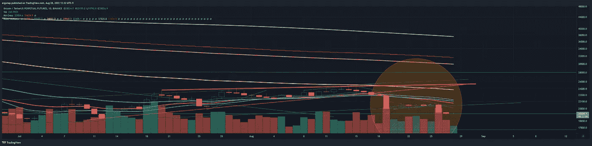

# 很明显周一的安排就要来了

> 原文：<https://medium.com/coinmonks/obvious-monday-setup-is-coming-94b10f98427c?source=collection_archive---------21----------------------->

比特币/加密货币市场分析 8/28

周日 8/28 分析。周一的一个明显的安排即将到来。BTC 徘徊在 2 万美元关口附近，这意味着暂时的整合。很明显，BTC 已经准备好在新的一周跟随间谍。

对于那些一直关注我所做的事情的人来说，这显然并不意味着看涨。

BTC can’t even make it over tiny MA’s at this time, and top of MA resistance on short term is $21.6k to continue downtrend .[https://www.tradingview.com/x/UXUy5E0Q/](https://www.tradingview.com/x/UXUy5E0Q/)

4H says lol get outta here — as we set up to go lower, as usual. [https://www.tradingview.com/x/yd8uwmr0/](https://www.tradingview.com/x/yd8uwmr0/)

Daily says more downtrend. [https://www.tradingview.com/x/jnCHRpVE/](https://www.tradingview.com/x/RmSx5YU9/)

Weekly looks like consolidation to drop further after the first major drop. [https://www.tradingview.com/x/OKiVes2v/](https://www.tradingview.com/x/OKiVes2v/)

融资历史显示，空头获利是唯一将价格从 2 万美元以下拉高的原因。[https://www.binance.com/en/futures/funding-history/4](https://www.binance.com/en/futures/funding-history/4)

On top of that at best, we have a significant 3 week timeframe *Sell/short* signal from the first major drop under $20k, that only looks like it’s being continued. [https://www.tradingview.com/x/clRZi2eQ/](https://www.tradingview.com/x/clRZi2eQ/)

所以…这是最悲观的，伙计们。向下是要走的路，寻找可疑的事情，泵短，等等。

值得注意的是，dogechain (DC)是在这种狗屎中推出的，试图榨取金钱，显然在这方面取得了成功。我的意思是 devs 在多个链上立即兑现，这是否意味着对一个项目的信任？

但是，当然，#比特币是完美的健全货币和#通货膨胀对冲，一切总是上涨，而且…我又错过了什么？哦，对了，#龙卷风现金，以直接资助俄罗斯和朝鲜而闻名。在这些熊市时期，支持显然是一件好事。

最重要的是，我们的 3 个月 DXY 刚刚开始看涨。三个月！

[https://www.tradingview.com/x/bYicXRDc/](https://www.tradingview.com/x/bYicXRDc/) bullish crossup and buy/long signal which can last months to years given that it’s a 3 MONTH signal. Signals can last from **1–8+ candles (2 YEARS+!)**, y’all.

亚洲/欧洲/拉丁美洲/加拿大/澳大利亚，美国显然要完全统治你们，因为其他人都有麻烦了。看到美国商品大量进口到上述所有国家应该很有趣，因为这是接下来的事情。我会期待美国公用事业出口爆炸式增长。

> 交易新手？试试[密码交易机器人](/coinmonks/crypto-trading-bot-c2ffce8acb2a)或者[复制交易](/coinmonks/top-10-crypto-copy-trading-platforms-for-beginners-d0c37c7d698c)