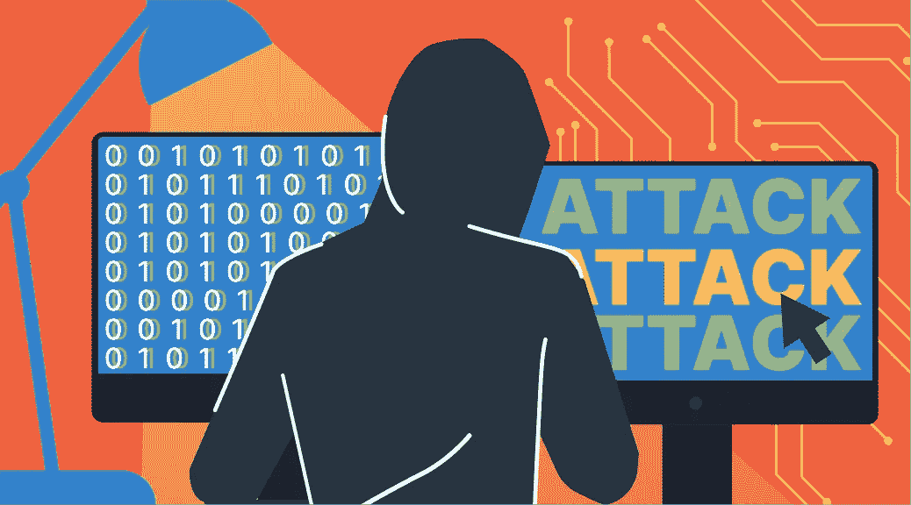
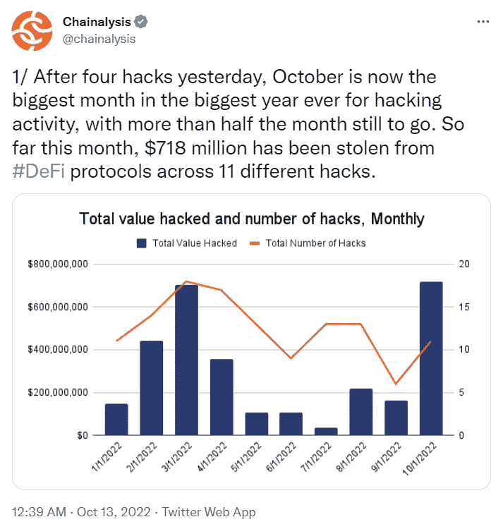
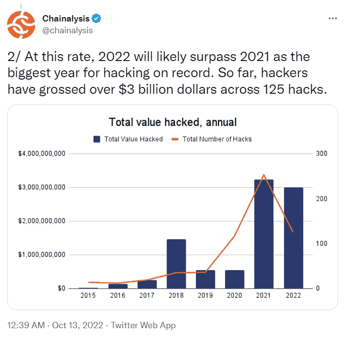
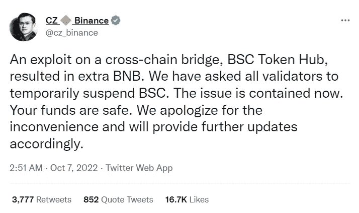
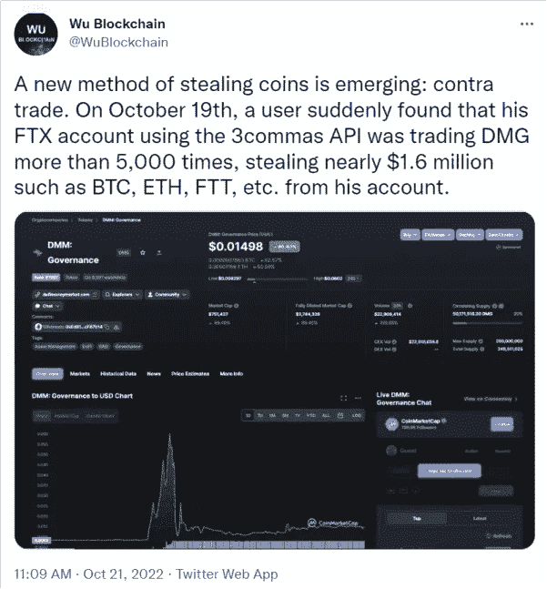
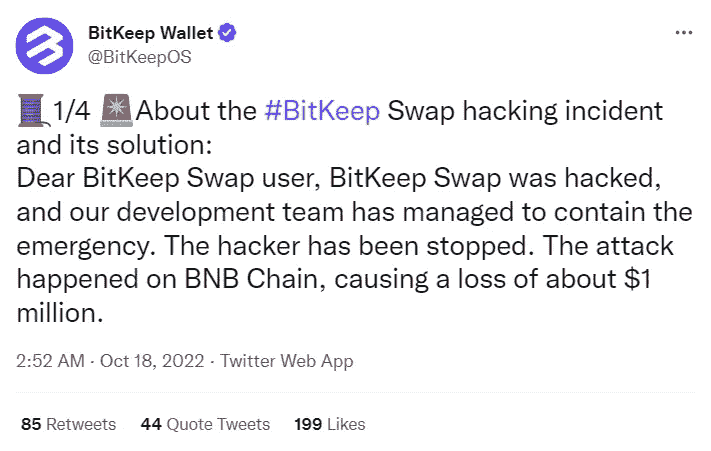
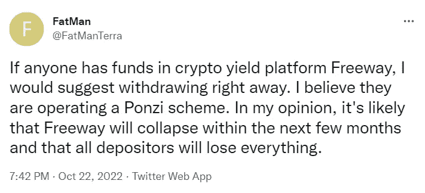

# 2022 年 10 月:迄今为止最大的加密黑客月？

> 原文：<https://medium.com/coinmonks/october-2022-the-biggest-crypto-hacks-month-so-far-4b1b8df5f219?source=collection_archive---------30----------------------->

随着密码行业的发展，它不断受到黑客的攻击。虽然在开始时，这并不是什么大问题，但今天，当加密货币成为一个数十亿美元的业务，代币可以很容易地被撤回或交换时，黑客似乎对最大的加密交易所非常感兴趣，破坏了他们的安全，窃取了数百万美元。在新的 StealthEX 文章中阅读更多关于[最新加密技术的信息。](https://stealthex.io/blog/october-2022-the-largest-crypto-hacks-month-so-far/)

加密黑客攻击目前呈上升趋势。加密市场正处于有史以来的最低点，然而，今年 10 月似乎已成为加密相关犯罪最严重的一个月，总损失超过 7.18 亿美元。离月底还有两个多星期。

周四来自[chain analysis](https://twitter.com/chainalysis/status/1580312145451180032?ref_src=twsrc%5Etfw%7Ctwcamp%5Etweetembed%7Ctwterm%5E1580312149557026817%7Ctwgr%5Ed8d9178fb7b1a9a5071e1c9bc33db3cd7197a98b%7Ctwcon%5Es2_&ref_url=https://www.coindesk.com/tech/2022/10/13/october-becomes-worst-month-for-crypto-hacks-with-two-weeks-to-go/)的数据指出，这笔钱是在 11 次不同的攻击中从几个分散金融协议中窃取的。在撰写本报告时，自本月初以来，密码领域已有超过 125 起独立事件利用了约 30 亿美元。

Chainalysis 公司还指出，2022 年的攻击数量和规模甚至可能超过 2021 年。这表明加密交易所和其他与加密相关的项目需要更加注意它们的安全性，因为任何破坏都可能给它们的客户带来巨大的损失。

# 最大的加密黑客

# 币安·哈克:发生了什么

就在几周前，全球最大的加密交易所币安遭到黑客攻击。10 月初，币安证实黑客窃取了至少 1 亿美元，但这个数字可能会高得多。

币安区块链，也被称为 BNB 链和币安智能链，在发现影响 BSC 令牌中心跨链桥的漏洞后，采取了暂停交易和资金转移的罕见步骤。这些桥梁旨在便利资产从一个独立的区块链转移到另一个独立的。

桥在 DeFi 世界中很流行，但由于其底层代码中的错误，桥已成为罪犯的热门目标。BNB 链，原名币安链，由币安于 2019 年首次开发。与其他区块链一样，它也有一个名为“BNB”的本地令牌，可以在游戏和其他应用程序中交易或使用。

BSC 令牌集线器桥中的漏洞使得攻击者能够伪造消息，从而伪造新的 BNB 令牌。由于被盗令牌不是从钱包中取出的预先存在的令牌，因此用户资金不会受到影响。

后来，BNB 链团队承认，最初总共提取了 200 万 BNB(约合 5.68 亿美元)。然而，黑客设法只带走了大约 1.1 亿美元:显然，BNB 链能够防止大约 80%到 90%的目标资金被盗。

# 币安·哈克:后果

币安首席执行官赵昌鹏[在推特](https://twitter.com/cz_binance/status/1578171072067031042)上表示，该公司估计黑客入侵造成的影响在 1 亿到 1.1 亿美元之间。

就在最近，他补充说，币安正在接近找出提取被盗资金的匿名黑客的身份。据赵说，在从执法部门得到一些关于黑客可能是谁的线索后，现在正在“缩小”攻击背后的人。

随后，该网络在升级版本 1.1.16 中被分叉，以解决允许在黑客攻击中进行撤回的软件缺陷。它不能取代网络中缺失的资金，币安说 BSC hard fork 是成功的。

# 发生了什么事

10 月 21 日，中国密码交易员科林·吴(Colin Wu)损失了 100 多万美元，此前黑客利用与交易账户相连的 API 进入了他的 FTX 账户。

用户首先注意到他的账户交易 DMG 代币超过 5000 次，后来才发现近 160 万美元的比特币、FTX 代币、以太坊和其他加密货币已经离开了他们的账户。

该记者进一步证实，这不是一个孤立的事件，因为另一名 FTX 用户 Bruce 也表示，他是 FTX 漏洞的受害者。他透露，在 10 月 21 日发生的事故中，他损失了 150 万美元。总部位于巴哈马的中央加密货币交易所 FTX 声称，黑客攻击是由于交易平台 3Commas 的 API 密钥泄露造成的。

就在这一事件发生的前几天，FTX 宣布在 2022 年 10 月 13 日凌晨黑客攻击了超过 81 个 ETH。交易所解释说，黑客利用了 FTX 平台的一个漏洞，使他们能够零成本地铸造 XEN 令牌 1.7 万次。

根据一份出版物，该欺诈是通过一个天然气盗窃漏洞实现的。黑客的地址获得了超过 1 亿个 XEN 令牌，并通过 DoDo、Uniswap 和 DEXes 将一些 XEN 转换为 61 ETH，并传输到 FTX 和币安。截至记者发稿时，FTX 遭受的损失达 103443 美元，而黑客通过出售自由铸造的 XEN 令牌获利 77618 美元。

# FXT Hack:后果

10 月 24 日，Bankman-Fried [在推特](https://twitter.com/SBF_FTX/status/1584304075323367426?ref_src=twsrc%5Etfw%7Ctwcamp%5Etweetembed%7Ctwterm%5E1584304075323367426%7Ctwgr%5E3b24f8572b17d5302641d11633a6b58a24b131c7%7Ctwcon%5Es1_&ref_url=https://decrypt.co/112720/sam-bankman-fried-refund-ftx-phishing-victims-6-million)上表示，他准备向受到攻击的 FTX 用户赔偿高达 600 万美元，攻击者利用 3Commas 的 API 在交易所进行交易。萨姆·班克曼-弗里德还说，交易所不会“习惯性地补偿那些被其他公司的假冒产品钓鱼的用户”。'

# BitKeep Hack

加密钱包提供商 BitKeep Wallet 也成为了该行业无休止的加密黑客浪潮的受害者。区块链安全公司 PeckShield 于 10 月 17 日周一在 Twitter 上首次发出警报，BitKeep 于周二凌晨在[发布了关于该事件的更新](https://twitter.com/BitKeepOS/status/1582157619032395776?ref_src=twsrc%5Etfw%7Ctwcamp%5Etweetembed%7Ctwterm%5E1582157619032395776%7Ctwgr%5E14d82f9bab3be822a0e8ac33ea5f0c3111d6e541%7Ctwcon%5Es1_&ref_url=https://cryptopotato.com/hacker-drains-1m-from-bitkeep-wallet-in-swap-feature-exploit/)。

在向公众发出警报后，BitKeep 宣布其开发团队已经阻止了黑客。在攻击者接管交换机/路由器后，他们能够利用批准从用户的钱包中榨取价值。在 BitKeep 团队能够冻结交换功能、阻止进一步攻击之前，总共有超过 100 万美元的令牌被盗。事件发生后，安全公司要求用户遵循一些步骤，以确保他们的资金安全。该钱包还暂停了其掉期服务，以防止进一步的攻击。开发商承诺与安全机构合作，追踪黑客并追回被盗资产，同时承诺奖励任何可以帮助识别窃贼的人。

加密钱包提供商还指出，该漏洞发生在 BNB 链，区块链已经在本月早些时候币安黑客利用。

# 奥林巴斯岛又一次小规模黑客攻击

在一名黑客窃取了 3 万欧姆代币(相当于 30 万美元)后，OlympusDAO 用户感到震惊。这些资金后来被返还给了道的客户。但攻击者要么改变了主意，要么一直是一个白帽黑客，因为他们在几小时后将资金返还给了 DAO。黑客利用了 OHM Bonds 新产品智能合同中的一个缺陷。攻击发生后，区块链安全业务表示，Bond Protocol 编写了有问题的智能合同。

发现漏洞后，DAO 通过 Discord 频道通知了黑客成员。OlympusDAO 表示，受影响的资金受到限制是因为交错实施。如果黑客披露了漏洞，他们可能会获得 330 万美元的奖金，而被盗金额只是其中的一小部分。道团队当时表示，已经关闭了有问题的市场。

# 高速公路骗局

加密赌注平台 Freeway 宣布暂停其服务，理由是加密和外汇市场的波动性，导致其令牌自由落体。随后，他们的股票 FWT 在消息宣布后的几个小时内暴跌了大约 80%。Freeway 不是一个重要或知名的项目，崩盘前的市值不到 7000 万美元，按当前交易价格计算，现在的市值为 1000 万美元。

公告还说，虽然上述过程仍在进行，但 Freeway 将向其基础投资组合分配资本，而且“在一段时间内”以及“在我们的新战略实施之前”，它不会购买 Supercharger simulations。目前还不清楚这些新策略是什么。

Freeway 向其用户承诺，通过其增压器产品，每年可获得高达 43%的回报。它说，这是“流行的加密和法定货币的虚拟模拟”，只能在平台内使用。该项目的开发商声称，通过他们网站上公布的数字，他们锁定了 1.6 亿美元的总价值。链上数据表明，4342 个令牌持有者中最大的大多数是在空投期间收到的，否则就处于闲置状态。平台上最大的鲸鱼损失了 16500 多美元。

正如一位名叫 [@FatManTerra](https://twitter.com/FatManTerra) 的 Twitter 用户所说，Freeway 网站的管理员正在删除团队名称。Wayback 机器确认网站的“团队高速公路”部分已被删除，因为它显示的 8 名高管不再列在网站上。“我们的合作伙伴”也不是。FatManTerra 继续揭露该平台的管理是欺诈行为。

在此之前不久，他在周六发了一条关于该平台的推特，这是暂停提现的前一天，他警告了用户。

# 国际刑警介入

在发生大量诘问和网络钓鱼事件后，国际刑警组织在新加坡组建了一个专门小组，以协助各国打击与加密货币有关的犯罪。

在新德里的一次新闻发布会上，警察组织在第 90 届大会之前宣布了这一消息，195 名成员中的杰出警官将出席这次大会。

# 结论

黑客攻击和诈骗破坏了加密行业的稳定，不仅使加密爱好者的生活变得困难，也使加密平台的生活变得困难。这是一个强烈的迹象，表明加密交易所需要加强其安全性，政府需要采取新的措施来打击黑客和欺诈，因为世界经济的不稳定无疑会使更多的犯罪分子转向加密空间，试图利用它。

如果你正在寻找一个购买加密的地方，你可以私下进行，不需要通过 [StealthEX](http://www.stealthex.io/) 注册。您可以立即进行钱包到钱包的转账，没有任何问题，crypto collection 有 600 多种不同的硬币和代币。

只需去 [StealthEX](https://stealthex.io/) 并遵循这些简单的步骤:

1.  选择要兑换的货币对和金额。例如，XMR 到 BTC。
2.  按下“开始交换”按钮。
3.  提供要将您的加密传送到的收件人地址。
4.  处理交易。
5.  接收您的加密硬币。

在 [Medium](https://stealthex-io.medium.com/) 、 [Twitter](https://twitter.com/Stealthex_io) 、 [Telegram](https://t.me/StealthEX) 、 [YouTube](https://www.youtube.com/channel/UCeES_XBesX76ge7xf1meuSw) 和 [Reddit](https://www.reddit.com/user/Stealthex_io) 上关注我们，了解关于 [StealthEX.io](https://stealthex.io/) 和其他秘密世界的最新消息。

在购买任何密码之前，不要忘记做自己的研究。本文表达的观点和意见仅代表作者个人。

*原载于*[【https://stealthex.io/blog/】T21](https://stealthex.io/blog/october-2022-the-largest-crypto-hacks-month-so-far/)*👈*

> *交易新手？尝试[加密交易机器人](/coinmonks/crypto-trading-bot-c2ffce8acb2a)或[复制交易](/coinmonks/top-10-crypto-copy-trading-platforms-for-beginners-d0c37c7d698c)*